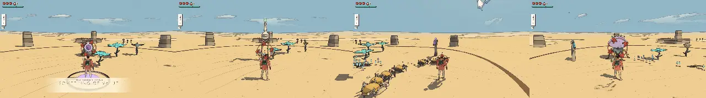
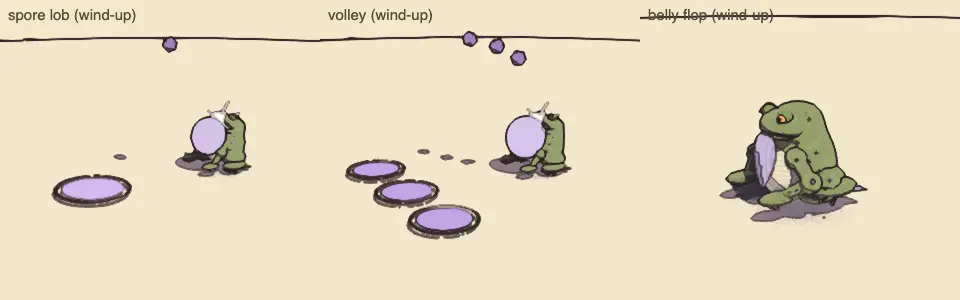
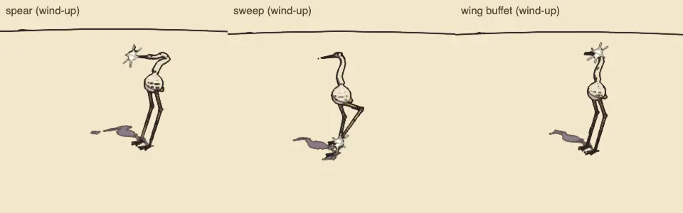
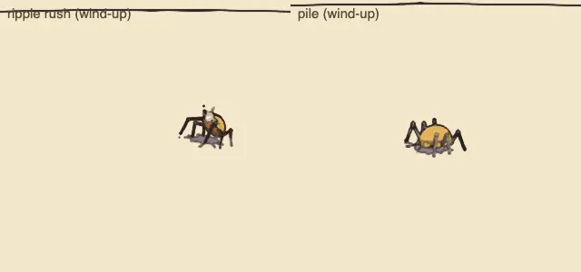
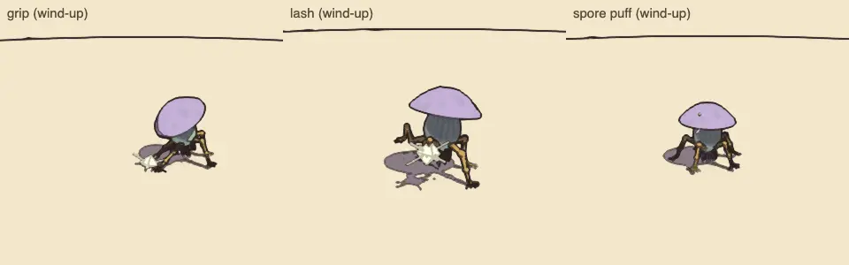

# Combat review, v1.13 (2026-10-09): the enemy roster, batch 3

<!-- audit-scores
overall: 4.54 / 5
label: the mean of the 4 batch-3 archetypes' totals (the bellows toad, the stilt heron, the skitter swarm, the root knot)
date: 2026-10-09
-->

A partial run of the combat-review skill (`.claude/skills/combat-review/SKILL.md`) over the third four archetypes of
the enemy roster (docs/design/enemy-roster.md, "Build plan", step 5; docs/systems/foes.md, "The enemy roster"), built
on the locomotion kit's phase 5 plans (hopper, stilt, skitterers, tentacled). Batches 1 and 2 stand as in
[v1.8](combat-v1.8.md) and [v1.9](combat-v1.9.md); the old kinds still standing in for archetypes not built yet, and the
guardians, were not changed: their scores stand as in v1.6 and v1.8.

## Setup

- The batch's branch (commit 5d4b6630, on main 890913ce), headless Chrome (muted, ANGLE Metal), the Arena,
  1280 × 720, Enemies "normal"; `--kinds toad,heron,skitter,rootknot --watch 24 --version 1.12 --guardians no` (the
  version flag only names the output; the lines went into v1.13 after the rebase).
- Each kind watched 24 s against a still traveller (its own skin: `HOME_SKIN`), then each move's blows through
  `Foes.hurt`, as in v1.8. The skitter is called in alone, so the watch sees one skitter, not its flock of eight (the
  flock's ring, its one-at-a-time darts and its heap are checked in `tests/archetypes.test.js`).
- The gallery's sheets: each archetype's own skin at 80 % of each attack's wind-up (`node scripts/enemy-roster/skins.mjs`).
- Not played by hand: guard, parry and evade timing against the new tells; the heron's spear from 5 m at a heron
  standing over you; the toad's spores on a slope; a skitter flock in the Desert's dunes; the root knot's grip in Lorn's
  reeds with the toad lobbing behind it.

| | |
|---|---|
|  |  |
|  |  |

## The scores

| kind | read | counter | space | fair | identity | combines | total | wind seen (s) | attacks/min | health/min | ttk combo | ttk charge | ttk air | ttk riposte | ttk shoot | ttk fire |
|---|---|---|---|---|---|---|---|---|---|---|---|---|---|---|---|---|
| bellows toad | 5 | 3 ✎5 | 5 | 5 | 4 | 4 ✎5 | 4.8 | 1.20 | 15 | 2.5 | 3.58 | 1.2 | 2.5 | 4.73 | 1.84 | 3.84 |
| stilt heron | 4 | 4 ✎5 | 3 ✎4 | 5 | 4 ✎5 | 4 | 4.5 | 0.90 | 15 | 2.5 | 3.58 | 2.4 | 2.5 | 4.72 | 2.45 | 5.12 |
| skitter swarm | 3 ✎4 | 4 ✎5 | 3 ✎4 | 5 | 4 | 4 | 4.3 | 0.61 | 10 | 1.46 | 1.19 | 1.2 | 1.25 | 6.73 | 0.61 | 1.28 |
| root knot | 4 | 5 | 3 ✎4 | 5 | 4 | 4 ✎5 | 4.5 | 0.78 | 17.5 | 2.29 | 4.77 | 2.4 | 3.75 | 4.16 | 3.07 | 3.84 |

Changed by eye (✎):

- **The toad's counterplay, 3 → 5:** the script sees the shot and the ember; it misses the shot into the swollen throat
  (it chokes, stunned, the lob lost), the air cut meeting its belly flop (double, and it lands on its back), the jump
  over its ring of shock, walking out of a landing mark, and closing in (it is soft up close). **Combines, 4 → 5:** a
  lobber that keeps 6.5 m away behind the root knot's grip (Lorn) and the lizards (the City-Shaft), its spores slowing
  you where the others want you.
- **The heron's counterplay, 4 → 5:** any guard knocks its bill aside and leaves its head open (a perfect parry
  longer), the dash cut gets inside its 5 m reach, a charged cut at a leg topples it for three seconds with every cut
  double, its stamp is avoided by stepping out from under it. **Space, 3 → 4:** it holds a ring of ground with its bill
  and punishes standing at range; under it is safe only until the foot lifts. **Identity, 4 → 5:** nothing else in the
  game is 5 m tall and that thin; a stilt walking one leg at a time is known at once.
- **The skitter's read, 3 → 4:** the rush is a quarter heart behind a 0.6 s rear-up and click, one skitter at a time,
  so each reads; the heap grows for 1.2 s. **Counterplay, 4 → 5:** any blow, a shot or a push ends one; the push
  scatters the heap; an ember sends the flock running; the combo's third swing sweeps them. **Space, 3 → 4:** the flock
  rings you at 4 m and comes from every side.
- **The root knot's space, 3 → 4:** its grip runs along the ground as a heave you jump or sidestep, and its hold
  pulls you to it. **Combines, 4 → 5:** the grappler: it holds you for the toad's lobs in Lorn and the moths and the
  jelly in Lorn II.

## Motion (the procedural-animation skill; `node scripts/motion-audit/run.mjs toad heron skitter rootknot --pack`, `--pace=0.5`)

| subject | legs | slide/m, worst | reach span, lift (% of the leg) | steps/s full → half speed | groups | unison of two |
|---|---|---|---|---|---|---|
| bellows toad (hops) | 4 | 0.00, 0.00 m | 21 %, 77 % | 1.25 → 1.00 (hops) | arms, legs (a hop lifts all four) | 0.00 |
| stilt heron | 2 | 0.01, 0.03 m | 31 %, 13 % | 0.75 → 0.38 | one at a time | 0.70 |
| skitter | 6 | 0.00, 0.00 m | 53 %, 18 % | 5.88 → 3.13 | the tripod | 0.40 |
| root knot | 5 | 0.02, 0.04 m | 29 %, 14 % | 0.90 → 0.65 | one at a time, round the ring | −0.20 |

Rubric (0–3): joints 3 (the heron's bird joint bending back, the skitter's knees over the dome, the root knot's two
bends on FABRIK from a curled guess, the toad's folded hind legs), feet 3 (the toad's feet never move under it between
hops: its drawn body hops, the mind's position runs ahead), gait 3 (the hop's rate follows the speed; the skitters a
tripod at the mid tier, each member out of step; the heron and the root knot one leg at a time), weight 3 (the heron's
high body on a soft pendulum that lags a turn or a stop; the toad crouches before a hop and lands squashed), secondary
2 (the heron's S-neck blended between its key shapes; the root knot's cap following you and its skirt swaying; no
chains), anticipation 3 (each attack its own pose: the throat swelling see-through and the rear back, the deep shaking
crouch, the S drawn back, the raised foot, the flaring wings, the rear-up, the heap, the plunged arms, the coiled arms,
the shuddering cap), ink 2 (the skitters' legs and the heron's stilts are thin from 30 m), cost 2 (a skitter is 44
meshes, a flock of eight 352: the most of any pack).

## The best and the weakest

- **Best: the bellows toad (4.8).** A lobber with three answers of its own (the throat, the air cut, the jump) and a
  silhouette nothing else has; it changes how the root knot and the lizards must be fought.
- **The stilt heron and the root knot (4.5)** each hold ground in their own way: the heron with reach, the root knot
  with its grip.
- **The weakest: the skitter swarm (4.3).** It is the tier-1 swarm and asks little alone; its 0.6 s rush is fair for a
  quarter heart but the shortest tell in the batch.

## Recommendations (in TODO.md)

1. Play the heron's spear with a pad: 0.9 s is the ordinary minimum, but the bill comes from 4 m up and 5 m away; if
   it reads late, 1.0 s.
2. The skitter flock costs 352 draws: merge each skitter's dome, eyes and feelers into one mesh, or draw a far flock
   from one instanced mesh.
3. The combat-review script calls a group kind in alone: watch a skitter flock as its group (`aloneWave`), and read the
   toad's choke and leap, the heron's open and topple, as answers.
4. Play the toad's spores on the slopes of Lorn: does wading through them at half pace read (no mark but the patch)?
5. The sound families (`sound`: soft, chitin, roots) are still played by two sets (batch 6).

## Against the last report

v1.8's batch 1 scored 3.7–4.5 (mean 4.22), v1.9's batch 2 4.3–4.7 (mean 4.50); batch 3 scores 4.3–4.8 (mean 4.54).
Against what they replace (v1.4): the spitting blot 4.0 → the bellows toad 4.8 (the same lob and volley, with the
throat, the flop and the spores); the blot swarm 3.2 → the skitter swarm 4.3 (a shape, a ring, a heap and a calm); the
root stalker 4.0 → the root knot 4.5 (the same grip, lash and bloom on a body that reads as a root, rooted, the grip
jumped). The stilt heron is new (4.5).
