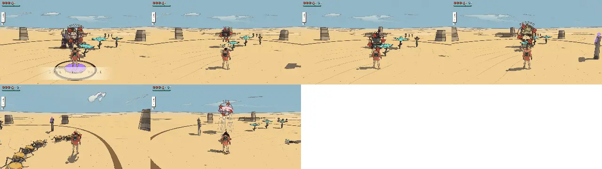

# Combat review, v1.15 (2026-10-09): the enemy roster, batch 4 (the possessed machines)

<!-- audit-scores
overall: 4.78 / 5
label: the mean of the 4 batch-4 archetypes' totals (the furnace brute, the ring drone, the crucible cart, the bell walker), by eye
date: 2026-10-09
-->

A partial run of the combat-review skill (`.claude/skills/combat-review/SKILL.md`) over the fourth four archetypes of
the enemy roster (docs/design/enemy-roster.md, "Build plan", step 6; docs/systems/foes.md, "The enemy roster"): the
possessed machines, built on the locomotion kit's machine plans (brute 8, hover 13, tracked 17, siege 19). Batches 1–3
stand as in [v1.8](combat-v1.8.md), [v1.9](combat-v1.9.md) and [v1.13](combat-v1.13.md); the guardians were not
changed (their scores below are the script's, from their tuning, for reference). The skitter swarm and the lantern
jelly were watched again to check the script's new group watch (a group kind as its group, a support with its escort).

## Setup

- The batch's branch (commit 54bbc38b and its follow-ups, on main 91f576bb), headless Chrome (muted, ANGLE Metal), the
  Arena, 1280 × 720, Enemies "normal"; `--kinds brute,drone,cart,bell,skitter,jelly --watch 24 --version 1.15
  --guardians no`.
- Each kind watched 24 s against a still traveller (its own skin: `HOME_SKIN`), then each move's blows through
  `Foes.hurt`, as in v1.8. **New in the script:** a group kind is called in and watched as its group (the skitters'
  flock of eight: every member's wind-ups, the attacks a minute the flock's), a support with its escort (the jelly and
  a blot: its health a minute includes the blot's blows), and the answers it reads now include a toad's choke and leap,
  a heron's open and topple, and batch 4's (a bomb jamming the cart's tracks, a wall stalling its ram, the bell-note
  whistle on the toll, the bell's opening after its drop).
- Not played by hand: guard, parry and evade timing against the new tells; the bell's three rings with a pad (jumping
  each); the whistle on a toll at range; the cart's pour in Hangar corridors; the drone's harpoon from behind cover.

## The scores

| kind | read | counter | space | fair | identity | combines | total | wind seen (s) | attacks/min | health/min | ttk combo | ttk charge | ttk air | ttk riposte | ttk shoot | ttk fire |
|---|---|---|---|---|---|---|---|---|---|---|---|---|---|---|---|---|
| furnace brute | 5 | 5 | 3 ✎4 | 5 | 4 ✎5 | 4 ✎5 | 4.8 | 1.50 | 12.5 | 3.13 | 7.16 | 3.6 | 5 | 11.05 | ∞ | ∞ |
| ring drone | 4 | 3 ✎5 | 5 | 5 | 4 ✎5 | 4 | 4.7 | 0.94 | 12.5 | 1.67 | 3.58 | 1.2 | 2.5 | 5.53 | ∞ | ∞ |
| crucible cart | 5 | 5 | 5 | 5 ✎4 | 4 ✎5 | 4 ✎5 | 4.8 | 1.21 | 12.5 | 6.26 | 5.97 | 2.4 | 3.75 | 5.52 | 3.68 | ∞ |
| bell walker | 5 | 5 | 3 ✎5 | 5 ✎4 | 4 ✎5 | 4 ✎5 | 4.8 | 1.59 | 12.5 | 4.17 | ∞ | ∞ | ∞ | 5.53 | ∞ | ∞ |
| skitter swarm (as its flock) | 3 ✎4 | 5 | 3 ✎4 | 2 ✎5 | 4 | 4 | 4.3 | 0.60 | 65 | 0.63 | 1.19 | 1.2 | 1.25 | 1.65 | 0.61 | 1.28 |
| lantern jelly (with its blot) | 5 | 4 | 2 | 5 | 4 | 4 | 4.0 | 0.95 | 12.5 | 4.59 | 3.58 | 1.2 | 2.5 | 5.52 | 3.68 | 3.84 |

Changed by eye (✎):

- **The brute's space, 3 → 4:** the slam's quake runs out 8 m (jump it), the hurled slab reaches 12 m (walk out of
  the mark), the backhand covers its front: it makes you move round it and jump. **Identity, 4 → 5:** a 4 m headless
  egg with arms to the ground and violet cracks, every step felt in the pad. **Combines, 4 → 5:** the heavy breaker in
  Viridel, where the root knot's grip holds you for its slam and the moths blind you through its wind-up.
- **The drone's counterplay, 3 → 5:** a guard cuts its line (dazed), a stilling glob drops it, the magnet glove and
  the hook pull it down, a cut knocks it low into reach, a guarded ram dazes it; the script counts three of these.
  **Identity, 4 → 5:** a floating cake stand of spinning plates with smoke and eyes between them.
- **The cart's fairness, 5 → 4:** its pour has a 1.2 s tell and its ram 1.3 s, but on a still traveller it is the most
  dangerous foe of the roster (6.26 bars a minute: the pour at point blank, its slag staying 6 s and its dripped trail).
  Always answerable, harsh when ignored. **Identity, 4 → 5:** a pot of boiling ink on tracks with a column of smoke and
  eyes. **Combines, 4 → 5:** the area denier: the drone's harpoon pulls you into its slag, the tripod snipes at you
  while you step round its puddles (the Hangar, the Buried Machine).
- **The bell's space, 3 → 5:** it turns the ground round it into rhythm: three rings to jump, a drop onto where you
  stand, a reach of 12 m; the whistle answers it from anywhere. **Fairness, 5 → 4:** every move is long and
  answerable, but only its clapper takes harm: without the whistle the window is the drop's 2.5 s opening (or a guarded
  drop, or a stilling glob), so the fight is long (ttk ∞ for every move but the riposte in the script, which cannot open
  it). **Identity, 4 → 5:** a bell on legs reads from anywhere. **Combines, 4 → 5:** siege: its rings in the Signal
  Market while the coin lizards blare and the alley hounds flank.
- **The skitters, watched as their flock:** the script's fairness of 2 reads a flock of eight darting one at a time for
  a quarter heart (0.63 bars a minute) as harmless; it is the tier-1 swarm working as designed. Their v1.13 scores by
  eye stand (4.3); the numbers are now the flock's (65 attacks a minute between eight, one at a time).
- **The jelly with its blot:** 4.59 bars a minute is mostly the blot's (the jelly wards it); its v1.9 score stands.

## Motion (the procedural-animation skill; `node scripts/motion-audit/run.mjs brute bell --pack`, `--pace=0.5`)

| subject | legs | slide/m, worst | reach span, lift (% of the leg) | steps/s full → half speed | groups | unison of two |
|---|---|---|---|---|---|---|
| furnace brute | 2 | 0.01, 0.03 m | 23 %, 14 % | 1.38 → 0.75 | one heavy leg at a time | −0.52 |
| bell walker | 5 | 0.00, 0.05 m | 36 %, 20 % | 0.70 → 0.45 | one at a time, round the ring | −0.13 |
| skitter (skinned now) | 6 | 0.00, 0.00 m | 55 %, 19 % | 5.88 → 3.13 | the tripod | −0.25 (as before the change) |

The crucible cart has no legs: its tracks run by the distance each side covered (tests/motion-kit.test.js: straight,
both belts the distance; turning on the spot, opposite ways by the turn times half the gauge); the drone has none
either (its plates spin at their own speeds, its arms lag its moves on springs).

Rubric (0–3): joints 3 (the brute's knees forward under the egg, the bell's short thighs up to high knees and long
shins to a point), feet 3 (planted; the brute's elephant feet keep their ground through the deep dip), gait 3 (the
brute one leg at a time with its hips over the standing foot; the bell one leg at a time round the ring in a machine's
straight moves; the cart's tracks locked to the ground), weight 3 (the brute's soft underdamped body dipping at each
footfall, a thump in the pad and the camera near it; the bell's pendulums driven by the hub), secondary 3 (the bell and
its clapper on pendulums, the drone's dangling arms lagging, the cart's turret on a slow spring with overshoot and its
smoke column swaying), anticipation 3 (each attack its own pose: both fists over the top, bent over to tear a slab,
one arm swung back; the plates parting with the reel sliding out, the plates locking and spinning up; the crucible
tipping, the tracks spinning in place; reared back with the clapper swinging higher, the legs straightening), ink 2
(the drone's arms and the bell's legs are thin from 30 m), cost 2 (6–16 meshes a body, but each heavy machine costs a
little more CPU than a blot: see below).

## Cost (`node scripts/enemy-roster/bench.mjs`, the Arena, headless Chrome on the GPU, 1280 × 720)

| pack in view | quality | draw calls before → after | CPU ms before → after |
|---|---|---|---|
| six: two brutes, two drones, two carts (before: their stand-ins, two golems, two rust drones, two slag walkers) | High | 451 → 339 | 2.5–2.6 → 4.0 |
| the same | Steam Deck | 455 → 344 | 2.4 → 3.8 |
| eight skitters (a flock) | High | 1248 → 312 | 3.8 → 3.3 |
| the same | Steam Deck | 1253 → 317 | 3.2 → 3.0–3.1 |

The machines' moving parts are skinned on the kit's own joints (one mesh a material, one skeleton a body), so each is
6–16 meshes; the old stand-ins were simple boxes and blobs, which is why the CPU time rises (~0.25 ms a machine;
a pack of six blots costs 2.9 ms in the same view). The skitter flock is a quarter of its draws.

## The best and the weakest

- **The crucible cart, the furnace brute and the bell walker (4.8)** each change the space in their own way: the cart
  takes ground away, the brute punishes standing still and ends combos, the bell turns a square into rhythm.
- **The ring drone (4.7)** is the weakest by a hair only because its 0.95 s ram is its shortest tell; its pull into
  the others' attacks is the most cooperative move in the roster.

## Recommendations (in TODO.md)

1. Play the bell walker with a pad: is the drop's 2.5 s opening long enough to strike the clapper without the whistle,
   and is a guarded drop (open 1.2 s, 2.6 s perfect) found? If the fight drags, open it longer or let a stilling glob
   tip it over.
2. The crucible cart on a still traveller costs 6.26 bars a minute, the most of the roster: play its pour at close
   range and its dripped trail in the Hangar's corridors; shorten the slag near it or the trail if it reads unfair.
3. Measure the machines' CPU on the Retroid and the Deck (+0.25 ms a machine headless): the cart's ground rays every
   other frame and its wheels' instance upload are the first to cut (a far cart could skip both).
4. The combat-review script: a clapper-only foe needs its opening to measure the time to kill (drive the whistle or
   wait for the drop's opening before the blows).
5. Batch 4 against its sheets (docs/design/enemy-roster.md "Status"): the cart's canvas drapes over the tracks as a box,
   not folds; the brute's fine crack net still reads heavier than the sheet's pen lines; the bell's spirit is hidden
   under the lip from above.

## Against the last report

v1.8's batch 1 scored 3.7–4.5 (mean 4.22), v1.9's batch 2 4.3–4.7 (mean 4.50), v1.13's batch 3 4.3–4.8 (mean 4.54);
batch 4 scores 4.7–4.8 by eye (4.2–4.7 by the script, mean 4.38). Against what they replace (v1.4): the glass golem
4.0 → the furnace brute 4.8 (its parry chip, bombs ×2 and hurl, with the slam's quake, the backhand, the stout hull and
its calm), the rust drone 4.0 → the ring drone 4.7 (the same harpoon, ram and hiding on a body of its own), the slag
walker 3.8 → the crucible cart 4.8 (the same douse and slag, with the pour, the ram, the jammed tracks and the stall).
The bell walker is new (4.8).
