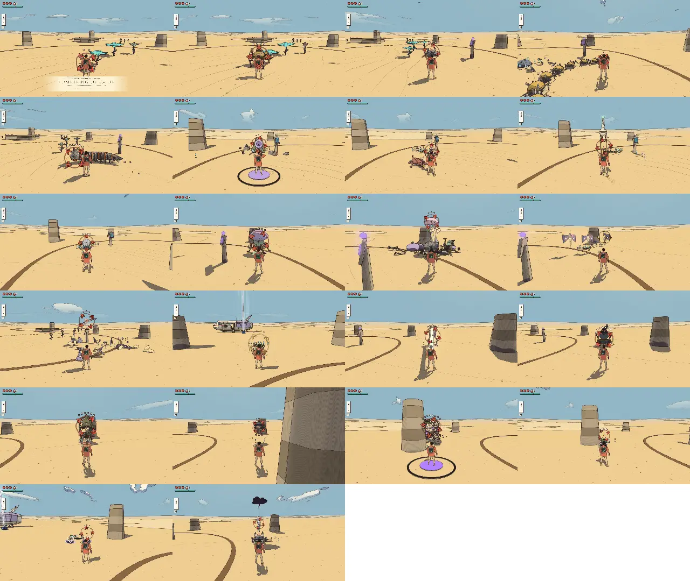
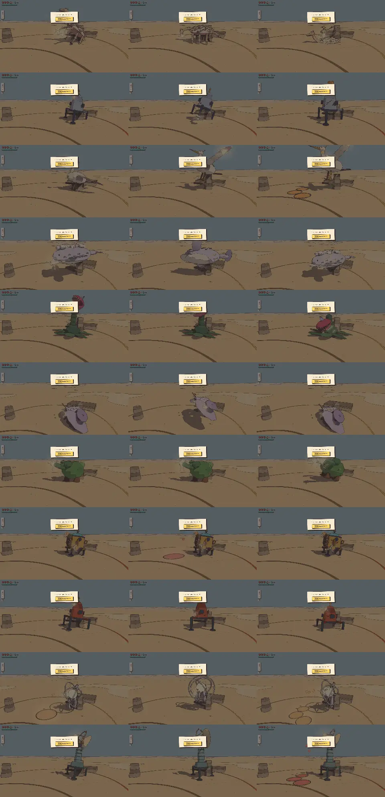

# Combat review, v1.22 (2026-10-10): the whole roster, balance and sound (the enemy roster's step 8)

<!-- audit-scores
overall: 4.51 / 5
label: the mean of the 21 archetypes' totals (by eye) and the 11 guardians' (from their tuning)
date: 2026-10-10
-->

The last step of the enemy roster (docs/design/enemy-roster.md, "Build plan" 8): with all 21 archetypes built (v1.8–v1.18),
the route's difficulty curve set world by world, a hurt and a burst sound per archetype, and the combat audits'
open recommendations that are tuning by numbers. The first full run of the combat-review skill over the whole roster
since v1.4, and the first with its new `--packs` mode (the curve, world by world).

## Setup

- This branch (on main ac7600f6), headless Chrome (muted, ANGLE Metal), the Arena, 1280 × 720, Enemies "normal".
- **Kinds:** every kind watched 24 s against a still traveller in its home skin, then each move's blows through
  `Foes.hurt`, before (`--watch 24`, the commit before) and after (`--version 1.20 --guardians no`, retimed with
  `--rescore … --moves-now`: the light combo timed swing by swing). Since this run the script times each move by its
  authored phases (wind + active + recover) instead of its clip's span, sends the air cut's `air` and the swing's place
  in the combo as the blade does, and keeps the still traveller standing (a knockout had left one run with nobody to
  fight from the root knot on).
- **The curve:** `--packs route --ttk <the kinds run> --pack-count 4 --pack-watch 20`: packs 1–4 of a visit to each
  route world (src/foe-worlds.js `packOf`, seeded: the same draws before and after where the tables agree), each kind in
  the world's skin and with the world's turns, set round the still traveller and watched 20 s.
- The guardians were not changed since v1.6: their table is the script's from their tuning, their sheet drawn again.
- **Not played by hand** (no pad on this machine, and no sound: nothing is played through the speakers here): the
  voices were checked in memory only (tests/foe-voices.test.js); the late worlds' three strikers, the moves' new niches
  and the cart's slag want a pad (recommendations 1–3).

## The difficulty curve, world by world

The measure (`.claude/skills/combat-review/SKILL.md`): a pack's **hearts a minute** on a still traveller and its
**attacks a minute**; its **time to kill** (the sum of its members' fastest moves from the kinds run); the **hearts on
arrival** (three, and every heart container of the shops in the worlds before it: an upper bound, the careful buyer's;
src/shop.js); and its **cost**: the hearts it takes from a traveller who trades blows with it standing still (hearts a
minute × time to kill), as a **share** of those hearts. The v1.4 audit's complaint was that the route's end was its
softest stretch: before this step the cost share fell from the middle of the route to 5 % in the Signal Market.

**Before** (main ac7600f6: places by stage 1–2, 2–3, 3–4, 4–5; groups alone; two strikers everywhere):

| world | stage | budget | strikers | lead | pack size | hearts/min (still) | attacks/min | ttk best (s) | ttk combo (s) | hearts on arrival | bars/min | cost (hearts) | cost share | packs watched |
| --- | --- | --- | --- | --- | --- | --- | --- | --- | --- | --- | --- | --- | --- | --- |
| desert | 0 | 1–2 | 2 | blot | 1.3 | 10.51 | 23.3 | 2.1 | 3.6 | 3 | 3.5 | 0.38 | 13 % | worm + blot; blot; worm; blot |
| arzach | 0 | 1–2 | 2 | ray | 1.3 | 7.51 | 16.5 | 2.1 | 4.5 | 5 | 1.5 | 0.28 | 6 % | heron + ray; ray; heron; ray |
| arzach2 | 1 | 2–3 | 2 | crab | 2.3 | 10.89 | 29.3 | 4.2 | ∞ | 6 | 1.81 | 0.75 | 13 % | 2 crab; crab + blot; ray + blot + crab; crab + blot |
| perdide | 1 | 2–3 | 2 | toad | 3 | 23.47 | 50.3 | 4.8 | 9.8 | 7 | 3.35 | 1.84 | 26 % | toad + blot + heron; toad + 2 heron; rootknot + blot + toad; toad + 2 blot |
| perdide2 | 1 | 2–3 | 2 | rootknot | 3 | 11.65 | 46.6 | 3.6 | 7.5 | 8 | 1.46 | 0.91 | 11 % | rootknot + blot + jelly; 3 moth; 2 rootknot + blot; 3 moth |
| edena | 2 | 3–4 | 2 | moth | 2.8 | 19.52 | 48.8 | 4 | 8.1 | 9 | 2.17 | 1.46 | 16 % | brute + blot; 3 moth; 3 blot; 2 rootknot + blot |
| incal | 2 | 3–4 | 2 | tripod | 2.8 | 15.4 | 41.3 | 3.3 | 8.7 | 10 | 1.54 | 0.89 | 9 % | 2 lizard; 2 drone + blot; toad + 2 blot; 2 drone + blot |
| garage | 2 | 3–4 | 2 | drone | 3 | 9.39 | 35.3 | 4.5 | ∞ | 12 | 0.78 | 0.71 | 6 % | 2 crab + ray; 2 drone + blot; roller + blot + drone; 3 drone |
| buried | 3 | 4–5 | 2 | worm | 3.5 | 11.64 | 25.5 | 7.2 | 12.5 | 13 | 0.9 | 1.49 | 11 % | cart + 2 worm + blot; 3 worm + blot; 2 lizard; 4 worm |
| spheres | 3 | 4–5 | 2 | roller | 5 | 7.7 | 41.3 | 8.7 | 17.3 | 15 | 0.51 | 1.13 | 8 % | 2 drone + 2 roller + jelly; 2 roller + 2 jelly + drone; 2 drone + blot + 2 roller; 3 roller + blot + jelly |
| bazaar | 3 | 4–5 | 2 | lizard | 2.8 | 9.78 | 25.6 | 4.8 | ∞ | 16 | 0.61 | 0.87 | 5 % | 3 crab + blot; 2 lizard; 2 crab + blot; 2 lizard |
**After** (places by stage 1–2, 2–3, 3–5, 4–5 and the Market alone at 5–6; Viridel 3–4, the Hangar 4–5, the Garden
4–6; groups with fillers from the third stage; in the last three worlds three strikers, three quarters of the wait
between strikes and the heavier blows):

| world | stage | budget | strikers | lead | pack size | hearts/min (still) | attacks/min | ttk best (s) | ttk combo (s) | hearts on arrival | bars/min | cost (hearts) | cost share | packs watched |
| --- | --- | --- | --- | --- | --- | --- | --- | --- | --- | --- | --- | --- | --- | --- |
| desert | 0 | 1–2 | 2 | blot | 1.3 | 10.14 | 21.8 | 1.4 | 2.1 | 3 | 3.38 | 0.25 | 8 % | worm + blot; blot; worm; blot |
| arzach | 0 | 1–2 | 2 | ray | 1.3 | 6.77 | 16.5 | 1.9 | 2.8 | 5 | 1.35 | 0.25 | 5 % | heron + ray; ray; heron; ray |
| arzach2 | 1 | 2–3 | 2 | crab | 2.3 | 12.03 | 30.8 | 3.8 | 4.3 | 6 | 2 | 0.75 | 13 % | 2 crab; crab + blot; ray + blot + crab; crab + blot |
| perdide | 1 | 2–3 | 2 | toad | 3 | 20.09 | 48.8 | 5 | 5.9 | 7 | 2.87 | 1.61 | 23 % | rootknot + toad + heron; toad + 2 heron; rootknot + blot + toad; toad + 2 blot |
| perdide2 | 1 | 2–3 | 2 | rootknot | 3 | 8.27 | 45.1 | 3.4 | 3.8 | 8 | 1.03 | 0.69 | 9 % | rootknot + blot + jelly; 3 moth; 2 rootknot + blot; 3 moth |
| edena | 2 | 3–4 | 2 | moth | 2.5 | 10.89 | 33 | 3.6 | 4 | 9 | 1.21 | 0.94 | 10 % | brute + blot; 3 moth; brute + blot; 3 moth |
| incal | 2 | 3–5 | 2 | tripod | 3.3 | 21.23 | 49.6 | 4.3 | 6 | 10 | 2.12 | 1.5 | 15 % | 2 toad + blot; drone + toad + blot; shade + 2 blot; 2 lizard + drone + blot |
| garage | 2 | 4–5 | 2 | drone | 3.8 | 13.9 | 39.1 | 4.6 | 7.8 | 12 | 1.16 | 1.07 | 9 % | crab + 2 drone + ray; 3 drone + blot; crab + blot + drone; 4 drone |
| buried | 3 | 4–5 | 3 | worm | 3.8 | 15.39 | 46.5 | 5 | 7.8 | 13 | 1.18 | 1.28 | 10 % | cart + 2 worm + blot; 3 worm + blot; 2 lizard + blot + worm; tripod + 2 worm |
| spheres | 3 | 4–6 | 3 | roller | 5.5 | 12.76 | 47.3 | 10.1 | 12 | 15 | 0.85 | 2.16 | 14 % | centipede + 2 roller + jelly + drone; 3 roller + jelly + blot + drone; centipede + blot + 3 roller; 4 roller + blot + jelly |
| bazaar | 4 | 5–6 | 3 | lizard | 4.8 | 20.46 | 51.8 | 8.5 | 9.8 | 16 | 1.28 | 2.82 | 18 % | 4 crab + blot; 2 lizard + 2 crab + blot; marionette + blot + 2 crab; 2 lizard + 3 crab |

The cost share by world, before → after:

| world | hearts on arrival | cost share before | cost share after | time to kill a pack, before → after (s) | attacks a minute, before → after |
|---|---|---|---|---|---|
| The Desert | 3 | 13 % | 8 % | 2.1 → 1.4 | 23 → 22 |
| Vael | 5 | 6 % | 5 % | 2.1 → 1.9 | 17 → 17 |
| Vael II | 6 | 13 % | 13 % | 4.2 → 3.8 | 29 → 31 |
| Lorn | 7 | 26 % | 23 % | 4.8 → 5.0 | 50 → 49 |
| Lorn II | 8 | 11 % | 9 % | 3.6 → 3.4 | 47 → 45 |
| Viridel | 9 | 16 % | 10 % | 4.0 → 3.6 | 49 → 33 |
| The City-Shaft | 10 | 9 % | 15 % | 3.3 → 4.3 | 41 → 50 |
| The Sealed Hangar | 12 | 6 % | 9 % | 4.5 → 4.6 | 35 → 39 |
| The Buried Machine | 13 | 11 % | 10 % | 7.2 → 5.0 | 26 → 47 |
| The Garden of Spheres | 15 | 8 % | 14 % | 8.7 → 10.1 | 41 → 47 |
| The Signal Market | 16 | 5 % | **18 %** | 4.8 → 8.5 | 26 → 52 |

What it shows:

- **The end rises now** (the Hangar 9 % → the Buried Machine 10 % → the Garden 14 % → the Market 18 %, the route's
  hardest after Lorn) where it fell (11 % → 8 % → 5 %). The Market's packs are twice the size (2.8 → 4.8: its lizard
  pairs bring company) and press twice as hard (9.8 → 20.5 hearts a minute: three strikers, its ordinary blows ¾); the
  Garden's are the biggest on the route (5.5 foes, 10 s to clear).
- **The time to clear a pack grows along the route** (1.4–1.9 s in the first two worlds, 3.4–5 s in the middle, 5–10 s
  at the end) and so do the attacks a minute (17–31 early, 45–52 late).
- **A still traveller in a crowd under-reads a big pack.** Two (now three) strikers at a time, and one off the screen
  waits while another strikes, so a pack of five presses about as hard as two: the late worlds' hearts a minute stay
  12–20 whatever their size. The time to kill carries their weight here; a pad tells the rest (recommendation 2).
- **Lorn stays a spike** (23 %): the spore toads' lobs land on a traveller who never moves, and its herons' spears reach
  him; a moving traveller steps out of both. Its toads and herons were made rarer (toad 4 → 3.5, heron 2 → 1.5,
  skitters 2 → 3), but these four seeded packs drew the same ones. Play it (recommendation 2) before cutting further.
- **Some of the fall in the early worlds is the moves' new niches**: the air cut and the combo clear the blots, rays and
  worms faster (the time to kill a Desert pack 2.1 → 1.4 s), so the same packs cost less.
- Four packs a world is a small sample (the same pack drawn twice moves a world's share by a few points); the shape,
  not each number, is the finding.

Model check (not in the tables): the expected pack per world from 4,000 draws of `packOf`, each kind's still-traveller
threat from the kinds run, the strikers' cap as the top two or three members, gives the same order at the end (the
Market highest, the Garden and the Buried Machine next) and the same Lorn spike.

## The scores

| guardian | world | read | counter | space | fair | phases | total |
|---|---|---|---|---|---|---|---|
| the Keeper of the cistern | desert | 4 | 5 | 4 | 5 | 5 | 4.6 |
| the Elder | arzach | 3 | 5 | 4 | 4 | 5 | 4.2 |
| the Cloud-Mother | arzach2 | 3 | 5 | 4 | 4 | 5 | 4.2 |
| the Mother Snapper | perdide | 3 | 5 | 4 | 4 | 5 | 4.2 |
| the Lampless | perdide2 | 3 | 5 | 3 | 4 | 5 | 4.0 |
| the Gardener | edena | 4 | 5 | 5 | 5 | 5 | 4.8 |
| the warden | incal | 3 | 5 | 5 | 4 | 5 | 4.4 |
| the Clockwork Foreman | garage | 3 | 5 | 4 | 4 | 5 | 4.2 |
| the Tooth-Warden | buried | 3 | 5 | 4 | 4 | 5 | 4.2 |
| the Echo | spheres | 3 | 5 | 4 | 4 | 5 | 4.2 |
| the First Sign | bazaar | 3 | 4 | 5 | 4 | 5 | 4.2 |

The guardians are as in [v1.6](combat-v1.6.md) (their fights were not changed; the temples' twists since are the temple
audits'). Each in its ring, phase by phase:

The foes, the whole roster (the scores by eye, carried from the batch audits and changed here where marked `a → b`; the
numbers from this run):

| kind | read | counter | space | fair | identity | combines | total | wind seen (s) | attacks/min | health/min | ttk combo | ttk charge | ttk air | ttk riposte | ttk shoot | ttk fire |
|---|---|---|---|---|---|---|---|---|---|---|---|---|---|---|---|---|
| shellback crab | 5 | 5 | 5 | 5 | 4 → 5 | 3 | 4.7 | 1.12 | 12.5 | 3.13 | 2.2 (behind) | 2.9 (behind) | 2.16 (behind) | 5.34 (behind) | ∞ | 5.12 |
| skitter swarm (as its flock) | 4 | 5 | 4 | 5 | 4 → 5 | 4 | 4.5 | 0.61 | 62.6 | 0.21 | 0.62 | 1.45 | 1.08 | 1.5 | 0.61 | 1.28 |
| ring centipede | 5 | 5 | 5 | 5 | 4 → 5 | 4 | 4.8 | 2.32 | 12.5 | 2.5 | 3.32 | 2.9 | 3.24 | 5.34 | ∞ | 7.68 |
| bellows toad | 5 | 5 | 5 | 5 | 4 → 5 | 5 | 5 | 1.22 | 15 | 2.09 | 2.2 | 1.45 | 2.16 | 4.54 | 1.84 | 3.84 |
| horn lizard | 5 | 4 | 4 | 5 | 4 → 5 | 4 | 4.5 | 1.03 | 20 | 2.5 | 2.2 | 1.45 | 2.16 | 3.54 | 1.84 | 3.84 |
| stilt heron | 4 | 5 | 4 | 5 | 5 | 4 | 4.5 | 0.90 | 15 | 2.5 | 2.2 | 2.9 | 2.16 | 4.54 | 2.45 | 5.12 |
| pearl roller | 5 | 5 | 4 | 4 | 4 → 5 | 4 | 4.5 | 0.98 | 12.5 | 2.5 | 2.2 | 2.9 | 2.16 | 5.34 | 2.45 | 5.12 |
| root knot | 4 | 5 | 4 | 5 | 4 → 5 | 5 | 4.7 | 0.77 | 17.5 | 2.08 | 2.2 | 2.9 | 3.24 | 3.97 | 3.07 | 3.84 |
| lantern jelly (with its blot) | 4 | 5 | 4 | 5 | 4 → 5 | 5 | 4.7 | 0.99 | 12.5 | 4.17 | 2.2 | 1.45 | 1.08 | 5.34 | 3.68 | 3.84 |
| signal moth | 5 | 5 | 4 | 5 | 4 → 5 | 3 | 4.5 | 1.03 | 30 | 2.29 | 0.62 | 1.45 | 1.08 | 2.54 | 0.61 | 1.28 |
| sky ray | 5 | 4 → 5 | 4 | 5 | 4 → 5 | 4 | 4.7 | 1.12 | 12.5 | 1.46 | 2.2 | 1.45 | 1.08 | 5.34 | 1.84 | 3.84 |
| mound worm | 5 | 5 | 5 | 5 | 4 → 5 | 4 | 4.8 | 1.31 | 12.5 | 2.29 | 2.2 | 2.9 | 1.08 | 10.68 | ∞ | ∞ |
| lamp tripod | 5 | 5 | 4 | 5 | 4 → 5 | 3 | 4.5 | 1.41 | 12.5 | 3.13 | 2.2 | 2.9 | 3.24 | 5.34 | ∞ | ∞ |
| crucible cart | 5 | 5 | 5 | 4 → 5 | 5 | 5 | 5 | 1.20 | 12.5 | 5.22 | 3.32 | 2.9 | 3.24 | 5.34 | 3.68 | ∞ |
| bell walker | 5 | 5 | 5 | 4 | 5 | 5 | 4.8 | 1.63 | 12.5 | 4.17 | ∞ | ∞ | ∞ | 5.34 | ∞ | ∞ |
| ring drone | 4 | 5 | 5 | 5 | 5 | 4 | 4.7 | 1.12 | 10 | 1.88 | 2.2 | 1.45 | 1.08 | 6.54 | ∞ | ∞ |
| furnace brute | 5 | 5 | 4 | 5 | 5 | 5 | 4.8 | 1.50 | 12.5 | 3.13 | 4.9 | 4.35 | 4.32 | 10.68 | ∞ | ∞ |
| ink blot | 4 | 5 | 3 | 4 | 3 → 4 | 3 | 3.8 | 0.69 | 17.5 | 2.92 | 1.3 | 1.45 | 1.08 | 3.97 | 1.23 | 2.56 |
| shade | 5 | 5 | 4 | 4 | 4 → 5 | 4 | 4.5 | 1.28 | 15 | 3.54 | 2.2 | 2.9 | 3.24 | 4.54 | 3.07 | 3.84 |
| antler hound | 5 | 4 | 4 | 5 | 4 → 5 | 4 | 4.5 | 1.44 | 30 | 4.59 | 0.62 (behind) | 1.45 (behind) | 2.16 (behind) | 2.54 | ∞ | 2.56 |
| marionette (with a crab) | 5 | 5 | 5 | 4 | 5 | 5 | 4.8 | 1.03 | 12.5 | 2.71 | 2.2 | 2.9 | 1.08 | 5.34 | 2.45 | 2.56 |

Changed by eye:

- **Identity, 4 → 5 for 14 kinds (the ink blot 3 → 4):** each archetype now has its own hurt and burst (src/foe-voices.js)
  on top of its drawn silhouette: a shell's clack, a toad's wheeze, a heron's clay ring and break, a jelly's glass, a
  moth's paper, a ray's slap and whoosh, a worm's grit, a tripod's steam, a centipede's rattling plates, a shade's cloth,
  a hound's yelp, a roller's glassy shatter. Checked in memory, not by ear: every two hurts are apart by their loudness
  over time and their brightness (tests/foe-voices.test.js); confirm by ear (recommendation 4).
- **The sky ray's counterplay, 4 → 5:** the air cut now meets it in its own air (double: one air cut, 1.08 s), beside
  the perfect parry that grounds its skim.
- **The crucible cart's fairness, 4 → 5:** its slag burns every 1.1 s (was 0.7) and cools sooner (the pour's 4 s, was 6;
  the trail 3.5 s, was 4.5): 7.1 → 4.4–5.2 bars a minute on a still traveller (two runs), level with the bell walker
  (4.2) and the hound (4.6), still the hardest to ignore.
- Kept: the shade's fairness 4 (its cut is a heavy blow now, ¾ with a 0.95 s wind-up, 2.9 → 3.5 bars a minute: harder,
  and as readable); the drone's 5 (its diving ram ¾, 0.4–1.7 → 1.9–2.1).

Numbers to read with care: the antler hound's blade times (behind) count only the blows that land on it solid (its
shadow phase swallows the rest at the Arena's distance); the bell walker's only the riposte (only its clapper takes
harm: combat-v1.16 rec. 4).

**Which move kills each kind fastest** (the time-to-kill columns): before, the full charged cut for 19 of 22 kinds (the
script's old timings; the shot for the skitters and the moth, the riposte for the bell). Now: **the air cut 11** (the
jelly, the ray, the drone and the marionette that hover, double by design; the blot and the worm in one air cut each;
the four-hearted ground kinds a hair ahead of the combo, 2.16 against 2.2 s; the brute, 4.32 against the charged cut's
4.35), **the light combo 4** (the root knot, the tripod and the shade, five hearts in one combo, its third swing landing
3; the hound's count is the unreliable one above), **the charged cut 4** (the centipede, the toad, the lizard, the cart: three hearts in one blow, six in
two), the shot 2, the riposte 1. The dash cut is the answer nowhere (recommendation 5).

## The combat as a whole

| | score | why |
|---|---|---|
| **Responsiveness** | 4 | unchanged (the swings' timing was not touched; the full charge gathers in 0.85 s instead of 0.6). |
| **Feedback** | 4 → 5 | every archetype its own hurt and burst; a shot or an ember that does nothing glances with a spark and a tick (`Foe.hit` → `'glance'`, `sound.foeGlance`) instead of flinching it as if hurt; the armour's thunk, the wind-up's rising sound and the glow as before. |
| **Move variety** | 3 → 4 | the charged cut leads 4 kinds, not 19: the air cut owns the flyers, the combo the five-hearted ground kinds, the charged cut the three- and six-hearted ones; the dash cut is still nobody's best. |
| **Difficulty curve** | 2 → 4 | the end rises to the Market (cost share 9 → 10 → 14 → 18 %) where it fell to 5 %; the time to clear a pack and the attacks a minute grow along the route. Lorn's spike and the still traveller's cap on a crowd keep it from 5. |
| **Camera and lock-on** | 3 | unchanged; with five foes in a Garden pack the off-screen markers carry more (recommendation 2). |

## The best and the weakest

- **Best:** the bellows toad (5.0: a lob with a landing mark, a throat to shoot, a belly flop the air cut flips, now its
  wheeze and pop), the crucible cart (5.0), the ring centipede, the mound worm, the furnace brute, the bell walker and
  the marionette (4.8).
- **Weakest:** the ink blot (3.8: the teacher, fodder by design), then a band at 4.5 (the lizard, the hound, the heron,
  the moth, the tripod, the roller, the shade, the skitters): each with a niche, none weak.
- **Guardians:** unchanged since v1.6: the Gardener (4.8) and the Keeper (4.6) best, the Lampless plainest (4.0).

## Recommendations (most valuable first; in TODO.md)

1. **Play the late worlds with a pad**: three strikers at once, three quarters of the wait between strikes and the
   heavier blows in the Buried Machine, the Garden and the Market (`TURNS.late`, `HARM_BY_STAGE`); if it is a pile-on,
   keep the heavier blows and drop the quicker waits first.
2. **Measure a crowd better before tuning further by numbers**: drive the still traveller's camera to each striker (as
   the lock-on would) or script a traveller clearing the pack; then look again at Lorn's spike (23 %: lobs and spears on
   a traveller who never moves) and the Hangar's drones (four drones press 7.5 hearts a minute).
3. **Play the moves' new niches**: the full charge at 0.85 s (still worth holding?), the combo's third swing at 3 and
   the air cut double on a flyer (are they used?); the cart's slag at 1.1 s in the Hangar's corridors.
4. **Hear the voices** on speakers and on the Retroid and tune by ear (levels, the bell's tail, the moth's paper).
5. **The dash cut** is nobody's fastest answer (1.5 s a blow by its cooldown): a dash cut through a foe's back could land
   double, or its cooldown shorten.

## Against the last report

The batch audits scored v1.8's batch 1 3.7–4.5 (mean 4.22), v1.9's batch 2 4.3–4.7 (4.50), v1.13's batch 3 4.3–4.8
(4.54), v1.16's batch 4 4.7–4.8 (4.78) and v1.18's batch 5 4.3–4.8 (4.50). The whole roster now scores 3.8–5.0 by eye,
mean 4.63 (identity up a point for 15 kinds with their voices, the ray's counterplay and the cart's fairness up a point);
with the guardians 4.51. Against v1.4's whole-game report: feedback 3 → 5 (v1.6 had 4), move variety 3 → 4, the
difficulty curve 2 → 4.
