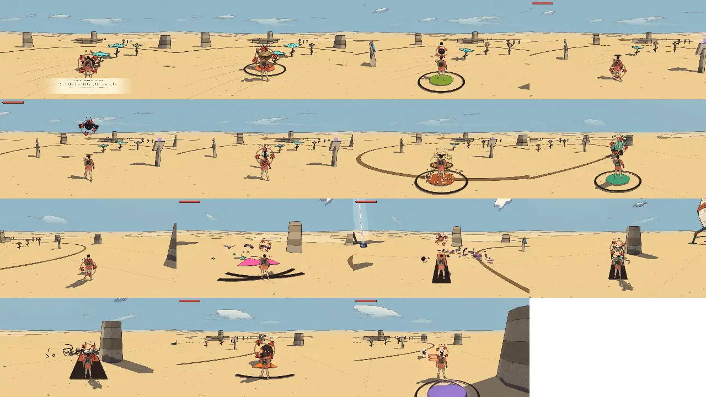

# Combat review, v1.4 (2026-10-09)

<!-- audit-scores
overall: 3.75 / 5
label: the mean of the 26 totals (15 foe kinds and 11 guardians, both 3.75)
date: 2026-10-09
-->

The first run of the combat-review skill (`.claude/skills/combat-review/SKILL.md`). Scores are 1-5 on the skill's
rubric; the per-foe numbers come from `.claude/skills/combat-review/arena.mjs` driving the Arena headless, the guardians'
from their temples' tuning. **The roster is about to grow** (a much larger set of enemies is being restored): this is the
baseline for the 15 kinds and 11 guardians of v1.4, to compare the new ones against.

## Setup

- Commit c724b2a4 (main 592f0e7a plus the skills), headless Chrome (muted, ANGLE Metal, M4 Pro), the Arena, Medium
  preset, 1280 × 720, Enemies "normal".
- Each kind called in with `foes.setPractice` and watched for 24 s against a traveller standing still 9 m off (his health
  kept topped up, every hurt counted); then each move's blows dealt through `Foes.hurt` (armour, shells and immunities
  answer as in play; from behind after six blows that do nothing, as a player would flank).
- Not played by hand this time: the camera and lock-on, guard and parry timing, and the guardians in their temples.
  Their scores below are from the tuning and the code, and say so.
- How to read the time to kill: seconds of that one move alone, its blows times its cycle (the light combo averages its
  three swings with the cooldown; the riposte also waits one of the foe's attack cycles for the parry; the gun counts
  tank charges and the refill). ∞: that move can't bring it down alone.

*The contact sheet, in the table's order (4 a row): blot, machine, spitter, swarm / flyer, shade, ray, golem /
splinter, moth, drone, stalker / crab, slag, hound. The game's own camera sits behind the traveller, so the foe is
often half hidden behind him: the script should frame the foe from the side (a TODO below).*

## Foes (15 kinds, the Arena, a still player, 24 s each)

| kind | read | counter | space | fair | identity | combines | **total** | wind seen (s) | attacks/min | health/min | ttk combo | ttk charge | ttk air | ttk riposte | ttk dash | ttk shoot | ttk fire | ttk push |
| --- | --- | --- | --- | --- | --- | --- | --- | --- | --- | --- | --- | --- | --- | --- | --- | --- | --- | --- |
| ink blot | 3 | 4 | 3 | 4 | 3 | 4 | **3.5** | 0.64 | 17.5 | 2.48 | 2.39 | 1.2 | 1.25 | 4.15 | 1.5 | 1.89 | 4.56 | ∞ |
| makers’ machine | 5 | 3 | 3 | 5 | 4 | 3 | **3.8** | 1.33 | 12.5 | 1.45 | 3.58 | 2.4 | 2.5 | 5.52 | 3 | ∞ | ∞ | ∞ |
| spitting blot | 5 | 3 | 4 | 5 | 4 | 3 | **4** | 1.29 | 15 | 1.65 | 2.39 | 1.2 | 1.25 | 4.73 | 1.5 | 1.89 | 4.56 | ∞ |
| blot swarm | 3 | 3 | 2 | 5 | 2 | 4 | **3.2** | 0.51 | 25 | 1.25 | 1.19 | 1.2 | 1.25 | 3.13 | 1.5 | 0.95 | 2.28 | 2.28 |
| winged blot | 5 | 2 | 3 | 5 | 2 | 4 | **3.5** | 1.01 | 10 | 1.7 | 2.39 | 1.2 | 1.25 | 6.73 | 1.5 | 1.89 | 4.56 | ∞ |
| shade | 4 | 2 | 2 | 4 | 3 | 3 | **3** | 0.94 | 15 | 3 | 4.77 | 2.4 | 3.75 | 4.73 | 4.5 | 4.73 | 11.4 | ∞ |
| dune ray | 5 | 4 | 5 | 5 | 4 | 3 | **4.3** | 1.26 | 12.5 | 2.13 | 3.58 | 2.4 | 2.5 | 11.04 | 3 | ∞ | ∞ | ∞ |
| glass golem | 5 | 5 | 3 | 5 | 4 | 2 | **4** | 1.37 | 15 | 2 | 5.97 | 2.4 | 3.75 | 4.73 | 4.5 | ∞ | ∞ | ∞ |
| glass splinter | 2 | 3 | 2 | 5 | 3 | 3 | **3** | 0.47 | 25 | 1.25 | 1.19 | 1.2 | 1.25 | 3.13 | 1.5 | 0.95 | ∞ | 2.28 |
| sign moth | 5 | 5 | 4 | 5 | 4 | 4 | **4.5** | 1.02 | 12.5 | 1 | 1.19 | 1.2 | 1.25 | 5.53 | 1.5 | 0.95 | 2.28 | 2.28 |
| rust drone | 4 | 3 | 5 | 5 | 4 | 3 | **4** | 0.82 | 12.5 | 1.1 | 3.58 | 1.2 | 2.5 | 5.52 | 3 | ∞ | ∞ | ∞ |
| root stalker | 4 | 5 | 3 | 5 | 4 | 3 | **4** | 0.77 | 20 | 2.15 | 3.58 | 2.4 | 2.5 | 3.73 | 3 | 3.79 | 4.56 | ∞ |
| salt crab | 5 | 5 | 4 | 5 | 4 | 3 | **4.3** | 1.11 | 12.5 | 2.13 | 3.58 (behind) | 7.2 | 8.75 | 5.53 (behind) | 3 (behind) | ∞ | 9.12 | ∞ |
| slag walker | 5 | 4 | 3 | 5 | 4 | 2 | **3.8** | 1.16 | 12.5 | 2 | 4.77 | 2.4 | 3.75 | 5.53 | 4.5 | 4.73 | ∞ | ∞ |
| shadow hound | 3 | 3 | 4 | 3 | 4 | 3 | **3.3** | 0.60 | 17.5 | 3.35 | 2.39 (behind) | 1.2 (behind) | 2.5 (behind) | 4.15 | 3 (behind) | ∞ | 4.56 | ∞ |

## Guardians (11, from their tuning)

| guardian | world | read | counter | space | fair | phases | **total** | why |
| --- | --- | --- | --- | --- | --- | --- | --- | --- |
| the Elder | arzach | 4 | 4 | 3 | 5 | 3 | **3.8** | telegraphs 1.4-1.7 s, 3 attacks (cone/ring), open 4.2 s, 2 phases, calmed |
| the Cloud-Mother | arzach2 | 4 | 4 | 3 | 5 | 3 | **3.8** | telegraphs 1.4-1.7 s, 3 attacks (cone/ring), open 2.6 s, 2 phases, calmed |
| the First Sign | bazaar | 4 | 4 | 3 | 5 | 3 | **3.8** | telegraphs 1.5-1.6 s, 3 attacks (ring/lane), open 4.4 s, 2 phases, broken |
| the Tooth-Warden | buried | 4 | 4 | 3 | 4 | 3 | **3.6** | telegraphs 1.4-1.6 s, 3 attacks (lane/ring), open 3 s, 2 phases, broken |
| the Keeper of the cistern | desert | 4 | 4 | 3 | 4 | 3 | **3.6** | telegraphs 1.4-2.1 s, 3 attacks (ring/cone), open 2.2 s, 2 phases, calmed |
| the Gardener | edena | 4 | 4 | 3 | 5 | 3 | **3.8** | telegraphs 1.4-1.8 s, 3 attacks (cone/ring), open 3.2 s, 2 phases, calmed |
| the Clockwork Foreman | garage | 4 | 4 | 3 | 5 | 3 | **3.8** | telegraphs 1.4-1.6 s, 3 attacks (cone/ring), open 5.6 s, 2 phases, broken |
| the warden | incal | 4 | 4 | 3 | 4 | 3 | **3.6** | telegraphs 1.4-1.6 s, 3 attacks (lane/ring), open 2.8 s, 2 phases, broken |
| the Mother Snapper | perdide | 3 | 4 | 4 | 5 | 3 | **3.8** | telegraphs 1.3-1.7 s, 3 attacks (lane/cone/ring), open 3.6 s, 2 phases, calmed |
| the Lampless | perdide2 | 4 | 4 | 3 | 5 | 3 | **3.8** | telegraphs 1.4-1.6 s, 3 attacks (ring/cone), open 3.4 s, 2 phases, calmed |
| the Echo | spheres | 4 | 4 | 3 | 5 | 3 | **3.8** | telegraphs 1.4-1.6 s, 3 attacks (ring/lane), open 2.8 s, 2 phases, calmed |

## Why each foe scored as it did

- **ink blot**: readability: wind-up 0.64 s seen; counterplay: 3 answers (shoot, fire, flinchy), 3 attacks; space: clamber, lunge; fairness: 2.48 health/min on a still player, threat 4; identity: ink tone, the ink sound set (confirm on the contact sheet and by ear); combines: 19 world rosters, role melee.
- **makers’ machine**: readability: wind-up 1.33 s seen; counterplay: 3 answers (breaks, heavy, metal), 2 attacks; space: heavy, shockwave; fairness: 1.45 health/min on a still player, threat 3; identity: own tone, the true sound set (confirm on the contact sheet and by ear); combines: 3 world rosters, role heavy.
- **spitting blot**: readability: wind-up 1.29 s seen; counterplay: 2 answers (shoot, fire), 2 attacks; space: perch, keep, lob, volley; fairness: 1.65 health/min on a still player, threat 3; identity: own tone, the ink sound set (confirm on the contact sheet and by ear); combines: 11 world rosters, role ranged.
- **blot swarm**: readability: wind-up 0.51 s seen; counterplay: 4 answers (shoot, fire, push, light), 1 attacks; space: lunge; fairness: 1.25 health/min on a still player, threat 2; identity: ink tone, the ink sound set (confirm on the contact sheet and by ear); combines: 6 world rosters, role swarm.
- **winged blot**: readability: wind-up 1.01 s seen; counterplay: 2 answers (shoot, fire), 1 attacks; space: hover, dive, lane; fairness: 1.70 health/min on a still player, threat 3; identity: ink tone, the ink sound set (confirm on the contact sheet and by ear); combines: 7 world rosters, role air.
- **shade**: readability: wind-up 0.94 s seen; counterplay: 2 answers (shoot, fire), 1 attacks; space: clamber; fairness: 3.00 health/min on a still player, threat 5; identity: own tone, the ink sound set (confirm on the contact sheet and by ear); combines: 22 world rosters, role heavy.
- **dune ray**: readability: wind-up 1.26 s seen; counterplay: 4 answers (shoot, fire, burrow, breaks), 2 attacks; space: burrow, lob, surface, lane, lunge, sweep; fairness: 2.13 health/min on a still player, threat 4; identity: own tone, the ink sound set (confirm on the contact sheet and by ear); combines: 2 world rosters, role ranged.
- **glass golem**: readability: wind-up 1.37 s seen; counterplay: 5 answers (weak:bomb, splits, breaks, heavy, parry:chip), 3 attacks; space: heavy, lob; fairness: 2.00 health/min on a still player, threat 4; identity: own tone, the true sound set (confirm on the contact sheet and by ear); combines: 1 world rosters, role ranged.
- **glass splinter**: readability: wind-up 0.47 s seen; counterplay: 4 answers (shoot, push, flinchy, breaks), 1 attacks; space: lunge; fairness: 1.25 health/min on a still player, threat 2; identity: own tone, the ink sound set (confirm on the contact sheet and by ear); combines: 1 world rosters, role melee.
- **sign moth**: readability: wind-up 1.02 s seen; counterplay: 6 answers (shoot, fire, push, flinchy, breaks, light), 2 attacks; space: hover, blind, dive, lane; fairness: 1.00 health/min on a still player, threat 2; identity: own tone, the ink sound set (confirm on the contact sheet and by ear); combines: 3 world rosters, role air.
- **rust drone**: readability: wind-up 0.82 s seen; counterplay: 3 answers (breaks, metal, parry:cut), 2 attacks; space: hover, keep, lane, tether, dive; fairness: 1.10 health/min on a still player, threat 2; identity: own tone, the true sound set (confirm on the contact sheet and by ear); combines: 8 world rosters, role ranged.
- **root stalker**: readability: wind-up 0.77 s seen; counterplay: 5 answers (shoot, fire, bloom, breaks, parry:cut), 2 attacks; space: clamber, lane, grab; fairness: 2.15 health/min on a still player, threat 4; identity: own tone, the ink sound set (confirm on the contact sheet and by ear); combines: 6 world rosters, role heavy.
- **salt crab**: readability: wind-up 1.11 s seen; counterplay: 6 answers (fire, weak:bomb, shell, breaks, heavy, parry:flip), 2 attacks; space: heavy, lane, lunge, sweep; fairness: 2.13 health/min on a still player, threat 4; identity: own tone, the true sound set (confirm on the contact sheet and by ear); combines: 3 world rosters, role heavy.
- **slag walker**: readability: wind-up 1.16 s seen; counterplay: 4 answers (shoot, douse, breaks, heavy), 2 attacks; space: heavy, trail, leave; fairness: 2.00 health/min on a still player, threat 4; identity: own tone, the ink sound set (confirm on the contact sheet and by ear); combines: 1 world rosters, role heavy.
- **shadow hound**: readability: wind-up 0.60 s seen; counterplay: 2 answers (fire, phase), 3 attacks; space: clamber, phase, lunge, blink; fairness: 3.35 health/min on a still player, threat 5; identity: own tone, the ink sound set (confirm on the contact sheet and by ear); combines: 1 world rosters, role swarm.
Scores changed by hand from the automatic ones: none in the tables (they are the script's); the judgements below
weigh them. Identity is capped by the sounds: `src/audio.js` `foeHurt` and `foeBurst` have **two** sets for the
whole roster, the machine's and the ink's, so no kind is recognisable by ear alone.

## The combat as a whole

| | score | why |
|---|---|---|
| **Responsiveness** | 4 | a 0.2 s input buffer, a 0.45 s chain window, the first swing's wind-up 0.22 s, evade 0.28 s with i-frames over 0.03-0.24 s, a perfect guard window of 0.18 s; the cut's pull (up to 2.2 m) forgives spacing. Not felt on a pad this run. |
| **Feedback** | 3 | hit-stop and a camera kick on every kill (`src/feel.js`), slow motion on the last of a fight, armour's thunk and sparks, the riposte's gold ring; but two hurt/burst sound sets for fifteen kinds. |
| **Move variety** | 3 | the **full charged cut kills 11 of 15 kinds fastest of every move** (1.2-2.4 s; the other four are the one-blow light kinds, where a shot is quicker, and the salt crab, whose shell wants a flank), never slower than the light combo but on the crab; the air cut matches it (1.25-3.75 s); the dash cut is a good opener (1.5-4.5 s); the riposte is the slowest by time (waiting on a parry) but doubles on the stunned foe. The gun's shot can't hurt 6 kinds (machine, ray, golem, drone, crab, hound) and the push only ends the light ones (swarm, splinter, moth): by design, but it narrows the answers. |
| **Difficulty curve** | 2 | along the route the leads' threat rises from the desert's blots and rays (2.1-2.5 bars a minute on a still player) to the stalkers and drones, then **falls at the end**: the Garden of Spheres goes back to blots, spitters and swarms and the Signal Market's own kind, the sign moth, is the softest in the game (1.0 bar a minute, one blow). The hardest kinds (hound 3.35, shade 3.0, slag) live in side worlds. |
| **Camera and lock-on** | 3 | lock reach 18 m, lost past 26 m, a flick of the stick switches (`FLICK`), a reticle; the camera stays behind the traveller and lets a foe in front hide behind him (the contact sheet). Not played by hand: score from the code. |

## The best and the weakest

- **Best:** the **sign moth** (4.5: a long, readable flash, a blind, many answers, one blow) and the **salt crab** (4.3:
  the shell makes you flank or flip it, the ember and bombs answer it, a clear spin), the **dune ray** (4.3: it
  swims under the sand and surfaces on a ring that follows you, the richest use of space).
- **Weakest:** the **shade** (3.0: one sword cut, no answer but the blade, 3 bars a minute on a still player, a dull
  pattern for the most human-looking foe), the **glass splinter** (3.0: a 0.47 s lunge, fodder) and the **blot swarm**
  (3.2: a 0.51 s nip, no shape of its own on the sheet).
- **Guardians:** all eleven score 3.6-3.8 and are built the same: **three attacks, two phases, telegraphs of 1.4-1.7 s**,
  an opening of 2.2-5.6 s. Readable and fair, but the last guardians of the route fight like the first.

## Recommendations (most valuable first; in TODO.md)

1. **The charged cut is the answer to almost everything**: kills 11 of 15 kinds fastest of any move. Give the others a reason: the
   light combo's third swing staggering, heavy foes resisting an uncharged charge release, or a longer full charge.
2. **A sound per kind**: hurt and burst voices for glass, shell, paper, roots, slag and shadow (`src/audio.js` has the
   machine's and the ink's only). The cheapest big gain in identity.
3. **The route's last stretch should be its hardest**: the Signal Market and the Garden of Spheres field the softest
   kinds. Bring a late kind to them (hounds, slag walkers or a shade-led pack) or a mixed lead.
4. **The shadow hound's pounce** (0.60 s wind-up, the highest threat: 3.35 bars a minute) and the **shade's cut** (0.94 s,
   3.0 a minute, one attack): a floor telegraph for the pounce or 0.75 s; a second attack for the shade (a thrust, a
   feint) and an answer besides the blade.
5. **Guardians**: vary the template down the route: a third phase or a combined attack for the later ones, telegraphs
   that tighten from 1.7 s in the desert to ~1.2 s at the Signal Market.
6. **Shots that do nothing should say so**: six kinds shrug off the fluid shot silently from the player's side; a glance
   spark and the armour thunk for a shot too.
7. **The script**: frame each kind side-on for the contact sheet (a pinned camera between the traveller and the foe), and
   drive guard, parry and evade timing against each attack (the parry window against each wind-up) next time.

## Against the last report

The first combat review: nothing to compare. The next one should keep the same 24 s watch and the Medium preset.
