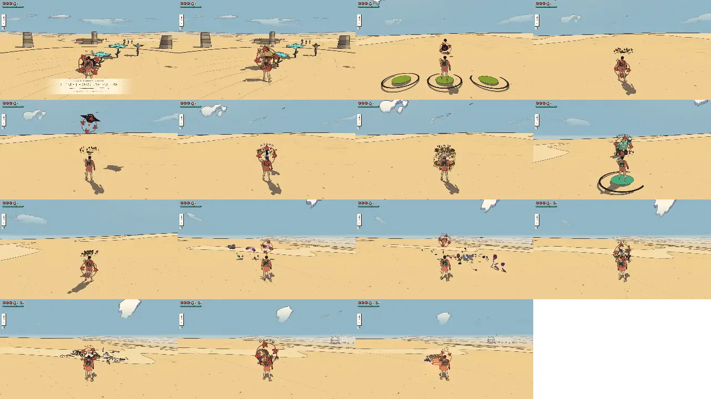
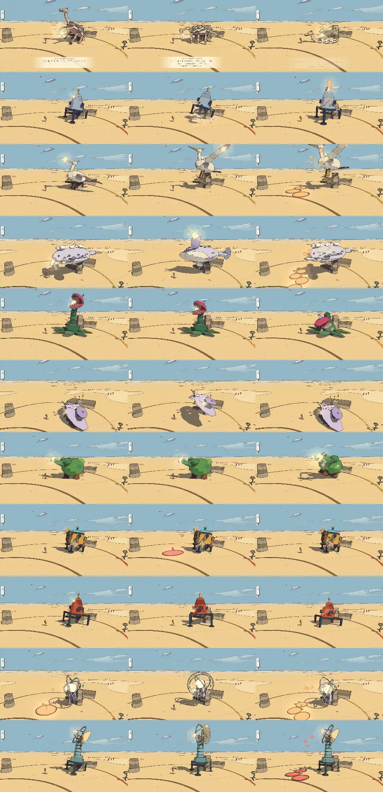

# Combat review, v1.6 (2026-10-09)

<!-- audit-scores
overall: 4.01 / 5
label: the mean of the 26 totals (15 foe kinds 3.80, 11 guardians 4.29)
date: 2026-10-09
-->

The second run of the combat-review skill (`.claude/skills/combat-review/SKILL.md`), after the body-telegraphs work
(TODO "Combat telegraphs", docs/systems/foes.md "Telegraphs: the body, not the floor" and "The guardians' staged
fights"). Compared with [v1.4](combat-v1.4.md).

## Setup

- Branch `worktree-agent-aaee28fe14124eab0` (commit c704cb68 on main 8312cf69), headless Chrome (muted, ANGLE Metal),
  the Arena, Medium preset, 1280 × 720, Enemies "normal".
- Each kind watched 24 s against a still traveller, then each move's blows through `Foes.hurt`, as in v1.4.
- **Health a minute is now a share of a fresh bar** (hurts come in hearts since v1.5; the script divides by the
  traveller's hearts, so 1.0 is still a full bar a minute). The hearts change itself (an ordinary blow is a sixth of a
  fresh bar, was an eighth) raised every kind's threat by about a third, which is why several fairness scores dropped
  by one without anything in this batch touching them.
- New this run: **the guardians' sheet** (`guardians.webp`): each guardian called into an Arena ring, its meter set to
  each phase's start, held at 85 % of that phase's first move, a row each, a column a phase. Their scores are still
  from their tuning, with the rubric's guardian part rewritten for staged fights (`scripts/combat-review/lib.mjs`
  `guardianFacts` / `scoreGuardian`: body tells of its own moves, combos, openings after a move or a miss, waves, lobs,
  phases and what each adds; a floor-drawn non-projectile attack costs a point of readability).
- Not played by hand: guard and parry timing against the new tells, the guardians in their temples (the temples' own
  tests play every one through: `tests/temples.test.js`).

*The contact sheet (the game's camera, behind the traveller), in the table's order: blot, machine, spitter, swarm /
flyer, shade, ray, golem / splinter, moth, drone, stalker / crab, slag, hound. Only the spitter's volley and the
golem's hurl draw on the sand now (landing marks); every other tell is on the body.*

*The guardians, a row each (Keeper, warden, Elder, Cloud-Mother, Mother Snapper, Lampless, Gardener, Foreman,
Tooth-Warden, Echo, First Sign), a column a phase, each at 85 % of the phase's first move: the glow on the striking
part, the rig's pose, the phase marks (cracks, glyph veins) lighting from the second column, landing marks only under
thrown things (the Elder's feathers, the Cloud-Mother's hail, the Foreman's cog, the Echo's notes, the First Sign's
static).*

## Foes (15 kinds)

| kind | read | counter | space | fair | identity | combines | **total** | wind seen (s) | attacks/min | health/min | ttk combo | ttk charge | ttk air | ttk riposte | ttk dash | ttk shoot | ttk fire | ttk push |
| --- | --- | --- | --- | --- | --- | --- | --- | --- | --- | --- | --- | --- | --- | --- | --- | --- | --- | --- |
| ink blot | 4 | 4 | 3 | 4 | 3 | 4 | **3.7** | 0.72 | 25 | 4.17 | 2.39 | 1.2 | 1.25 | 3.13 | 1.5 | 1.23 | 2.56 | ∞ |
| makers’ machine | 5 | 3 | 3 | 5 | 4 | 3 | **3.8** | 1.08 | 12.5 | 3.76 | 3.58 | 2.4 | 2.5 | 5.52 | 3 | ∞ | ∞ | ∞ |
| spitting blot | 5 | 3 | 4 | 5 | 4 | 3 | **4** | 1.29 | 15 | 2.09 | 2.39 | 1.2 | 1.25 | 4.73 | 1.5 | 1.23 | 2.56 | ∞ |
| blot swarm | 3 | 3 | 2 | 4 | 2 | 4 | **3** | 0.50 | 25 | 2.09 | 1.19 | 1.2 | 1.25 | 3.13 | 1.5 | 0.61 | 1.28 | 1.28 |
| winged blot | 5 | 2 | 3 | 5 | 2 | 4 | **3.5** | 1.02 | 10 | 2.5 | 2.39 | 1.2 | 1.25 | 6.73 | 1.5 | 1.23 | 2.56 | ∞ |
| shade | 5 | 2 | 2 | 5 | 3 | 3 | **3.3** | 0.98 | 15 | 3.75 | 4.77 | 2.4 | 3.75 | 4.73 | 4.5 | 3.07 | 6.4 | ∞ |
| dune ray | 5 | 4 | 5 | 5 | 4 | 3 | **4.3** | 1.23 | 12.5 | 2.5 | 3.58 | 2.4 | 2.5 | 11.05 | 3 | ∞ | ∞ | ∞ |
| glass golem | 5 | 5 | 3 | 5 | 4 | 2 | **4** | 1.38 | 15 | 3.13 | 5.97 | 2.4 | 3.75 | 4.72 | 4.5 | ∞ | ∞ | ∞ |
| glass splinter | 3 | 3 | 2 | 4 | 3 | 3 | **3** | 0.50 | 25 | 2.09 | 1.19 | 1.2 | 1.25 | 3.13 | 1.5 | 0.61 | ∞ | 1.28 |
| sign moth | 5 | 5 | 4 | 5 | 4 | 4 | **4.5** | 1.02 | 12.5 | 2.08 | 1.19 | 1.2 | 1.25 | 5.53 | 1.5 | 0.61 | 1.28 | 1.28 |
| rust drone | 5 | 3 | 5 | 5 | 4 | 3 | **4.2** | 1.08 | 10 | 1.67 | 3.58 | 1.2 | 2.5 | 6.72 | 3 | ∞ | ∞ | ∞ |
| root stalker | 4 | 5 | 3 | 5 | 4 | 3 | **4** | 0.76 | 17.5 | 2.5 | 3.58 | 2.4 | 2.5 | 4.15 | 3 | 2.45 | 2.56 | ∞ |
| salt crab | 4 | 5 | 4 | 5 | 4 | 3 | **4.2** | 0.71 | 15 | 2.71 | 3.58 (behind) | 2.4 (behind) | 2.5 (behind) | 4.73 (behind) | 3 (behind) | ∞ | 5.12 | ∞ |
| slag walker | 5 | 4 | 3 | 5 | 4 | 2 | **3.8** | 1.16 | 12.5 | 3.13 | 4.77 | 2.4 | 3.75 | 5.52 | 4.5 | 3.07 | ∞ | ∞ |
| shadow hound | 4 | 3 | 4 | 4 | 4 | 3 | **3.7** | 0.85 | 15 | 4.18 | 2.39 (behind) | 1.2 (behind) | 2.5 (behind) | 4.72 | 3 (behind) | ∞ | 2.56 | ∞ |

Against v1.4 (total): blot 3.5 → **3.7** (0.72 s seen, readability 4), machine 3.8 → 3.8, spitter 4 → 4, swarm 3.2 →
3.0 (the hearts' threat), flyer 3.5 → 3.5, shade 3.0 → **3.3**, ray 4.3 → 4.3, golem 4 → 4, splinter 3 → 3, moth
4.5 → 4.5, drone 4 → **4.2** (its wind-ups seen 0.82 → 1.08 s: more harpoons than rams this run; its tuning is unchanged),
stalker 4 → 4, crab 4.3 → 4.2 (the hearts' threat), slag 3.8 → 3.8, hound 3.3 → **3.7** (pounce 0.6 → 0.8 s).

**Changed by hand:** none of the numbers. The rubric's top readability band said "a tell of the body and the floor
≥ 0.95 s"; it now reads "a tell of the body (a landing mark for what is thrown)" (SKILL.md), so the floor shapes no
longer score: the kinds that lost theirs (ray, golem, moth, drone, stalker, crab, slag, hound) kept their readability
on the contact sheet and in the run: their bodies move into a pose of their own, the glow is plain at Arena distance.

## Guardians (11)

The v1.5 defs scored on this rubric beside the v1.6 fights (read / counter / space / fair / phases, **total**):

| guardian | world | v1.5 defs, this rubric (read/counter/space/fair/phases) | v1.6 | why (v1.6) |
| --- | --- | --- | --- | --- |
| the Keeper of the cistern | desert | 4/3/3/5/4 **3.8** | 4/5/4/5/5 **4.6** | body tells 1.2-2.0 s (links 0.70 s), 5 moves + 2 links, 1 combos (up to 3), open 1.4 s, 2 punish a miss, 1 lobs, 0 waves, 3 phases (new moves 1/2), calmed |
| the warden | incal | 4/3/3/5/4 **3.8** | 3/5/5/4/5 **4.4** | body tells 1.0-1.5 s (links 0.70 s), 6 moves + 2 links, 2 combos (up to 3), open 2.8 s, 0 punish a miss, 2 lobs, 1 waves, 3 phases (new moves 1/3), broken |
| the Elder | arzach | 4/3/3/5/4 **3.8** | 3/5/4/4/5 **4.2** | body tells 1.0-1.6 s (links 0.65 s), 6 moves + 3 links, 2 combos (up to 3), open 4.2 s, 0 punish a miss, 1 lobs, 0 waves, 3 phases (new moves 2/2), calmed |
| the Cloud-Mother | arzach2 | 4/3/3/5/4 **3.8** | 3/5/4/4/5 **4.2** | body tells 1.1-1.6 s (links 0.75 s), 5 moves + 3 links, 2 combos (up to 3), open 2.6 s, 0 punish a miss, 1 lobs, 2 waves, 3 phases (new moves 1/2), calmed |
| the Mother Snapper | perdide | 3/3/3/5/4 **3.6** | 3/5/4/4/5 **4.2** | body tells 1.0-1.5 s (links 0.65 s), 5 moves + 4 links, 3 combos (up to 3), open 3.6 s, 0 punish a miss, 2 lobs, 0 waves, 3 phases (new moves 2/1), calmed |
| the Lampless | perdide2 | 4/3/3/5/4 **3.8** | 3/5/3/4/5 **4** | body tells 1.0-1.5 s (links 0.65 s), 6 moves + 3 links, 2 combos (up to 3), open 3.4 s, 0 punish a miss, 1 lobs, 0 waves, 3 phases (new moves 2/2), calmed |
| the Gardener | edena | 4/3/3/5/4 **3.8** | 4/5/5/5/5 **4.8** | body tells 1.2-1.4 s (links 0.75 s), 5 moves + 2 links, 1 combos (up to 3), open 3.2 s, 2 punish a miss, 1 lobs, 1 waves, 3 phases (new moves 1/2), calmed |
| the Clockwork Foreman | garage | 4/3/3/5/4 **3.8** | 3/5/4/4/5 **4.2** | body tells 1.0-1.4 s (links 0.65 s), 6 moves + 2 links, 1 combos (up to 3), open 5.6 s, 1 punish a miss, 2 lobs, 1 waves, 3 phases (new moves 2/2), broken |
| the Tooth-Warden | buried | 4/3/3/5/4 **3.8** | 3/5/4/4/5 **4.2** | body tells 1.0-1.4 s (links 0.70 s), 6 moves + 3 links, 2 combos (up to 3), open 1.6 s, 1 punish a miss, 2 lobs, 1 waves, 3 phases (new moves 1/2), broken |
| the Echo | spheres | 4/3/3/5/4 **3.8** | 3/5/4/4/5 **4.2** | body tells 1.0-1.5 s (links 0.70 s), 6 moves + 3 links, 2 combos (up to 3), open 2.8 s, 1 punish a miss, 2 lobs, 2 waves, 3 phases (new moves 2/2), calmed |
| the First Sign | bazaar | 4/3/3/5/4 **3.8** | 3/4/5/4/5 **4.2** | body tells 1.0-1.4 s (links 0.65 s), 5 moves + 3 links, 2 combos (up to 3), open 4.4 s, 0 punish a miss, 2 lobs, 2 waves, 3 phases (new moves 1/1), broken |

Before (v1.4's report): 3.6-3.8 for all eleven, the same three attacks and two phases each. Now **4.0-4.8**, every one
different: five or six moves of its own, one to three combos ending in an opening, openings when a move misses (the
Keeper, the Gardener, the Foreman, the Tooth-Warden, the Echo), shock rings to jump (six of them), lobs with landing
marks (all eleven), three phases each adding moves. Readability is 3 for most: their combo starters wind up in 1.0 s
(a peck, a snap, a jab, a stomp, a ripple, a stutter), quicker than v1.5's 1.4 s floor shapes, on purpose: the
combo's last move is the long one (1.1-1.3 s). Fairness 4-5: links ≥ 0.6 s, nothing under a second that isn't a link.

## The combat as a whole

| | score | why |
|---|---|---|
| **Responsiveness** | 4 | unchanged (the blade's tuning was not touched). |
| **Feedback** | 4 (was 3) | every wind-up now has a sound that rises over exactly its length and ticks at the stillness, and a glow on the striking part; still two hurt/burst sound sets for fifteen kinds. |
| **Move variety** | 3 | unchanged: the full charged cut is still the fastest kill for most kinds. The guardians' miss-openings and shock rings reward evading and jumping over guarding. |
| **Difficulty curve** | 2 | unchanged for the kinds (the route's end is still the softest); the guardians now rise from the desert's (one combo) to the late ones (two combos, more moves). |
| **Camera and lock-on** | 3 | unchanged. The glow helps read a foe half hidden behind the traveller (the sheet); the off-screen warning marker still covers the ones behind. |

## The best and the weakest

- **Best foes:** the sign moth (4.5), the dune ray (4.3: now its fin, not a ring, tells where it bursts up), the rust
  drone and the salt crab (4.2).
- **Weakest:** the blot swarm and the glass splinter (3.0: a 0.5 s nip, fodder), the shade (3.3: one sword cut).
- **Guardians:** the Gardener (4.8: a three-swing combo into a stamp, roots and a crush that wedge it when they miss,
  a shock ring) and the Keeper (4.6: a burrow you watch plough at you, a charge that wedges, spat clods); the Lampless
  is the plainest (4.0: no shock ring, no miss-opening).

## Recommendations (most valuable first; in TODO.md)

1. **Play the guardians in their temples with a pad** and tune by hand: the combo starters' 1.0 s, the miss-openings'
   lengths, the shock rings' speed (9 m/s) against the jump; the scores above are from the tuning.
2. **The hearts made every kind about a third more dangerous to a still player** (an ordinary blow a sixth of a fresh
   bar): look at the kinds whose fairness fell (the swarm, the splinter, the crab) or at `DAMAGE.blow`.
3. **A miss-opening for the Lampless, the Elder and the Cloud-Mother** (their dives could wedge them in the floor as
   the Keeper's stamp does), and a shock ring for the Lampless's dust.
4. Still open from v1.4: a sound per kind, the charged cut's dominance, the route's soft end, the side-on contact sheet.

## Against the last report

- Foes: readability up where wind-ups were raised (blot, hound) and steady where floor shapes were removed; threat up
  everywhere from the hearts change (v1.5), not this batch.
- Guardians: from a shared 3.6-3.8 template to 4.0-4.8 staged fights.
- Feedback 3 → 4.
