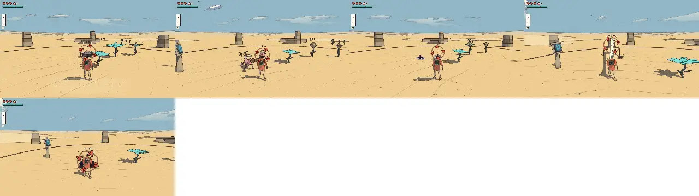
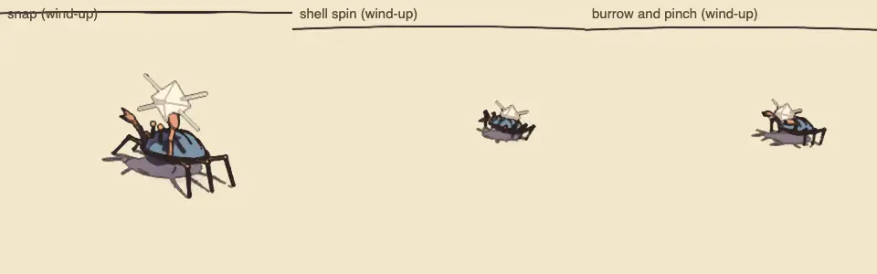
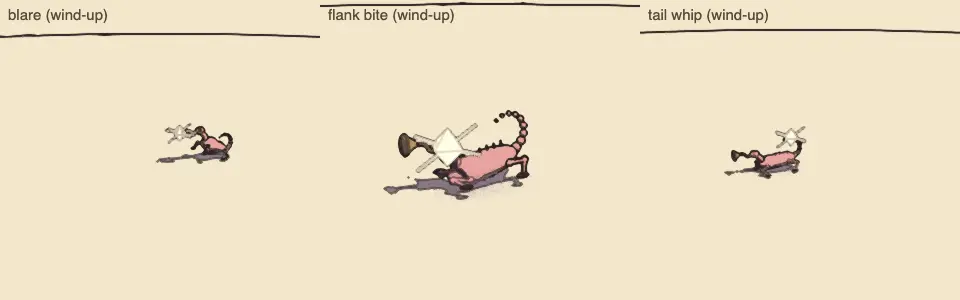
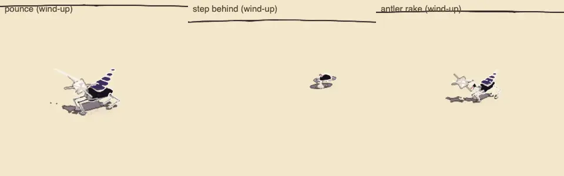
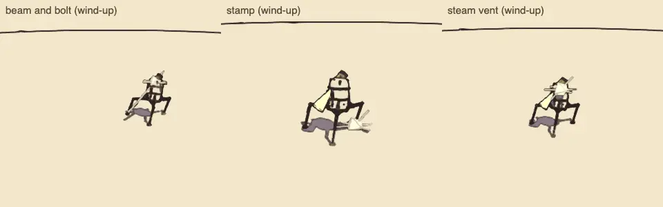
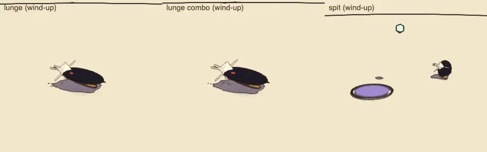

# Combat review, v1.8 (2026-10-09): the enemy roster, batch 1

<!-- audit-scores
overall: 4.22 / 5
label: the mean of the 5 batch-1 archetypes' totals (the shellback crab, the horn lizard, the antler hound, the lamp tripod, the ink blot)
date: 2026-10-09
-->

A partial run of the combat-review skill (`.claude/skills/combat-review/SKILL.md`) over the first five archetypes of
the enemy roster (docs/design/enemy-roster.md, "Build plan", batch 1; docs/systems/foes.md, "The enemy roster"), built
on the locomotion kit. The old kinds that still stand in for the archetypes not built yet, and the guardians, were not
changed and not re-run: their scores stand as in [v1.6](combat-v1.6.md).

## Setup

- Branch `worktree-agent-a41101f89dd18912b` on main b88dfbe4, headless Chrome (muted, ANGLE Metal), the Arena,
  1280 × 720, Enemies "normal"; `--kinds crab,lizard,hound,tripod,blot --watch 24 --guardians no`.
- Each kind watched 24 s against a still traveller (its own skin: `HOME_SKIN`), then each move's blows through
  `Foes.hurt`, as in v1.6.
- The Arena's contact sheet (each at the height of its wind-up, seen from the traveller) and, better for reading the
  bodies, the gallery's sheets: each archetype's own skin at 80 % of each attack's wind-up (the held pose),
  `node scripts/enemy-roster/skins.mjs`.
- Not played by hand: guard, parry and evade timing against the new tells; the pair behaviour of the lizards over a
  long fight; the calm (wildlife) in the real worlds.

| | |
|---|---|
|  |  |
|  |  |
|  | |

## The scores

| kind | read | counter | space | fair | identity | combines | total | wind seen (s) | attacks/min | health/min | ttk combo | ttk charge | ttk riposte | ttk shoot | ttk fire |
|---|---|---|---|---|---|---|---|---|---|---|---|---|---|---|---|
| shellback crab | 5 | 5 | 5 | 5 | 4 | 3 | 4.5 | 1.13 | 15 | 2.71 | 3.58 (behind) | 2.4 (behind) | 4.73 (behind) | ∞ | 5.12 |
| horn lizard | 5 | 3 ✎4 | 3 ✎4 | 5 | 4 | 4 | 4.3 | 1.01 | 15 | 2.50 | 3.58 | 1.2 | 4.73 | 1.84 | 3.84 |
| antler hound | 5 | 4 | 4 | 5 | 4 | 4 | 4.3 | 1.48 | 15 | 4.59 | 2.39 (behind) | 1.2 (behind) | 4.72 | ∞ | 2.56 |
| lamp tripod | 5 | 5 | 3 ✎4 | 5 | 4 | 3 | 4.3 | 1.42 | 12.5 | 3.13 | 4.77 | 2.4 | 5.52 | ∞ | ∞ |
| ink blot | 4 | 5 | 3 | 4 | 3 | 3 | 3.7 | 0.71 | 20 | 2.92 | 2.39 | 1.2 | 3.72 | 1.23 | 2.56 |

Changed by eye (✎):

- **The horn lizard's counterplay, 3 → 4:** the script counts what takes it (shots, embers) and misses its answers by
  position: the bite only comes from behind you (`flank`), the whip only at its back (`rear`), a guard takes the
  blare's shove whole, and splitting the pair takes the shove's aim away. **Its space, 3 → 4:** the second of a pair
  circles behind you before it strikes (`flanks`), and the blare throws you toward it.
- **The lamp tripod's space, 3 → 4:** it keeps 9 m off, its beam needs a clear line (cover breaks it: tested), and it
  stamps when you get under it: it makes you move between cover and its legs.

Against v1.6, the archetypes against what they replace: the salt crab 4.3 → the shellback crab 4.5 (a third move, the
burrow in two skins; a parried snap chips it); the shadow hound 3.3 (v1.4) → the antler hound 4.3 (the 0.8 s pounce
kept, the rake added, an ember still the best answer); the ink blot 3.5 → 3.7 (the spit folded in from the spitting
blot gives it a ranged threat that keeps a teacher's 0.7 s lunge); the makers' machine 3.8 → the lamp tripod 4.3 (its
sentinel role); the horn lizard is new.

## Motion (the procedural-animation skill; `node scripts/motion-audit/run.mjs --pack`, `--pace=0.5`)

| subject | legs | slide/m | worst (m) | reach span, % of leg | lift, % | steps/s full → half | groups | unison (pack) |
|---|---|---|---|---|---|---|---|---|
| shellback crab | 6 | 0.00 | 0.00 | 21 % | 22 % | 2.50 → 1.25 | [0,2,4] [1,3,5] (a tripod) | 0.08 |
| horn lizard | 4 | 0.00 | 0.01 | 23 % | 20 % | 6.00 → 3.38 | diagonals | −0.25 |
| antler hound | 4 | 0.01 | 0.01 | 36 % | 20 % | 5.00 → 3.00 | diagonals | 0.43 |
| lamp tripod | 3 | 0.00 | 0.05 | 25 % | 17 % | 1.42 → 0.75 | each alone (a wave) | −0.32 |

Every target of the kit is met (slide < 0.05 m/m, reach span > 15 %, lift ≥ 6 %, the right groups, cadence by speed,
packs out of step); `tests/motion-plans.test.js` holds them for each archetype in two skins. Rubric (0–3): joints 3
(knees out and up, hocks back, pistons), feet 3, gait 3, weight 2–3 (the tripod's hard stops and its possessed twitch,
the crab's bursts), secondary 2 (the lizard's tail and the hound's smoke on verlet chains, the crab's awning; no
antennae chains yet), anticipation 3 (a coil pose per attack: the crab tilts its shell, the lizard rears on its hind
legs, the hound dips its antlers, the tripod's shutter closes in notches), ink 2, cost 2 (the kit as before; the
chains a few µs).

## The best and the weakest

- **Best: the shellback crab (4.5).** Seven answers, a guard that turns its spin into an opening, and a body that
  reads as a black lump with two hooks.
- **Weakest: the ink blot (3.7)**, as it should be: the teacher. Its spit is its only threat at range.
- **The antler hound is the most dangerous on a still player (4.6 bars a minute):** in pairs, a pounce every 4 s.
  Tier 4; met only in the last worlds of the route.

## Recommendations (in TODO.md)

1. Play the lizards' pair by hand with a pad: does the flanker's circle behind read before the bite (the hiss and the
   off-screen marker), and is the blare's shove toward the partner fair?
2. The hound's threat on a still player (4.6) is the highest of any kind: if the playtest agrees, lengthen its
   `cool` rather than its tell.
3. The combat-review script's contact sheet frames the foes behind the traveller: frame each from the side
   (the gallery's sheets, used here, read far better).
4. The sound families (`sound` in src/enemies/archetypes.js: shell, chitin, soft, metal, ink) are still played by
   two sets; batch 7 of the build plan.
