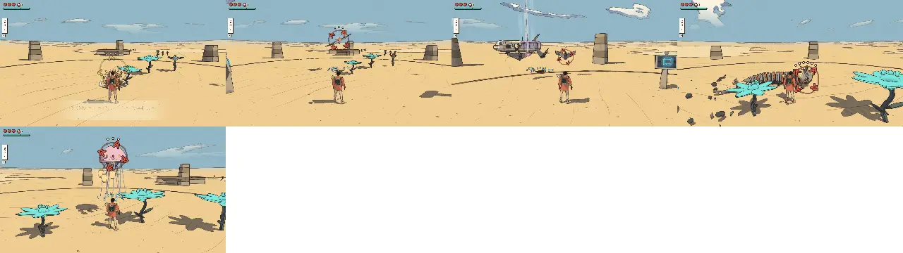
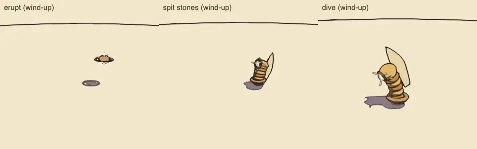
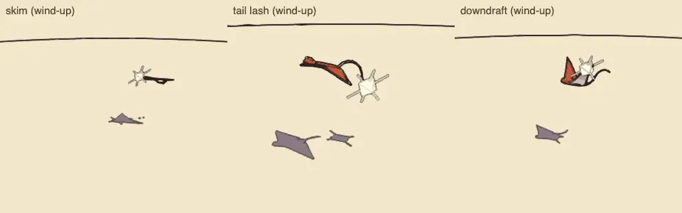
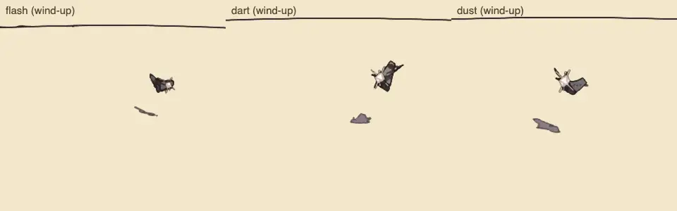
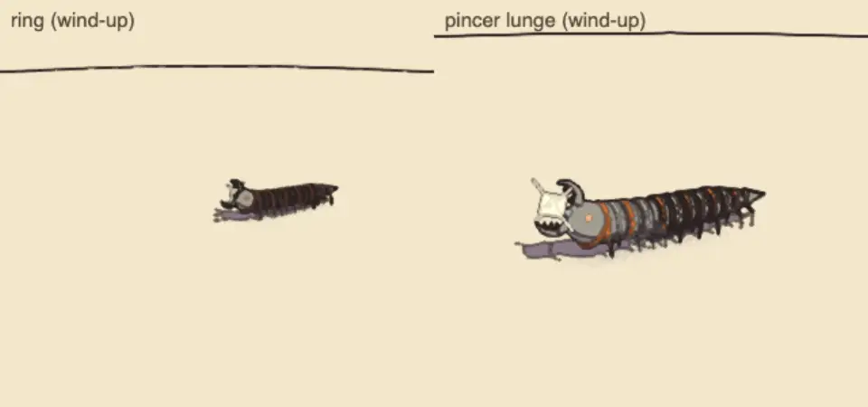
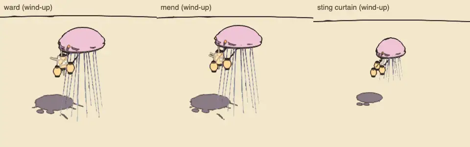

# Combat review, v1.9 (2026-10-09): the enemy roster, batch 2

<!-- audit-scores
overall: 4.50 / 5
label: the mean of the 5 batch-2 archetypes' totals (the mound worm, the sky ray, the signal moth, the ring centipede, the lantern jelly)
date: 2026-10-09
-->

A partial run of the combat-review skill (`.claude/skills/combat-review/SKILL.md`) over the second five archetypes of
the enemy roster (docs/design/enemy-roster.md, "Build plan", batch 2; docs/systems/foes.md, "The enemy roster"), built
on the locomotion kit's chains (phase 4). Batch 1 stands as in [v1.8](combat-v1.8.md); the old kinds still standing in
for archetypes not built yet, and the guardians, were not changed: their scores stand as in v1.6 and v1.8.

## Setup

- Branch of commit 31631fe2 (on main 71ecfc0d), headless Chrome (muted, ANGLE Metal), the Arena, 1280 × 720, Enemies
  "normal"; `--kinds worm,ray,moth,centipede,jelly --watch 24 --version 1.9 --guardians no`.
- Each kind watched 24 s against a still traveller (its own skin: `HOME_SKIN`), then each move's blows through
  `Foes.hurt`, as in v1.8. Called in alone (`foes.setPractice`), so the lantern jelly had nobody to ward: its watch
  measures only its sting curtain. Its support was checked in `tests/archetypes.test.js` (it wards a neighbour, the
  ward halves the harm and takes the stagger, a shot pops it; it mends in its tier-2 skins).
- The gallery's sheets: each archetype's own skin at 80 % of each attack's wind-up (`node scripts/enemy-roster/skins.mjs`).
- Not played by hand: guard, parry and evade timing against the new tells; escaping the centipede's ring with the
  wings or the jets in a real world; the jelly's wards in a mixed pack over a long fight.

| | |
|---|---|
|  |  |
|  |  |
|  | |

## The scores

| kind | read | counter | space | fair | identity | combines | total | wind seen (s) | attacks/min | health/min | ttk combo | ttk charge | ttk air | ttk riposte | ttk shoot | ttk fire |
|---|---|---|---|---|---|---|---|---|---|---|---|---|---|---|---|---|
| mound worm | 5 | 4 ✎5 | 3 ✎5 | 5 | 4 | 4 | 4.7 | 1.29 | 12.5 | 2.71 | 3.58 | 2.4 | 2.5 | 11.05 | ∞ | ∞ |
| sky ray | 5 | 4 | 4 | 5 | 4 | 3 ✎4 | 4.3 | 1.12 | 12.5 | 1.46 | 3.58 | 1.2 | 2.5 | 5.52 | 1.84 | 3.84 |
| signal moth | 5 | 5 | 4 | 5 | 4 | 3 | 4.3 | 1.00 | 12.5 | 2.08 | 1.19 | 1.2 | 1.25 | 5.53 | 0.61 | 1.28 |
| ring centipede | 5 | 4 ✎5 | 3 ✎5 | 5 | 4 | 4 | 4.7 | 2.32 | 12.5 | 2.50 | 5.97 | 2.4 | 3.75 | 5.53 | ∞ | 7.68 |
| lantern jelly | 4 | 4 ✎5 | 2 ✎4 | 5 | 4 | 3 ✎5 | 4.5 | 0.92 | 10 | 1.67 | 3.58 | 1.2 | 2.5 | 6.73 | 3.68 | 3.84 |

Changed by eye (✎):

- **The mound worm's counterplay, 4 → 5, and space, 3 → 5:** the script counts the dune ray's answers it kept (shots,
  embers, the burrow) and misses the rest: the air cut onto the mound flushes it with a double blow, the fin cut, the
  bomb, the stomp and the gust flush it, a guard takes its stones; it is under you, then up for six seconds, then
  under again, so the fight is about where you stand and when.
- **The sky ray's combines, 3 → 4:** it is the air threat over ground packs in Vael, Vael II, the Hangar and three
  side worlds; a skim crossing a crab's flank is a real problem.
- **The ring centipede's counterplay, 4 → 5, and space, 3 → 5:** its ring turns open ground into an arena you get out
  of over its back (the wings, the jets, a ledge) or break with the push; its head turned in takes a cut double, its
  back half; the parry answers the lunge. The script read the ring as a lob (`at: 'target'`).
- **The lantern jelly's counterplay, 4 → 5, space, 2 → 4, and combines, 3 → 5:** alone in the watch it only stings;
  in a pack it hovers out of the blade's reach over its neighbours, the shot and the boomerang pop its lanterns, the
  air cut and the push catch it when it comes down to mend, and every foe it wards must be fought differently (kill it
  first). Its read stays 4: the ward's 1.0 s lantern swell is clear up close, small from far off.

The ttk riposte of the worm (11 s) counts the wait for an attack to parry: it is under the sand most of the time.

## Motion (the procedural-animation skill; `node scripts/motion-audit/run.mjs centipede --pack`, `--pace=0.5`; `node scripts/motion-audit/chains.mjs`)

| subject | measure | value |
|---|---|---|
| ring centipede (24 legs) | slide/m, worst contact | 0.00, 0.00 m |
| | reach span, lift (% of the leg) | 36 %, 42 % |
| | steps/s full → half speed | 8.75 → 4.38 |
| | groups | a metachronal wave: a pair's two legs never together; two side by side out of step |
| | segments off the head's weaving path | 0.000 m |
| mound worm | mounds off the fin's weaving path | 0.000 m |
| sky ray | beats/s full → half, tip lag | 1.17 → 0.80, 2.1 rad |
| signal moth | beats/s full → half, tip lag | 8.45 → 7.17, 1.1 rad |
| lantern jelly | pulses/s drifting → winding up | 0.55 → 2.38 |

Rubric (0–3): joints 3 (the centipede's two-bone legs, knees out and up), feet 3 (planted on distance, one ray at
touchdown), gait 3 (the wave by distance; the ring's wind-up quickens it; still, every foot stays down), weight 2 (the
worm's rise dips first, `r < 0`; the ray banks and pitches on springs; the jelly tilts into its drift), secondary 3
(the ray's tail on a follow-the-leader chain, the antennae, the jelly's threads and lanterns on verlet chains, the
wings' tips lagging their roots), anticipation 3 (each wind-up its own pose: the worm rears and bunches or leans and
spins its teeth, the ray climbs and sweeps its wings back, the moth snaps open or folds to a tent, the centipede's head
lifts and turns in or rears with its front bunched, the jelly's lantern swells or its bell clenches), ink 2 (the
threads drawn with a hairline in their own colour; the moth's wings still read as paddles until its sheet), cost 2.

## The best and the weakest

- **Best: the ring centipede and the mound worm (4.7).** Both change the ground under you: one closes a ring you must
  get out of, the other comes up where you stand and leaves an opening. The centipede's silhouette (a long banded
  tube with claws) and the worm's (a stack of rings with a sail) are like nothing else in the roster.
- **The lantern jelly (4.5)** is the first support: in a pack it changes what you hit first.
- **The weakest: the sky ray and the signal moth (4.3).** The ray is a tier-1 teacher of the parry, as it should be;
  the moth's body waits for its redrawn sheet, and its dust is only in two skins.

## Recommendations (in TODO.md)

1. Play the centipede's ring with a pad in the Buried Machine: is the gap readable before it closes, does a plain jump
   clear its back (`RING.over` 0.9 m), and is 2.3 s the right length?
2. A cut on a jelly's thread of light should break the ward (the doc's counter): only the shot, the boomerang and
   killing the jelly break it now.
3. The combat-review script calls each kind in alone: give a support its escort (`aloneWave`) in the watch, and read
   `encircle` as a body attack, not a lob.
4. The moth's body against its redrawn sheet when it is picked (the wings as rounded triangles, not paddles).
5. The sound families (`sound` in src/enemies/archetypes.js: chitin, soft, paper) are still played by two sets.

## Against the last report

v1.8's batch 1 scored 3.7–4.5 (mean 4.22); batch 2 scores 4.3–4.7 (mean 4.50). Against what they replace: the dune ray
4.3 (v1.4) → the mound worm 4.7 (its mind kept, its spit and dive added, the air cut's double); the winged blot 3.5 →
the sky ray 4.3 (a parry that grounds it, a lane you can read); the sign moth 4.5 → the signal moth 4.3 (by the script,
4.3 here against the old 4.5 by eye: the same flash and dart, the dust added in two skins). The ring centipede and
the lantern jelly are new.
