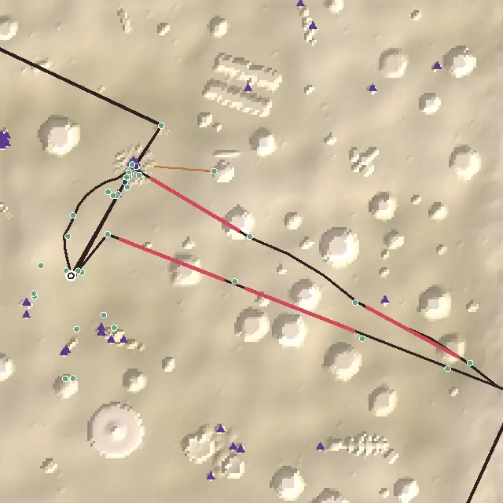
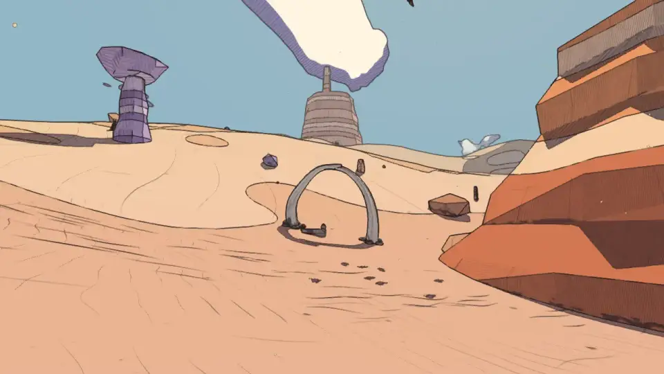
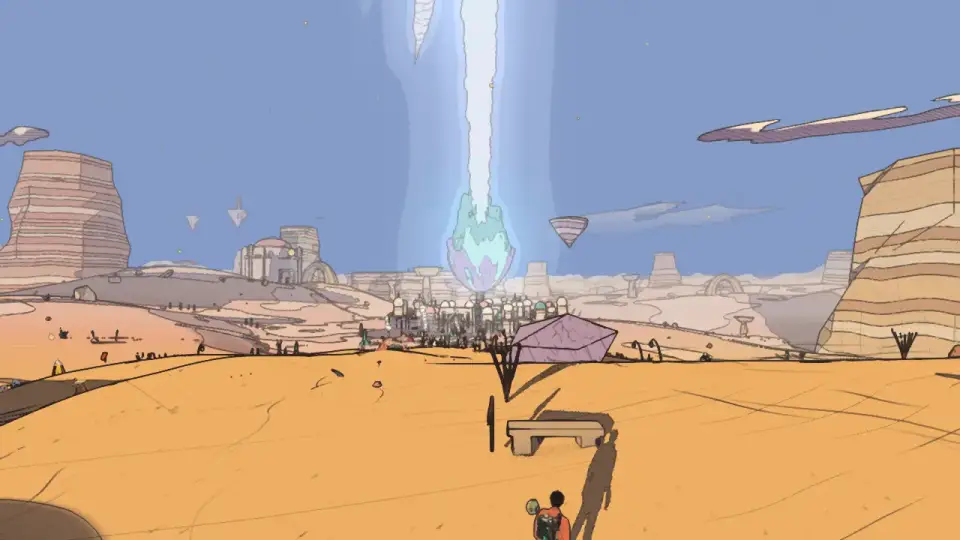
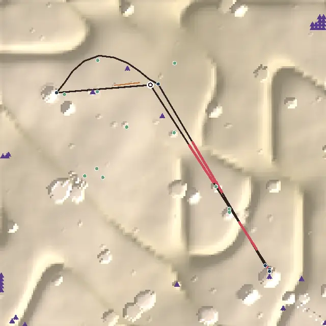
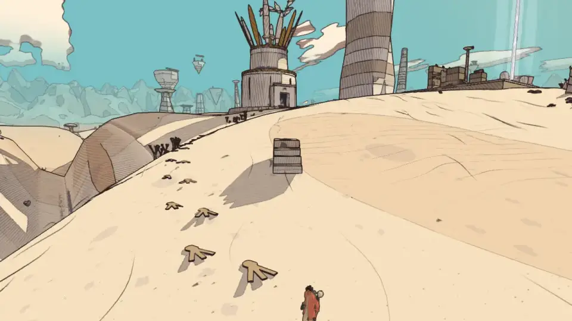
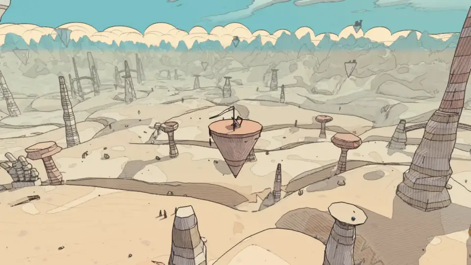
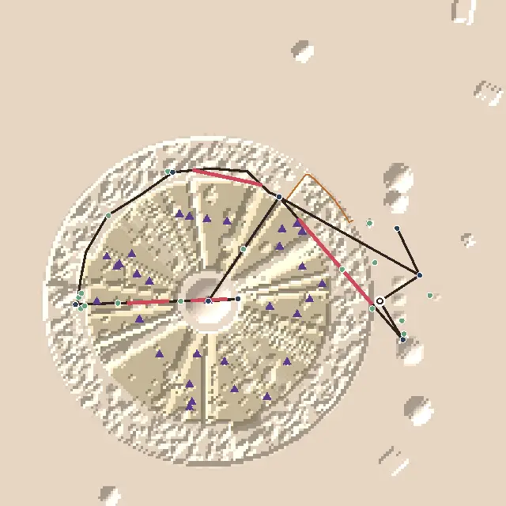
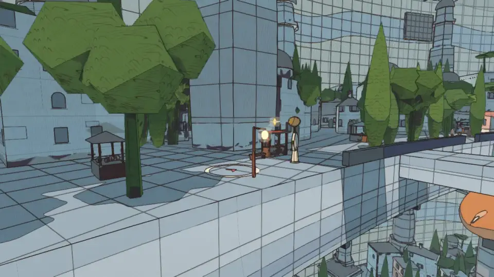
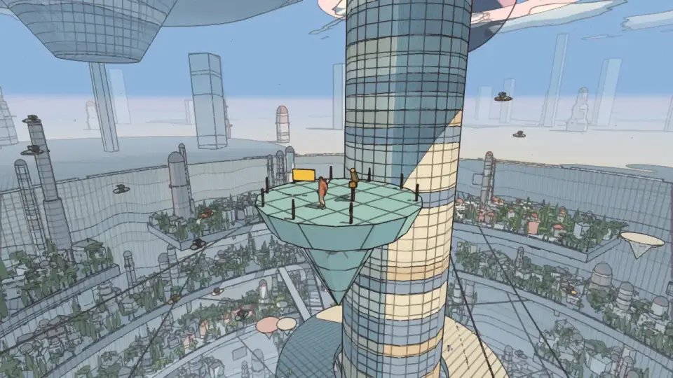

# Level design audit, v1.15 (2026-10-09)

<!-- audit-scores
overall: 3.94 / 5
label: the average of the eleven route worlds' means
date: 2026-10-09
-->

The v1.9 audit (`docs/audits/level-design-v1.9.md`) reworked the desert and Vael and left a list. This report re-runs
the `level-design-qc` skill after the second round of edits: **the City-Shaft** (measurement-only last time) is
reworked; **the desert** and **Vael** get a second way home and the desert's longest empty stretch a reason to stop.
The other eight worlds are unchanged and re-run for the overall score.

**Setup.**
- The worktree branch on top of `origin/main` as of 2026-10-09 (version 1.15: main had the v1.14 shops).
- `node scripts/level-design/audit.mjs` on the eleven route worlds; `scripts/design-qc/capture.mjs` (one muted
  headless Chrome) to look at every change, and `scripts/changelog-shots.mjs` for the pictures below.
- **The audit changed** (measurement, not content), so the "before" column is the *same new audit run on the old
  worlds* (commit `45c920d5`: the new audit and the hints for what already stood there, nothing in the worlds
  changed). Against the old audit on the same worlds only three move: the desert 3.11 → 3.33, Vael 3.67 → 3.78 and
  Vael II 3.56 → 3.67. What changed in the audit:
  - **Leading lines** (`level.lines`: `[{ name, points, auto }]`). A leg is *guided* by a line that starts within
    60 m of it and ends by its goal or where the goal comes into sight; a leg a line runs along, from beside its start
    (30 m) to beside its goal (30 m), is *walked along it* (`followLines`: the path, the gaps and the walks back follow
    the line). A stage whose words send you along a line names it (`via`), and a line marked `auto: false` is walked
    only where a stage names it. Declared for what stood there already: the desert's marked stones and the Givers' dry
    channel, Vael's standing stones, the City-Shaft's red stair; the desert's `light` stage ("home along the marked
    stones") names the stones. Vael's standing stones now guide the first leg (v1.9 gave it by eye).
  - **The loner rule scales with the travel speed**: a place 18 s from anything (150 m running, 366 m on the bike,
    329 m on the bird). The desert's six "loners" were 400–500 m apart on a 20 m/s bike: 7 s.
  - The map draws the leading lines (ochre) under the path.
- **What the numbers can't see:** whether players really take the second way home (the audit assumes a line laid from
  here to there is followed, and a way home named by the quest is taken); anything seen from the camera rather than
  eye height; the jets' speed (the City-Shaft is scored running).

## Scores

1-5 per criterion; the mean is the world's score. "a → b" is the same audit before and after this batch.

| World | Travel | Landmarks | Wayfinding | Density | Spacing | Loops | Optional pull | Verticality | Pacing | Onboarding | **Mean** |
|---|---|---|---|---|---|---|---|---|---|---|---|
| The Desert | bike | 4 | 3 | 4 | 4 | 2 → 4 | 4 | 3 | 3 | 3 | **3.33 → 3.56** |
| Vael | foot, wings | 3 → 4 | 3 → 4 | 5 | 5 | 2 → 5 | 4 | 4 | 5 | 3 | **3.78 → 4.33** |
| The City-Shaft | foot, jets, cab | 4 | 3 → 4 | 2 → 4 | 4 → 3 | 3 → 4 | 4 | 4 | 4 | 4 | **3.56 → 3.89** |
| Vael II: the Sky Stones | bird | 4 | 1 ✎2 | 4 | 5 | 2 | 5 | 4 | 5 | 3 | **3.78** |
| Lorn II: the Deep Wood | skiff | 5 | 1 | 5 | 5 | 4 | 5 | 1 | 3 | 4 | **3.67** |
| The Signal Market | foot | 3 | 4 | 5 | 5 | 3 | 4 | 3 | 4 | 3 | **3.78** |
| Lorn | skiff | 4 | 2 | 5 | 5 | 4 | 4 | 1 | 5 | 5 | **3.89** |
| The Sealed Hangar | foot, portals | 3 | 5 | 5 | 2 | 4 | 4 | 2 | 5 | 5 | **3.89** |
| The Garden of Spheres | foot | 4 | 4 | 4 ✎3 | 5 | 5 | 4 | 1 | 4 | 5 | **3.89** |
| The Buried Machine | foot, jets | 3 | 5 | 4 | 5 | 4 | 5 | 4 | 4 | 4 | **4.22** |
| Viridel | foot | 5 | 5 | 5 | 5 | 4 | 3 | 3 | 5 | 5 | **4.44** |

✎ **The Sky Stones and the Garden of Spheres** keep v1.5's moves by eye, for the same reasons.

✎ **No move by eye for the reworked worlds.** The desert's density stays 4 for a stretch 1 s over the band (418 m, 21 s);
the City-Shaft's spacing drops to 3 for a real reason (below).

**Average across the eleven worlds: 3.84 → 3.94 / 5** (v1.9 published 3.78 with the old audit; the shops of v1.14 had
already moved Vael and the City-Shaft up a little).

**Two criteria judged by eye:**
- **Environmental storytelling.** Each new thing tells a little of who was here: the Givers stood their tusks where the
  red rocks begin and left water in the shade; the pilgrims stacked cairns to the last dune and sat on its crest to see
  the tree; the bird walked down from the Aerie to wait for her rider, who kept a camp on a stone in the sky; the
  City-Shaft's lamplighters dropped down the terraces lighting lamps until their last round eleven years ago (the
  same eleven years as Dov's token), and someone still trims the wicks.
- **The reveal.** The pilgrims' road crests the last big dune west of the landing: from the resting stone the burning
  tree is framed over the walls, then the road drops out of sight of it to the ship. The tusk gate is seen from the
  wreck, the Hearth's chimney through it. The roost is seen from the tower's sill before you fly.

## Per world

### The Desert (3.33 → 3.56)

*From above, +z up. The dark line is the critical path, ochre the leading lines, red the longest empty stretches,
blue places on the route, green optional places, purple triangles landmarks and beacons, the ring the landing. The way
home now leaves the city west of the gate and comes down to the landing from the north-west, along the pilgrims' road.*

**What changed** (commit `5da94207`):
1. **The tusk gate** (`src/desert-hearth.js` `ride.tusks`): four fifths of the straight ride, where the red rocks
   begin, two great tusks stand either side of the way with their tips crossed 13 m over it; in their shade a low
   wall, the Givers' sealed jar and a riders' cairn. Named on the ride as it comes up. It splits the 518 m stretch from
   the wreck to the Hearth in two.
2. **A second way home: the pilgrims' road** (`src/desert-road.js`): eleven stacked-stone cairns, each with a clay
   lamp, from just west of the main gate over the dunes past Oum's stone and the crest of the last big dune (the
   pilgrims' resting stone, turned to the tree) down to the landing, 60–100 m off the straight way in. The lamps are
   cold while the tree is; 14 s after it catches, Qanat lights them one after another from the gate to the ship, a
   line says so, and the last stage ("Go and meet them there, down the pilgrims' road west of the gate") sends you
   down it. The road is a `line` with `auto: false` (it is the way home, not the way in) and the `ship` stage names it.

| Measure | Before | After |
|---|---|---|
| Longest empty stretch | 518 m (26 s on the bike) | 418 m (21 s) |
| Path empty | 61 % | 58 % |
| Walks back with nothing new | 2 of 4 | 1 of 4 |
| The tree to the ship | the way you came, 450 m, nothing new | the pilgrims' road, 517 m, 2 new places |
| Long legs guided | 50 % | 57 % |

**What's left:**
- The longest stretch is now Yara's shade to the wreck on the ride out (418 m, 21 s: one second over the band for a 5).
- One walk back is still empty: out of the giant's mouth back to the well (188 m), the way you went down.
- Pacing reads ten "do" stops in a row (the cave's and the Hearth's puzzle steps).
- Blind legs: Ama's fire to the giant's mouth (294 m), the well to Marrow at the ship (441 m), and Marrow's hollow to the
  Hearth (1.6 km: the chimney is hidden from the hollow's floor until you climb out of it).

### Vael (3.78 → 4.33)

**What changed** (commit `d82f4e75`, `src/vael-ways.js`):
1. **The bird's tracks**: her great three-toed prints, toes pointing downhill, from the Aerie's door over the
   plateau's north side down to Oïa's stone, 40–70 m off the standing stones' way up. Out by the stones, back by the
   tracks. Halfway, on the plateau's lip, **the rider's mounting stone**: steps, an iron ring, a saddle-cloth with the
   bird's track drawn on it, looking out to the tower. Oïa's stage names the tracks.
2. **The rider's roost**: a stone floating 140 m up, 45 % of the way from the tower's window to the landing, on the line
   the bird flies home: a lean-to, a bedroll, a cup, a short rope ladder, a long white streamer. Named once as you fly
   near it after the bird has answered; land on it and she settles where the rock is worn smooth.

| Measure | Before | After |
|---|---|---|
| Walks back with nothing new | 2 of 2 | 0 of 2 |
| The Aerie to Oïa | the standing stones back, 225 m | the bird's tracks, 275 m, past the mounting stone |
| The tower to the ship | 544 m of sky | past the roost |
| Long legs guided | 60 % | 80 % |
| Landmarks seen along the path | 50 % | 74 % (the roost stands in the height grid as the floating ruins do) |

**What's left:** onboarding stays 3 (the first goal, the Aerie, is 207 m off; two places by the landing). The roost
counts as a landmark the way the floating ruins do; it is small next to the tower.

### The City-Shaft (3.56 → 3.89)

**What changed** (commit `6d8f67ff`, `src/shaft-ways.js`):
1. **The lamplighters' drops**: a red lamp-post at the terrace edge and a painted ring on the promenade (a red chevron in
   it pointing on down) on every level, a spiral from Nima's corner of the high terrace to the bottom terrace by the
   shrine, each landing one level down and some 60 m round from the last: the way down on the jets, marked. Nima sends
   you down them. The main quest has a **`down` stage** between Nima and Ossa (a "go" to the middle landing; talking to
   Ossa first skips it): the three talks in a row (Nima, Ossa, the palace gate) are now talk, go, talk, talk.
2. **Perrine's halfway stall** moved onto the middle landing (y −24), its mirror and the Smog lantern relic with it
   (`content.js` spots[2]; `tests/story-incal.test.js` still pins the relic over the awning). The middle cab stop and
   Fausta's Basket-Shop keep their own stretch of the terrace, untouched.
3. **The lamplighters' locker** on the landing below the smog line: their rope, a wick-trimmer, the card from their last round.
4. **The climb** to the palace: a floating pad with a lamp a quarter of the way up, and **the relay lamp** on the spire's
   ring at the 92 m level, on the side facing the bottom: dark until the splinter passes it.
5. **Tobin's view pad** halfway down from the palace's crown to Nima, a coin telescope aimed up: the walk back after
   looking up passes something.
6. **Wren**'s marker waits at the call-lamp's stop (where its talk happens) instead of on the cab circling far off.

| Measure | Before | After |
|---|---|---|
| Longest empty stretch | 564 m (69 s, the climb) | 178 m (22 s, the rim from the Well to Nima) |
| Path empty | 61 % | 44 % |
| The drop, Nima to Ossa | 474 m with nothing on it | along the drops, past Perrine and the locker |
| The climb, Ossa to the palace | 564 m with nothing on it | past the pad and the relay lamp |
| Walks back with nothing new | 2 of 2 | 1 of 2 (Tobin's coin back to Lio, 83 m) |
| Longest run of one kind | 3 talks (Nima, Ossa, the gate) | 3 talks (Nima told, Lio, Tobin) |
| Long legs guided | 50 % | 73 % |
| Remote dead ends | 1 (Wren's marker on the circling cab) | 1 (Fausta's shop, below) |

**The cost:** with Perrine on the drops, **Fausta's shop** by the middle cab stop is now 230 m from any other place and
340 m round the terrace from the drops' middle landing: the audit counts its door a loner and a remote dead end
(spacing 4 → 3). It stands where the cabs set you down (`tests/shop-worlds.test.js` now counts a cab stop as "by the
way"), but on the jets you no longer pass it.

**What's left:**
- The shop by the cab stop: a person waiting for a cab there, or a branch of the drops past it.
- The relay lamp stands alone on the climb (206 m from the pad and the gate): a loner.
- A run of three talks after the light (Nima told, then Lio and Tobin for the cab pass) and the Tobin → Lio ping-pong.
- The Warden's Well to Nima (306 m) is blind: the red stair's gate is 200 m round the rim from the Well's door.

## The ranked edits that remain

1. **The City-Shaft: the shop by the cab stop** (above). Spacing 3 → 4, loops 4 → 5.
2. **The desert: the ride's Yara-to-wreck stretch** (418 m) and the cave's walk back to the well. Density 4 → 5, loops 4 → 5.
3. **Every way home passes something new** in the worlds not reworked yet: the Sky Stones (Ondine onto the clapper's
   return arc), the Signal Market (a second way back from Madame Sel's).
4. **A weenie on every main-quest leg**: the Sky Stones (wayfinding ✎2) and Lorn II (1) still guide under half their legs.
5. **The audit:** the jets as a travel speed in the worlds that have them; a playtest of the second ways home (does a
   player take the pilgrims' road and the bird's tracks, or the way they came?).

## Against the last report

- The City-Shaft, measurement-only in v1.9, is reworked: its two long drops have stops, its talks are broken by a "go",
  its walk back passes something; 3.56 → 3.89.
- The desert and Vael each have a second way home, and the desert's longest stretch a gate in it: 3.33 → 3.56 and
  3.78 → 4.33. Vael is now the best-scored world after Viridel and the Buried Machine.
- The audit sees leading lines and scales its loner rule with the travel speed; run on the old worlds that moved the
  desert, Vael and Vael II up by 0.11–0.22.
