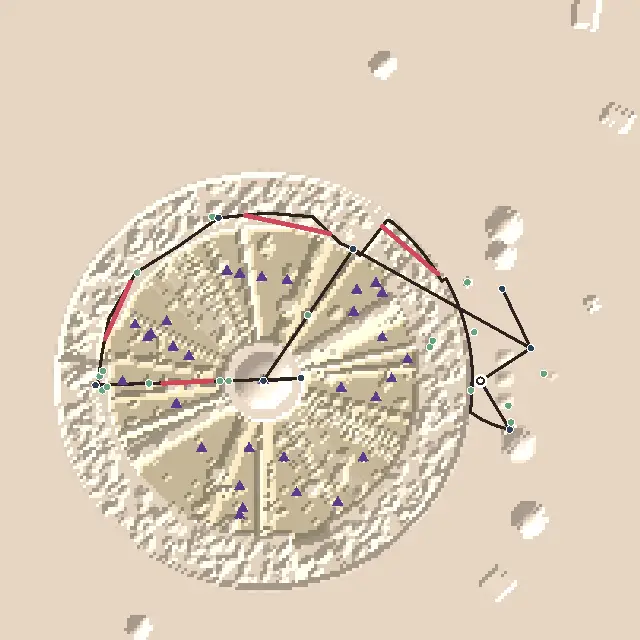
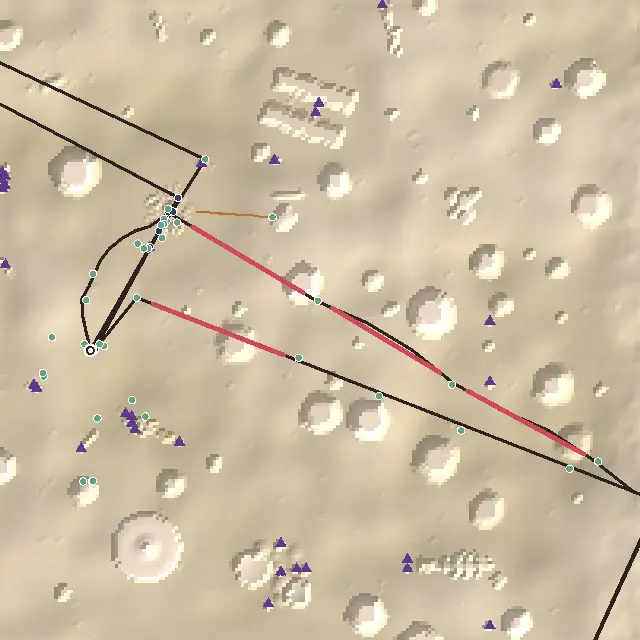
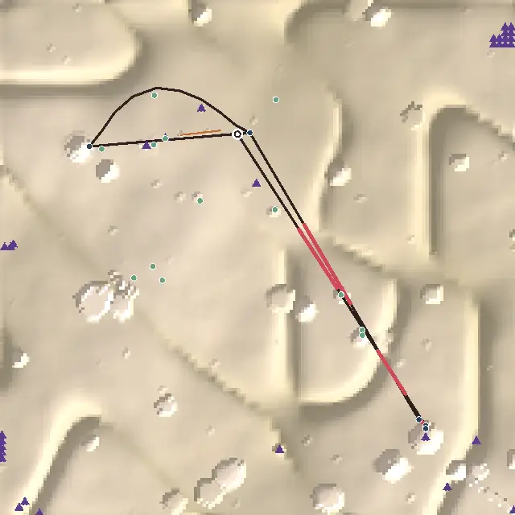

# Level design audit, v1.17 (2026-10-09)

<!-- audit-scores
overall: 4.04 / 5
label: the average of the eleven route worlds' means
date: 2026-10-09
-->

A short third round after `docs/audits/level-design-v1.15.md`: the small fixes its "what's left" listed for **the
City-Shaft**, **the desert** and **Vael**, measured again with the `level-design-qc` skill. The other eight worlds are
unchanged and re-run only for the overall score (each scores as it did in v1.15).

**Setup.**
- The worktree branch, measured on top of `bed64a68` and rebased onto `origin/main` (version 1.16: the enemy roster's batch 4 and two
  temples reworked; this round starts v1.17). The Aerie's rework moved nothing the audit measures in Vael (re-run after the rebase).
- `node scripts/level-design/audit.mjs` on the eleven route worlds, before (at `bed64a68`) and after; one muted
  headless Chrome (`scripts/design-qc/capture.mjs`, 1280 × 720, High) for the before / after pictures in the changelog
  and to look at every change.
- **Two small changes to the audit** (measurement, written down in the skill):
  - a portal marked **`oneWay`** is not assumed to be walked back (the desert's new hatch only lifts from below; before,
    the audit would have sent the way *down* through it, the shortest route to the cave);
  - a route step **`{ act, at, label }`** (`tests/playthrough-worlds.js` `ROUTE`) is a stop where `at` stands. Vael's
    route now starts the way the game does: Oïa sits 17 m from the landing, the scout finds her first and her talk
    opens the main quest and sends you to the Aerie. Before, the route began at the Aerie (207 m), the second thing a
    player does. **This, not the new mast, is what moves Vael's onboarding** (3 → 5): see Vael below.
- **What the numbers can't see:** whether players take the keepers' stair up or walk back out of the skull's mouth (the
  quest sends them up it, and the audit assumes they go); the thin mast at 100 m, which the audit aims at as a beacon
  but which reads small on screen; anything seen from the camera rather than eye height.

## Scores

1-5 per criterion; the mean is the world's score. "a → b" is the same audit before and after this round.

| World | Travel | Landmarks | Wayfinding | Density | Spacing | Loops | Optional pull | Verticality | Pacing | Onboarding | **Mean** |
|---|---|---|---|---|---|---|---|---|---|---|---|
| The Desert | bike | 4 | 3 | 4 → 5 | 4 | 4 → 5 | 4 | 3 | 3 → 4 | 3 | **3.56 → 3.89** |
| Vael | foot, wings | 4 | 4 | 5 | 5 | 5 | 4 | 4 | 5 | 3 → 5 | **4.33 → 4.56** |
| The City-Shaft | foot, jets, cab | 4 | 4 → 5 | 4 → 5 | 3 → 5 | 4 | 4 | 4 | 4 → 5 | 4 | **3.89 → 4.44** |
| Vael II: the Sky Stones | bird | 4 | 1 ✎2 | 4 | 5 | 2 | 5 | 4 | 5 | 3 | **3.78** |
| Lorn II: the Deep Wood | skiff | 5 | 1 | 5 | 5 | 4 | 5 | 1 | 3 | 4 | **3.67** |
| The Signal Market | foot | 3 | 4 | 5 | 5 | 3 | 4 | 3 | 4 | 3 | **3.78** |
| Lorn | skiff | 4 | 2 | 5 | 5 | 4 | 4 | 1 | 5 | 5 | **3.89** |
| The Sealed Hangar | foot, portals | 3 | 5 | 5 | 2 | 4 | 4 | 2 | 5 | 5 | **3.89** |
| The Garden of Spheres | foot | 4 | 4 | 4 ✎3 | 5 | 5 | 4 | 1 | 4 | 5 | **3.89** |
| The Buried Machine | foot, jets | 3 | 5 | 4 | 5 | 4 | 5 | 4 | 4 | 4 | **4.22** |
| Viridel | foot | 5 | 5 | 5 | 5 | 4 | 3 | 3 | 5 | 5 | **4.44** |

✎ **The Sky Stones and the Garden of Spheres** keep v1.5's moves by eye, for the same reasons.

✎ **No move by eye for the three worlds of this round**, but two scores sit on a band's edge: the desert's longest
stretch is 398.5 m on the bike (19.9 s) and the City-Shaft's 166 m running (20.2 s); both round to 20 s, the top of the
band for a 5.

**Average across the eleven worlds: 3.94 → 4.04 / 5.**

**Two criteria judged by eye:**
- **Environmental storytelling.** The keepers who tended the giant's water had their own way up, a stair beside the
  root the water climbs, and a hatch in the back lane they latched from below; the skiff that lies wrecked on the ride
  dragged its stone anchor half a kilometre first, and its rope still points at the wreck; the City-Shaft's lamplighters'
  round began on the rim, at the Warden's Well; Basile is what a basket-shop by a cab stop needs, someone carrying its
  baskets who cannot get a cab to stop; the riders flew a streamer wherever the bird was to come down.
- **The reveal.** From Vael's landing the mast's streamer shows over the slope; from its foot the Aerie comes up over the
  crest (the standing stones lead there; the mast is where the white house appears). Coming up the keepers' stair you
  step out of the dark into the back lane with the great tree straight ahead.

## Per world

### The City-Shaft (3.89 → 4.44)

*From above, +z up. The dark line is the critical path, ochre the leading lines, red the longest empty stretches, blue
places on the route, green optional places, purple triangles landmarks and beacons, the ring the landing.*

**What changed** (`src/shaft-ways.js`, `src/story/incal-data.js`, `src/levels/content.js`):
1. **Basile** waits at the middle levels' cab stop beside Fausta's Basket-Shop with her baskets (listen-only, toned
   lines: the cabs that will not stop for baskets, Fausta's two prices, the light). The shop's door is 10 m from him.
   `tests/shop-worlds.test.js` again asks for a person or the landing near every shop (round 2 had let a cab stop count).
2. **The lamplighters' rim posts**: the drops' red post, arm and lamp, twelve of them, from beside the Warden's Well's
   door along the rim's edge to the red stair's gate (none on the rim's cab stop). With the stair they are a leading
   line from the Well to Nima.
3. **The upper pad**: a second floating pad, tally marks on its rail, just off the 150 m ring's edge past the relay
   lamp, 79 m from it.
4. **Tobin pays as you walk up**: the pass's `fare` stage is a walk to him; he grumbles and hands over the coin without a
   conversation. Talking to him first still works.

| Measure | Before | After |
|---|---|---|
| Loners | 2 (the shop's door, 231 m; the relay lamp, 206 m) | 0 |
| Remote dead ends | 1 (the shop's door) | 0 |
| The Well to Nima (306 m) | blind | along the rim posts and the red stair |
| Long legs guided | 73 % | 82 % |
| Longest run of one kind | 3 talks (Nima told, Lio, Tobin) | 2 |
| Longest empty stretch | 178 m (22 s, the rim from the Well to Nima) | 166 m (20 s, Nima's corner down to the first drop) |
| Path empty | 44 % | 39 % |

**What's left:** the hop from Tobin back to Lio (83 m, nothing new on it: loops stays 4). The climb from the shrine to the
palace is still blind by the numbers (663 m; the palace is overhead the whole way, which the audit does not count).

### The desert (3.56 → 3.89)

**What changed** (`src/desert-city.js`, `src/desert-hearth.js`, `src/story/desert-data.js`):
1. **The keepers' stair**: in the giant's chest, eight stone blocks behind the pool climb beside one of the tree's roots
   to a bone-framed doorway in the far wall; through it you come up under a hatch in Qanat's back lane, 53 m from the
   well, the tree straight ahead. The hatch only lifts from below (no way down: the skull's mouth stays the way in).
   The main quest has an **`up` stage** (a walk to the hatch) between filling the jar and watching the well; leaving by
   the skull's mouth instead, the well's rise passes it over.
2. **The skiff's anchor**: a ring of stone tipped in the sand short of halfway on the straight ride out, between Yara's
   shade and the wreck, its frayed rope trailing toward the wreck. Named as it comes up, and something to look at.

| Measure | Before | After |
|---|---|---|
| Longest empty stretch | 418 m (21 s, Yara's shade to the wreck) | 398.5 m (20 s, Marrow's hollow to Yara's shade) |
| Path empty | 58 % | 55 % |
| Walks back with nothing new | 1 of 4 (out of the giant's mouth to the well, 188 m) | 0 of 3 (the hatch is 53 m from the well) |
| Kinds of stop, longest run | 3 kinds, 10 "do" in a row | 4 kinds (the `up` stage is a "go"), 7 "do" |

**What's left:** the blind legs (Ama's fire to the giant's mouth, 294 m; the well to Marrow at the ship, 441 m; Marrow's
hollow to the Hearth, 1.6 km: wayfinding 3), the first goal 391 m from the landing (onboarding 3), and the run of seven
"do" stops from the well to the ship (the Hearth's errand: a "see" beat there, the tusk gate or the resting stone as a
stage, would make pacing 5).

### Vael (4.33 → 4.56)

**What changed** (`src/vael-ways.js`, `src/story/arzach-data.js`):
1. **The riders' mast**: a 16 m mast with the riders' long white streamer and a rust-red pennon on the slope under the
   crest past the last standing stone, broadside to the landing. From the landing (a hollow that shows nothing to the
   west) it shows over the slope; from its foot the Aerie comes into view over the crest. Something to look at.
2. **Oïa points to it**: her directions to the Aerie now say *up the standing stones to the white streamer*, and past
   it the house with stone wings.
3. **The route starts with her** (the audit's change above): the first goal is 18 m from the landing, two places are
   within 80 m, three landmarks are in sight (the mast is one of them).

| Measure | Before | After |
|---|---|---|
| First goal | the Aerie, 207 m (the route skipped Oïa) | Oïa, 18 m, who sends you to the Aerie |
| Landmarks seen from the landing | 2 | 3 (the mast) |
| Onboarding | 3 | 5 (+2 from the route's first step; the mast alone would leave it at 3) |

**What's left:** the mast is thin at 100 m and its streamer small on screen; a player who does not look west may not
see it. The window to the tower's foot is still blind by the numbers (248 m up the steps round the tower).

## The ranked edits that remain

1. **The desert: a "see" beat in the Hearth's errand** (the tusk gate or the resting stone as a stage) and a weenie on its
   three blind legs. Pacing 4 → 5, wayfinding 3 → 4.
2. **Every way home passes something new** in the worlds not reworked yet: the Sky Stones (Ondine onto the clapper's
   return arc), the Signal Market (a second way back from Madame Sel's); and the City-Shaft's Tobin → Lio hop.
3. **A weenie on every main-quest leg**: the Sky Stones (wayfinding ✎2) and Lorn II (1).
4. **The audit:** the jets as a travel speed; overhead goals (the City-Shaft's palace) as seen; a playtest of the second
   ways home and the keepers' stair.

## Against the last report

- The City-Shaft's shop has company and its door is no longer a loner or a remote dead end; the relay lamp has a pad
  near it; the Well to Nima is marked; the three talks in a row are broken: 3.89 → 4.44, now level with Viridel.
- The desert's walk out of the cave is a different way up, its ride's longest stretch has an anchor in it, and its ten
  "do" stops have a "go" among them: 3.56 → 3.89.
- Vael's first minutes: a mast where Oïa points, and the route measured from where the game starts: 4.33 → 4.56.
- The average across the eleven worlds: 3.94 → 4.04.
