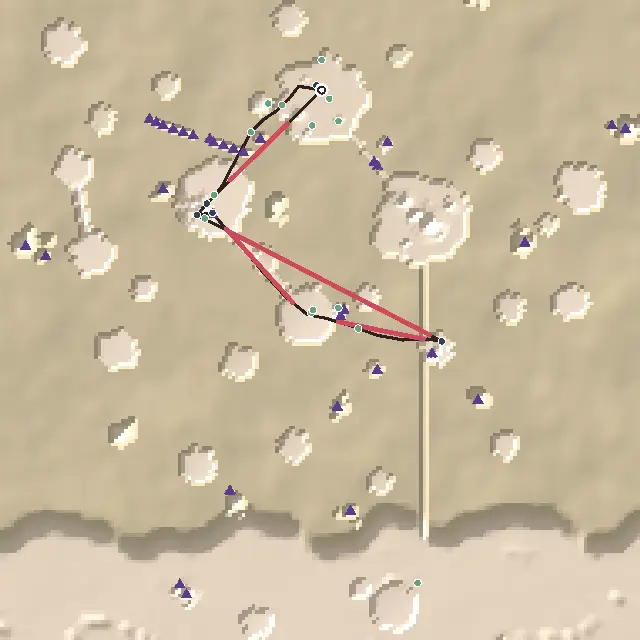
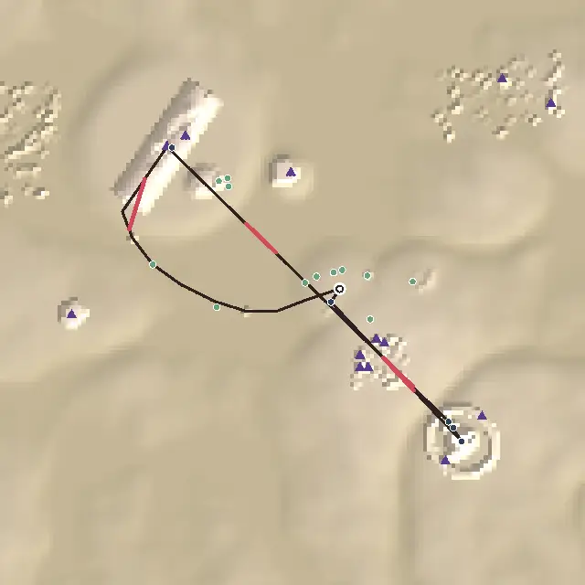
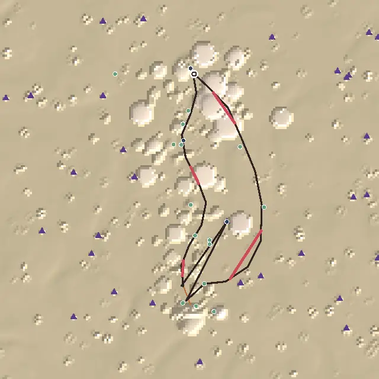
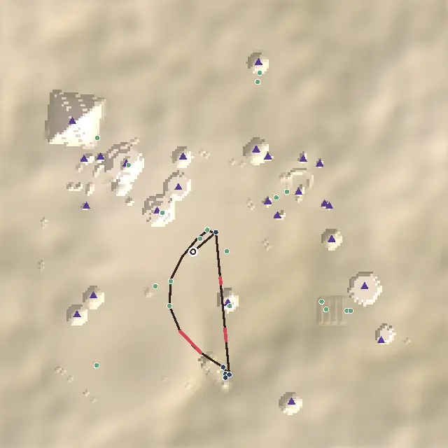
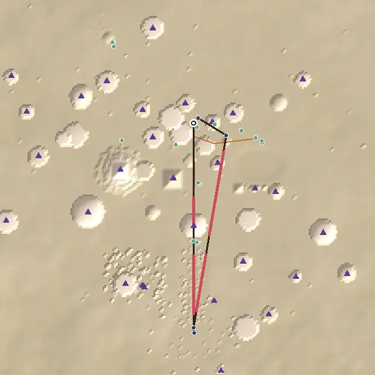
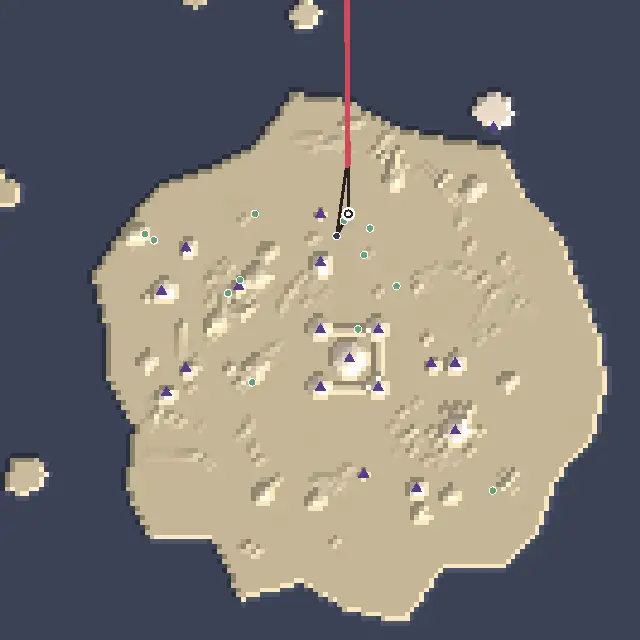
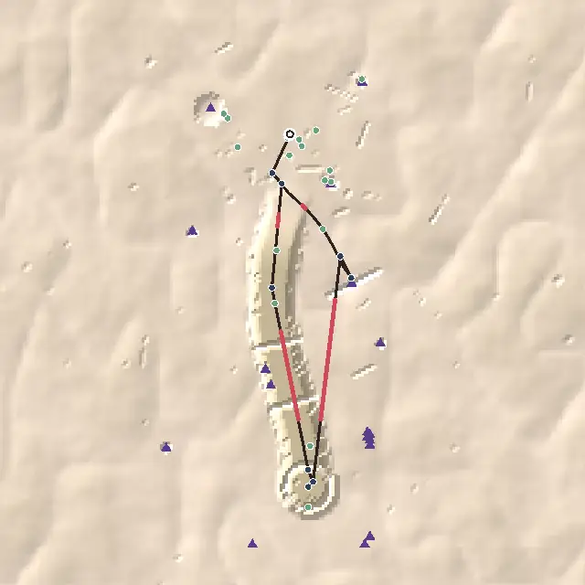
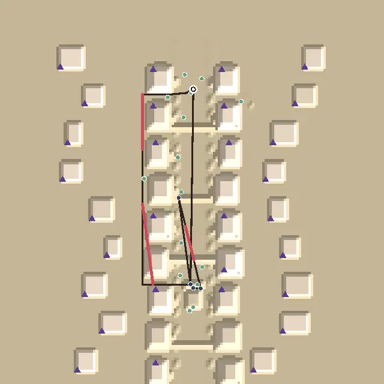

# Level design audit, v1.20 (2026-10-09)

<!-- audit-scores
overall: 4.25 / 5
label: the average of the eleven route worlds' means
date: 2026-10-09
-->

A fourth round after `docs/audits/level-design-v1.17.md`, on the two broad items of `TODO.md`'s "Level design (audit)"
that the desert, Vael and the City-Shaft had already had: **every way home passes something new** and **a landmark on
every long main-quest leg**, for the eight worlds not reworked yet (the Sky Stones, Lorn, Lorn II, Viridel, the Garden of
Spheres, the Sealed Hangar, the Buried Machine, the Signal Market). Measured with the `level-design-qc` skill before and
after; the three worlds of the earlier rounds are re-run only for the overall score (unchanged).

**Setup.**
- The worktree branch on top of `ac7600f6` (v1.19: the temple audit's Warden's Well and Engine-House); this round starts
  v1.20, one commit per world or two.
- `node scripts/level-design/audit.mjs` on the eleven route worlds, before (at `ac7600f6`) and after; one muted headless
  Chrome (`scripts/design-qc/capture.mjs`, 1280 × 720, High) to look at every change, and for the changelog's pictures.
- **Two small changes to the audit** (measurement, written down in the skill):
  - a stage may name the line its words send you **home** along (`home`): the walk back to the ship after the last stage
    that names one follows it, as a stage's `via` does for its own leg. Before, the walk back was always drawn straight,
    so a world could only pass something new on it by putting it on the straight line out;
  - a stage may say where its person **stands** by the time you get there (`stands`, a locator). Lorn II's Hollin walks
    down to the root cave at the path's far end while you are at the saucer; the audit measured him at the landing where
    he starts, so the route ended 12 m from the ship and the real walk home (400 m back from the cave) was never seen.
    With it, and the pools finished at the last one (`ends`), Lorn II's path is 1,267 m, not 574.
- **What the numbers can't see:** whether players take the new ways home rather than the straight line (each is named
  where the quest ends, and lit or marked, but nothing makes you take it); anything flown (the Sky Stones' ways hang in
  the air, and the bird goes where you point it); the Garden's and Lorn II's lines were already there, and are only
  declared now.

## Scores

1-5 per criterion; the mean is the world's score. "a → b" is the same audit before and after this round.

| World | Travel | Landmarks | Wayfinding | Density | Spacing | Loops | Optional pull | Verticality | Pacing | Onboarding | **Mean** |
|---|---|---|---|---|---|---|---|---|---|---|---|
| The Desert | bike | 4 | 3 | 5 | 4 | 5 | 4 | 3 | 4 | 3 | **3.89** |
| Vael | foot, wings | 4 | 4 | 5 | 5 | 5 | 4 | 4 | 5 | 5 | **4.56** |
| The City-Shaft | foot, jets, cab | 4 | 5 | 5 | 5 | 4 | 4 | 4 | 5 | 4 | **4.44** |
| Vael II: the Sky Stones | bird | 4 → 5 | ✎2 → 4 | 4 | 5 | 2 → 5 | 5 → 4 | 4 | 5 | 3 | **3.78 → 4.33** |
| Lorn II: the Deep Wood | skiff | 5 | 1 → 5 | 5 | 5 | 4 → 5 | 5 → 4 | 1 → 2 | 3 | 4 | **3.67 → 4.22** |
| The Signal Market | foot | 3 | 4 | 5 | 5 | 3 → 5 | 4 | 3 | 4 | 3 | **3.78 → 4** |
| Lorn | skiff | 4 | 2 → 4 | 5 | 5 | 4 → 5 | 4 | 1 | 5 | 5 | **3.89 → 4.22** |
| The Sealed Hangar | foot, portals | 3 | 5 | 5 | 2 → 4 | 4 → 5 | 4 | 2 | 5 | 5 | **3.89 → 4.22** |
| The Garden of Spheres | foot | 4 | 4 → 5 | 4 ✎3 | 5 | 5 | 4 | 1 | 4 | 5 | **3.89 → 4** |
| The Buried Machine | foot, jets | 3 | 5 | 4 | 5 | 4 → 5 | 5 | 4 | 4 | 4 | **4.22 → 4.33** |
| Viridel | foot | 5 | 5 | 5 | 5 | 4 → 5 | 3 | 3 | 5 | 5 | **4.44 → 4.56** |

✎ **The Garden of Spheres** keeps v1.5's move by eye on density (the avenue's long middle). **The Sky Stones'** ✎2 on
wayfinding (v1.5: the script saw no leg guided, the eye saw the monastery on its cliff) goes: the script now sees four of
six legs guided, and the two it doesn't are 31 m walks inside the monastery's courtyard.

**Average across the eleven worlds: 4.04 → 4.25 / 5.** No world walks back to its ship past nothing new any more, except
the City-Shaft's 83 m hop from Tobin back to Lio.

**Two criteria judged by eye:**
- **Environmental storytelling.** Each new way home is something the world's people made for coming home: the riders'
  lanterns the monks lit for riders in the cloud, and the tiles that fell up with the clapper; the egg-warden's lamps for
  the gatherers coming home from the cave at dusk, with their punt still tied to one; the lamp-keepers' second way, for
  boats; the overflow of Mira's clock carried down to water the vines over the ship; the Major's mast and his telescope,
  trained on the portal he no longer goes through; a post for every Tooth Day the counters carried a sliver home; the old
  listeners' dishes, kept turned to the silent tower for thirty years.
- **The reveal.** The lantern stones are dark on the way out and light when the bell rings, so the way home is new even
  to a player who flew past them; Lorn II's water-way the same once Hollin has heard. From the ring's portal in the
  Hangar the Major's mast now shows over the quarter's roofs (one tall house that stood in front of it is gone). Lorn's
  crown shows over the swamp from the landing, not from the Great Crystal: a grove of crystal stands between.

## Per world

### Vael II: the Sky Stones (3.78 → 4.33)

*From above, +z up. The dark line is the critical path, ochre the leading lines, red the longest empty stretches, blue
places on the route, green optional places, purple triangles landmarks and beacons, the ring the landing.*

**What changed** (`src/sky-stones-ways.js`, `src/levels/arzach2.js`, `src/story/arzach2-data.js`, `src/story/arzach2.js`):
1. **The fallen-up tiles**: the monastery's roof tiles, instanced in drifting knots every 22 m, from before the island
   church's porch west and south over Tiv's great table to the bell tower. The `ring` stage sends you along them with
   the clapper (`via`), and Calix says so when he sends you for it.
2. **The lantern stones**: eight floating stones with the riders' lanterns from the rose cliff's north lip past the
   Founders' Belfry to Aube's hermitage by the landing. Dark until the bell rings; Calix's last words point you home
   along them (`home`).
3. **Beacons**: the bell tower and the island church's taller tower (the collision's plateaus stand on the chasm's floor,
   so the audit's own landmarks were aimed into the rock under the cliffs).
4. **Brother Calix** wandered into the cloister's door slab (a solid box he stood inside): his spot is 3 m off it, and
   the legs from him see out.

| Measure | Before | After |
|---|---|---|
| Walks back with nothing new | 2 of 2 (clapper → rope 551 m, Calix → ship 366 m) | 0 of 2 (along the tiles: 3 new; along the lanterns: 2) |
| Long legs guided | 0 % | 67 % |
| Path empty | 73 % | 64 % |

**What's left:** the longest stretch is still the 477 m flight out to the island over the cloud (density 4); Ondine on the
plain is still a remote loner (490 m from anything); onboarding 3 (the first goal, the monastery, is 339 m off).

### Lorn (3.89 → 4.22)

**What changed** (`src/lorn-ways.js`, `src/levels/perdide.js`, `src/story/perdide-data.js`):
1. **The cave's crown**: six crooked spires of the cave's own teal crystal through its ridge, the tallest 26 m over it,
   solid as drawn, with a light; a beacon.
2. **Wendel's egg-lamps**: posts in the shallows from the cave's west mouth along the south shore to the landing, a
   glowing egg in an iron cup on each; **the gatherers' punt** moored at the fifth, its baskets full of eggs. The heart's
   page, when the cave sings, says where they lead (`home` on `cave`).

| Measure | Before | After |
|---|---|---|
| Walks back with nothing new | 1 of 1 (the cave → the ship, 220 m) | 0 of 1 (338 m along the lamps: the punt, the lamps) |
| Long legs guided | 33 % | 67 % |

**What's left:** Saba → the cave (388 m) is still blind by the numbers: a crystal grove on the landing island stands
between the Great Crystal's foot and every bearing within 80 m of the cave's heart, and no beacon clears it. The crown
shows from the landing, which every player crosses on the way.

### Lorn II: the Deep Wood (3.67 → 4.22)

**What changed** (`src/deep-wood-ways.js`, `src/levels/perdide2.js`, `src/story/perdide2-data.js`, `src/story/perdide2.js`):
1. **The water-way**: the keepers' lamps for boats from **the water-gate** (two posts and a lamp on a crossbeam) by the
   root cave's lagoon, round the deep water east of the wood to the landing, **the lamp-raft** moored halfway. Lit once
   Hollin has heard about the saucer; his last words send you home by it on the skiff (`home`).
2. **Declared**: the lit path as a leading line, the saucer's 40 m beam (shown while it answers) as a beacon.
3. **The route measured as played**: the pools end at the last one, Hollin is met at the root cave (`stands`).

| Measure | Before | After |
|---|---|---|
| Critical path | 574 m (Hollin at the landing) | 1,267 m (Hollin at the root cave, home by water) |
| Walks back with nothing new | 1 of 1 (the saucer → "Hollin", 280 m) | 0 of 2 (the water-gate; the raft and a makers' box) |
| Long legs guided | 0 % | 100 % |

**What's left:** pacing 3 (the four stops are all "do": the talk with Hollin is a flag the audit reads as a "do").

### Viridel (4.44 → 4.56)

**What changed** (`src/viridel-ways.js`, `src/levels/edena.js`, `src/story/edena-data.js`): **Mira's runnel**, a white
stone channel with water in it from the water clock west round the meadow, past the trial's eyes and the pond's shore,
down to the vines over the fallen ship; a sluice-gate and a round basin on it. The last stage (`tell`) sends you back up
it (`via`).

| Measure | Before | After |
|---|---|---|
| Walks back with nothing new | 1 of 1 (the ship → Mira, 230 m) | 0 of 1 (309 m up the runnel: the sluice, the basin, a makers' box) |

**What's left:** optional pull 3 (the pyramid seed is still a remote loner, 160 m from anything).

### The Garden of Spheres (3.89 → 4)

**What changed** (`src/levels/spheres.js`): nothing you see. Its white paths, from the lake past the pearl sphere to the
grove's path, through the sphere-arch and down the avenue to the plaza, are declared as one leading line: the leg from
the spheres to the plaza (572 m) was blind because the arch hides the plaza, which is its point.

**What's left:** the avenue's long middle (✎3), verticality 1, Emrys a remote loner.

### The Sealed Hangar (3.89 → 4.22)

**What changed** (`src/hangar-ways.js`, `src/levels/garage.js`):
1. **The Major's mast**: a 26 m signal mast over his desk, a red flag on its yard and a lamp on its tip; a beacon. One
   random tall house stood between it and the ring's portal; its spot is kept clear like the story's (`B_VIEW`).
2. **The Major's telescope**: on its tripod beside a stool halfway back to the portal home, trained on its light.

| Measure | Before | After |
|---|---|---|
| The ring's portal → the desk (160 m) | blind | the mast by it |
| Walks back with nothing new | 1 of 1 (the desk → the portal, 191 m) | 0 of 1 (the telescope) |
| Loners | 4 | 2 (Gaspard, Lune) |

### The Buried Machine (4.22 → 4.33)

**What changed** (`src/buried-ways.js`, `src/levels/buried.js`, `src/story/buried-data.js`): **the Tooth Day posts**,
forty-one posts in a gently bowed row from the great wheel's foot (outside the strip its sand slides off when it turns)
to Wen's dome, the year's sliver nailed on each; the last stage sends you back along them (`via`). Drawn only: as solids
they tipped the contact audit's sampling of the whole world over its line (climbs inside 42 → 44, 42 allowed), and the
world was already at that line before them.

| Measure | Before | After |
|---|---|---|
| Walks back with nothing new | 1 of 1 (the wheel's foot → Wen, 201 m) | 0 of 1 (the posts) |

**What's left:** the oil valve → the wheel (351 m) is blind by the numbers (from the oculus floor nothing outside shows);
the canyon is its guide, and the audit doesn't count a canyon.

### The Signal Market (3.78 → 4)

**What changed** (`src/market-ways.js`, `src/levels/bazaar.js`, `src/story/bazaar-data.js`): **the listeners' lane**, the
back lane behind the west towers, reached by the alley behind Signal Square and left by the alley by the lantern market,
where a dish on a pole every 26 m is turned to the silent tower; **the radio-mender's table** halfway. Sel sends you home
that way when the tower speaks again (`home`).

| Measure | Before | After |
|---|---|---|
| Walks back with nothing new | 1 of 1 (Sel → the ship, 319 m) | 0 of 1 (474 m: the table, the makers' run by the market's alley) |
| Longest empty stretch | 59 m | 149 m (18 s: the lane's halves) |

**What's left:** the lane's two halves are long (a person in it, or a second thing to stop for, would halve them);
onboarding 3 (Sel is 319 m from the landing).

## The ranked edits that remain

1. **The desert's blind legs** (Ama's fire → the giant's mouth 294 m, the well → Marrow 441 m, Marrow's hollow → the Hearth
   1.6 km: wayfinding 3): a weenie the camps can see over the city's walls by the back gate (the skull is 17 m and stands
   behind the walls), and the audit's route through `bikeWay` checked against play. Wayfinding 3 → 4.
2. **Pull the remote loners in**: Ondine (Sky Stones), Gaspard (Hangar), the pyramid seed (Viridel), Emrys (Garden).
   Optional pull +1 each.
3. **The Signal Market's lane**: a listener in it (a person who sits under the dishes), halving its two long stretches.
4. **The City-Shaft's Tobin → Lio hop** (83 m, loops 4) and **Vael's window → the tower's foot** (248 m, blind).
5. **The audit:** a canyon or a corridor as a leading line where it is the only way (the Buried Machine's oculus), and a
   playtest of the new ways home: do players take them?

## Against the last report

- Every route world but the City-Shaft (its 83 m hop) now has a way home, or back to whoever ends its main quest, that
  passes something new: loops 5 in ten of eleven worlds.
- The Sky Stones and Lorn II, the two worlds that guided none of their long legs, guide 67 % and 100 %.
- The audit reads `home` and `stands`; Lorn II's route is measured as it is played.
- The average across the eleven worlds: 4.04 → 4.25.
