# Level design audit, v1.23 (2026-10-10)

<!-- audit-scores
overall: 4.38 / 5
label: the average of the eleven route worlds' means
date: 2026-10-10
-->

A fifth round after `docs/audits/level-design-v1.20.md`, on what its "ranked edits that remain" and `TODO.md`'s "Level
design (audit)" left: **the remote loners pulled into 30-150 m of the path** (Ondine, Gaspard, the pyramid seed, Emrys),
**one high place per flat world** (Lorn 8 m of height, Lorn II 17 m, the Garden of Spheres 25 m), and the smaller ones (the
Signal Market's lane, the City-Shaft's Tobin → Lio hop, the blind legs). Measured with the `level-design-qc` skill before and
after; nothing in the audit's code changed this round.

**Setup.**
- The worktree branch on top of `7b520b1c` (v1.20's changelog media); this round is v1.23 (main took v1.21 and v1.22 meanwhile), one commit per world.
- `node scripts/level-design/audit.mjs` on the eleven route worlds, before (at `7b520b1c`) and after; one muted headless
  Chrome (`scripts/design-qc/capture.mjs`, 1280 × 720, High) to look at every change; the new high places climbed in
  `tests/level-design-round5.test.js` by the real traveller, pitch by pitch.
- The contact audit's counts checked world by world (`tests/contact-audit.test.js`, its limits unchanged): Lorn's
  climbs inside 6 → 4, the Deep Wood's 1 → 1, the Garden's 34 → 28; the Garden's feet sink move with the sampling
  (61 → 75, all in the olive crowns, under its line of 80).
- **What the numbers can't see:** whether players climb the lookouts (each is in sight of the landing and named by
  nothing but itself and, in Lorn, the box's hint); the Sky Stones' clapper lantern from the bell is a small point of light
  at 550 m (it reads from the bird, hardly from the cliff); the desert's breath is pale against a pale sky from far off.

## Scores

1-5 per criterion; the mean is the world's score. "a → b" is the same audit before and after this round.

| World | Travel | Landmarks | Wayfinding | Density | Spacing | Loops | Optional pull | Verticality | Pacing | Onboarding | **Mean** |
|---|---|---|---|---|---|---|---|---|---|---|---|
| The Desert | bike | 4 | 3 → 4 | 5 | 4 | 5 | 4 | 3 | 4 | 3 | **3.89 → 4** |
| Vael | foot, wings | 4 | 4 | 5 | 5 | 5 | 4 | 4 | 5 | 5 | **4.56** |
| The City-Shaft | foot, jets, cab | 4 | 5 | 5 | 5 | 4 → 5 | 4 | 4 | 5 | 4 | **4.44 → 4.56** |
| Vael II: the Sky Stones | bird | 5 | 4 | 4 | 5 | 5 | 4 → 5 | 4 | 5 | 3 | **4.33 → 4.44** |
| Lorn II: the Deep Wood | skiff | 5 | 5 | 5 | 5 | 5 | 4 | 2 → 3 | 3 | 4 | **4.22 → 4.33** |
| The Signal Market | foot | 3 → 4 | 4 → 5 | 5 | 5 | 5 | 4 | 3 | 4 | 3 | **4 → 4.22** |
| Lorn | skiff | 4 | 4 → 5 | 5 | 5 | 5 | 4 | 1 → 2 | 5 | 5 | **4.22 → 4.44** |
| The Sealed Hangar | foot, portals | 3 | 5 | 5 | 4 → 5 | 5 | 4 → 5 | 2 | 5 | 5 | **4.22 → 4.44** |
| The Garden of Spheres | foot | 4 | 5 | 4 ✎3 → 5 | 5 | 5 | 4 | 1 → 2 | 4 | 5 | **4 → 4.33** |
| The Buried Machine | foot, jets | 3 | 5 | 4 | 5 | 5 | 5 | 4 | 4 | 4 | **4.33** |
| Viridel | foot | 5 | 5 | 5 | 5 | 5 | 3 | 3 | 5 | 5 | **4.56** |

✎ **The Garden of Spheres'** move by eye on density (the avenue's long middle, since v1.5) goes: the answering spheres
stand in it, and the leg is now measured down the avenue it is walked along (its longest empty stretch 247 → 105 m).

**Average across the eleven worlds: 4.25 → 4.38 / 5.** Every route world's walks back now pass something new (loops 5 in
all eleven), and no route world has a remote dead end left but the Hangar's ring (Lune, a quest person in its far zone).

**Two criteria judged by eye:**
- **Environmental storytelling.** Each new place says who stands there and why: Ondine walks out as far as the island
  every day and scratches a mark for it, the nearest she gets to her sister; a lantern stone that went up with the
  clapper still burns over it; Wendel climbs his lookout at dusk to count the gatherers home; the lamp-keepers watched
  both their ways from the stalks; Emrys climbs everything and practises on a little sphere (his hands are all over it);
  Wynn is the last of the twelve who kept the dishes turned; Tobin sells views, so his telescopes line the way back; the
  cave under the giant breathes out cool air into the morning.
- **The reveal.** From Saba's stone the cave's crown shows through a notch in the grove's tall crystals, framed, not
  whole across the swamp; the meadow path home turns off behind the arch and comes round the pyramid's flank before Emrys
  shows on its top; the lookouts show their tops from the landing and their way up only once you are at their foot.

## Per world

### Vael II: the Sky Stones (4.33 → 4.44)

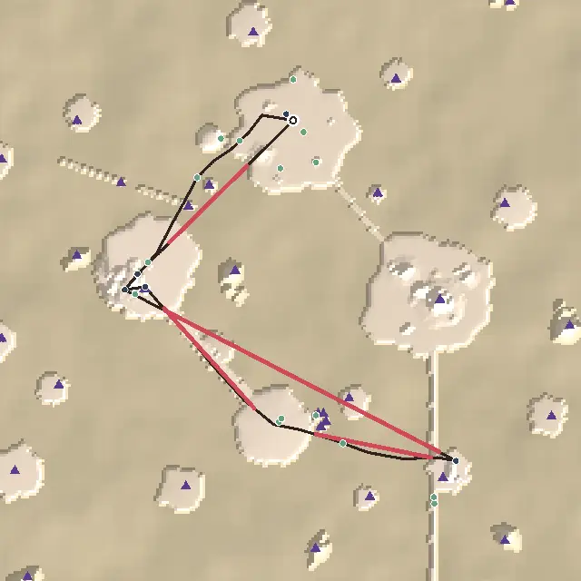

*From above, +z up. The dark line is the critical path, ochre the leading lines, red the longest empty stretches, blue
places on the route, green optional places, purple triangles landmarks and beacons, the ring the landing.*

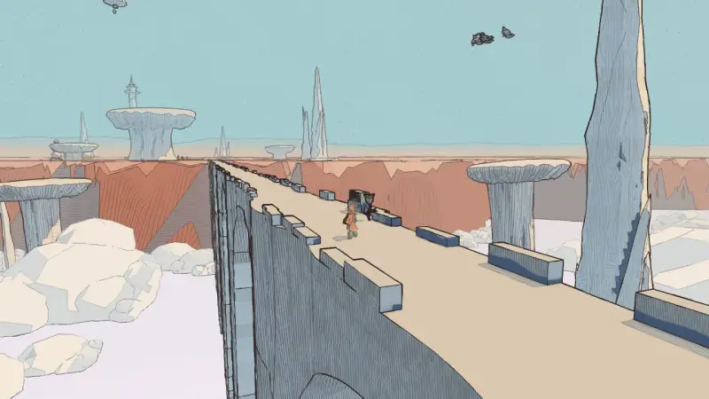

**What changed** (`src/sky-stones-ways.js`, `src/levels/arzach2.js`, `src/story/arzach2-data.js`, `src/story/arzach2.js`):
1. **Ondine** walks out along the long aqueduct as far as the floating island each day and stands just south of it, under
   the church where the clapper lies (110 m below the tiles' way home). Her words: someone out on the aqueduct, why she
   stops there (the bell's tongue fell up onto that island, a lantern stone with it), and the tower's lamp out on the
   plain for her answer. The quest, the people page and Ysolde's lines say where she is.
2. **Her tally**: a parapet stone on the aqueduct's edge, scratched in fives (a sight).
3. **The clapper's lantern**: a lantern stone hung over the island church's porch, its lantern lit while the clapper lies
   there, dark once it is lifted.

| Measure | Before | After |
|---|---|---|
| Loners | 1 (Ondine, 490 m from anything) | 0 |
| Optional places pulling (30-150 m) | 5 of 16 | 7 of 17 |
| Remote dead ends | 1 | 0 |

**What's left:** the flight out to the island over the cloud (478 m, density 4); the first goal 339 m off (onboarding 3);
the two short courtyard walks in the monastery are blind by the numbers (wayfinding 4).

### Lorn (4.22 → 4.44)

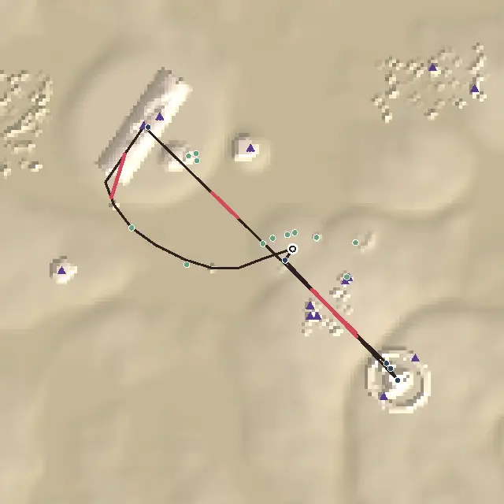

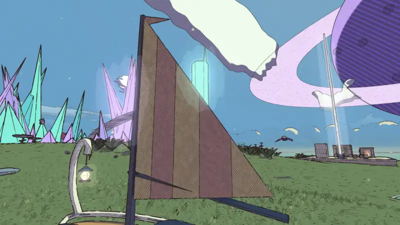

**What changed** (`src/lookouts.js`, `src/lorn-ways.js`, `src/levels/perdide.js`, `src/boxes/placements.js`):
1. **Wendel's lookout**: hexagonal columns of the cave's teal crystal on the rise east of the landing, 6, 12, 18, 24 and
   30 m, a short climb and a rest each; the makers' box from the rise on its top. 52 m from the landing, 40 m off the
   path to the Great Crystal.
2. **The crown's window**: the landing island's grove grows only as tall as the sightline from Saba's stone to the cave's
   crown allows in a 7 m lane; the crown shows through the notch, framed by the grove's tall crystals.

| Measure | Before | After |
|---|---|---|
| Places' span of height | 8 m | 38 m |
| Saba → the cave (388 m) | blind | the crown by it |
| Long legs guided | 67 % | 100 % |

**What's left:** verticality 2 (the box on the lookout is the one raised place; nothing on the path climbs); the Great
Crystal ↔ Saba ping-pong (three visits; pacing still 5).

### Lorn II: the Deep Wood (4.22 → 4.33)

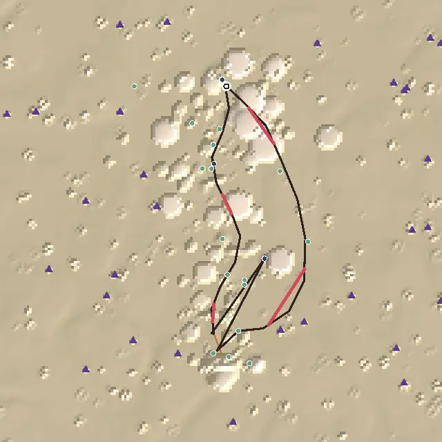

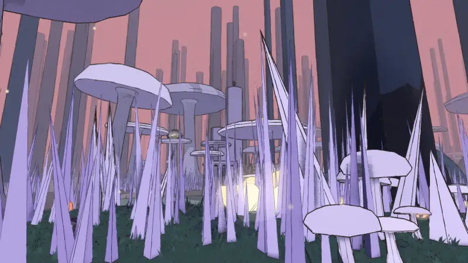

**What changed** (`src/lookouts.js`, `src/deep-wood-ways.js`, `src/levels/perdide2.js`): **the keepers' stalks**, five dead
giant stalks broken off a climb apart in the shallows west of the landing (76 m off it), the keepers' lamp on the tallest,
lit with the water-way. The "lamp-lit stakes" of v1.5 are covered by v1.20's lit path, water-way and the saucer's beam:
every long leg is guided.

| Measure | Before | After |
|---|---|---|
| Places' span of height | 17 m | 32 m |

**What's left:** pacing 3 (the four stops are all "do"); the first goal 119 m from the landing (onboarding 4).

### The Garden of Spheres (4 → 4.33)

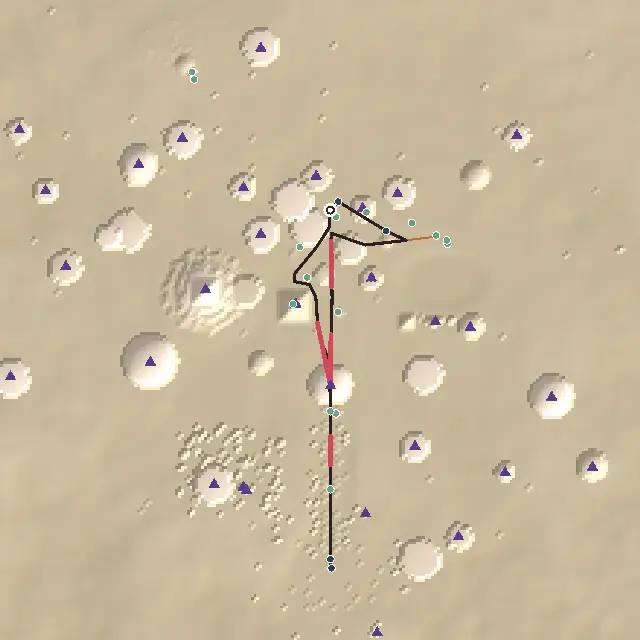

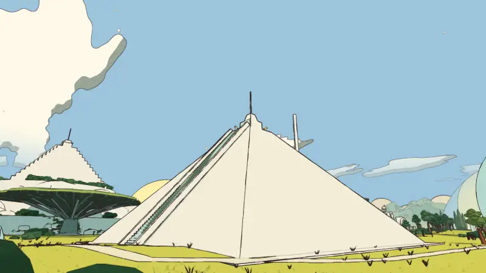

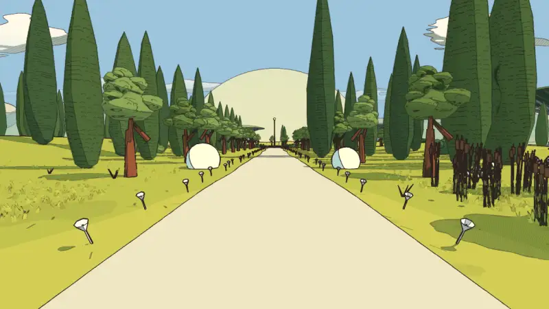

**What changed** (`src/levels/spheres.js`, `src/story/spheres-data.js`, `src/story/spheres.js`):
1. **Emrys** stands on the meadow pyramid's summit by its stair's head, 29 m up, 70 m off the path (he stood alone by the
   white hill, 158 m from anything), with a line about the view.
2. **The meadow path home**: the plaza leg is now measured down the white path and the avenue its words send you along,
   and measured as walked, the walk home was the way out (loops 3). A white path now runs from the sphere-arch round the
   meadow pyramid to its stair's foot, on up the old pyramid path to the grove; Ume sends you home by it, past **the
   chalked sphere** (Emrys's handprints up its side).
3. **The answering spheres** in the avenue's middle: splash one and the other rings back.

| Measure | Before | After |
|---|---|---|
| Longest empty stretch | 247 m (30 s; ✎ by eye, the avenue's middle) | 105 m (13 s) |
| Places' span of height | 25 m | 30 m |
| Walk home | 620 m straight across the meadow (as measured) | 684 m by the meadow path: Emrys, the chalked sphere |
| Loners | 1 (Emrys) | 0 |

**What's left:** verticality 2 (only Emrys stands high); optional pull 4 (Emrys is on the way home now, so "on" the path,
not pulling); the Footprint and Tessa are remote (the temple stays where it is).

### The Signal Market (4 → 4.22)

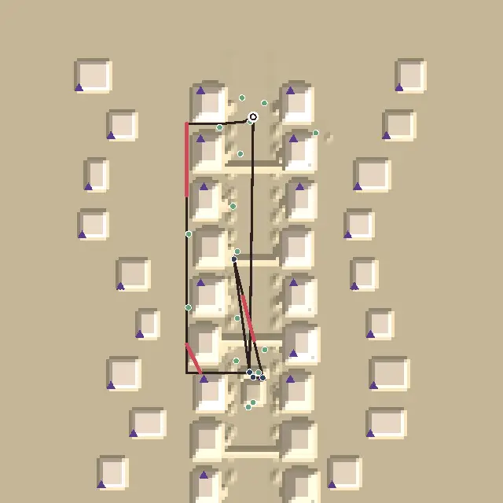

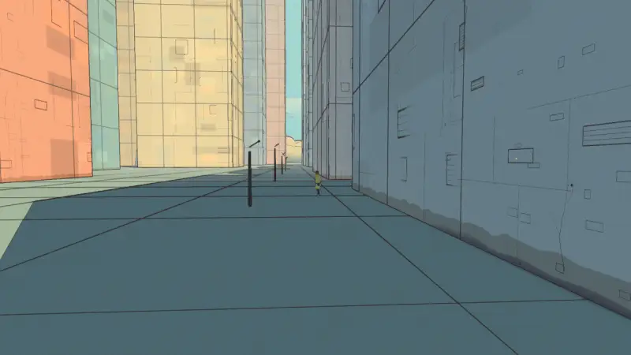

**What changed** (`src/levels/content.js`, `src/story/bazaar-data.js`, `src/levels/bazaar.js`): **Wynn**, the last of the
old listeners, under the dishes halfway up the lane; **the silent tower's aerial** declared as a beacon (it stands over
the tower's roof, seen down the avenue).

| Measure | Before | After |
|---|---|---|
| Longest empty stretch | 149 m (the lane's halves) | 90 m |
| Path that sees a landmark | 39 % | 73 % |
| Long legs guided | 80 % | 100 % |

**What's left:** onboarding 3 (Sel is 319 m from the landing); the tower down two more avenues (v1.5) is not done: from
the back lane the west towers stand between it and the tower at every bearing.

### The City-Shaft (4.44 → 4.56)

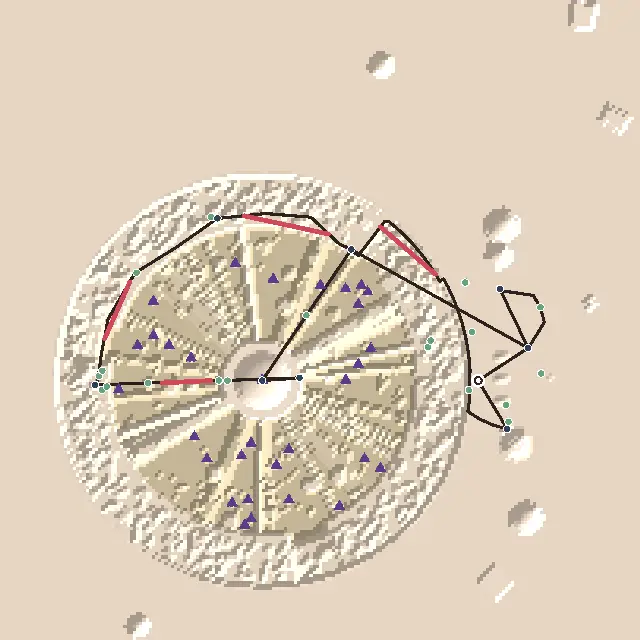

**What changed** (`src/shaft-ways.js`, `src/levels/incal.js`, `src/story/incal-data.js`, `src/story/incal.js`): **Tobin's
telescopes**, three coin telescopes round the outer rim between Tobin and Lio, 38 m out from the straight line; his coin
comes with the words to go back that way.

| Measure | Before | After |
|---|---|---|
| Walks back with nothing new | 1 of 2 (Tobin → Lio, 83 m) | 0 of 2 (120 m round the rim, past the telescopes) |

**What's left:** the climb from the shrine to the palace (663 m) and the walk down to Nima (287 m) stay blind by the
numbers (the palace is overhead the whole way: the audit doesn't count an overhead goal).

### The Sealed Hangar (4.22 → 4.44), Viridel (4.56), the desert (3.89 → 4)

- **The Hangar** (`src/levels/content.js`): **Gaspard** rests 74 m from the landing in sight of the signal board (250 m
  off the path and 175 m from anyone before). Loners 2 → 1 (Lune, in the ring), pulling 6 → 7 of 15 (optional 4 → 5).
  Left: the far zones' weenies (landmarks 3: 43 % of the path sees one).
- **Viridel** (`src/story/edena.js`): **Oro's seed** rolls to the pond's south shore (145 m off the path, 127 m from the
  runnel's basin; 160 m from anything before). No loner; optional pull stays 3: eight places stay remote, among them the
  Greenhouse, the tea terraces' stream and the mud by it.
- **The desert** (`src/desert-city.js`, `src/levels/desert.js`): **the giant's breath**, a thin pale column of the cave's
  cool air out of the skull's brow over the back gate while the tree is cold, a beacon then: Ama's fire → the giant's
  mouth is guided (wayfinding 57 % → 64 % of the long legs, 3 → 4). Left: the well → Marrow (441 m) and Marrow's hollow →
  the Hearth (1.6 km), and the audit's route through `bikeWay` against play.

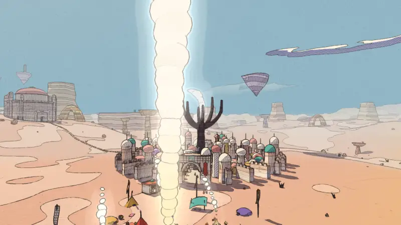

## The ranked edits that remain

1. **The desert's two long blind legs** (the well → Marrow, the hollow → the Hearth: wayfinding 4 → 5) and its first goal
   391 m off (onboarding 3).
2. **Verticality in Lorn, the Hangar and the Garden** (2 each): a stage or a box up high, or a path that climbs.
3. **The Hangar's far zones**: a weenie in the ring and in the upside-down quarter (landmarks 3 → 4).
4. **The Buried Machine's oculus → the wheel** (351 m, blind): an oil pipe from the valve to the wheel was looked at; it
   would run beside the Tooth Day posts the whole way, and the world sits at the contact audit's line (climbs inside 42 of
   43). The canyon is the guide; the audit doesn't count a canyon.
5. **Vael's window → the tower's foot** (248 m, straight up the tower) and **the City-Shaft's palace legs**: overhead
   goals; the audit should count a goal seen overhead (the skill's own list).
6. **Lorn's Great Crystal ↔ Saba ping-pong** merged into one visit (a quest change: saves at each stage must still work).
7. **The Signal Market's onboarding** (Sel 319 m from the landing) and **the Sky Stones'** (the monastery 339 m).

## Against the last report

- The four remote loners are in (Ondine, Gaspard, the pyramid seed, Emrys): no route world has a loner left but the
  Hangar's Lune.
- Lorn, the Deep Wood and the Garden have a high place each (8 → 38 m, 17 → 32 m, 25 → 30 m of height).
- Loops 5 in all eleven route worlds (the City-Shaft's Tobin → Lio hop was the last).
- Lorn's Saba → the cave and the desert's Ama's fire → the giant's mouth are guided; the Signal Market guides every leg.
- The average across the eleven worlds: 4.25 → 4.38.
