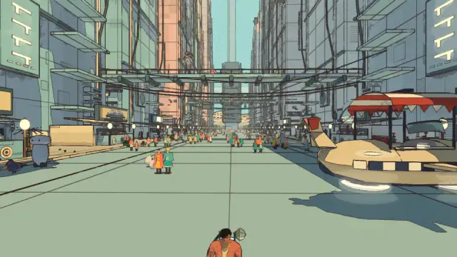
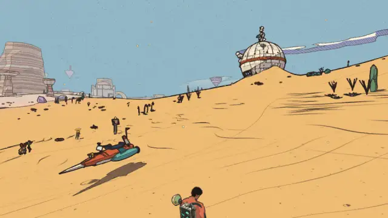
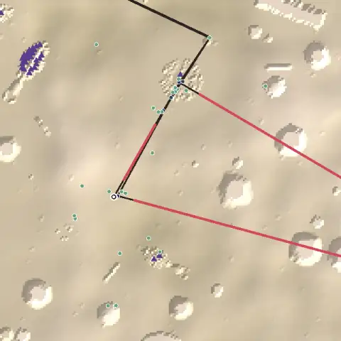
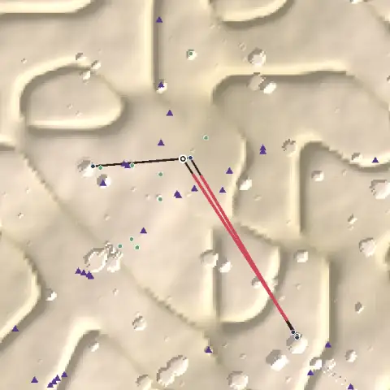
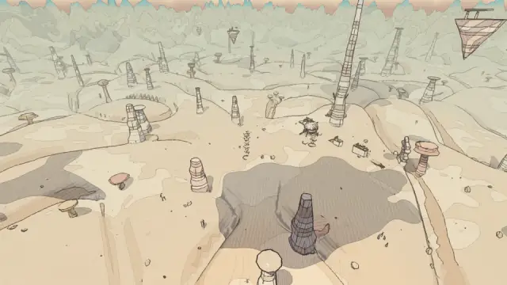

# Level design audit, v1.5 (2026-10-09)

<!-- audit-scores
overall: 3.66 / 5
label: the average of the eleven route worlds' means
date: 2026-10-09
-->

This audit asks: are the worlds well organised, and are they interesting to cross? It applies the
`level-design-qc` skill (`.claude/skills/level-design-qc/SKILL.md`: the principles, their sources, the rubric) to
the eleven route worlds.

**Setup.**
- `origin/main` as of 2026-10-09 (version 1.5).
- `node scripts/level-design/audit.mjs` builds each world as the play-through does. It gathers the places:
  people, quest markers, boxes, the temple's door, the trial and the makers' run, doors and caves, the court.
- It lays the critical path through the route's quests, from the landing back to the ship and through portals
  where that is shorter. It finds the landmarks in a height grid of the collision and measures sight with rays.
- `node scripts/design-qc/capture.mjs` shot four views per world in one muted headless Chrome (High, 960×540),
  with 15 s rests between worlds.
- **What the numbers can't see:**
  - The path is drawn straight between markers. Real routes bend, climb and fly, so distances are a floor.
  - Sight is blocked by collision and terrain, not by foliage.
  - The side worlds (all still WIP) were not run.

**The verdict.** The worlds are better organised than their temples. Most are compact, with the places close
together: median nearest neighbour 13–36 m. The problems repeat across worlds:

1. **The walk back to the ship.** It passes nothing new in 10 of 11 worlds.
2. **Blind legs.** From where the main quest sends you, you often can't see where you're going, or any landmark
   near it. Under half the long legs are guided in 6 worlds; the drone does the wayfinding.
3. **A few very long empty stretches.**
   - The desert's 1.55 km ride to the Givers' Hearth, and the ride back.
   - Vael's 450 m plain, both ways.
   - The City-Shaft's 470–560 m drops.
   - The Sky Stones' clapper fetch, both ways.
4. **Flat swamps and gardens.** Lorn, Lorn II and the Garden of Spheres span under 25 m of height.

## Scores

1-5 per criterion; the mean is the world's score. **Travel** is the speed the density and pacing are read at.
The ✎ notes are moves made by eye.

| World | Travel | Landmarks | Wayfinding | Density | Spacing | Loops | Optional pull | Verticality | Pacing | Onboarding | **Mean** |
|---|---|---|---|---|---|---|---|---|---|---|---|
| The Desert | bike | 3 | 2 | 2 | 2 | 1 | 4 | 3 | 3 | 3 | **2.56** |
| Vael | foot, wings | 4 | 1 | 3 | 2 | 2 | 3 | 4 | 5 | 3 | **3.00** |
| The City-Shaft | foot, jets, cab | 4 | 2 | 2 | 3 | 2 | 4 | 4 | 4 | 4 | **3.22** |
| Vael II: the Sky Stones | bird | 4 | 1 ✎2 | 4 | 4 | 2 | 5 | 4 | 5 | 3 | **3.56 → 3.67** |
| Lorn II: the Deep Wood | skiff | 5 | 2 | 5 | 5 | 4 | 5 | 1 | 3 | 3 | **3.67** |
| The Signal Market | foot | 3 | 4 | 5 | 5 | 3 | 4 | 3 | 4 | 3 | **3.78** |
| Lorn | skiff | 4 | 2 | 5 | 5 | 4 | 4 | 1 | 5 | 5 | **3.89** |
| The Sealed Hangar | foot, portals | 3 | 5 | 5 | 2 | 4 | 4 | 2 | 5 | 5 | **3.89** |
| The Garden of Spheres | foot | 4 | 4 | 4 ✎3 | 5 | 5 | 5 | 1 | 4 | 5 | **4.11 → 4.00** |
| The Buried Machine | foot, jets | 3 | 5 | 4 | 5 | 4 | 5 | 3 | 4 | 4 | **4.11** |
| Viridel | foot | 5 | 5 | 5 | 5 | 4 | 3 | 3 | 5 | 5 | **4.44** |

✎ **The Sky Stones' wayfinding, 1 → 2.** From the landing a 98 m needle stands between you and the monastery,
which is a fair BotW-style hide. From the bird, the targets show. The fetch legs are still blind.

✎ **The Garden of Spheres' density, 4 → 3.** 62 % of its path has nothing within 40 m, and the walk back is 620 m.

**Average across worlds: 3.66 / 5.**

**Two criteria judged by eye** (from the views and the maps):
- **Environmental storytelling.**
  - Strong where the world was built around one idea: the Buried Machine's canyons, the Signal Market's avenues,
    the desert's skeletons.
  - Weakest in the swamps, where the reeds and crystals repeat without telling anything.
- **The reveal.**
  - The Signal Market's silent tower closes the avenue from the landing: a true weenie, the best in the game (see
    the picture below).
  - The desert hides Qanat behind a dune from the landing, but nothing points toward it.

*The Signal Market from the landing. The silent tower closes the avenue, framed by the skybridges: the
Disneyland "weenie" exactly. This is the model for the edits below.*

## The worst problems

### 1. Empty walks back to the ship (10 of 11 worlds)

The last leg of almost every world is "back to the ship", along the way you came. Some cases:
- the desert's spark-stone to the tree well: 1.6 km, then 450 m to the ship;
- Vael's window to the ship: 544 m;
- the Sky Stones' clapper back to the bell: 551 m;
- the Garden of Spheres: 620 m.

In each case `returnLegs` finds no new place within 35 m of the way back. This is the
`fun-and-story-review.md` complaint (problem 6), measured.

### 2. Blind legs: the drone does the wayfinding

Share of long main-quest legs whose goal, or a landmark by it, is in sight from where the leg starts:

| World | Guided |
|---|---|
| Vael | 20 % |
| the Sky Stones | 0 % |
| the desert | 31 % |
| Lorn | 33 % |
| Lorn II | 33 % |
| the City-Shaft | 40 % |

By the Level Design Book's ladder, the critical path should ride on the strong aids (sightlines, landmarks,
leading lines). Here it rides on the drone's FIND.

*The desert's first leg: 391 m to Qanat's dark tree, which is out of sight behind the dune. The landmarks in view
(the mesa, the observatory dome) are not where the quest sends you.*

### 3. The long empty stretches

 

*Maps are drawn from above, with +z up:*
- *the dark line is the critical path;*
- *red marks the longest empty stretches;*
- *blue marks places on the route, green optional places;*
- *purple triangles are landmarks;*
- *the ring is the landing.*

| World | Longest empty stretch | Other empty stretches |
|---|---|---|
| The desert | 1,552 m, ship to the Givers' Hearth (78 s on the bike) | |
| Vael | 445 m, tower to ship (54 s running) | 363 m going out |
| The City-Shaft | 564 m, the shaft's bottom up to the palace | 474 m, terrace down to the bottom |
| The Sky Stones | 457 m, the clapper fetch | 453 m, back again |

*Vael: the plain between the landing and the lone tower. Needles and stones fill it, but nothing on it asks you
to stop.*

### 4. Flat worlds

| World | Height range of its places | Raised places | Climb along the path |
|---|---|---|---|
| Lorn | 8 m | none | 1 m |
| Lorn II | 17 m | none | |
| The Garden of Spheres | 25 m | none | 2 m |

For a swamp that is the genre. Still, one high place per world (a viewpoint, a climb to a box) would give
prospect: seeing where to go from above.

### 5. Remote dead ends and loners

These optional places stand more than 150 m from the path and from everything else:

| World | Place | Distance |
|---|---|---|
| The desert | Oum | 313 m |
| The Sky Stones | Ondine | 515 m |
| Vael | the makers' box | 247 m |
| The City-Shaft | Perrine and Wren | about 200 m each |
| The Hangar | Gaspard | 248 m |
| Viridel | the pyramid seed | 215 m |
| The Garden of Spheres | Emrys | 210 m |

Each is a trip there and back with nothing else on it.

## Per world

**The Desert (2.56).**
- Path: 5.4 km on the bike plus the giant's cave and the Hearth's interior. About 11 minutes of travel, 3–4× any
  other world.
- 70 % of the path is empty. There are four walks back, three of them with nothing new.
- One landmark is visible from the landing. 35 % of the path sees one.
- The best parts are dense: Qanat, the tree, the camps (median neighbour 22 m).
- The worst part is the ride out and back to the Hearth.

**Vael (3.00).**
- The legs are blind: the temple from the landing (207 m), Oïa (225 m), the wind at the tower (461 m).
- The tower dominates 66 % of the path, but the quest's stops aren't framed by it.
- Two empty walks back.

**The City-Shaft (3.22).**
- Superb verticality: 645 m of range.
- The legs between terraces are blind (40 %).
- There is a run of three "talk to X" stops in a row (Nima, Ossa, the palace gate).
- Long drops with nothing on them.

**Vael II: the Sky Stones (3.67).**
- The clapper is 576 m from the bell, in a blind straight line out and back. Ondine sits 490 m from anything.
- Good optional pull: 62 % of its optional places are 30–150 m off the path.

**Lorn II (3.67).**
- From the landing only one place is near, and the first goal is 119 m away.
- The light across the water and Hollin's cave are blind legs at dusk.
- Flat.

**The Signal Market (3.78).**
- The silent tower is a perfect weenie, but only 29 % of the path sees a landmark: the market is dense and
  enclosed.
- Madame Sel is 319 m from the landing, and you walk back the same 319 m.

**Lorn (3.89).**
- Dense (no gap over 40 m) and quick.
- But the Great Crystal ↔ Saba ping-pong takes three visits, and the walk back from the cave's heart is 220 m.
- Flat.

**The Sealed Hangar (3.89).**
- The portals make it compact: 751 m.
- The upside-down quarter and the ring have no landmark: 21 % of the path sees one.
- Gaspard is a loner.

**The Garden of Spheres (4.00).**
- Good spacing and onboarding.
- The 572 m leg from the remembering sphere to the round plaza is blind. The walk back is 620 m. Flat.

**The Buried Machine (4.11).**
- Well guided (86 %).
- Pacing is a run of six "do" stages.
- The walk back from the wheel is 201 m.

**Viridel (4.44).**
- Compact and well lit: 9 landmarks from the landing, 100 % of the path sees one.
- Weaknesses: 9 of 17 optional places are remote (the pyramid seed), and nothing on the path is raised.

## Ranked edits

Worst first, by score gain × players affected, divided by cost. Each item says where, what, why (the
principle and the measure) and the expected rubric change.

### Across the worlds: the five that move most

1. **Every world's way home passes something new.**
   - Bring the last stage nearer the ship, or open a different way back past an optional place.
   - The temple's world change can give a reason to return (the desert's channel running, the pipe-cart in the
     Buried Machine).
   - Expected: loops +1–2 in 10 worlds.
2. **A weenie on every main-quest leg.** Each long leg's goal gets a tall, unique, lit silhouette in sight from
   where the leg starts, or a leading line to it (a road, a channel, a row of stones, lamps).
   - Expected: wayfinding +1–2 in 6 worlds.
3. **Fill the four longest empty stretches with one small place each:** the desert's Hearth ride, Vael's plain,
   the Shaft's drops, the Sky Stones' fetch. A person with a line, a reactive plant (`docs/world-principles.md`),
   or a box.
   - Expected: density +1–2.
4. **Pull the remote loners into the 30–150 m band** off the path: Oum, Ondine, Vael's box, Perrine, Wren,
   Gaspard, the pyramid seed, Emrys.
   - Expected: loops +0.5, optional pull +1.
5. **One high place per flat world:** a climbable viewpoint with a box in Lorn, Lorn II and the Garden of
   Spheres.
   - Expected: verticality +1–2.

### Per world, worst first

**The Desert (2.56 → about 3.6)**
1. **The Hearth ride**, from (71, −12) to (1568, −417), 1.55 km with nothing on it. Add a nomad camp with a
   person about halfway, a salt-bloom field and a wreck. Or route the bike line past the observatory.
   - Expected: density 2→4.
2. **The way back from the Hearth:** a different line, by the canyon or via the observatory, past new places.
   Or the spark-stone's return goes by the hoverbike trial's gates.
   - Expected: loops 1→3.
3. **Landing → Qanat (391 m, blind):** a smoke column over Qanat's camps, or the dark tree's crown, in the
   landing's sightline. Or turn the landing toward the city.
   - Expected: wayfinding 2→3, onboarding 3→4.
4. **The Givers' House** is 248 m from anything. Draw the dry channel Sabri speaks of as a leading line on the
   sand from Qanat to its door.
   - Expected: wayfinding +0.5, loops +0.5.
5. **Oum** (313 m from anything): move nearer the camps' path.

**Vael (3.00 → about 3.8)**
1. **Frame the quest by the tower.** Put Oïa's stone on the line from the landing to the tower, with the tower
   behind her. Set a row of menhirs from the landing to the Aerie.
   - Expected: wayfinding 1→3.
2. **The plain:** put the trial's stone, Kesh and the hand, or the remote makers' box (247 m) on the 445 m line
   between the tower and the ship.
   - Expected: density 3→4, loops 2→3.

**The City-Shaft (3.22 → about 3.9)**
1. **The drops** (rim → bottom → palace, 470–560 m): a stop on each, a terrace person or a stall on the way. Or
   make one leg a cab ride with a line.
   - Expected: density 2→3.
2. **The three talks in a row** (Nima, Ossa, the palace gate): put a "go" or "do" between them, such as the red
   stair or a jet hop.
   - Expected: pacing +1.
3. **Blind terraces:** lamps or banners down each terrace's stair as a leading line.
   - Expected: wayfinding 2→3.

**Vael II: the Sky Stones (3.67 → about 4.3)**
1. **Move Ondine** (490 m from anything) onto the clapper's return arc, so the fetch has a second reason.
   - Expected: loops 2→4, spacing +0.5.
2. **A flag or a lit stone at the clapper**, seen from the bell at bird height.
   - Expected: wayfinding 2→3.

**Lorn II (3.67 → about 4.2)**
1. **Lamp-lit stakes** from the dark pool to the light across the water, and on to Hollin's cave (lantern
   breadcrumbs).
   - Expected: wayfinding 2→4.
2. **A place near the landing** (a lamp, a person).
   - Expected: onboarding 3→4.
3. **A raised viewpoint:** the Lamp-House's gallery or a tall root.
   - Expected: verticality 1→2.

**The Signal Market (3.78 → about 4.2)**
1. **Open two more avenues onto the silent tower,** so it shows from the second skybridge and from Madame Sel's.
   - Expected: landmarks 3→4.
2. **A second way back** from Madame Sel's, by a skybridge, past the antenna or a stall.
   - Expected: loops 3→4.

**Lorn (3.89 → about 4.3)**
1. **Merge the Great Crystal ↔ Saba ping-pong** into one visit.
   - Expected: pacing holds; cuts two legs.
2. **A crystal outcrop to climb**, with the box on top.
   - Expected: verticality 1→2.
3. **Back from the cave's heart** by the skiff trial's reeds.
   - Expected: loops 4→5.

**The Sealed Hangar (3.89 → about 4.2)**
1. **A weenie in each far zone:** the ring's slit-lit tower, and a hanging clock in the upside-down quarter.
   - Expected: landmarks 3→4.
2. **Gaspard nearer the board.**
   - Expected: spacing 2→3.

**The Garden of Spheres (4.00 → about 4.4)**
1. **Answering spheres along the 572 m leg** as breadcrumbs, and one on the walk back.
   - Expected: density 3→4, wayfinding 4→5.
2. **A great sphere to climb**, the humming pole's viewpoint.
   - Expected: verticality 1→2.

**The Buried Machine (4.11 → about 4.4)**
1. **A pipe as a leading line** from the oil valve to the great wheel (351 m, blind), and the pipe-cart as the
   ride back.
   - Expected: loops 4→5, pacing +0.5.

**Viridel (4.44 → about 4.7)**
1. **Bring two remote optional places** (the pyramid seed, 215 m) within the 30–150 m band.
   - Expected: optional pull 3→4.
2. **The fallen ship's goal on its hull's top.**
   - Expected: verticality 3→4.

## Next

- Each edit batch re-runs `node scripts/level-design/audit.mjs --worlds <id>`.
- Each new place goes into the world's story data, so the audit sees it.
- The side worlds, when they leave WIP, get a first run.
