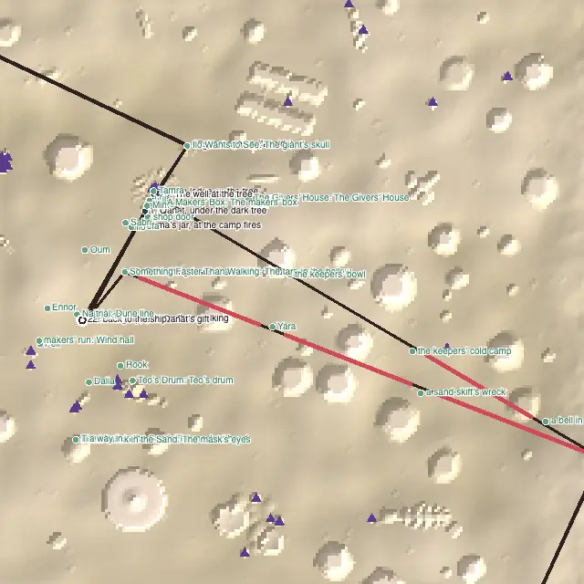
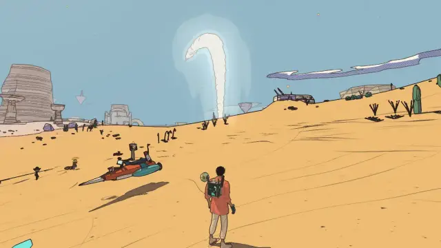
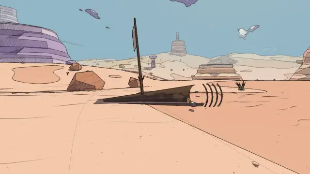
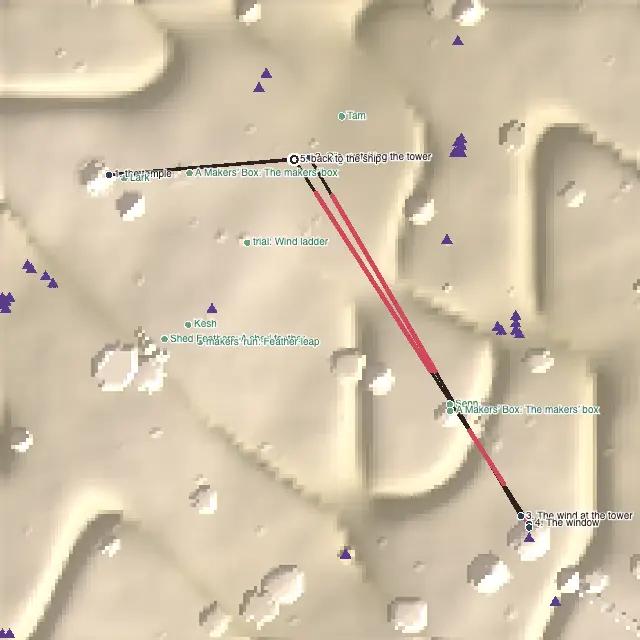
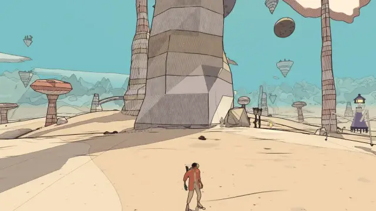

# Level design audit, v1.9 (2026-10-09)

<!-- audit-scores
overall: 3.78 / 5
label: the average of the eleven route worlds' means
date: 2026-10-09
-->

The v1.5 audit (`docs/audits/level-design-v1.5.md`) ranked the worlds and listed concrete edits. This report
re-runs the `level-design-qc` skill after the first batch of those edits: **the Desert** (the worst, 2.56) and
**Vael** (the next, 3.00) are reworked; **the City-Shaft** (third) gets only a measurement fix, its edits are
left for the next batch (below). The other eight worlds are unchanged and re-run for the overall score.

**Setup.**
- The worktree branch on top of `origin/main` as of 2026-10-09 (version 1.9).
- `node scripts/level-design/audit.mjs` on the eleven route worlds. `node scripts/design-qc/capture.mjs` and
  `scripts/changelog-shots.mjs` for the pictures, one muted headless Chrome at a time.
- **The audit changed** (measurement, not content), so the "before" column is the *same new audit run on the old
  worlds* (commit `60cccd46`: the new audit, nothing in the worlds changed yet). Against v1.5's published numbers
  only Vael (3.00 → 2.89 before any edit) and the Buried Machine (4.11 → 4.22) move from the measurement alone.
  What changed in the audit:
  - **Draped legs.** A leg over 200 m between two stops on the ground is laid on the ground under it (up to 70 m
    down). The desert's ride to the Hearth was measured 50 m in the air over the basin it crosses, so a place down in
    the basin never counted as "on the way".
  - **Sights** (`level.sights`): things to stop for that are neither people nor quests (the desert's bowl, cold camp,
    bell and wreck) count as optional places.
  - **Beacons** (`level.beacons`): tall see-through markers aimed at like landmarks. The camps' smoke column, the
    Hearth's chimney (off the audit's 2 km map), Vael's lone tower (the height grid kept 30 floating ruins and dropped
    the tower) and the City-Shaft's Lodestar.
  - **A stage's `ends`**: where a stage whose marker moves on is done. The desert's bike stage is done at Marrow's
    hollow, where the ride starts, not at Marrow.
- **What the numbers can't see:** leading lines (the marked stones, Vael's new standing stones, the Givers' dry
  channel), what moves (the procession of gifts back to the ship), and anything seen from the camera rather than
  from eye height in a hollow.

## Scores

1-5 per criterion; the mean is the world's score. "a → b" is the same audit before and after this batch.

| World | Travel | Landmarks | Wayfinding | Density | Spacing | Loops | Optional pull | Verticality | Pacing | Onboarding | **Mean** |
|---|---|---|---|---|---|---|---|---|---|---|---|
| The Desert | bike | 3 → 4 | 2 → 3 | 2 → 4 | 2 | 1 → 2 | 4 | 3 | 3 | 3 | **2.56 → 3.11** |
| Vael | foot, wings | 3 | 1 → 3 | 3 → 4 | 2 → 5 | 2 | 3 | 4 | 5 | 3 | **2.89 → 3.56** |
| The City-Shaft | foot, jets, cab | 4 | 2 → 3 | 2 | 3 | 2 | 4 | 4 | 4 | 4 | **3.22 → 3.33** |
| Vael II: the Sky Stones | bird | 4 | 1 ✎2 | 4 | 4 | 2 | 5 | 4 | 5 | 3 | **3.56 → 3.67** |
| Lorn II: the Deep Wood | skiff | 5 | 2 | 5 | 5 | 4 | 5 | 1 | 3 | 3 | **3.67** |
| The Signal Market | foot | 3 | 4 | 5 | 5 | 3 | 4 | 3 | 4 | 3 | **3.78** |
| Lorn | skiff | 4 | 2 | 5 | 5 | 4 | 4 | 1 | 5 | 5 | **3.89** |
| The Sealed Hangar | foot, portals | 3 | 5 | 5 | 2 | 4 | 4 | 2 | 5 | 5 | **3.89** |
| The Garden of Spheres | foot | 4 | 4 | 4 ✎3 | 5 | 5 | 5 | 1 | 4 | 5 | **4.11 → 4.00** |
| The Buried Machine | foot, jets | 3 | 5 | 4 | 5 | 4 | 5 | 4 | 4 | 4 | **4.22** |
| Viridel | foot | 5 | 5 | 5 | 5 | 4 | 3 | 3 | 5 | 5 | **4.44** |

✎ **Vael's wayfinding, measured 2, by eye 3.** The landing is a hollow: from eye height nothing to the west shows,
so the leg to the Aerie reads as blind. The new line of standing stones climbs the slope from the landing to the
plateau's edge, where the Aerie comes into view: a leading line, which the audit doesn't measure. With it, 3 of 5
long legs are guided (60 %).

✎ **The Sky Stones and the Garden of Spheres** keep v1.5's moves, for the same reasons.

✎ **The City-Shaft's 3.22 → 3.33 is measurement only.** The Lodestar over the shaft, now a beacon, guides the climb
to the palace and the look up. Nothing in the world changed.

**Average across the eleven worlds: 3.66 → 3.78 / 5.**

**Two criteria judged by eye:**
- **Environmental storytelling.** The desert's ride now tells one: someone sailed out toward the Hearth once and
  wrecked halfway; a salt-carrier rests in the only shade. Coming home, the fire-bearers' stones, their bowl and
  their cold camp tell the older one.
- **The reveal.** From the landing the camps' smoke stands over the dune that hides Qanat: the city is promised
  before it is seen. On the ride, the pennant, then the wreck's mast, then the Hearth's chimney come up one after
  another; the Hearth is no longer the only thing on the horizon for 1.5 km.

## Per world

### The Desert (2.56 → 3.11)

*From above, +z up. The dark line is the critical path, red the longest empty stretches, blue places on the route,
green optional places, purple triangles landmarks and beacons, the ring the landing. The ride out (Marrow's hollow
to the Hearth, lower right) now passes Yara and the wreck; the way home runs along the marked stones past the bowl,
the cold camp and the bell.*

**What changed** (commit `b5786bb4`):
1. **The stragglers' smoke.** While the tree is cold, the camps keep a column of smoke going over the dune that
   hides Qanat from the landing. The first leg (391 m) was blind; it now has a beacon by its goal.
2. **The straight ride out has two stops.** Most riders go straight from Marrow's hollow toward the Hearth's chimney,
   while the marked stones run from Qanat a little to the north. A third of the way, Yara the salt-carrier sits under
   her sunshade (tall pole, red pennant). Two thirds of the way, a sand-skiff's wreck lies on its side, its mast up.
   Each is named on the ride as it comes up.
3. **Home by the stones.** The `light` stage says it: back to Qanat along the marked stones, past the keepers' bowl
   and cold camp you rode wide of. The 1.6 km walk back now passes 3 new places.
4. **Oum** waits on a dune 100 m west of the way in, in its pull band, not 300 m out (the world's one remote dead end).
5. **The Givers' dry channel**, a stone-lined bed from Qanat's east side to the Givers' House, along the line the
   temple's water takes once it runs. A leading line to the house, which stood 250 m from anything.

**The numbers.**

| Measure | Before | After |
|---|---|---|
| Longest empty stretch | 1,552 m (78 s on the bike) | 518 m (26 s) |
| Path empty | 70 % | 61 % |
| Walks back with nothing new | 3 of 4 | 2 of 4 |
| Remote dead ends | 1 (Oum) | 0 |
| Long legs guided | 31 % | 43 % |
| Landmarks seen from the landing | 1 | 6 |

**What's left:**
- The longest stretch is now the wreck to the Hearth (518 m). The bell sits on the stones' line, 150 m north of the
  straight ride.
- Spacing stays at 2: six loners, because the ride's stops are 400–500 m apart. 150 m is a running distance; on the
  bike it is 7 s. The rubric's loner rule doesn't scale with travel speed.
- The walk from the tree back to the ship (450 m) is still the way you came. Its reason (the city carrying its gifts
  to your ship, the tree's column behind you) is something the audit can't see.
- The pacing reads ten "do" stops in a row; most are the cave's and the Hearth's puzzle steps.

### Vael (2.89 → 3.56)

**What changed** (commit `c573fa1b`):
1. **The plain has a middle.** Senn now listens at the foot of the capped needle spire at (170, −282), right on the
   line from the landing to the lone tower (12 m off it). The hush-cloth's makers' box moved from a spire 240 m
   north (the world's remote dead end) to that spire's cap, beside the shed feather already there: one long climb,
   two finds, and Senn's quest points straight up it.
2. **Standing stones from the landing to the Aerie**: four stones up the slope out of the landing's hollow.
3. **The tower as a beacon** for the audit (the weenie the height grid had dropped).

| Measure | Before | After |
|---|---|---|
| Longest empty stretch | 436 m (53 s) | 267 m (33 s) |
| Loners | 2 | 0 |
| Remote dead ends | 1 (the box) | 0 |
| Long legs guided | 20 % | 40 % (60 % by eye) |

**What's left:**
- Both walks back are still the way you came: the Aerie to Oïa (225 m) and the tower to the ship (544 m). The way
  home from the tower is a glide from 250 m up, then the bird. A loop needs Oïa or the last stage off the
  landing–tower line, or a stop the bird passes.
- From the Aerie's door, Oïa and the landing are below the plateau's edge (a 22 m stone wasn't enough to show).

### The City-Shaft (3.22 → 3.33, measurement only)

Not reworked in this batch. Its edits from v1.5 stand, refined after looking at the numbers again:
1. **The drops** (Nima → Ossa 474 m, Ossa → the palace 564 m): the straight line crosses the open shaft. The real
   route is the jets or the red stair. The stop belongs where the jets land: a terrace person or a lamp on the
   bottom's near side, or Perrine's halfway stall moved onto the stair. That stall carries a relic `tests/story-incal.test.js`
   pins, so it needs its own batch.
2. **The three talks in a row** (Nima, Ossa, the palace gate): a "do" between them, such as Ossa's goods hoist sending
   a crate up before she talks.
3. **The remote loners**, Perrine and Wren (200 m off the path each).

## The ranked edits that remain

1. **The City-Shaft**, the three above. Expected density 2 → 3, pacing 4 → 5, loops 2 → 3.
2. **Every way home passes something new.** Still 2 empty walks back in most worlds. The desert's and Vael's last
   legs need a second way back, not more things on the first.
3. **Vael: a loop home.** Put the bird's first flight home past the colossus, or Oïa off the line.
   Loops 2 → 3.
4. **The Sky Stones, Lorn II, the Garden of Spheres**: as in v1.5, unchanged.
5. **The audit:** scale the loner rule with the travel speed (150 m running, 360 m on the bike), and teach it
   leading lines (a level's `lines`, polylines a leg can follow).

## Against the last report

- The desert is still the lowest world, but no longer far below the rest: 2.56 → 3.11. The Hearth ride, v1.5's single
  worst finding (1.55 km with nothing on it), is now 518 m.
- Vael's plain has a middle and no remote dead end; its spacing goes from 2 to 5.
- The audit sees more of what is there: sights, beacons, draped legs, a stage's end. Run on the old worlds, these
  changed only Vael (−0.11) and the Buried Machine (+0.11).
