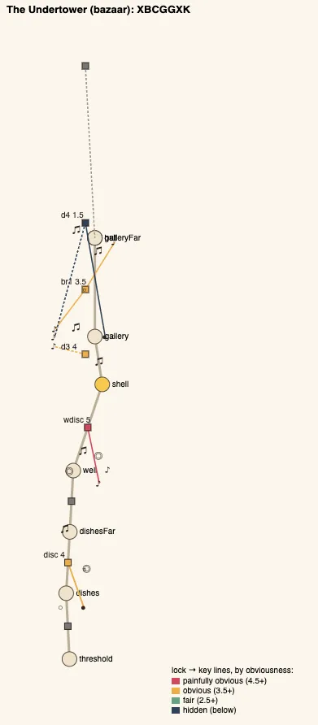
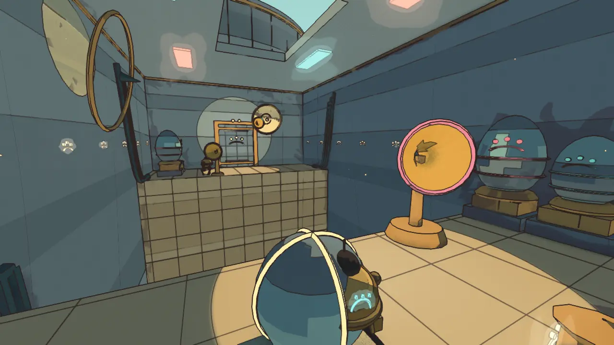
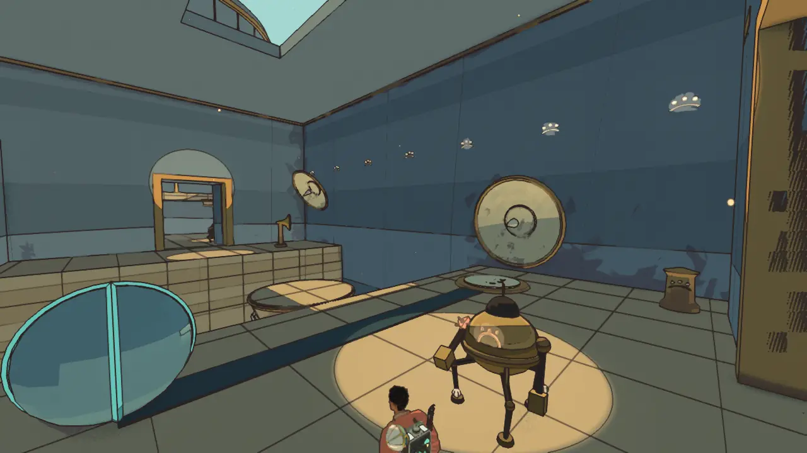
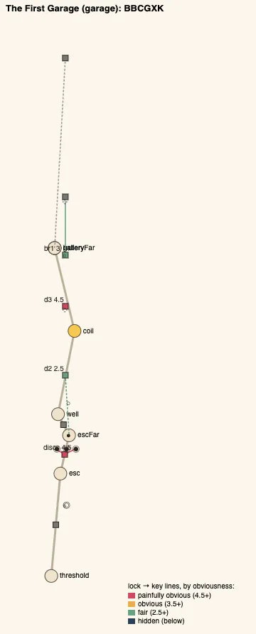
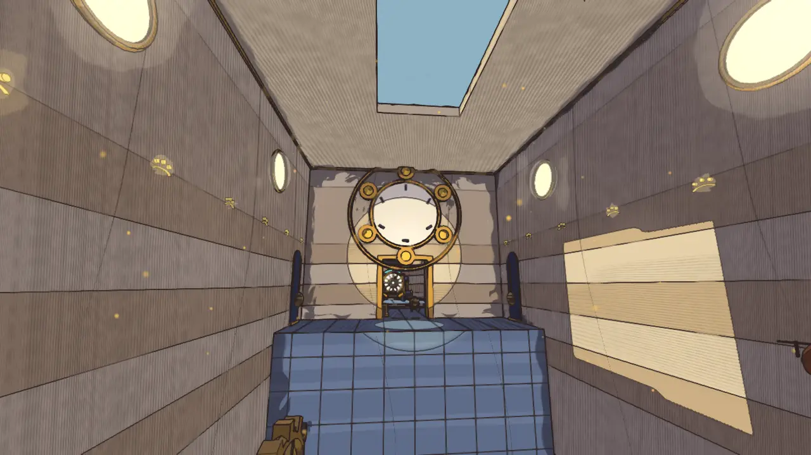
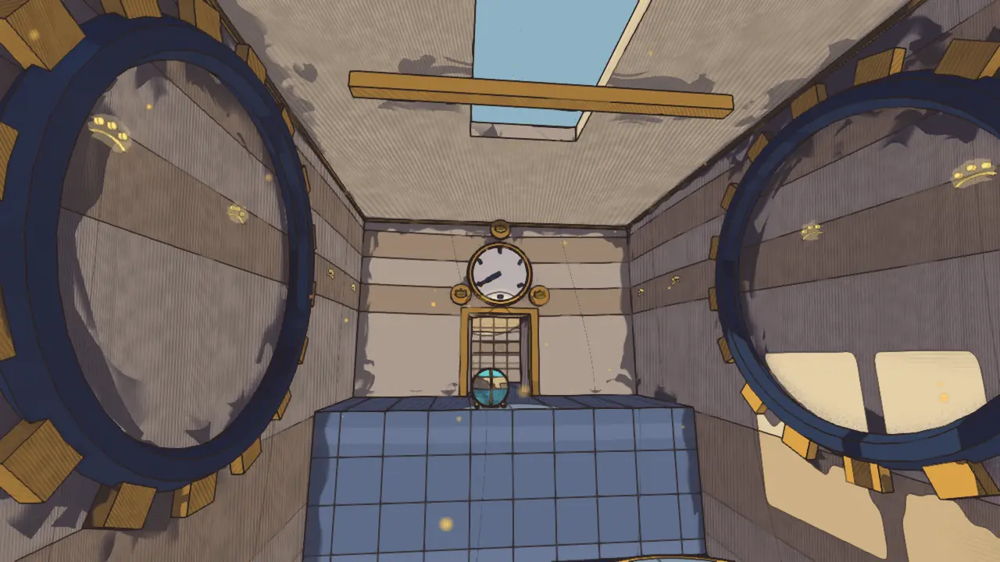
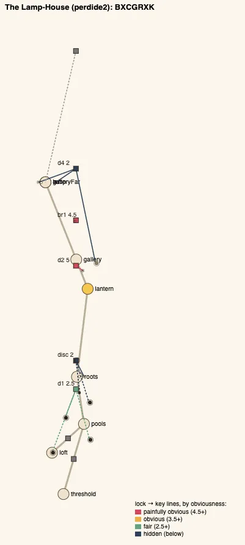
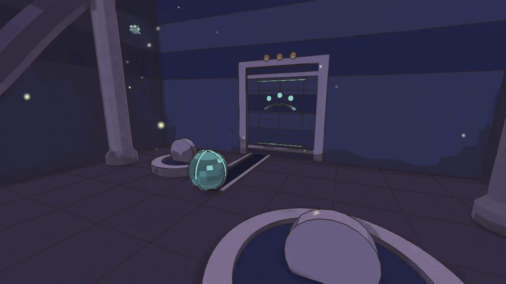
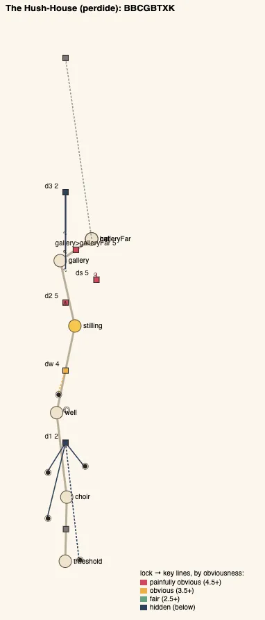
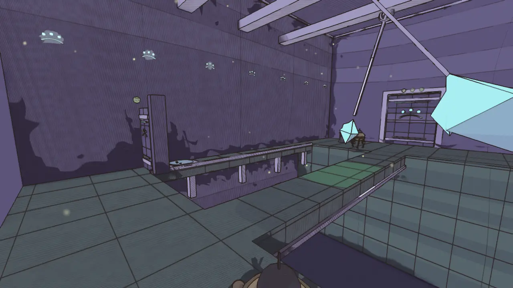

# Temple design audit, v1.12 (2026-10-09)

<!-- audit-scores
overall: 2.80 / 5
label: the average of the eleven temples' means (2.75 at v1.12; 2.80 with the guardians' addendum, v1.15)
date: 2026-10-09
-->

This report re-runs the `temple-design-qc` skill (`.claude/skills/temple-design-qc/SKILL.md`) after the second
batch of edits from the [v1.8 audit](temple-design-v1.8.md): its two worst temples reworked, the Undertower
(1.78 → 3.78) and the First Garage (1.78 → 2.89), and the follow-ups v1.8 left for the three reworked before it
(the Lamp-House's chest too early, the Hush-House's missing shortcut, the three looking alike). The other six
temples were not changed; they are measured again so the table reads against v1.8.

**Setup.**
- Version 1.12, on top of `origin/main` (`cfd2c45f`), 2026-10-09.
- `node scripts/temple-design/audit.mjs` for all eleven temples; the plans drawn by
  `node scripts/design-qc/capture.mjs` (one muted headless Chrome); the pictures of the new rooms are headless
  Chrome shots against a dev server (High, 1280 × 720), the changelog's "after" views.
- For the first time each reworked temple also has **picked reference pictures** (`references/temples/<id>/`):
  the key hall and the entrance of the Undertower and the First Garage were drawn after them (see per temple).
- Each changed temple is played through on foot in `tests/temples.test.js` with a real `Player`, failure cases
  included (the ball sung where it lies, the dark dish, the crossing that strands the middle note, the pillars
  that wait for their rider; the eye out of turn, the six from twelve, the sequence that fades; the dark orb
  tipped back, the orb stopped at the shut door; the ledge's gate shut from the near side).
- The audit script learnt two things so it can see the new rooms: a singing ball (`Ball` `sings`) is a stone
  for its horn's clue, and a bank of eyes woken in turn (`order`) is a sequence. Neither moves an unchanged
  temple's score.
- Not checked: wall climbs (not in the data), how readable a lamp or a glyph is, and the guardians' fights,
  which were not touched (another batch is reworking the foes; see "What was not done").

## Scores

1-5 per criterion; the mean is the temple's score. The ✎ notes are moves made by eye.

| Temple | Structure | Teach→test→twist | Combination | Non-obvious | Decoupling | Dungeon item | Guardian exam | Identity | Curve | **Mean** |
|---|---|---|---|---|---|---|---|---|---|---|
| Founders' Belfry (arzach2) | 4 | 5 | 4 | 3 | 5 | 5 | 4 ✎3 | 2 | 5 | **4.11 → 4.00** |
| Undertower (bazaar) | 2 | 5 | 4 | 3 | 5 | 5 | 3 | 2 | 5 | **3.78** |
| Hush-House (perdide) | 5 | 5 | 3 | 3 | 4 | 5 | 3 | 3 | 2 | **3.67** |
| Lamp-House (perdide2) | 3 | 5 | 4 | 4 | 5 | 5 | 3 | 2 | 1 ✎2 | **3.56 → 3.67** |
| First Garage (garage) | 2 | 5 | 3 | 3 | 3 | 3 | 3 | 2 | 2 | **2.89** |
| Footprint (spheres) | 1 | 3 | 1 | 1 | 1 | 4 | 3 | 3 | 3 | **2.22** |
| Engine-House (buried) | 1 | 3 | 1 | 2 | 3 | 2 | 2 | 2 | 4 ✎3 | **2.22 → 2.11** |
| Givers' House (desert) | 1 | 3 | 3 | 1 | 1 | 3 | 4 | 2 | 1 | **2.11** |
| Warden's Well (incal) | 1 | 3 | 1 | 1 | 1 | 3 | 3 | 2 | 4 ✎3 | **2.11 → 2.00** |
| Aerie (arzach) | 1 | 3 | 1 | 1 | 1 | 3 | 2 | 2 | 4 ✎3 | **2.00 → 1.89** |
| Builders' Greenhouse (edena) | 1 | 3 | 3 | 1 | 1 | 3 | 2 | 2 | 1 | **1.89** |

✎ **The Belfry's guardian, 4 → 3,** and **the curve of three unchanged temples, 4 → 3:** the same moves as in
v1.8. ✎ **The Lamp-House's curve, 1 → 2:** the script reads its new pre-chest step (the orb carried to the disc)
as the hardest early step and the easy lamp beside the chest as a fall; its last step, the orb in the niche,
is still the hardest of the temple (complexity 4.5, obviousness 2), so the curve does rise to the guardian, with
a dip after the chest.

The Engine-House gains a point of identity untouched (2.11 → 2.22 measured): its 100 % twin, the First Garage,
has changed.

**Average across temples: 2.75 / 5** (2.38 in v1.8, 1.84 in v1.5).

### The changed temples, before and after

| Temple | Structure | Teach→test→twist | Combination | Non-obvious | Decoupling | Dungeon item | Guardian exam | Identity | Curve | **Mean** |
|---|---|---|---|---|---|---|---|---|---|---|
| Undertower (bazaar) | 1 → 2 | 3 → 5 | 1 → 4 | 1 → 3 | 3 → 5 | 2 → 5 | 2 → 3 | 2 → 2 | 1 → 5 | **1.78 → 3.78** |
| First Garage (garage) | 1 → 2 | 3 → 5 | 1 → 3 | 1 → 3 | 1 → 3 | 2 → 3 | 2 → 3 | 1 → 2 | 4 → 2 | **1.78 → 2.89** |
| Lamp-House (perdide2) | 2 → 3 | 5 → 5 | 3 → 4 | 3 → 4 | 3 → 5 | 4 → 5 | 3 → 3 | 2 → 2 | 3 → 1 ✎2 | **3.11 → 3.67** |
| Hush-House (perdide) | 2 → 5 | 5 → 5 | 3 → 3 | 3 → 3 | 5 → 4 | 5 → 5 | 3 → 3 | 2 → 3 | 3 → 2 | **3.44 → 3.67** |

Mean obviousness (5 is painfully obvious; the skill aims for 2.5-3.5): the Undertower 4.63 → 3.60, the First
Garage 4.63 → 3.63, the Lamp-House 3.88 → 3.20, the Hush-House 3.60 → 3.83 (its new shortcut gate is a plain
footstone, 5, by design). One step is at 1.5: the Undertower's far door (`d4`), see below.

## Across the temples

| Temple | Skeleton | Most alike |
|---|---|---|
| bazaar | `XBCGGXK` (was `BCGGGK`) | desert, 71 % (was 83 %) |
| garage | `BBCGXK` (was `BBCGGK`) | arzach2, 86 % (was buried, **100 %**) |
| perdide2 | `BXCGRXK` (was `BCGRXK`) | arzach2, 71 % |
| perdide | `BBCGBTXK` (was `BBCGTXK`) | arzach2, 75 % (was 86 %) |
| arzach2 | `BBCGXXK` | garage, 86 % |

**The three reworked in v1.9, alike:** Belfry–Hush-House 86 → 75 %, Belfry–Lamp-House 71 → 71 %, Hush-House–Lamp-House
71 → 63 %. The Lamp-House now opens with a combination before the chest and the Hush-House has a loop, so the
script's letters part. What the letters can't see: the Hush-House and the Lamp-House are still built on the same
plan (a long hall, a rotunda with a disc over dark water and a wall to climb, a rotunda with the chest, a gallery
over a chasm, a round arena). That is the next real fix for them (see the ranked edits).

What changed:

1. **Two more temples have one idea each, from the first room to the last.** The Undertower: a note travels (the
   makers' dishes carry it across a hall, the shell in your pocket, one note at a time). The First Garage: the
   makers' clock counts round from where its hand points, and every clock in the house stopped at four.
2. **Teach before the chest with an older verb, twist after it with the gadget.** The Undertower's first room
   teaches the dish pair with the push and a splash; its gallery twists it with the shell. The Lamp-House now
   teaches "light can be carried" with a pool's light before the chest; its gallery's niche twists it with the
   lantern. The First Garage's escapement teaches the clock's order; its gallery asks for it in one breath.
3. **No first room repeats "push the ball, ride the disc" in the changed temples.** The Undertower opens with a
   singing ball and a dish, the First Garage with three eyes in a clock's order.
4. **Two new held / reversible states and one loop:** the Undertower's pillar bridge (it stands while a great
   horn rings, and either side's horn raises it again), and the Hush-House's ledge back over the chasm.

## Per temple

### The Undertower (bazaar), 1.78 → 3.78

*The Gallery of Voices from the way in, after its picked reference (`references/temples/undertower/sheet-1.jpg`):
blue-grey blocks, three singing eggs of three sizes on stepped plinths, the great brass horn at the chasm's
edge, cable bundles down the walls, the market's coral and teal light through slots in the roof. The doorway
outside follows `sheet-2.jpg`: one stepped monolith, a doorway framed three times, a round dish-face, the old
cables from under its foot.*

- **Steps:**
  - `disc` push + shot (4): the horn across the cable pit (`eD`) hears a stone's own song but is too far for any
    on this side. Splashed where it lies the singing ball's note dies (the catch); rolled onto the great dish's
    footstone (`p1`, its weight wakes the dish) and splashed, its note comes out of the twin over the horn;
  - `wdisc` shot (5): the Cable Well's second disc waits for the horn on the ledge, which listens for the low
    stone on the floor; the high stone beside it is not its note (the horns' ring colours, taught cheaply);
  - `d3` echo (4): no stone sings the low note in the Shell Chamber: it is down in the Cable Well, a splash from
    the landing; the shell carries it (the gadget taught a room away, where failing costs a walk);
  - `br1` echo, held (3.5): the pillars stand only while the great horn (`e1`) rings with the high note, 12 s,
    and never sink while you are on them; the far side's own horn (`e3`) raises them again;
  - `d4` echo + push (1.5): the far door listens through a dish over it, whose twin, low on the near wall, wakes
    with `ball2` on its footstone (`p2`). Send the middle note over first, then carry the high note to the horn.
    Crossing first strands the middle note: the shell can't catch it from across the chasm, and the far door's
    horn is up in its dish, out of reach.
- **On `d4`'s 1.5:** the script reads it as near-obscure (its key a room away, out of sight, 35 m, two verbs). In
  the room it is less hidden: the dish over the far door is in plain sight from the near side, its twin with a
  ball and a footstone is the arrangement the Hall of Dishes taught, and the far door's two lamps say "ball home"
  and "note heard". It stays the temple's hardest step on purpose; if players stall there, its first lamp could
  pulse when the near dish wakes.
- **The gadget's arc:** taught at `d3`, tested at `br1`, twisted at `d4` with the push and the dishes.
- **Guardian:** unchanged. The First Sign asks for its word played back, as the doors taught.

### The First Garage (garage), 1.78 → 2.89

*The Clock Gallery after its reference (`references/temples/first-garage/sheet-1.jpg`): the great clock face
on the far wall with six eyes round it, the makers' cogs turning slowly in the chasm, brass pendulums in arched
niches, high round windows of warm light. Outside, after `sheet-2.jpg`, the dark doorway is a round arch ringed
in brass and the great clock has a second frame; its hands still say four.*

- **Steps:**
  - `discs` sequence (4.5): three eyes round the dial over the Escapement's far door, woken from the one its hand
    points at, round the way a clock goes (eight, twelve, four); out of turn an eye only ticks;
  - `d2` push (2.5): the Winding Well's door wants its counterweight home, and the counterweight is the ball still
    on the Escapement's far landing, its groove running into the well to a socket at the wall's foot (a room
    away, out of sight from the door);
  - `d3` coil, volley (4.5): the six eyes by the chest, the cheap first use;
  - `br1` coil + order, volley (3): the great clock has lost its hands; its six eyes want one breath and the turn
    counted from the hour every clock in the house stopped at, which the little clock over the gallery's way in
    still shows (behind you), as do the Winding Well's and the one over the door outside. Out of turn they all
    go dark, and say why.
- **The gadget's arc:** taught at `d3`, tested and twisted at `br1` with the escapement's order.
- **Still weak:** the coil is used twice (dungeon item 3), the plan is a chain with no loop (structure 2), and the
  skeleton now looks like the Belfry's (86 %).

### The Lamp-House (perdide2), 3.11 → 3.67

- **New step, `disc` push + shot (2):** the Root Stair's disc waits for the lamp in its socket (`l5`), and only
  a glowing orb wakes it. The orb (`orb5`) rests beside a small pool by the hall's door (`s5`): light the pool, let
  the orb drink its light, roll it through the doorway to the socket. Rolled dark it is tipped back; its groove
  stops at the door while the door is shut. The chest now comes at 40 % of the steps (was 25 %).
- **`s4` moved:** the eye only the lantern shows is high over the gallery's way in, behind you as you cross; seen
  from the far door (`d4`'s key a room away).

### The Hush-House (perdide), 3.44 → 3.67

- **New, `ds` weight (5):** a keeper's ledge runs back along the Pendulum Gallery's east wall from the far landing
  to a gate by the near one; its footstone (`ps`) is behind the gate, so it only opens from the far side. A second
  link between the landings: the plan's first loop, and the walk back is never the pendulums again.

## Ranked edits, what is left

**The First Garage, 2.89**
1. **A third use of the coil, in a new context** (a disc that must be caught twice in one breath, or a
   counterweight pushed twice inside one refill): dungeon item +1, identity.
2. **A loop:** a shortcut from the Clock Gallery's far side back to the Coil Chamber. Expected: structure +1.5.
3. **The Foreman:** its six numerals in the clock's order from four in the last phase (a guardian change, deferred).

**The Undertower, 3.78**
1. **The First Sign's last phase listens only through the arena's dishes:** play its word into a low dish on the
   wall (shell + dish under pressure). Deferred with the guardians. Expected: guardian +1.
2. **A loop:** a ledge back from the Gallery's far side to the Shell Chamber. Expected: structure +1.5.

**The Hush-House and the Lamp-House, 3.67 each**
1. **Their plans are one plan.** Give the Lamp-House a tower that climbs (it is a tower outside) instead of the
   shared hall → rotunda → rotunda → gallery: the loft and the Root Stair as one vertical shaft round its lamp.
   Expected: identity +1, and the look of their references (a dark tower, a lamp-room).
2. **The Hush-House's `d2`** beside the chest is still painfully obvious (5): still the jaws from the Bog Well's
   disc through a window in the gate. Expected: non-obvious +0.5.

**The other six** keep their v1.5 edits (`TODO.md`, "Temple design (audit)"); next by score: the Builders'
Greenhouse (1.89) and the Aerie (1.89).

## What was not done

- **The guardians.** The First Sign, the Foreman, the Lampless and the Mother Snapper were not touched (another
  batch is reworking temple guardians); the guardian edits above are listed for it.
- **Rewards in side rooms.** The temples have no reward chests of their own yet; a side room needs one first.

## Against the last report

- Average 2.38 → 2.75. The two worst temples of v1.8 are now fifth and second.
- Temples with a step combining the gadget and an older verb: 3 → 5 (the Undertower, the First Garage).
- Steps whose key is a room away or out of sight: 9 → 14.
- Loops: 0 → 1 (the Hush-House); held / reversible states: 2 → 3 (the Undertower's pillars).
- The last 100 % pair (the First Garage and the Engine-House) is broken; no two temples share a skeleton.

## Addendum (v1.15): the guardians re-scored

The five guardians this report left for another batch (and the Belfry's, left from v1.8) were reworked so that each
last phase asks for its temple's one idea, taught a phase earlier where the old way still works too
(docs/systems/foes.md, "The guardians' last phases"). Only the **guardian exam** criterion was re-scored; the rooms
did not change. `node scripts/temple-design/audit.mjs` reads the guardians from their lines only (it counts the
verbs a fight names): it moves the Lamp-House 3 → 4 (its last phase now names the splash) and the other four not at
all, so the scores below are by eye against the skill's criterion (1: no gadget; 3: the gadget, one verb; 5: the
gadget twisted with a second verb, 2+ phases, body tells), each ✎. The script also learnt that a guardian's crystals
(a `Swing` with `onStill`) are no traversal, so the Mother Snapper's hall leaves the Hush-House's curve where it was.

| Temple | Guardian's last phase | Taught | Failure | Guardian exam | **Mean** |
|---|---|---|---|---|---|
| Founders' Belfry (arzach2) | ring as she rises to dive: a stone comes down where she dives, held while the note sounds; she lies on it, and the bell calms her (her own crying no longer opens her) | phase 2, beside her crying | a ring between moves brings nothing; the stone falls up when the note fades | 3 → 4 ✎ | **4.00 → 4.11** |
| Undertower (bazaar) | its dish turned up, it hears its word only through the two low dishes on the wall (shell + dishes under pressure) | phase 2: a dish carries it from anywhere | its word to its face: nothing; the wrong word through a dish: refused | 3 → 4 ✎ | **3.78 → 3.89** |
| Hush-House (perdide) | three crystal pendulums over her stilled in turn, smallest first (stilling + the order, as the gallery's twist); the cold in her mouth no longer eases her | phase 2: in turn, a tenth of her calm | out of turn: flat, the lit notes fade, she snaps up | 3 → 4 ✎ | **3.67 → 3.78** |
| Lamp-House (perdide2) | it shies from you; a pool lit earlier (a splash, or the lantern held by it) lures it down, and it drinks there while you stand back | phase 2: a lit pool lures it, standing still still works | by the pool it waits; no pool, no calm | 3 → 4 (the script agrees) | **3.67 → 3.78** |
| First Garage (garage) | open, its hands stop at four; its six numerals take only in the clock's order from four, in one breath (the coil + the order, as `br1`) | phase 2: in step they ring and light, any order still counts | out of step they all go dark; past a breath, begin again | 3 → 4 ✎ | **2.89 → 3.00** |

**Why 4 and not 5:** each now asks for the gadget with the temple's older verb or order, in the last of three phases,
told by the body; none yet asks for the twist room's whole combination under a new pressure that changes how the
gadget is used (the Belfry's ball, the Undertower's ball on its footstone, the Lamp-House's orb). The Lamp-House's
pools can be lit by fluid alone, so its last phase can be won without the lantern.

**Average across temples: 2.80 / 5** (2.75 before the addendum).

Tests: `tests/guardian-twists.test.js` plays each last phase in its arena with a real `Player` (the failure, then
the way through) and the phase that teaches it; `tests/temples.test.js` still plays each temple through, its
guardian included. Not checked here: how the timings feel with a pad (TODO, "Play the five reworked guardians'
last phases with a pad").
