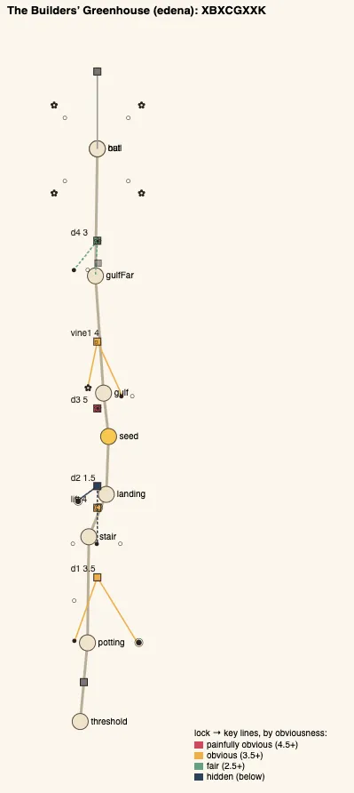
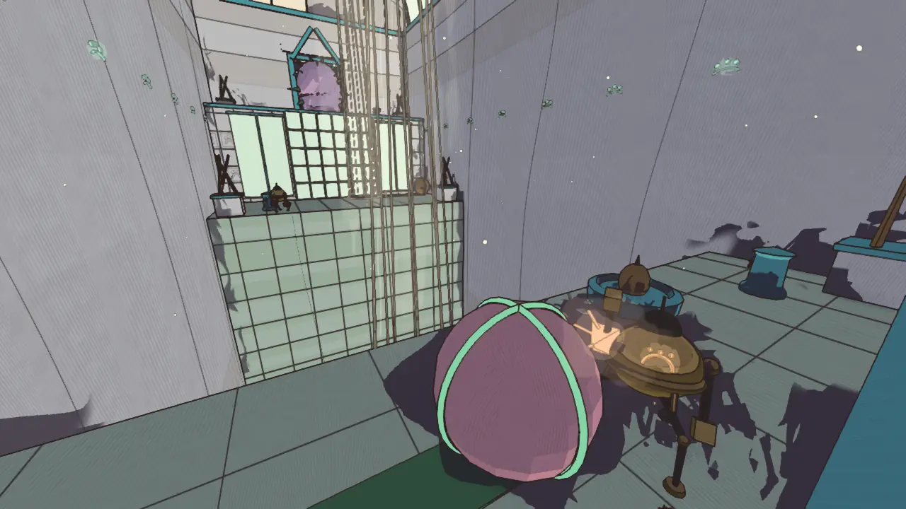
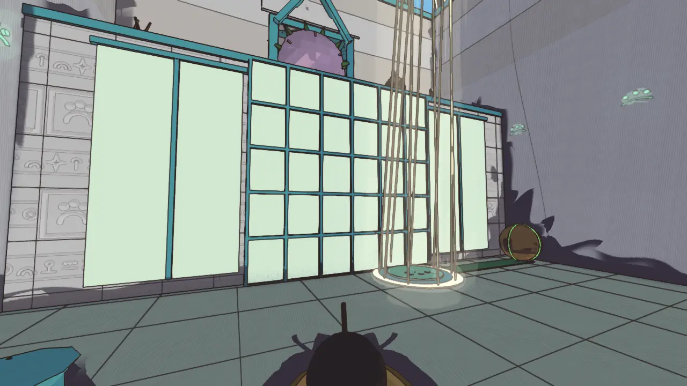
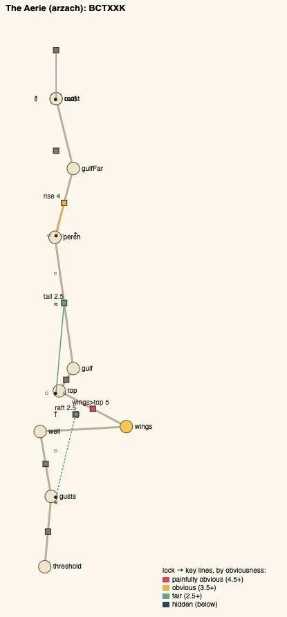
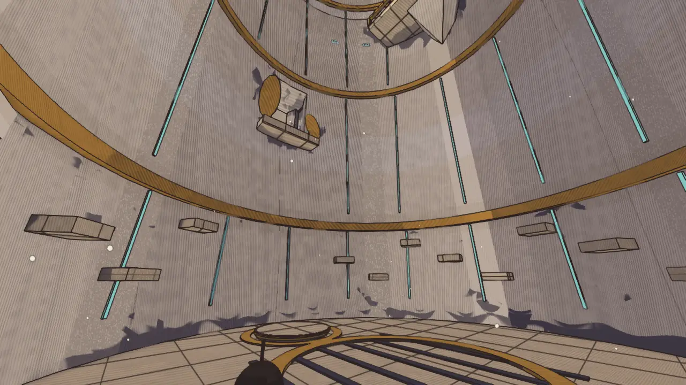
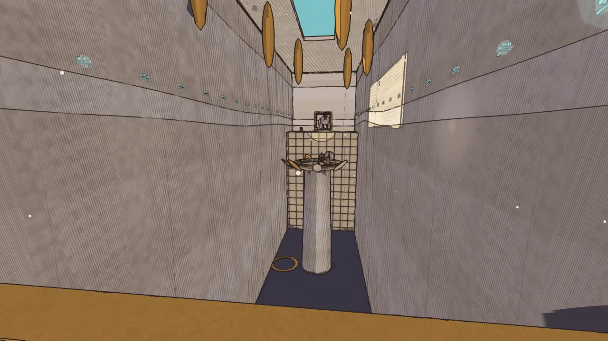

# Temple design audit, v1.16 (2026-10-09)

<!-- audit-scores
overall: 3.14 / 5
label: the average of the eleven temples' means (2.80 at v1.12 with its guardians' addendum)
date: 2026-10-09
-->

This report re-runs the `temple-design-qc` skill (`.claude/skills/temple-design-qc/SKILL.md`) after the third batch of
edits from the [v1.12 audit](temple-design-v1.12.md) (and its v1.15 addendum, the guardians re-scored): its two worst
temples, tied at 1.89, reworked round one idea each, their guardians' last phases on that idea. The Builders'
Greenhouse (1.89 → 3.78) and the Aerie (1.89 → 3.78). The other nine were not changed; they are measured again so the
table reads against v1.12.

**Setup.**
- Version 1.16, on top of `origin/main` (`cfaa2045`), 2026-10-09.
- `node scripts/temple-design/audit.mjs` for all eleven temples; the plans drawn by `node scripts/design-qc/capture.mjs`
  (one muted headless Chrome); the pictures of the new rooms are the changelog's "after" shots
  (`scripts/changelog-shots.mjs`, High, 1280 × 720, hour 10; before at v1.15).
- Both reworked temples had the author's **picked references** (`references/temples/builders-greenhouse/`,
  `references/temples/aerie/`): the key hall and the entrance of each were drawn after them (see per temple).
- Each is played through on foot in `tests/temples.test.js` with a real `Player`, failures first: the eye splashed in
  the shade, the disc that won't ride and the eye the sun has left, the seed and the seed-ball bloomed in the shade, the
  rooted seed-ball pushed; the gust that shoves you back, the raft on the floor in still air, the glide that falls
  short of the perch on still air and the one that can't climb to the higher ledge. Their guardians' last phases are
  played in their arenas in `tests/guardian-twists.test.js` (the failure, then the way; and the phase that teaches it).
- The audit script learnt two things so it can see the new rooms: an element that takes only `when` a condition holds
  (an eye in a ball's sunbeam) counts that condition's verbs and keys; a ball with several `stops` is the key of each of
  its plates. Neither moves an unchanged temple's score.
- Not checked: wall climbs (not in the data: the Aerie's lower well wall could be climbed to the Wing Chamber's balcony
  instead of the raft; the column still needs the stone), how readable a sunbeam or a vent is, and how the new timings
  feel with a pad (TODO).

## Scores

1-5 per criterion; the mean is the temple's score. The ✎ notes are moves made by eye.

| Temple | Structure | Teach→test→twist | Combination | Non-obvious | Decoupling | Dungeon item | Guardian exam | Identity | Curve | **Mean** |
|---|---|---|---|---|---|---|---|---|---|---|
| Founders' Belfry (arzach2) | 4 | 5 | 4 | 3 | 5 | 5 | 4 | 2 | 5 | **4.11** |
| Undertower (bazaar) | 2 | 5 | 4 | 3 | 5 | 5 | 3 ✎4 | 2 | 5 | **3.89** |
| Builders' Greenhouse (edena) | 2 | 5 | 5 | 3 | 4 | 5 | 3 ✎4 | 3 | 3 | **3.67 → 3.78** |
| Aerie (arzach) | 3 | 5 | 4 | 3 | 4 | 4 | 4 | 3 | 4 | **3.78** |
| Hush-House (perdide) | 5 | 5 | 3 | 3 | 4 | 5 | 3 ✎4 | 3 | 2 | **3.78** |
| Lamp-House (perdide2) | 3 | 5 | 4 | 4 | 5 | 5 | 4 | 2 | 1 ✎2 | **3.78** |
| First Garage (garage) | 2 | 5 | 3 | 3 | 3 | 3 | 3 ✎4 | 2 | 2 | **3.00** |
| Footprint (spheres) | 1 | 3 | 1 | 1 | 1 | 4 | 3 | 3 | 3 | **2.22** |
| Engine-House (buried) | 1 | 3 | 1 | 2 | 3 | 2 | 2 | 2 | 4 ✎3 | **2.22 → 2.11** |
| Givers' House (desert) | 1 | 3 | 3 | 1 | 1 | 3 | 4 | 2 | 1 | **2.11** |
| Warden's Well (incal) | 1 | 3 | 1 | 1 | 1 | 3 | 3 | 2 | 4 ✎3 | **2.11 → 2.00** |

✎ **The guardian exams of v1.15's addendum** stand (the Undertower, the Hush-House, the First Garage: 3 → 4, the Lamp-House
measured 4): their rooms did not change. ✎ **The Greenhouse's guardian, 3 → 4,** by the addendum's rule: its last phase
asks for the gadget with the temple's own move (the sun brought to it from its quarter's footstone, your weight on a
plate as the louvres taught), told by its body (it kneels; the flowers fold and drop in the shade), in the last of three
phases; the script only reads the verbs a fight's lines name, and "stand on the footstone" names none of its words.
✎ **The curve of the Engine-House and the Warden's Well, 4 → 3,** as in v1.8 and v1.12. The Lamp-House's curve, 1 → 2,
as in v1.12.

**Average across temples: 3.14 / 5** (2.80 at v1.12 with the addendum, 2.75 without; 2.38 at v1.8, 1.84 at v1.5).

### The changed temples, before and after

| Temple | Structure | Teach→test→twist | Combination | Non-obvious | Decoupling | Dungeon item | Guardian exam | Identity | Curve | **Mean** |
|---|---|---|---|---|---|---|---|---|---|---|
| Builders' Greenhouse (edena) | 1 → 2 | 3 → 5 | 3 → 5 | 1 → 3 | 1 → 4 | 3 → 5 | 2 → 4 ✎ | 2 → 3 | 1 → 3 | **1.89 → 3.78** |
| Aerie (arzach) | 1 → 3 | 3 → 5 | 1 → 4 | 1 → 3 | 1 → 4 | 3 → 4 | 2 → 4 | 2 → 3 | 3 ✎ → 4 | **1.89 → 3.78** |

Mean obviousness (5 is painfully obvious; the skill aims for 2.5-3.5): the Greenhouse 4.70 → 3.50, the Aerie 5.00 →
3.50. One step is at 1.5: the Greenhouse's landing door (`d2`), see below.

## Across the temples

| Temple | Skeleton | Most alike |
|---|---|---|
| edena | `XBXCGXXK` (was `XCGGGGK`) | arzach2, 75 % (was desert, **86 %**) |
| arzach | `BCTXXK` (was `BCTGK`) | arzach2, 71 % (was incal, 83 %) |
| desert | `XCGGGK` | bazaar, 71 % (was edena, 86 %) |
| incal | `BBCTGK` | buried, 83 % (was arzach, 83 %) |

**What changed:**

1. **Two more temples have one idea each, from the first room to the guardian.** The Greenhouse: nothing grows in the
   shade (the builders' louvres, a ball's weight on a plate turning one, a sunbeam swinging onto whatever it was turned
   for). The Aerie: one wind, and it comes out wherever no stone stops it (on foot it is in your way; with the wings it
   carries you).
2. **The light and the wind are visible.** A sunbeam is thin pale rays from a louvre to a pool of light, swinging over
   in a second when its plate changes; a column of wind is rings rising out of a vent, and settles when its stone goes
   home; a gust is streaks racing down a hall. Each step's state can be read from where you stand.
3. **Teach before the chest with an older verb, twist after it.** The Greenhouse teaches "the sun wakes things, a ball
   moves the sun" twice before the chest (the Potting Hall's eye; the Glass Stair's one ball for two places), then asks
   for it with the bloom twice (the light brought to the seed; the seed brought to the light). The Aerie teaches "a
   stone in a vent sends the wind elsewhere" with the hall's stone (its effect seen a room away), then asks for it with
   the wings twice (a tailwind, a column from a perch over nothing).
4. **States that change back:** the Aerie's two vents in the Gulf (`not` on a stone in its throat) and the Roost's; the
   Greenhouse's Glass Stair (the disc rides only while the ball is on the east plate).
5. **No first room repeats "push the ball, ride the disc".** The Greenhouse opens with an eye in the shade, the Aerie
   with a stone pushed through the gusts.
6. **The two share no plan.** The Greenhouse keeps its chain of halls (its rooms were good, only their locks changed);
   the Aerie is a tower now: a tall round well as its hub (the Hall of Winds into its floor, the raft up to the Wing
   Chamber off its side, the column up to the high balcony), then out over the Gulf to the Roost.

## Per temple

### The Builders' Greenhouse (edena), 1.89 → 3.78

*The Vine Gulf after its picked reference (`references/temples/builders-greenhouse/sheet-1.jpg`): gridded white walls,
a barrel vault of greenhouse glass on white ribs, dead sticks in square stone pots on the ledges, the vine bridge across
the chasm, the glass wall with its vine and the great pink bud over a pointed doorway. Outside, after `sheet-2.jpg`: two
pilasters rising past the drum's rim either side of a tall narrow door, the builders' three dots over an arc, panes gone
from the dome, sown beds in rows along the path where nothing has come up.*

- **Steps:**
  - `d1` shot + push (3.5): the eye behind the potting benches (`s1`) is in the shade and won't wake ("the builders'
    eyes open only to the sun"); the stone ball onto the plate at its groove's end (`p1`, 18 m away) turns the louvre
    over the benches, and the sunbeam swings off the floor onto the eye (`s1` `when: drumOn`): an order to find;
  - `lift` push (4): the Glass Stair's one ball (`ball2`, `stops` `pW` / `pE`): east, the sun on the disc over the
    root-wall, which rides only in the sun;
  - `d2` shot + push (1.5): the landing's door wants the eye high on the wall beside it (`s2`), which wakes only with
    the ball on the west plate, where the disc stands still. The catch: ride up first and the door is shut, the eye in
    the shade, the ball eighteen metres below. Ride down, roll it west, wake the eye (it stays open), roll it back;
  - `d3` bloom (5): the flower-door in a sunbeam, the cheap first use;
  - `vine1` bloom + push (4): the seed at the lip (`seed1`) lies in the shade and only sprouts pale; the sun-ball on the
    near ledge (`sun` on `pS`) turns the great louvre's beam up out of the dark onto the lip (the light brought to the
    seed);
  - `d4` bloom + push (3): across, the seed is a seed-ball (`sb`) lying in the shade beside the glass wall: rolled into
    the fixed sunbeam at the glass's foot (`pG`) and bloomed there, it roots; its vine climbs the glass into the great
    bud, which opens round it (the seed brought to the light; `d4` opens on `seed2`, the bud no longer a bloom of its
    own).
- **On `d2`'s 1.5:** the script reads it as near-obscure (its key a room back, below and out of sight, 24 m, two
  verbs). In the room it is less hidden: the eye is on the wall beside the door, in plain sight from the landing, its
  door's lamp says "eye", and the Glass Stair's floor shows one ball between two plates and two dark places the louvre
  can light. It stays the temple's hardest early step on purpose; if players stall there, the eye could stir when the
  beam passes it.
- **The gadget's arc:** taught at `d3`, tested at `vine1` (with the ball), twisted at `d4` (the seed itself rolled),
  examined by the Gardener (the sun brought to it).
- **Guardian:** the Gardener (docs/systems/foes.md, "The guardians' last phases"): the dome's louvre throws the sun on
  one quarter at a time, the quarter whose footstone you last stood on (`rt.gardenSun`). In its second phase a bloom on
  its back counts double in the sun; in its last, nothing grows on it in the shade: stand on the footstone of the
  quarter it kneels in, let the sun settle, bloom. It kneels a little longer in its last two phases (4.6 s, 6.2 s).
- **Still weak:** a chain with no loop (structure 2); the bud by the chest at 5; the curve rises only a little (the two
  pre-chest steps are as complex as the twist).

### The Aerie (arzach), 1.89 → 3.78

*The Wind Well after its picked reference (`references/temples/aerie/sheet-1.jpg`): a tall round shaft of bone-white
stone banded in ochre, open to the sky through a crown of stone feathers leaning out round its rim, glyph lines up its
walls like the lines on a wing, carved ledges low down, a high balcony jutting from the wall beside a great carved eye.
Outside, after `sheet-2.jpg`: the doorway is a tall round-topped arch cut through the drum, framed in ochre.*

- **Steps:**
  - `raft` push (2.5): the Wind Well's air is still: the wind goes down the Hall of Winds, out of the vent in its far
    mouth. Its stone (`ballW`), too heavy for the gusts, is pushed up the hall between them, a push or two a calm, into
    the vent's socket (`pH`): the hall falls calm, and in the well beyond the column rises and lifts the feather raft to
    the Wing Chamber's balcony (the key a room away, the effect in the next room);
  - `wings>top` wings (5): the column lifts open wings to the high balcony (the gadget alone);
  - `tail` push + wings (2.5): forty-six metres of still air to a stone perch four lower: no glide carries so far (the
    catch: you fall short and are back at the mark). The vent's mouth is over the Gulf's door; its throat is a grate in
    the balcony behind you, its stone in it (`ballB`, a room away): rolled out, the wind pours over the gulf in gusts,
    and leaping as one comes it carries your wings to the perch (a `Gust` with `carry`). Push the stone home and it
    stops (`not` on `drumOn`: a state that changes back);
  - `rise` push + wings (4): from the perch to a ledge six metres higher: no glide climbs. A vent far below beside the
    perch, its throat on the perch with its stone in it (`ballP`): rolled out, a column rises past the perch.
- **The gadget's arc:** taught at `wings>top`, tested and twisted at `tail` (the gust that shoved you back in the hall
  carries you; the stone a room back), twisted again at `rise` (the well's column from a perch over nothing), examined
  by the Elder.
- **Guardian:** the Elder (docs/systems/foes.md): two vents in the Roost's floor and one stone in the groove between
  them; in one vent, the wind rises from the other. Aloft (her second phase on) she drifts over the nearer vent; flying
  with her in its wind counts double; in her last phase still air does nothing ("she wants the wind under her wings"):
  roll the stone into the other vent and ride the wind up beside her. She hangs a little longer (5.2 s, 6.6 s).
- **Still weak:** the column step is the gadget alone (5), and the plan has no loop (the way back down is a glide, which
  the logic does not count as a room's link).

## Ranked edits, what is left

**The Warden's Well, 2.00 (next)**
1. **One idea:** jets against a gust in the Lamp Gallery (the Aerie's `Gust` now blows only `when` a stone or an eye
   lets it, and carries what flies with it), `s1` seen only mid-ride, the three eyes over their shelves found from the
   air. Expected: combination +2, non-obvious +1.5.
2. **The warden:** its crown vent opened by a gust you send up the drum (the jets held in it).

**The Engine-House and the Footprint, 2.11 / 2.22**
1. `k2` on pistons in turn (the Engine-House); false lens stones with the clue a room back (the Footprint). See the
   v1.5 report for each.

**The Givers' House, 2.11**
1. A burning tar ball pushed into `b3`; `b2` a room back.

**The Builders' Greenhouse, 3.78**
1. **A loop:** the chest room's second bud, in the shade until the Vine Gulf's louvre turns, opening a way back from
   the far side. Expected: structure +1.5.
2. **A decoy by the chest's bud:** a bud in the shade beside it (it folds tighter: "only in the sun", taught at once).
   Expected: non-obvious +0.5.

**The Aerie, 3.78**
1. **The column as a choice:** the Wing Chamber's balcony and the high balcony each with a vent of their own and one
   stone between them, so riding up means sending the wind first. Expected: non-obvious +0.5, combination +0.5.
2. **A loop:** a ledge from the perch back to the well. Expected: structure +1.5.

## What was not done

- **The third temple.** The Warden's Well (2.00) is next; it was left for a batch of its own rather than done thinly.
- **Rewards in side rooms.** The temples have no reward chests of their own yet (the box system holds the makers'
  gifts and the shops the containers); a side room wants one first.
- **The pad pass** for the new timings (TODO, "Play the Greenhouse's and the Aerie's new rooms and last phases with a
  pad").

## Against the last report

- Average 2.80 → 3.14. The two worst temples of v1.12 are now tied third.
- Temples with a step combining the gadget and an older verb: 5 → 7.
- Steps whose key is a room away or out of sight: 14 → 19.
- Held or reversible states: 3 → 6 (the Gulf's two vents, the Roost's, the Glass Stair's disc).
- Most alike pair: 86 % (the Belfry and the First Garage, unchanged); the Greenhouse leaves the Givers' House (86 → 75 %).
