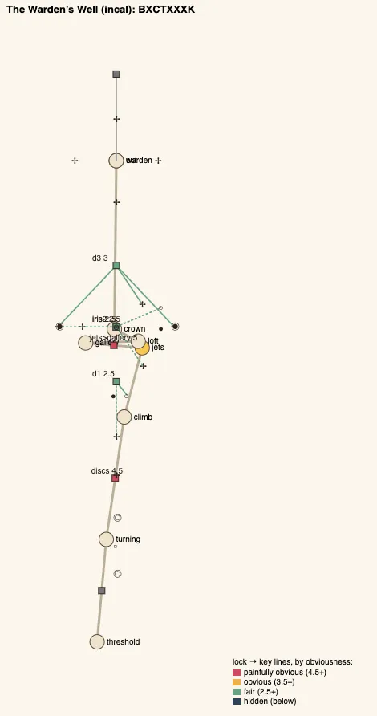
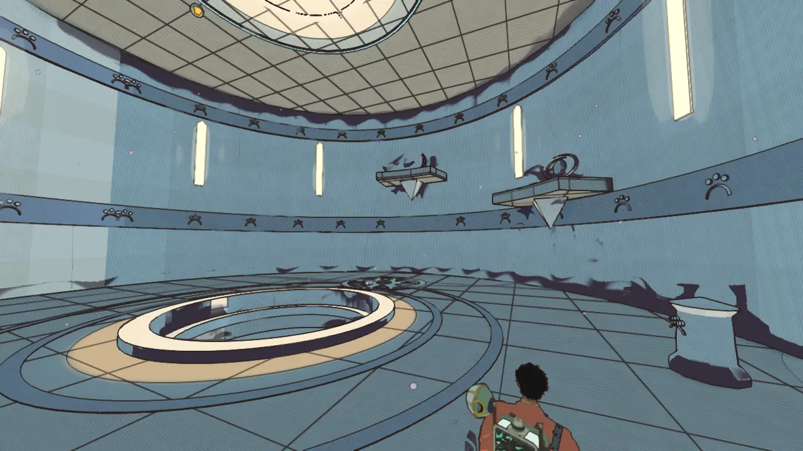
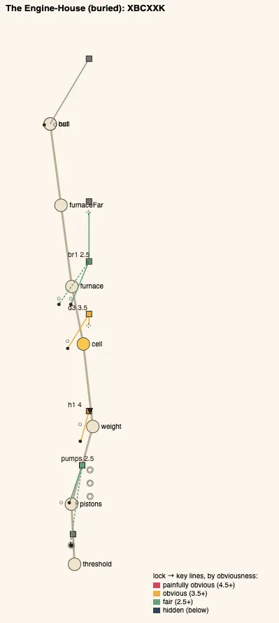
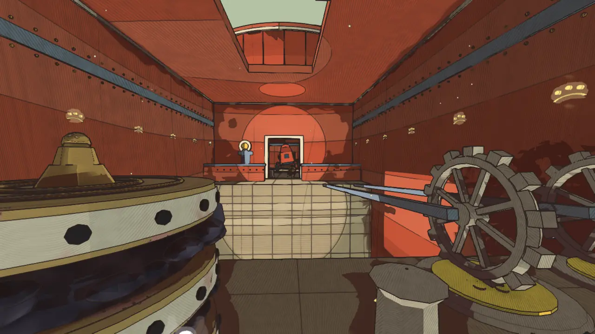

# Temple design audit, v1.19 (2026-10-09)

<!-- audit-scores
overall: 3.49 / 5
label: the average of the eleven temples' means (3.14 at v1.16)
date: 2026-10-09
-->

This report re-runs the `temple-design-qc` skill (`.claude/skills/temple-design-qc/SKILL.md`) after the fourth batch
of edits from the [v1.16 audit](temple-design-v1.16.md): its two worst temples reworked round one idea each, their
guardians' last phases on that idea. The Warden's Well (2.00 → 3.89) and the Engine-House (2.11 → 4.00). The other
nine were not changed; they are measured again so the table reads against v1.16.

**Setup.**
- Version 1.19, on top of `4060e921` (written on `461ac5ea`), 2026-10-09 (the rework `e54fec96`, `943b0bf6`, `d20992a7`).
- `node scripts/temple-design/audit.mjs` for all eleven temples; the two plans drawn by `node scripts/design-qc/capture.mjs`
  (one muted headless Chrome); the pictures of the new rooms are the changelog's "after" shots
  (`scripts/changelog-shots.mjs`, High, 1280 × 720, hour 10; before at v1.16).
- Both temples had the author's **picked references** (`references/temples/wardens-well/`,
  `references/temples/engine-house/`): the Lamp Gallery and the Furnace, and both doorways, were drawn after them (see
  per temple).
- Each is played through on foot in `tests/temples.test.js` with a real `Player`, failures first: the discs still
  until the vane spins and stopping with it, the ball stopped at the slot's lip, the eye's shut lids and the great vane
  that only rocks to a splash, the shelf's ball stopped at the gap, the crown's lids shut with one vane turning; the
  valve that hisses while the ball sits in the pistons' crank, the hammer that throws you off the walkway, the eyes
  caught as their pistons rise (never four in a breath), one crank jammed in the Furnace not being enough. Their
  guardians' last phases are played in their arenas in `tests/guardian-twists.test.js` (the failure, then the way;
  and the phase that teaches it).
- The audit script learnt three things so it can see the new rooms: a `vane` element (a splash, or its item, and a
  timing; what it drives is a state that changes back); a ball whose groove crosses a bridge (`gap`) has that bridge's
  key in its plate's lock; a `Hammer` is a traversal, like a `Swing`. None moves an unchanged temple's score.
- Not checked: wall climbs (the Engine-House's gantry face can still be climbed instead of riding the pistons; the Crank
  Hall's hammer still bars the way), how readable a vane's spin or a piston's turn is from across a room, and how the
  new timings feel with a pad (TODO).

## Scores

1-5 per criterion; the mean is the temple's score. The ✎ notes are moves made by eye.

| Temple | Structure | Teach→test→twist | Combination | Non-obvious | Decoupling | Dungeon item | Guardian exam | Identity | Curve | **Mean** |
|---|---|---|---|---|---|---|---|---|---|---|
| Founders' Belfry (arzach2) | 4 | 5 | 4 | 3 | 5 | 5 | 4 | 2 | 5 | **4.11** |
| Engine-House (buried) | 2 | 5 | 5 | 4 | 5 | 4 | 4 | 3 | 4 | **4.00** |
| Undertower (bazaar) | 2 | 5 | 4 | 3 | 5 | 5 | 3 ✎4 | 2 | 5 | **3.89** |
| Warden's Well (incal) | 2 | 5 | 5 | 3 | 4 | 5 | 4 | 3 | 4 | **3.89** |
| Builders' Greenhouse (edena) | 2 | 5 | 5 | 3 | 4 | 5 | 3 ✎4 | 3 | 3 | **3.78** |
| Aerie (arzach) | 3 | 5 | 4 | 3 | 4 | 4 | 4 | 3 | 4 | **3.78** |
| Hush-House (perdide) | 5 | 5 | 3 | 3 | 4 | 5 | 3 ✎4 | 3 | 2 | **3.78** |
| Lamp-House (perdide2) | 3 | 5 | 4 | 4 | 5 | 5 | 4 | 2 | 1 ✎2 | **3.78** |
| First Garage (garage) | 2 | 5 | 3 | 3 | 3 | 3 | 3 ✎4 | 2 | 2 | **3.00** |
| Footprint (spheres) | 1 | 3 | 1 | 1 | 1 | 4 | 3 | 3 | 3 | **2.22** |
| Givers' House (desert) | 1 | 3 | 3 | 1 | 1 | 3 | 4 | 2 | 1 | **2.11** |

✎ The moves of v1.15 and v1.16 stand (the guardian exams of the Undertower, the Greenhouse, the Hush-House and the
First Garage, 3 → 4; the Lamp-House's curve, 1 → 2): their rooms did not change. No move for the two reworked
temples: the script's curve of 4 is a real rise this time (the Warden's Well from a splash and a ride to two vanes at
once; the Engine-House from one jam to two jams and a breath), so the ✎ 4 → 3 of v1.8-v1.16 is dropped.

**Average across temples: 3.49 / 5** (3.14 at v1.16, 2.80 at v1.12, 2.38 at v1.8, 1.84 at v1.5).

### The changed temples, before and after

| Temple | Structure | Teach→test→twist | Combination | Non-obvious | Decoupling | Dungeon item | Guardian exam | Identity | Curve | **Mean** |
|---|---|---|---|---|---|---|---|---|---|---|
| Warden's Well (incal) | 1 → 2 | 3 → 5 | 1 → 5 | 1 → 3 | 1 → 4 | 3 → 5 | 3 → 4 | 2 → 3 | 4 ✎3 → 4 | **2.00 → 3.89** |
| Engine-House (buried) | 1 → 2 | 3 → 5 | 1 → 5 | 2 → 4 | 3 → 5 | 2 → 4 | 2 → 4 | 2 → 3 | 4 ✎3 → 4 | **2.11 → 4.00** |

Mean obviousness (5 is painfully obvious; the skill aims for 2.5-3.5): the Warden's Well 4.88 → 3.33, the
Engine-House 4.38 → 3.13. No step at 1.5 or under.

## Across the temples

| Temple | Skeleton | Most alike |
|---|---|---|
| incal | `BXCTXXXK` (was `BBCTGK`) | arzach, 75 % (was buried, 83 %) |
| buried | `XBCXXK` (was `BBCGGK`) | edena, 75 % (was incal, 83 %) |
| arzach | `BCTXXK` | incal, 75 % (unchanged score) |
| garage | `BBCGXK` | arzach2, 86 % (unchanged) |

**What changed:**

1. **Two more temples have one idea each, from the first room to the guardian.** The Warden's Well: the tower
   breathes through its vanes (a vane drives its machine only while it turns; a splash spins a small one a while, a
   great one turns only under the jets' wash). The Engine-House: a ball in the teeth stops the engine there (what a
   crank drives stops where it stands while a ball sits in its notch).
2. **Teach, test, twist, on both sides of the chest.** The Warden's Well teaches the vane alone (the discs), then with
   the push (the slot on the Climb); after the jets, the great vane with the shot (the lidded eye), with the push from
   the air (the shelf's ball), and both kinds of vane at once (the crown). The Engine-House teaches the jam backwards
   first (roll the ball *out* and the pistons run), then forwards (the hammer stopped), then with the gadget (one crank
   holds four eyes up), twisted (two cranks for four pistons, the other two caught in turn).
3. **States that change back:** the Turning Floors' discs and the Climb's slot (a vane slows and stops), the
   Piston Hall's pistons (the ball rolled back into the teeth stops them where they are; the audit does not count it:
   a ball resting on a plate reads as held).
4. **No first room repeats "push the ball, ride the disc".** The Warden's Well opens with a vane to splash; the
   Engine-House with a valve that hisses and a ball to roll out of a crank.
5. **The Warden's Well and the Engine-House no longer share a shape** (83 % at v1.16). The crown step keeps the Warden's
   Well off the Aerie's skeleton (86 % without it), and the Engine-House's opening keeps it off the First Garage's
   (`BBCGXK`: a plain opening would have made them the same).

## Per temple

### The Warden's Well (incal), 2.00 → 3.89

*The Lamp Gallery after its picked reference (`references/temples/wardens-well/sheet-1.jpg`): cream stone banded in
steel blue with the makers' three dots over an arc, tall slit windows of warm light, stone shelves jutting from the
wall with carved eyes over them (three blind, one with stone lids), rings round the floor's middle. Outside, after
`sheet-2.jpg`: a tall pointed arch at the top of a short flight of steps, banded in blue at its foot, an unlit lamp
on a post beside the steps (Vell lights it once the warden is still).*

- **Steps:**
  - `discs` splash (4.5): the discs ride only while the small vane over the far door turns (coasting 15 s: one splash
    carries you across, the far disc coming back for you); it slows, and they stop with it;
  - `d1` push + splash (2.5): the balcony's ball stops at a slot's lip; its stones stand only while the vane in the
    well's floor turns, out of sight from the door, in sight from the balcony's lip;
  - the oculus, jets (5);
  - `iris` splash + jets (2.5): the eye over the west shelf, hidden from the floor, behind stone lids that lift only
    while the great vane in the floor turns; a splash only rocks it. Hover over it (aim: the jets hold you) and splash
    the eye from the air;
  - `iris2` push + jets (2.5): the loft's shelf ball stops at a gap; its stones stand while the loft's great vane
    turns. Hover over the vane and push the ball across from the air;
  - `d3` splash + jets (3): the crown's eye wants two vanes turning at once: splash the little one on the west wall,
    fly to the great one and hover before it slows (12 s).
- **The gadget's arc:** taught at the oculus, tested at `iris` (with the shot), twisted at `iris2` (with the push, from
  the air) and at `d3` (with a coasting vane), examined by the warden.
- **Guardian:** the warden (docs/systems/foes.md, "The guardians' last phases"): four great vanes in its hall's floor;
  its hatch open, it backs onto the nearest. In its second phase a hit in the crown over a turning vane counts twice;
  in its last the hatch stays shut in still air: hover over its vane, level with its crown, and the draught lifts it.
  The hatch stays up a little longer in those phases (5.5 s, 7 s).
- **Also fixed:** the shaft's breath (the world change) let a rider sink off the end of its crest and fall back down;
  it now holds them near its line to the rim.
- **Still weak:** a chain with no loop (structure 2; the jets make a shortcut moot); the opening (`discs`, 4.5) and the
  oculus (5) are obvious, the latter by design (the quest's "use" stage).

### The Engine-House (buried), 2.11 → 4.00

*The Furnace after its picked reference (`references/temples/engine-house/sheet-1.jpg`): rust-red iron walls riveted
and banded in blue-grey, the chasm over embers, four eyes standing on pistons behind an iron parapet across the far
lip, the two west pistons' crank wheels on the near lip with their connecting rods across, the ring window high
above. The Piston Hall has the engine's own pistons standing in their cylinders and valve wheels on its pipes.
Outside, after `sheet-2.jpg`: the oval door in a riveted iron plate, the door itself swung back against the drum on
two great greased hinges (Fisk's).*

- **Steps:**
  - `pumps` splash + push (2.5): the valve hisses and the pistons shudder and stay: a ball sits in their crank's teeth.
    Roll it out and they ride; roll it back and they stop where they are (`ball0`, two stops);
  - `h1` push (4): the Crank Hall's hammer slams down on the walkway over a pit and throws you off; the gantry's ball,
    a room back, rolled down its groove through the corridor into the hammer's crank, stops it at the top of its stroke;
  - `d3` the fourth chamber + push (3.5): four eyes on pistons rising in turn behind a parapet, never four up in a
    breath; one crank drives all four: a ball in it holds them all up, then four in a breath;
  - `br1` the fourth chamber + push (2.5): the Furnace's four pistons, a crank for each of the two west ones only:
    jam those two, then catch the other two as they rise one after the other (2 s apart, a 2.6 s breath).
- **The gadget's arc:** taught at `d3` (with the jam just learnt), tested and twisted at `br1` (two jams and the
  pistons' turn), examined by the Tooth-Warden.
- **Guardian:** the Tooth-Warden: from its second phase it turns on the hall's great gear; a ball in the gear's teeth
  holds it, and a volley counts twice. Shifting into its last phase it stamps the ball out of the teeth, and opens
  turning, one vent facing out at a time (each 1.4 s: four in a 2.6 s breath can't be had); roll the ball back and
  all four face out.
- **Still weak:** a chain with no loop (structure 2); the gadget opens only two locks (dungeon item 4); `h1` is the push
  alone (4).

## Ranked edits, what is left

**The Givers' House, 2.11 (next)**
1. **One idea, the tree's fire:** a burning tar ball pushed into `b3`; `b2` a room back. See the v1.5 report.
2. **The Keeper:** its last phase on the same idea (the braziers lit from the burning ball).

**The Footprint, 2.22**
1. False lens stones with the clue a room back (the Lens Chamber's mural glyph); a sphere's groove only the lens shows.

**The Warden's Well, 3.89**
1. **A hub in the gallery:** a side chamber off a shelf whose vane lifts the west eye's lids, so the gallery has three
   ways out. Expected: structure +1.
2. **Less obvious opening:** the Turning Floors' vane seen only from the island (`discs` 4.5 → 3.5).

**The Engine-House, 4.00**
1. **A shortcut back:** a keeper's stair from the Fourth Chamber down to the Piston Hall, opened from above. Expected:
   structure +1.5.
2. **The gadget a third time:** a bank on the hall's corridor, its eyes on the hammer's stroke. Expected: dungeon item +1.

**The First Garage, 3.00**
1. **Break its shape** (`BBCGXK`, 86 % like the Belfry): its opening's eyes in turn combined with the escapement's
   ball. Expected: identity +1, combination +1.

## What was not done

- **The third and fourth temples** (the Givers' House and the Footprint): left for a batch of their own rather than
  done thinly.
- **The pad pass** for the new timings (TODO): the Turning Floors' 15 s, the crown's 12 s, the warden's 7 s hatch,
  the Furnace's 1.2 s piston tops.
- **Loops.** Both reworked temples are still chains; a jet-borne tower makes shortcuts moot, the Engine-House could
  have one (above).

## Against the last report

- Average 3.14 → 3.49. The two worst temples of v1.16 are now second and joint third.
- Temples with a step combining the gadget and an older verb: 7 → 9.
- Steps whose key is a room away or out of sight: 19 → 24.
- Held or reversible states: 6 → 7 by the script (the Turning Floors' discs), 9 by eye (the Climb's slot, the Piston
  Hall's pistons).
- Most alike pair: 86 % (the Belfry with the First Garage, unchanged); the Warden's Well leaves the Engine-House
  (83 → 50 %).
