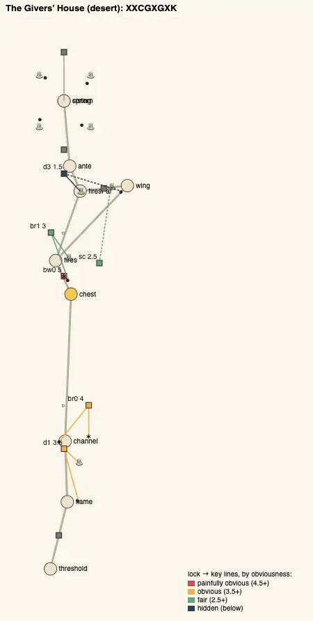
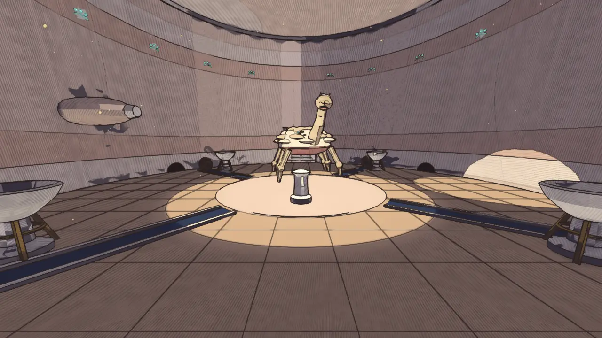
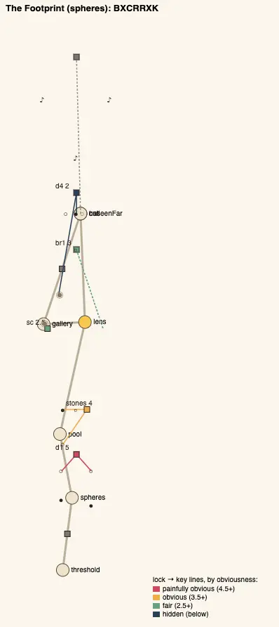
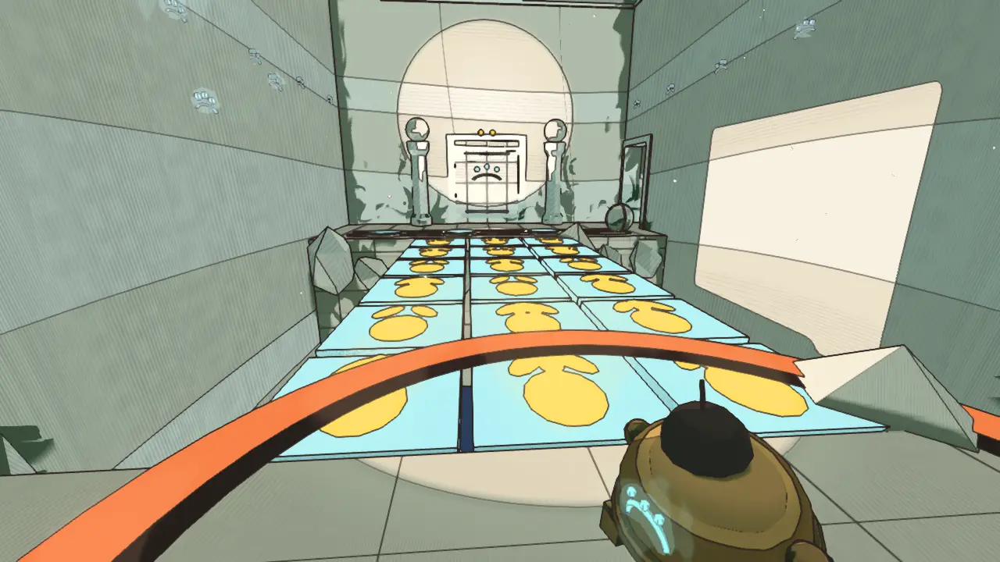

# Temple design audit, v1.24 (2026-10-10)

<!-- audit-scores
overall: 3.87 / 5
label: the average of the eleven temples' means (3.49 at v1.19)
date: 2026-10-10
-->

This report re-runs the `temple-design-qc` skill (`.claude/skills/temple-design-qc/SKILL.md`) after the fifth and last
batch of edits from the [v1.19 audit](temple-design-v1.19.md): its two worst temples reworked round one idea each, their
guardians' last phases on that idea. The Givers' House (2.11 → 4.22) and the Footprint (2.22 → 4.33). The other nine were
not changed; they are measured again so the table reads against v1.19, and checked against the four rules TODO.md asks of
every temple (below).

**Setup.**
- Version 1.24, on top of `37f13898`, 2026-10-10 (the rework `ffb77734`).
- `node scripts/temple-design/audit.mjs` for all eleven temples; the two plans drawn by `node scripts/design-qc/capture.mjs`
  (one muted headless Chrome); the pictures of the new rooms are the changelog's "after" shots
  (`scripts/changelog-shots.mjs`, High, 1280 × 720, hour 10; before at the commit before the rework).
- Both temples had the author's **picked references** (`references/temples/givers-house/`, `references/temples/footprint/`,
  each `manifest.json`: sheet 1 the hall, sheet 2 the entrance): the cistern and the Hall of the Unseen, and both
  doorways, were drawn after them (per temple, below).
- Each is played through on foot in `tests/temples.test.js` with a real `Player`, failures first: the tar ball that burns
  out before the bowl and is tipped back cold, the cold ball stopped by the thorns, plain fluid and an ember glob on a
  hooded bowl, the long groove's ball lit at the start going out short of the bowl; the floating sphere drawn back by the
  stirring water, a stone with a two- or four-toed print crumbling (back to the mark), a sphere settled on a plain print,
  the keepers' door that will not open from the chest's side. Their guardians' last phases are played in their arenas in
  `tests/guardian-twists.test.js` (the failure, then the way; and the phase that teaches it).
- The audit learnt three things so it can see the new rooms (`scripts/temple-design/lib.mjs`, `tests/temple-design.test.js`):
  a gate may name a `clue` (an element of type `clue`, here the Lens Chamber's mural), counted as one of its keys with its
  distance and sight; a plate only the lens shows adds the lens and the reveal to its ball's push; `LensStones` is a
  traversal. None moves an unchanged temple's score. `logic.js` also learnt that a link held by a latched element itself
  (thorns over a doorway) stays shut until it is lit: before, the solver walked through the Givers' House's old far
  thorns as if they were not there (no temple's result changes).
- Not checked: wall climbs (the Dry Channel's side walls could still be climbed round the bridge, as round the old disc),
  how readable a tar ball's shrinking flame or a print's toes are from across a room, and how the new timings feel with a
  pad (TODO).

## Scores

1-5 per criterion; the mean is the temple's score. The ✎ notes are moves made by eye.

| Temple | Structure | Teach→test→twist | Combination | Non-obvious | Decoupling | Dungeon item | Guardian exam | Identity | Curve | **Mean** |
|---|---|---|---|---|---|---|---|---|---|---|
| Footprint (spheres) | 5 | 5 | 4 | 3 ✎4 | 5 | 5 | 4 | 2 | 5 | **4.33** |
| Givers' House (desert) | 5 | 5 | 5 | 4 | 4 | 5 | 4 | 2 ✎3 | 3 | **4.22** |
| Founders' Belfry (arzach2) | 4 | 5 | 4 | 3 | 5 | 5 | 4 | 2 | 5 | **4.11** |
| Engine-House (buried) | 2 | 5 | 5 | 4 | 5 | 4 | 4 | 3 | 4 | **4.00** |
| Undertower (bazaar) | 2 | 5 | 4 | 3 | 5 | 5 | 3 ✎4 | 2 | 5 | **3.89** |
| Warden's Well (incal) | 2 | 5 | 5 | 3 | 4 | 5 | 4 | 3 | 4 | **3.89** |
| Builders' Greenhouse (edena) | 2 | 5 | 5 | 3 | 4 | 5 | 3 ✎4 | 3 | 3 | **3.78** |
| Aerie (arzach) | 3 | 5 | 4 | 3 | 4 | 4 | 4 | 3 | 4 | **3.78** |
| Hush-House (perdide) | 5 | 5 | 3 | 3 | 4 | 5 | 3 ✎4 | 3 | 2 | **3.78** |
| Lamp-House (perdide2) | 3 | 5 | 4 | 4 | 5 | 5 | 4 | 2 | 1 ✎2 | **3.78** |
| First Garage (garage) | 2 | 5 | 3 | 3 | 3 | 3 | 3 ✎4 | 2 | 2 | **3.00** |

✎ The moves of v1.15-v1.19 stand (the guardian exams of the Undertower, the Greenhouse, the Hush-House and the First
Garage, 3 → 4; the Lamp-House's curve, 1 → 2): their rooms did not change. Two new moves:
- **The Footprint's non-obvious, 3 → 4.** Its mean obviousness is 3.30, on the line between 3 and 4. The script cannot see
  the stones' field as a puzzle: eighteen stones the lens shows over the chasm, twelve of them decoys that crumble, the
  key (which prints are the walker's) a room back on the chest's wall. That is the hall's whole difficulty, and it is
  fair (a fall costs a walk from the mark), so the step counts for more than its 3.
- **The Givers' House's identity, 2 → 3.** Its letters (`XXCGXGXK`) are three-quarters the Greenhouse's (`XBXCGXXK`), but
  the shapes behind them differ: it opens with its own idea before the gadget (a fire carried on a ball, twice), its far
  door's key is a room off the main line, and it has a loop. The skeleton has no letter for any of that.

**Average across temples: 3.87 / 5** (3.49 at v1.19, 3.14 at v1.16, 2.80 at v1.12, 2.38 at v1.8, 1.84 at v1.5).

### The changed temples, before and after

| Temple | Structure | Teach→test→twist | Combination | Non-obvious | Decoupling | Dungeon item | Guardian exam | Identity | Curve | **Mean** |
|---|---|---|---|---|---|---|---|---|---|---|
| Footprint (spheres) | 1 → 5 | 3 → 5 | 1 → 4 | 1 → 3 ✎4 | 1 → 5 | 4 → 5 | 3 → 4 | 3 → 2 | 3 → 5 | **2.22 → 4.33** |
| Givers' House (desert) | 1 → 5 | 3 → 5 | 3 → 5 | 1 → 4 | 1 → 4 | 3 → 5 | 4 | 2 ✎3 | 1 → 3 | **2.11 → 4.22** |

Mean obviousness (5 is painfully obvious; the skill aims for 2.5-3.5): the Givers' House 4.75 → 3.25, the Footprint
4.70 → 3.30. One step at 1.5 (the Givers' House's far door, `d3`: its ball and relay are in the next hall and out of
sight); the groove running out of the doorway to the bowl beside the door is the clue, so it is left (watch players).

## The four rules, across the eleven

TODO.md asks every temple for four things (the v1.19 report's "what repeats"). ✓ holds, ~ partly, ✗ not.

| Temple | A twist room after the gadget's test (the gadget + the pre-gadget verb, keys of two kinds) | One key out of its lock's room, in sight, reached from elsewhere | No gadget door beside the chest (its way out teaches where failure is cheap) | Its own opening (not "push the ball, ride the disc") |
|---|---|---|---|---|
| Givers' House | ✓ the far door: the long groove's ball (push) and the relay (ember) | ✓ the far door's bowl is fed from the Hall of Channels; the keepers' door opens from the far side | ✓ the corridor's thorns, the gadget alone (nothing is lost by a miss); its next use a room on | ✓ the pilot flame and a tar ball, twice |
| Footprint | ✓ the far door: the walker's plate (push + lens) and the eye (lens + shot) | ✓ the eye high on the near wall, seen from the far door across the chasm; the gallery's door opens from the far side | ✓ no lock: the lens's first use is the mural (the clue), its next a room on | ~ the disc is gone (a floating sphere and a stilling stone), but it still opens with two balls on plates |
| Founders' Belfry | ✓ the held stones and the ball (`br1`), the last door (`d4`) | ✓ `d1`'s balls in two stores, `d4`'s ball a room back | ✗ the bell door `d3` in the chest's room (4.5) | ✗ balls and a riding stair |
| Engine-House | ✓ the Furnace (`br1`: two jams and the pistons' turn) | ✓ the gantry's ball, a room back, into the hammer's crank | ✗ the chest chamber's own bank (`d3`, gadget + push) is its way out | ✓ the valve and a ball out of a crank |
| Undertower | ✓ the last door (`d4`: a ball and the echo shell) | ✓ `br1`'s high stone and `d4`'s ball, a room away | ✗ the echo door `d3` by the chest (4, its stone out of sight) | ✗ the singing ball and a disc over the pit |
| Warden's Well | ✓ the loft (`iris2`: the push from the air) | ✗ every key is in its lock's room (out of sight, not elsewhere) | ~ the jets' column by the chest is a traversal (a miss drops you back) | ~ a vane, but it still drives riding discs |
| Builders' Greenhouse | ✓ the seed-ball and the glass's foot (`vine1`, `d4`) | ✓ `d2`'s eye and ball a room away | ✗ the bud over the chest's door (`d3`, 5) | ✓ the eye in a ball's sunbeam |
| Aerie | ✓ the tailwind and the perch (`tail`, `rise`) | ✓ the raft's stone and the tailwind's, a room away | ~ the column beside the chest (a traversal, `wings>top` 5) | ~ the stone pushed up the hall, then a raft |
| Hush-House | ✓ the pendulums stilled in turn (`d3`: stilling + order) | ✓ the lowest note at the door, a room back | ✗ the jaws by the chest (`d2`, 5) | ✓ the crystals sung low to high |
| Lamp-House | ✓ the pool-orb into the niche (`d4`: lantern + push) | ✓ the third pool up the roots, the orb from the pools' room | ✗ the lamp by the chest's door (`d2`, 5) | ~ pools to light, then a disc |
| First Garage | ✓ the clock's six in turn (`br1`: coil + order) | ✓ the counterweight rolled in from the escapement's landing | ✗ the bank of six by the chest (`d3`, 4.5) | ~ eyes in turn on the escapement's disc |

**Done in this batch:** all four in the two reworked temples (the Footprint's opening partly). **Left** (ranked, each a
change to a room, not a number): the chest's way out in seven temples (the Belfry, the Engine-House, the Undertower, the
Greenhouse, the Hush-House, the Lamp-House, the First Garage): each wants its gadget door moved a room on and a lock-free
place to try the gadget by the chest, which costs each one gadget lock (its dungeon-item and teach→test→twist scores
would fall unless a new lock is added a room later), so it is a batch of its own; a key reached from elsewhere in the
Warden's Well (the crown's little vane in the loft below, seen through the second iris, splashed and then flown up to
the great one within its 12 s); the openings of the Belfry, the Undertower and the Lamp-House (their discs), and the
Footprint's two balls. None of these was cheap enough to do well here.

## Across the temples

| Temple | Skeleton | Most alike |
|---|---|---|
| desert | `XXCGXGXK` (was `XCGGGK`) | edena, 75 % (was bazaar, 71 %) |
| spheres | `BXCRRXK` (was `BBCRRRK`) | perdide2, 86 % (was arzach2, 57 %) |
| the other nine | unchanged | the Belfry and the First Garage still 86 % |

**What changed:**

1. **Every temple now has one idea, from the first room to the guardian.** The Givers' House: the Givers carried their
   fire (a tar ball set burning lights what it rolls into, until it burns out). The Footprint: the lens shows where the
   walker set things down (what is real carries the walker's print, three toes).
2. **Taught before the gadget, for the first time.** The Givers' House teaches its idea twice before ember mode, with the
   house's own fire: the ball rolled through the pilot flame into the hooded bowl, then back through the flame first (the
   flame is behind the ball). With the gadget you are the fire.
3. **Loops in both** (structure 1 → 5): the keepers' door from the Hall of Channels back to the Hall of Fires' near
   ledge, opened by the relay brazier from the far side; the keepers' gallery from the Footprint's far landing back to
   the Lens Chamber, its hidden door opened by an eye on its far side.
4. **A clue a room back** (the Footprint's mural, which prints are the walker's) and **decoys** (twelve crumbling stones,
   two plain prints on the far landing): the lens is no longer "look, and it's there".
5. **The Footprint now resembles the Lamp-House** (86 %): both are reveal temples whose middle hides its stones and whose
   last door wants a ball rolled to something only the gadget shows and an eye across the chasm. Their verbs differ
   (the lantern's light carried in an orb; the lens's print among decoys), but the shape is shared: a later batch could
   give one of them a different middle.

## Per temple

### The Givers' House (desert), 2.11 → 4.22

*The cistern after its picked reference (`references/temples/givers-house/sheet-1.jpg`): four tall bronze braziers on
tripods round the dry basin, the Givers' long muzzle over it on the east wall, the old channels' arched mouths at the
foot of the drum, the frieze of the makers' dots round it. Outside, after `sheet-2.jpg`: the tall dark doorway in a
frame of carved stone stepped out from the drum in three bands, and over it a panel with three deep round holes over an
arc (the dry channel to Qanat is the world's own, src/levels/desert.js).*

- **Steps:**
  - `d1` push + the flame (3.5): the tar ball through the pilot flame and on into the hooded bowl `b0` by the door; a ball
    that burns out on the way is tipped back cold;
  - `br0` push + the flame (4): the Dry Channel's bridge sockets choked with thorns at the end of a groove; the flame is
    behind the ball, so it must go back through the fire first;
  - `bw0` ember (5): the corridor's thorns out of the Chest Chamber, the gadget alone (the teach);
  - `br1` ember + push (3): the chest's tar ball, lit and rolled, burns through the thorns (if they stand) and on into the
    bowl `b3` on the Hall of Fires' near lip;
  - `sc` ember (2.5): the relay brazier in the Hall of Channels wakes the keepers' door back to the near ledge;
  - `d3` ember + push (1.5): the far door's bowl, fed by the Hall of Channels' long groove: lit at the start, the ball
    burns out about 3 m short (`WING`); the relay beside the groove (or an ember glob as it passes) lights it again.
- **The gadget's arc:** taught at `bw0`, tested and twisted at `br1` (with the push, through the thorns), twisted again at
  `d3` (a fire carried far needs a fire on the way), examined by the Keeper.
- **Guardian:** the Keeper (docs/systems/foes.md, "The guardians' last phases"): four spokes, a tar ball in each, rolled
  in past a lit rim brazier. In its second phase a burning ball at rest by it makes it pant at once (as well as its own
  panting); in its last its own openings come to nothing in the dark: it pants only by a fire rolled to it.
- **Also fixed:** the Dry Channel's sand drifts floated over the pit at the ledges' height and the cistern's lay hidden
  under its floor; they now lie on the sand, solid as drawn (the cistern's are gone).
- **Still weak:** the curve (3: the teach at `bw0` sits between harder steps); `d3` at 1.5 (watch players).

### The Footprint (spheres), 2.22 → 4.33

*The Hall of the Unseen after its picked reference (`references/temples/footprint/sheet-1.jpg`): the chasm's broken
lips, the field of stepping stones only the lens shows, two pillars topped with spheres either side of the far door.
Outside, after `sheet-2.jpg`: a band of sage green round the round-headed door, the door's round boss over it, white
slabs along the print's rim to the porch.*

- **Steps:**
  - `d1` push (5): two spheres onto their plates (unchanged);
  - `stones` push + weight (4): the Still Pool's sphere floats; the stirring water draws it back unless you stand on the
    stone that stills it (`pS`); pushed across then, it settles in its berth and the stepping stones rise;
  - `br1` the lens + the clue (3): the field of stepping stones over the chasm; only the walker's three-toed prints hold;
    which prints are the walker's is on the chest's wall (the mural) and outside (the Footprint itself);
  - `sc` the lens (2.5): the keepers' gallery's door into the Lens Chamber, plain wall from there, opened by a hidden eye
    on its far side;
  - `d4` the lens + push + shot (2): the sphere rolled past prints of two and four toes onto the walker's, which only the
    lens shows; and the hidden eye high on the near wall, across the chasm.
- **The gadget's arc:** taught at the mural (no lock), tested at the stones, twisted at `d4` (with the push, among decoys),
  examined by the Echo.
- **Guardian:** the Echo: through the lens the resonant sphere that answers its note wears the walker's print (its second
  phase); in its last it sings three notes at once, all three glow, and only the print tells which to splash.
- **Still weak:** its opening still asks for two balls on plates; it shares its shape with the Lamp-House (above).

## Ranked edits, what is left

**The chest's way out, seven temples** (the rule above): move the gadget door a room on, a lock-free try by the chest; a
batch of its own.

**The First Garage, 3.00**
1. **Break its shape** (`BBCGXK`, 86 % like the Belfry): its opening's eyes in turn combined with the escapement's ball.
   Expected: identity +1, combination +1.

**The Warden's Well, 3.89**
1. **A key from elsewhere:** the crown's little vane in the loft below, seen through the second iris. Expected:
   decoupling +1, non-obvious +0.5.

**The Engine-House, 4.00**
1. **A shortcut back:** a keeper's stair from the Fourth Chamber down to the Piston Hall, opened from above. Expected:
   structure +1.5.

**The Footprint, 4.33**
1. **Its own opening:** the Hall of Spheres from the walker's idea (a sphere set down where its print is). Expected:
   identity +1.

## What was not done

- **The pad pass** for the new timings (TODO): the tar balls' 14 s and the Hall of Channels' 4.6 s, the Keeper's 3.4 s
  pant by a fire, the stones' 0.35 s crumble, the Echo's print read across its hall.
- **The rules in the other nine** (the table above): listed, not done.

## Against the last report

- Average 3.49 → 3.87. The two worst temples of v1.19 are now first and second.
- Temples with a step combining the gadget and an older verb: 9 → 11.
- Steps whose key is a room away or out of sight: 24 → 30.
- Loops: 1 (the Hush-House's) → 3.
- Temples that teach their idea before the gadget: 0 → 1 (the Givers' House).
- Most alike pair: 86 % (the Belfry with the First Garage, unchanged; the Footprint with the Lamp-House, new).
