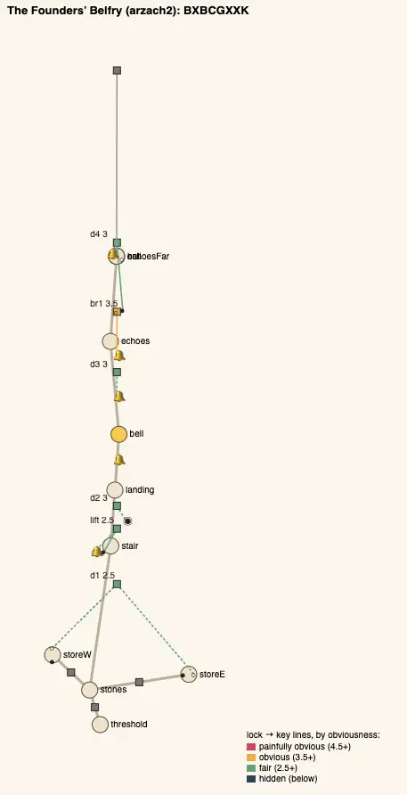
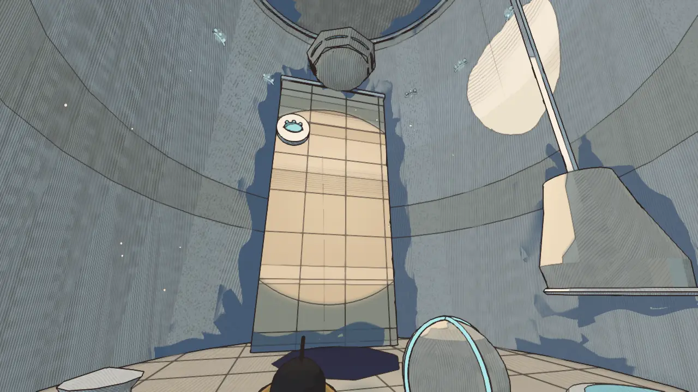
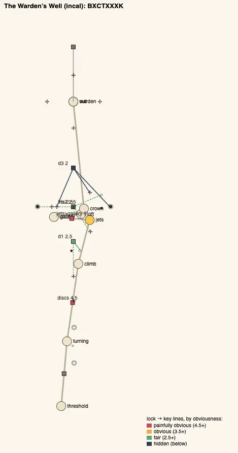
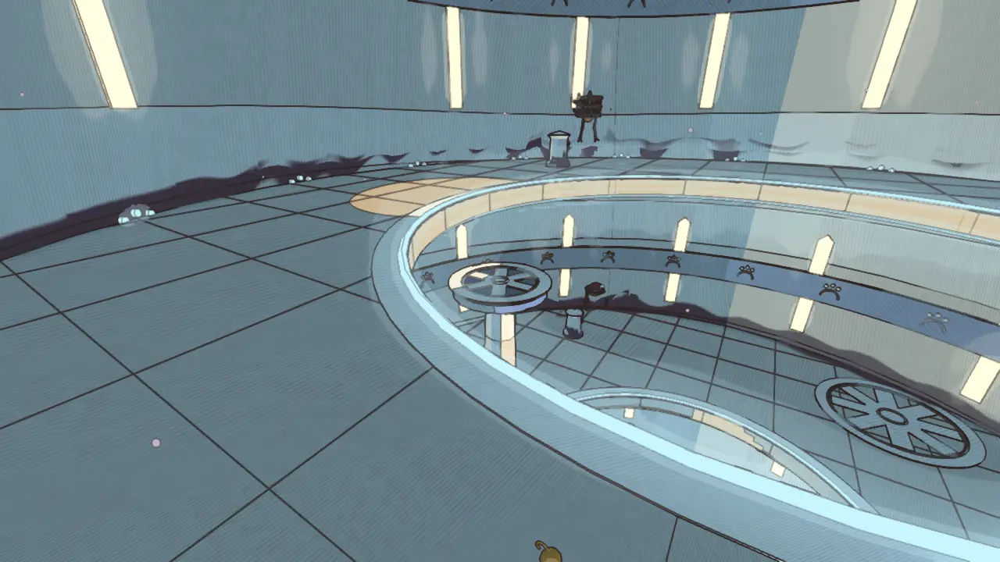
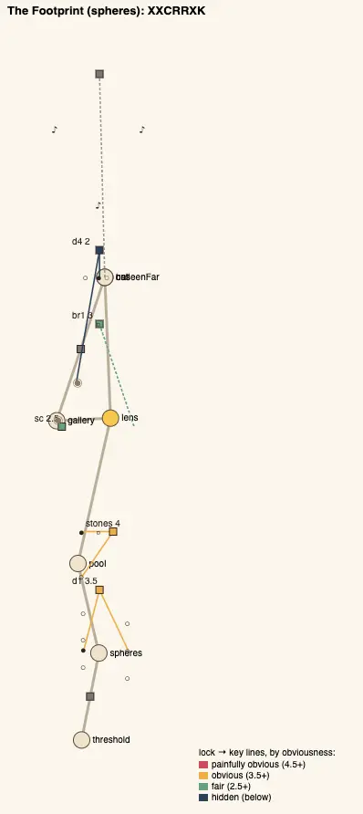
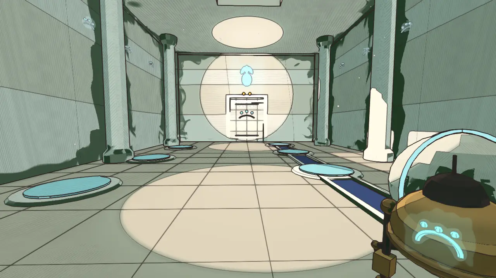
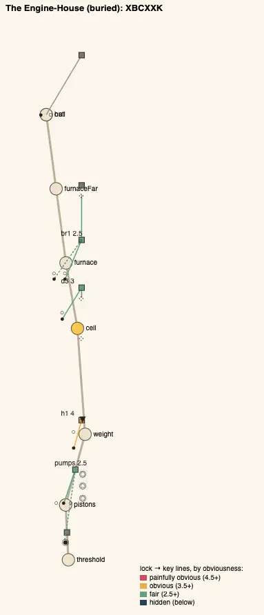

# Temple design audit, v1.27 (2026-10-10)

<!-- audit-scores
overall: 3.90 / 5
label: the average of the eleven temples' means (3.87 at v1.24)
date: 2026-10-10
-->

This report re-runs the `temple-design-qc` skill (`.claude/skills/temple-design-qc/SKILL.md`) after the batch that took on
the four rules the [v1.24 audit](temple-design-v1.24.md) left open: no gadget door beside the chest in seven temples, a key
from elsewhere in the Warden's Well, the shared opening (the discs of the Belfry, the Undertower and the Lamp-House), and the
Footprint's shape, 86 % the Lamp-House's. No temple was rebuilt round a new idea; each change is a room, a lock or a key.

**Setup.**
- Version 1.27, on top of `27baa057`, 2026-10-10 (the rework `f72c314e`; the pictures taken before the rebase, at `268fa72e` and `02994c2c`, the same rooms).
- `node scripts/temple-design/audit.mjs` for all eleven temples; four plans drawn by `node scripts/design-qc/capture.mjs`
  (one muted headless Chrome); the pictures of the changed rooms are the changelog's "after" shots
  (`scripts/changelog-shots.mjs`, High, 1280 × 720, hour 10; before at `268fa72e`).
- Every changed temple is played through on foot in `tests/temples.test.js` with a real `Player`, failures first: the
  Belfry's great stone falling up without you, and the landing's door shut when the eye under it was not splashed on the
  way up; the porch's bell deaf to the whistle from the chamber, the held door rising again; the Undertower's pit with no
  way over before the note, the wrong note at the passage's horn; the Lamp-House's pool with no way over before the orb;
  the Engine-House's still eyes out of one breath without the fourth chamber, the passage's pistons caught as they rise;
  the jaws snapping at plain fluid a room on; the Garage's six too slow without the coil, in the passage; the Footprint's
  sphere on the four-toed print, then you on a two-toed one; the Warden's Well's little vane splashed in the loft and
  stopped before the great one turned. The guardians' tests (`tests/guardian-twists.test.js`) pass unchanged.
- The audit learnt one thing (`scripts/temple-design/lib.mjs`, `tests/temple-design.test.js`): its line of sight is drawn
  for a lock, and the gates you came through to reach that lock's room stand open (`audit.mjs`: both rooms of their link
  reached no later than the lock's room). Before, the Warden's Well's second iris, shut at the start, hid the loft's vane
  from the crown it is seen from. No other temple's score moves with it. `logic.js` `solve` also tries a ball's stops with
  you standing on each plate (the Footprint's new opening wants both); every temple still solves the same way.
- Not checked: wall climbs, how readable a carved print or a horn's ring is from across a room, how the falling-up stone
  and the little vane's 15 s feel with a pad (TODO).

## Scores

1-5 per criterion; the mean is the temple's score. The ✎ notes are moves made by eye.

| Temple | Structure | Teach→test→twist | Combination | Non-obvious | Decoupling | Dungeon item | Guardian exam | Identity | Curve | **Mean** |
|---|---|---|---|---|---|---|---|---|---|---|
| Footprint (spheres) | 5 | 5 | 5 | 4 | 5 | 5 | 4 | 2 | 3 ✎4 | **4.33** |
| Givers' House (desert) | 5 | 5 | 5 | 4 | 4 | 5 | 4 | 2 ✎3 | 3 | **4.22** |
| Warden's Well (incal) | 2 | 5 | 5 | 4 | 5 | 5 | 4 | 3 | 5 | **4.22** |
| Founders' Belfry (arzach2) | 4 | 5 | 4 | 4 | 5 | 5 | 4 | 2 | 3 ✎4 | **4.11** |
| Engine-House (buried) | 2 | 5 | 5 | 4 | 5 | 4 | 4 | 3 | 4 | **4.00** |
| Undertower (bazaar) | 2 | 5 | 4 | 3 | 5 | 5 | 3 ✎4 | 2 | 5 | **3.89** |
| Builders' Greenhouse (edena) | 2 | 5 | 5 | 3 | 4 | 5 | 3 ✎4 | 3 | 3 | **3.78** |
| Aerie (arzach) | 3 | 5 | 4 | 3 | 4 | 4 | 4 | 3 | 4 | **3.78** |
| Hush-House (perdide) | 5 | 5 | 3 | 3 | 4 | 5 | 3 ✎4 | 3 | 2 | **3.78** |
| Lamp-House (perdide2) | 3 | 5 | 4 | 4 | 5 | 5 | 4 | 2 | 1 ✎2 | **3.78** |
| First Garage (garage) | 2 | 5 | 3 | 3 | 3 | 3 | 3 ✎4 | 2 | 2 | **3.00** |

✎ The moves of v1.15-v1.24 stand (the guardian exams of the Undertower, the Greenhouse, the Hush-House and the First Garage,
3 → 4; the Lamp-House's curve, 1 → 2; the Givers' House's identity, 2 → 3); the Footprint's non-obvious move is no longer
needed (the script gives it 4 now: its opening has decoys of its own). Two new moves, both the same reason:
- **The Belfry's and the Footprint's curve, 3 → 4.** Both openings got harder this round (the Belfry's founders' bell and
  great stone, complexity 3; the Footprint's sphere and your weight on the walker's prints, 2.5), so the first gadget step
  after them (the porch's held door, 1.5; the lens's stones, 2) reads as a fall. It is the teach after the item: a small
  dip inside a rise that principle 7 asks for, and both temples' last thirds still rise above their first (3.25 against
  2.75; 3.4 against 2.5). Before this round both scored 5 on a curve whose low start was an opening too easy.

**Average across temples: 3.90 / 5** (3.87 at v1.24, 3.49 at v1.19, 3.14 at v1.16, 2.80 at v1.12, 2.38 at v1.8, 1.84 at v1.5).

### The changed temples, before and after

The script's scores at `268fa72e` and now, with the standing moves; the seven temples whose only change is the chest's way
out score as before, give or take a decoy (the audit cannot see a room on: the passage is one room with the chest's in the
logic, below).

| Temple | Structure | Teach→test→twist | Combination | Non-obvious | Decoupling | Dungeon item | Guardian exam | Identity | Curve | **Mean** |
|---|---|---|---|---|---|---|---|---|---|---|
| Warden's Well (incal) | 2 | 5 | 5 | 3 → 4 | 4 → 5 | 5 | 4 | 3 | 4 → 5 | **3.89 → 4.22** |
| Founders' Belfry (arzach2) | 4 | 5 | 4 | 3 → 4 | 5 | 5 | 4 | 2 | 5 → 3 ✎4 | **4.11 → 4.11** |
| Footprint (spheres) | 5 | 5 | 4 → 5 | 3 ✎4 → 4 | 5 | 5 | 4 | 2 | 5 → 3 ✎4 | **4.33 → 4.33** |

Mean obviousness (5 is painfully obvious; the skill aims for 2.5-3.5): the Belfry 3.50 → 2.92, the Warden's Well 3.33 →
3.17, the Footprint 3.30 → 3.00, the Lamp-House 3.20 → 3.10, the Greenhouse 3.50 → 3.42, the Engine-House 3.13 → 3.00.
The first gadget lock in each of the seven: the Belfry's `d3` 4.5 → 3, the Lamp-House's `d2` 5 → 4.5, the Greenhouse's `d3`
5 → 4.5, the Engine-House's `d3` 3.5 → 3 (each now with a try beside the chest that is not its key); the Undertower's `d3`
stays 4 (its key moved from the Cable Well to the chest's room), the Hush-House's `d2` and the Garage's `d3` stay 5 and 4.5.
A teach should be plain: these are left plain on purpose.

## The four rules, across the eleven

✓ holds, ~ partly, ✗ not.

| Temple | A twist room after the gadget's test (the gadget + the pre-gadget verb, keys of two kinds) | One key out of its lock's room, in sight, reached from elsewhere | No gadget door beside the chest (its way out teaches where failure is cheap) | Its own opening (not "push the ball, ride the disc") |
|---|---|---|---|---|
| Givers' House | ✓ the far door: the long groove's ball (push) and the relay (ember) | ✓ the far door's bowl fed from the Hall of Channels; the keepers' door from the far side | ✓ the corridor's thorns, the gadget alone; its next use a room on | ✓ the pilot flame and a tar ball, twice |
| Footprint | ✓ the far door: the walker's plate (push + lens) and the eye (lens + shot) | ✓ the eye high on the near wall, seen from the far door across the chasm | ✓ no lock: the lens's first use is the mural, its next a room on | ✓ the sphere set down on the walker's print among two- and four-toed ones, you on the walker's print by the wall (new) |
| Founders' Belfry | ✓ the held stones and the ball (`br1`), the last door (`d4`) | ✓ `d1`'s balls in two stores, `d4`'s ball a room back | ✓ the Bell Chamber's way out is open; the held door is in the Bell Porch, under its own bell (new); the chamber's bell is a try (its stones) | ✓ the founders' bell struck by a ball, the great stone that falls up with you (new) |
| Engine-House | ✓ the Furnace (`br1`: two jams and the pistons' turn) | ✓ the gantry's ball, a room back, into the hammer's crank | ✓ the Fourth Chamber's way out is open (four still eyes, a try); the pistons' door in the Crank Passage (new) | ✓ the valve and a ball out of a crank |
| Undertower | ✓ the last door (`d4`: a ball and the echo shell) | ✓ `br1`'s high stone and `d4`'s ball, a room away | ✓ the Shell Chamber's way out is open (a low singing stone); the low-note door in the Listening Passage (new) | ✓ the singing ball's note carried by the dishes raises the pillars over the cable pit (new; the Cable Well's two discs come after) |
| Warden's Well | ✓ the loft (`iris2`: the push from the air) | ✓ the crown's little vane on a post in the loft, seen down through the second iris (new) | ✓ the jets' column by the chest: a traversal, a miss drops you back (left as it is) | ~ a vane, but it still drives riding discs |
| Builders' Greenhouse | ✓ the seed-ball and the glass's foot (`vine1`, `d4`) | ✓ `d2`'s eye and ball a room away | ✓ the Seed Chamber's way out is open (a seed in the sun, a try); the bud in the Bud Passage (new) | ✓ the eye in a ball's sunbeam |
| Aerie | ✓ the tailwind and the perch (`tail`, `rise`) | ✓ the raft's stone and the tailwind's, a room away | ✓ the column beside the chest: a traversal (left as it is) | ~ the stone pushed up the hall, then a raft |
| Hush-House | ✓ the pendulums stilled in turn (`d3`: stilling + order) | ✓ the lowest note at the door, a room back | ✓ the Stilling Chamber's way out is open; the jaws in the Snapping Passage (new) | ✓ the crystals sung low to high |
| Lamp-House | ✓ the pool-orb into the niche (`d4`: lantern + push) | ✓ the third pool up the roots, the orb from the pools' room | ✓ the Lantern Chamber's way out is open (a lamp, a try); the lamp-door in the Lamp Passage (new) | ✓ pools to light, then moss-stones the orb's lamp raises out of the dark pool (new) |
| First Garage | ✓ the clock's six in turn (`br1`: coil + order) | ✓ the counterweight rolled in from the escapement's landing | ✓ the Coil Chamber's way out is open; the bank of six in the Winding Passage (new) | ~ eyes in turn on the escapement's disc |

**Done in this batch:** every cell asked for. **Left** (not asked for here): the openings of the Warden's Well, the Aerie
and the First Garage, each its own first step and then a disc or a raft.

## Across the temples

| Temple | Skeleton | Most alike |
|---|---|---|
| arzach2 | `BXBCGXXK` (was `BBCGXXK`) | perdide2, 75 % (was garage, 86 %) |
| spheres | `XXCRRXK` (was `BXCRRXK`) | perdide2, 71 % (was perdide2, 86 %) |
| perdide2 | `BXCGRXK` (unchanged) | arzach2, 75 % (was spheres, 86 %) |
| garage | `BBCGXK` (unchanged) | arzach2, 75 % (was arzach2, 86 %) |
| the other seven | unchanged | at most 75 % |

**What changed:**

1. **No gadget door by any chest.** Seven temples had their first gadget lock in the chest's own room (4.5-5 obvious: key
   beside lock, nothing else to try). Now each chest room's way out is open, into a short room of its own (12-14 m), and
   the old door with its key stands at that room's far end. Five chest rooms got a try that locks nothing (the Bell
   Chamber's bell brings three stones down round the dais while it rings; the Fourth Chamber's four still eyes; the Seed
   Chamber's seed in the sun; the Lantern Chamber's lamp; the Shell Chamber's low stone, whose note the passage's door
   wants). In the logic each passage is part of the chest's room, as the Footprint's near ledge is: so the audit's letters
   (`C` then `G`) and its distances cannot see the room on, and the rule is checked here by the plan, not the numbers.
2. **No disc in any opening asked about.** The Belfry teaches its idea before the whistle, with the house's own bell, as
   the Givers' House does with its flame: a ball rolled into the founders' bell's mouth strikes it, the great stone comes
   down while it rings and falls up when it falls quiet (its catch: be on it). The Undertower's note, carried by the
   dishes, raises pillars, the gallery's way later. The Lamp-House's orb wakes moss-stones, the gallery's own later.
   Pushes and rides were 7-9 openings of 11 at v1.19; now the riding disc opens none of the Belfry, the Undertower, the
   Lamp-House, the Footprint, the Givers' House, the Engine-House, the Greenhouse or the Hush-House.
3. **Every temple has a key from elsewhere** (11 of 11): the Warden's Well's little vane stands in the loft and is seen
   from the crown (the audit had it out of sight behind the second iris shut at the start: see the setup).
4. **The most alike pair is 75 %** (86 % at v1.24): the Footprint now opens with a combination of its own (the push and
   your weight, among decoys), and the Belfry's new step separates it from the First Garage.

## Per temple

### The Founders' Belfry (arzach2), 4.11 → 4.11

- **Steps:** `d1` push (2.5); `lift` the ball struck into the founders' bell (bell + push + held, 2.5); `d2` the eye under
  the landing, splashed on the way up (3); `d3` the porch's held door (the whistle alone, held, 3: the teach, a room on);
  `br1` the held stones and the ball (3.5); `d4` the ball and the far bell (3).
- **The gadget's arc:** taught at `d3` in the porch (after a try in the chamber), tested and twisted at `br1`, examined by the
  Cloud-Mother. Its idea taught twice before it: the great stone, and the held door.
- **Still weak:** identity 2 (`BXBCGXXK` is 75 % the Lamp-House's); the great stone's timing with a pad.

### The Warden's Well (incal), 3.89 → 4.22

- **The change:** the crown's eye still wants two vanes at once, the great one in the crown's floor and the little one; the
  little one now stands on a post in the loft below, under the second iris's rim, seen from the high door (`d3` 3 → 2: a
  room away, over 20 m, the jets and a splash, a timing). Splash it in the loft (or down through the iris), fly up and
  hover over the great one before it slows: 15 s now (12 when it hung on the crown's wall, a few metres from the great one).
- **Still weak:** structure 2 (a chain: no loop, no hub); its opening still rides discs.

### The Footprint (spheres), 4.33 → 4.33

- **The change:** the Hall of Spheres opens with the temple's idea before the lens: one sphere whose groove passes carved
  prints of two, three and four toes (`stops`), three prints by the east wall, and the door wants the sphere on the
  walker's and you on the walker's (push + weight, two decoys, 3.5). The clue is the Footprint you walked into, and the
  print carved over the door.
- **Still weak:** identity 2 (71 % the Lamp-House's, from 86 %).

### The seven chests' ways out

| Temple | The chest room | The passage (its door, the old one) |
|---|---|---|
| Founders' Belfry | the Bell Chamber: its oculus bell brings three stones down round the dais while it rings | the Bell Porch: the held door under the porch's bell (the bell does not hear a whistle from the chamber) |
| Engine-House | the Fourth Chamber: four still eyes either side of the way on, one breath | the Crank Passage: four eyes on pistons round the door, the crank and its ball by the west wall |
| Undertower | the Shell Chamber: a low singing stone by the dais | the Listening Passage: the low-note horn by the door, nothing to sing in the passage |
| Builders' Greenhouse | the Seed Chamber: a seed in the oculus's sun | the Bud Passage: the bud in a sunbeam through the passage's roof |
| Hush-House | the Stilling Chamber | the Snapping Passage: the gate of jaws |
| Lamp-House | the Lantern Chamber: a lamp by the dais | the Lamp Passage: the lamp beside the door, off the way to it (you go and stand by it) |
| First Garage | the Coil Chamber | the Winding Passage: the bank of six round the door |

## Ranked edits, what is left

**The First Garage, 3.00**
1. **Its own opening and shape** (`BBCGXK`): the escapement's eyes in turn combined with the counterweight's ball, its disc
   gone. Expected: identity +1, combination +1.

**The Warden's Well, 4.22**
1. **A shortcut back** (structure 2): a keeper's stair from the crown down to the gallery, opened from above. Expected:
   structure +1.5.

**The Engine-House, 4.00**
1. **A shortcut back:** a keeper's stair from the Fourth Chamber down to the Piston Hall, opened from above. Expected:
   structure +1.5.

**The Aerie, 3.78**
1. **Its own opening:** the Hall of Winds without the raft after it (the Wind Well's column alone). Expected: identity +0.5.

## What was not done

- **The pad pass** (TODO): the great stone's 12 s and its fall up with you, the little vane's 15 s from the loft to the
  crown, the carved prints read from the hall's door.

## Against the last report

- Average 3.87 → 3.90. The Warden's Well 3.89 → 4.22; no temple fell.
- The four rules: 41 of 44 cells ✓ (27 at v1.24); the only ~ left are three openings that still ride a disc or a raft
  after their own first step (the Warden's Well, the Aerie, the First Garage).
- Chest rooms with a gadget door: 7 → 0. Chest rooms with a try that locks nothing: 0 → 5.
- Openings that ride a disc or a raft: 6 → 3.
- Temples with a key out of its lock's room, in sight, reached from elsewhere: 10 → 11.
- Most alike pair: 86 % → 75 %.
