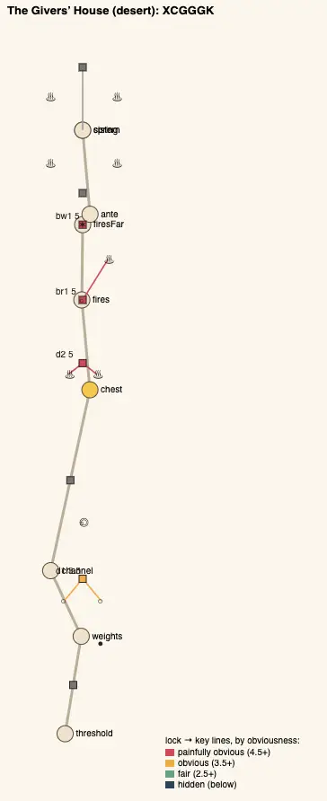
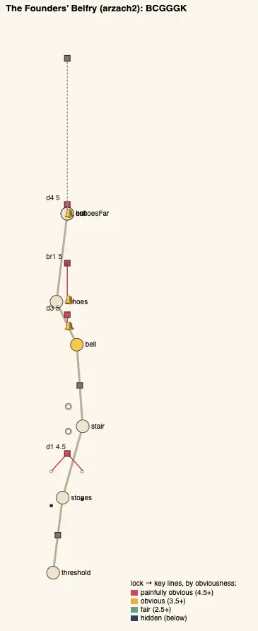
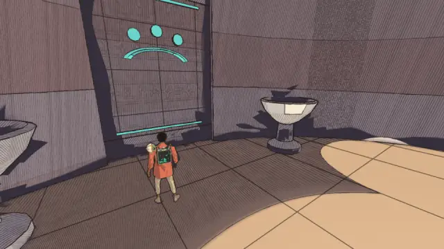
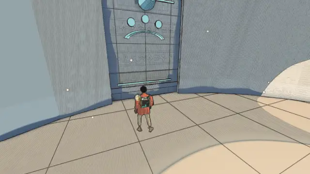
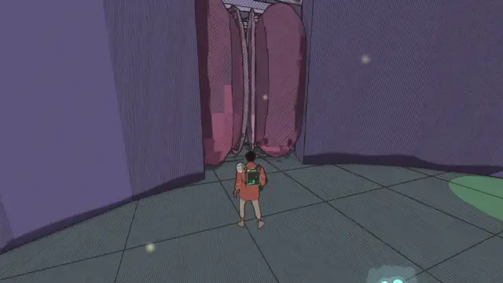
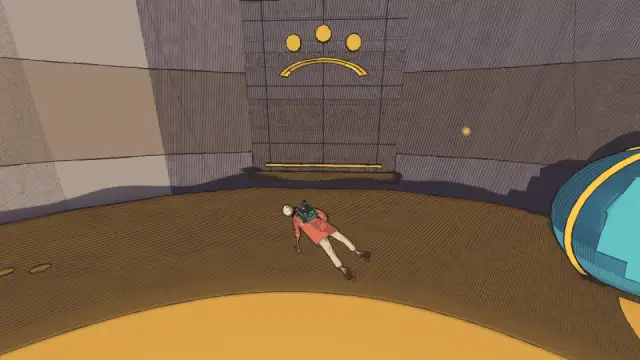

# Temple design audit, v1.5 (2026-10-09)

<!-- audit-scores
overall: 1.84 / 5
label: the average of the eleven temples' means
date: 2026-10-09
-->

This audit tests the author's note that "the temples so far seem very simplistic, with puzzles that are almost
painfully obvious." It applies the `temple-design-qc` skill (`.claude/skills/temple-design-qc/SKILL.md`, which
holds the principles, their sources and the rubric) to all eleven temples.

**Setup.**
- Version 1.5, run from `origin/main` on 2026-10-09.
- `node scripts/temple-design/audit.mjs` builds each temple's rooms in node, records every piece, and measures
  the puzzle graph.
- `node scripts/design-qc/capture.mjs` took pictures of each temple's two most obvious steps in one muted
  headless Chrome (High, 960×540), with a 15 s rest between worlds.
- Not checked: wall climbs (they are not in the data), how readable the lamps and glyphs are, and the guardian
  fights beyond their definitions. The fights belong to the **Combat telegraphs** batch in `TODO.md`, which
  replaces ground-drawn telegraphs with body tells and enriches the guardians. This audit does not repeat that
  work.

**The verdict.** The author is right, and the numbers show why. All eleven temples share one plan:
- a threshold;
- a pre-gadget room (push a ball onto a plate, or splash an eye);
- a disc ride or a climb;
- the chest;
- a door opened by the gadget, right beside the chest;
- a chasm crossed with the gadget;
- a second gadget door;
- the guardian.

Every one is a straight chain, with no loops and no hubs. Every key sits in its lock's own room and in plain
sight. No step anywhere combines the gadget with an older verb. Mean obviousness is 4.25–5 out of 5, where 5
means painfully obvious.

## Scores

1-5 per criterion; the mean is the temple's score. The ✎ notes are moves made by eye.

| Temple | Structure | Teach→test→twist | Combination | Non-obvious | Decoupling | Dungeon item | Guardian exam | Identity | Curve | **Mean** |
|---|---|---|---|---|---|---|---|---|---|---|
| Founders' Belfry (arzach2) | 1 | 3 | 1 | 1 | 1 | 2 | 2 | 1 | 1 | **1.44** |
| Hush-House (perdide) | 1 | 3 | 1 | 1 | 1 | 3 | 2 | 2 | 1 | **1.67** |
| Lamp-House (perdide2) | 1 | 3 | 1 | 1 | 1 | 3 | 2 | 2 | 1 | **1.67** |
| Undertower (bazaar) | 1 | 3 | 1 | 1 | 3 | 2 | 2 | 1 | 1 | **1.67** |
| First Garage (garage) | 1 | 3 | 1 | 1 | 1 | 2 | 2 | 1 | 4 | **1.78** |
| Builders' Greenhouse (edena) | 1 | 3 | 3 | 1 | 1 | 3 | 2 | 2 | 1 | **1.89** |
| Aerie (arzach) | 1 | 3 | 1 | 1 | 1 | 3 | 2 | 2 | 4 ✎3 | **2.00 → 1.89** |
| Givers' House (desert) | 1 | 3 | 3 | 1 | 1 | 3 | 4 | 2 | 1 | **2.11** |
| Warden's Well (incal) | 1 | 3 | 1 | 1 | 1 | 3 | 3 | 2 | 4 ✎3 | **2.11 → 2.00** |
| Engine-House (buried) | 1 | 3 | 1 | 2 | 3 | 2 | 2 | 1 | 4 ✎3 | **2.11 → 2.00** |
| Footprint (spheres) | 1 | 3 | 1 | 1 | 1 | 4 | 3 | 2 | 3 | **2.11** |

✎ **The curve, three temples.** The script scores a rise in complexity from 1.25 to 1.5–2. That is not a real
difficulty curve: the last step is a slightly longer version of the first.

**Average across temples: 1.84 / 5.**

## Across the temples

 

*Above: the plans of the Givers' House and the Founders' Belfry. Each is one line of rooms. Every red line, from
a lock to its key, is short and solid, which means the key is close and in sight.*

The skeletons use one letter per step: **B** base verbs, **C** the chest's room, **G** the gadget alone, **X** two
verbs combined, **R** a reveal, **T** a traversal the gadget makes, **K** the guardian.

| Temple | Skeleton | Most alike |
|---|---|---|
| desert | `XCGGGK` | edena, 86 % |
| arzach | `BCTGK` | perdide, incal, 83 % |
| arzach2 | `BCGGGK` | **bazaar, 100 %** |
| perdide | `BCGTGK` | arzach, 83 % |
| perdide2 | `BCGRRK` | spheres, 71 % |
| edena | `XCGGGGK` | desert, 86 % |
| incal | `BBCTGK` | arzach, 83 % |
| garage | `BBCGGK` | **buried, 100 %** |
| buried | `BBCGGK` | **garage, 100 %** |
| spheres | `BBCRRRK` | perdide2, 71 % |
| bazaar | `BCGGGK` | **arzach2, 100 %** |

What repeats:

1. **Every temple is a straight chain.** Each has 0 loops, 0 hubs, 0 keys fetched from another room and 0 states
   that can change back. Each room has exactly one lock, and its key is in the same room. By Boss Keys' measure,
   all eleven are "follow the path"; none asks you to "find the path".
2. **Every key sits beside its lock and in sight.** That is 43 of 45 steps. The exceptions:
   - the Engine-House's valve eye, 23 m away and out of sight of the pistons;
   - the Undertower's middle stone, which is across the chasm from its door.

   Bates' proximity dial is turned all the way down in every temple.
3. **Each gadget is taught, tested, then never twisted.** In every temple the gadget's first use is the door right
   beside the chest: a lock that reads "use the thing you just picked up". Its second use is the same verb on a
   bridge. The gadget is never used with an older verb (0 of 11 temples), never in a new state, and never as a
   surprise that still follows the rules.
4. **The chest comes early** (20–50 % of the steps). It is followed by two or three locks that only repeat it, so
   the "test" and the "twist" collapse into "again".
5. **Every guardian uses the gadget**, which is good, but in the plain way the doors taught. Each has two phases
   and three attacks telegraphed on the floor (see the Combat telegraphs batch).
6. **The first room is nearly always the same:**
   - push a ball onto a plate in 7 temples;
   - splash an eye in 4;
   - then ride a disc in 9.

   Only the Hush-House's choir (a sequence) and the Greenhouse's potting hall (a push plus a shot) ask for any
   thinking before the chest.

*The Givers' House, the Chest Chamber (`d2`, obviousness 5). You take the ember from the chest. The way on is a
door with a cold brazier on each side, 5 m away. There is nothing else in the room to try.*

*The Founders' Belfry, the bell door (`d3`, obviousness 5). Its ear is 3.7 m from the door, in the chest's own
room. The next two locks are the same ear twice more.*

## Per temple

Steps are listed as `lock: verbs (obviousness)`. A key's distance is in metres; *in sight* means visible from
where you stand to face the lock.

### The Givers' House (desert), 2.11

- **Steps:**
  - `d1` weight + push (3.5): a plate to stand on, and a ball to roll onto the other plate;
  - `d2` ember (5): braziers 5 m from the door, in sight;
  - `br1` ember (5): a brazier across the chasm, lit from this side, 14 m away;
  - `bw1` ember (5): the thorns over the doorway, lit directly.
- **Curve:** complexity falls from 2.5 to 1, so the hardest step is the first.
- **Guardian:** the best exam of the eleven. Lighting the four rim braziers (`b6`–`b9`) calms it, then water
  goes into its mouth. That still repeats the doors, though.

### The Aerie (arzach), 1.89

- **Steps:**
  - `d1` shot (5): an eye by the far door, at the end of the gusts;
  - the Gulf, wings (5);
  - `d3` wings (5): an updraft lifts you to an eye.
- The gusts and the updraft are good traversal, but every puzzle is "splash the eye you can see".

### The Founders' Belfry (arzach2), 1.44: the weakest

- **Steps:**
  - `d1` push (4.5): two balls in two grooves;
  - then three bell ears, `e1` (5), `e2` (5) and `e3` (5), at 3.7, 12 and 3 m from their locks.
- The same "sound the bell by the thing" three times in a row, with nothing else in between.
- Its skeleton is identical to the Undertower's.

### The Hush-House (perdide), 1.67

- **Steps:**
  - `d1` sequence (4): four crystals sung from low to high. This is the only order puzzle in the game, and it
    shows the order by the crystals' heights;
  - `d2` stilling (5): the jaws are the door;
  - the pendulums, stilling (5);
  - `d3` stilling (5).
- **Curve:** the first room is the hardest (complexity 3, then 1–1.25).

*The Hush-House, `d2`: the gate of jaws is itself the switch. You pick up the stilling glob, and the jaws snap in
front of you.*

### The Lamp-House (perdide2), 1.67

- **Steps:**
  - `d1` three pool-lamps (4.5);
  - `d2` a lamp that wakes beside you with the lantern (5);
  - `br1` the moss bridge, which the lantern reveals (4.5);
  - `d4` an eye plus a lamp (4.5).
- The lantern only ever means "stand here with it". It is never used as light to aim, carry or reflect.

### The Builders' Greenhouse (edena), 1.89

- **Steps:**
  - `d1` push + shot (3.0, the best pre-gadget room in the game);
  - then four bloom steps, `bud1`, `seed1`, `seed2` and `bud2`, all scoring 5.
- The vine on the glass (`vine2`) has the makings of a twist, since the glass blocks climbing until bloom fixes
  it. But the seed sits at the foot of the glass, 7 m away, in sight.

### The Warden's Well (incal), 2.00

- **Steps:**
  - `discs` shot (5);
  - `d1` push (4.5);
  - the oculus, jets (5);
  - `d3` jets (4.5): three eyes hidden over shelves, 28–32 m away.
- This is the one gadget step that asks you to look round a room. The Warden does ask for the jets and the shot.

### The First Garage (garage), 1.78

- **Steps:**
  - `discs` shot (5);
  - `d2` push (4.5): the ball 4 m from its door;
  - `d3` coil volley (4.5);
  - `br1` coil volley (4.0).
- The coil is a capacity, not a verb, so "use it" just means shooting six eyes quickly. Its shape is identical to
  the Engine-House's.

### The Engine-House (buried), 2.00

- **Steps:**
  - `pumps` shot (3.5): the valve eye, 23 m away and out of sight. This is the only key in the game that is both
    far and hidden;
  - `d2` push (4.5);
  - `d3` volley (4.5);
  - `br1` volley (4.5).
- A copy of the First Garage's shape, with four eyes instead of six.

### The Footprint (spheres), 2.11

- **Steps:**
  - `d1` push (4.5);
  - `disc` shot (5);
  - `d2` lens (4.5);
  - `br1` lens (4.5);
  - `d4` lens + eye (4.5).
- The lens is used three times, the most of any gadget, but always the same way: "look, and it's there". There is
  never a lens trick, such as a false bridge or a clue that only the lens shows somewhere else.

### The Undertower (bazaar), 1.67

- **Steps:**
  - `disc` push (4.5);
  - `d3` echo (5);
  - `br1` echo (5);
  - `d4` echo (3.5): the middle stone is on the far side, 35 m away and out of sight.
- The one-note-at-a-time rule is the game's best puzzle idea, but it only bites once.
- Its skeleton is identical to the Belfry's.

## Ranked edits

The edits are ordered worst first, by score gain × how many players meet the temple, divided by cost. Each names
`LOGIC` ids. The expected changes are rubric points. Every edit keeps `tests/temples.test.js` passing: each temple
is solved, its gadget is mid-way, and the gadget is needed for every later room.

### For every temple: the five edits that move all eleven

1. **Add one twist room after the gadget's test:** the gadget plus the temple's pre-gadget verb, in one lock whose
   keys are elements of two kinds.
   - Expected: combination 1→3, teach→test→twist 3→4, non-obvious −0.5 obviousness.
   - +0.4 on the mean, in every temple.
2. **Move one key per temple out of its lock's room.** The key stays in sight from the lock, through a grille or
   across a void, but is reached from elsewhere: from an earlier room by a shortcut that opens from the far side,
   or from a disc mid-ride.
   - Expected: decoupling 1→3, structure 1→2.
3. **Drop the "gadget door beside the chest".** The chest room's way out should be a step that teaches the gadget
   somewhere failure is cheap, not a door with the answer painted on either side. Then put the gadget's next use
   at least a room later (Level Design Book: leave room between test and twist).
   - Expected: non-obvious +1.
4. **Break the shared opening.** No two temples should open with "push the ball, ride the disc". Give each temple's
   first room its world's own idea; the Hush-House's choir and the Greenhouse's potting hall are the models.
   - Expected: identity 1–2 → 3–4.
5. **The guardian's last phase asks for the twist.** It uses the gadget the way the twist room did, plus an older
   verb. Its tells are on the body (TODO "Combat telegraphs").
   - Expected: guardian exam 2→3–4.

### Per temple, worst first

**The Founders' Belfry (arzach2), 1.44 → about 3**
1. **Hall of Echoes:** the bell brings the hanging stones of `br1` down only while it rings (about 8 s), and they
   rise again. A stone ball (`ball3`, new) must be pushed across mid-ring to a plate on the far side that holds
   them down (`br1.opens: { drumOn: ['ball3', 'p3'] }` after `e2`). This is bell + push with a catch.
   - Expected: combination +2, twist +1, non-obvious +1.
2. **Hub:** make the Stone Stair a hub with the two balls of `d1` in two side rooms, one each. The order is the
   player's.
   - Expected: structure +2; identity +2, which breaks the 100 % match with the Undertower.
3. **Move `e3`'s ear** onto the Stone Stair's top ledge, seen from `echoesFar` through a window and rung from a disc
   as it passes (BellEar `reach`).
   - Expected: decoupling +2.
4. **The Cloud-Mother:** a phase where a bell brings a stone down where she will dive.
   - Expected: guardian +1.

**The Hush-House (perdide), 1.67 → about 3**
1. **Pendulum Gallery:** a stilled pendulum (Swing) is a step. Still one at the top of its arc to reach a ledge
   holding `j2`'s eye, on the other side of the gap. This is stilling + traversal, and the stilling becomes a tool
   rather than a door key.
   - Expected: combination +2, twist +1.
2. **Choir:** the crystals' heights no longer give the order. The low-to-high order is given by their *pitches*,
   which the Mother sings in the Threshold, so the clue is a room away (`c1`–`c4` placed out of height order).
   - Expected: decoupling +2, non-obvious +1.
3. **`d2`:** still the jaws from the Bog Well's disc as it rides past the gate's window, not standing in front of
   it.
   - Expected: non-obvious +0.5.

**The Lamp-House (perdide2), 1.67 → about 3**
1. **Dark Gallery:** the moss-stones show only within the lantern's light radius. Push a glowing pool-ball (new
   Ball with a light) ahead of you to see the far half of `br1`, so lantern + push are needed to cross.
   - Expected: combination +2, twist +1.
2. **Pools:** move `s3` behind the Root Stair's root wall, seen from the Hall of Dark Pools through roots. A
   shortcut back opens once the lantern is had.
   - Expected: decoupling +2, structure +1.
3. **The Lampless:** lure it to pool-lamps you lit before (the shot) as well as the lantern.
   - Expected: guardian +1.

**The Undertower (bazaar), 1.67 → about 3**
1. **Make the one-held-note rule bite twice.** `br1` (the high note) stays up only while the shell holds the high
   note (not latched). The far door wants the middle note, whose stone is on the near side. You must cross, come
   back for the middle note, and find the bridge gone: that is the catch. A second high stone on the far side is
   the revelation.
   - Expected: structure +1 (a reversible state), non-obvious +1.5, twist +1.
2. **Teach the stones before the shell:** in the Hall of Dishes, a stone sung beside its ear wakes it with no shell
   needed. The shell then becomes "carry a note", which is the twist.
   - Expected: teach→test→twist +1, identity +2.
3. **The First Sign:** the stone singing its word rides a disc round the hall.
   - Expected: guardian +1.

**The First Garage (garage), 1.78 → about 3**
1. **Clock Gallery:** the six eyes of `k2` must be hit *in the clock's order from the hour it stopped*. The clue is
   the stopped clock over the outside door, so it lies outside the temple. Volley + sequence, with the clue far
   from the lock.
   - Expected: decoupling +2, non-obvious +1.5, combination +2.
2. **Winding Well:** the ball's plate is on the escapement's swinging disc. Push the ball twice inside one breath
   (the coil's fast refill) to land it as the disc passes.
   - Expected: twist +1; identity +2, which breaks the match with the Engine-House.

**The Builders' Greenhouse (edena), 1.89 → about 3**
1. **Vine Gulf:** `seed1` sits on the *far* side of the chasm. Bloom a vine up the near wall to see it, then arc the
   glob over. Bloom + shot at range.
   - Expected: non-obvious +1, decoupling +1.
2. **Glass:** `seed2` is a seed-ball. Roll it (push) into the oculus's light at the glass's foot before bloom takes.
   - Expected: combination +2, twist +1.
3. **The Gardener:** its kneeling back can only be reached by a vine you grow during the fight.
   - Expected: guardian +1.

**The Aerie (arzach), 1.89 → about 3**
1. **Hall of Winds:** `s1`'s eye sits behind a screen. The gusts carry the shot sideways, so aim upwind between
   gusts (shot + gust, a catch).
   - Expected: combination +2, non-obvious +1.
2. **Wind Well:** the updraft blows only when a ball is pushed into its vent (push + wings), and the ball's groove
   is up a ledge you glide to.
   - Expected: twist +1, decoupling +1.

**The Warden's Well (incal), 2.00 → about 3**
1. **Lamp Gallery:** a gust (the Aerie's piece) blows down the gallery. Reach `s2`–`s4` by jetting from screen to
   screen against it (jets + gust).
   - Expected: combination +2, twist +1.
2. **Turning Floors:** `s1` sits under the discs' path and can only be seen and shot mid-ride. Only an empty disc
   moves until then.
   - Expected: decoupling +1, non-obvious +1.

**The Engine-House (buried), 2.00 → about 3**
1. **Furnace:** `k2`'s four eyes stand on pistons that rise in turn. Hitting all four in one breath means timing
   the pistons (volley + the Piston Hall's rhythm).
   - Expected: combination +2, identity +2.
2. **Counterweight:** `p1` rises only while the valve `s1` (Piston Hall) is open, and closes after 20 s, so the
   push must come in time.
   - Expected: structure +1 (reversible), non-obvious +0.5.

**The Footprint (spheres), 2.11 → about 3**
1. **Hall of the Unseen:** the lens shows the bridge *and* false stones. Only the stones carrying the Lens
   Chamber's mural glyph hold. The clue is a room back.
   - Expected: non-obvious +1.5, decoupling +2.
2. **A lens groove:** a sphere's groove that only the lens shows. Roll a sphere along it to a plate (lens + push).
   - Expected: combination +2, twist +1.

**The Givers' House (desert), 2.11 → about 3.2**
1. **Hall of Fires:** `b3` is out of reach and out of sight. Light a tar ball (new: ember on a Ball) and push it
   across the bridge stub so it rolls burning into `b3` (ember + push).
   - Expected: combination +1, twist +1, non-obvious +1.
2. **Chest Chamber:** move `b2` up onto the Dry Channel's gallery, seen through a slot from the chest room, and
   reached by a shortcut ledge. The door then has one brazier beside it and one a room back.
   - Expected: decoupling +2.
3. **Cistern:** one rim brazier (`b9`) can only be reached from the Keeper's own back when it lowers its head
   (fight + ember).
   - Expected: guardian +0.5.

## What was not checked, and what to do next

- Play one rebuilt temple through before trusting its scores. Obviousness counts distance, sight and verbs; it
  cannot judge how readable a lamp or a glyph is.
- After each edit batch, re-run `node scripts/temple-design/audit.mjs` and compare with this report.
- The guardians' fights: TODO "Combat telegraphs".
