# Temple design audit, v1.8 (2026-10-09)

<!-- audit-scores
overall: 2.38 / 5
label: the average of the eleven temples' means
date: 2026-10-09
-->

This report re-runs the `temple-design-qc` skill (`.claude/skills/temple-design-qc/SKILL.md`) after the first
batch of edits from the [v1.5 audit](temple-design-v1.5.md): its three worst temples, reworked worst first. The
Founders' Belfry (1.56 measured, 1.44 in the v1.5 table), the Hush-House (1.67) and the Lamp-House (1.67) now
score 4.00, 3.44 and 3.11. The other eight temples were not changed; they are measured again so the table can
be read against v1.5.

**Setup.**
- Version 1.8, the reworked temples on top of `origin/main` (`2537a78d`), 2026-10-09.
- `node scripts/temple-design/audit.mjs` for all eleven temples, then the plans drawn by
  `node scripts/design-qc/capture.mjs` (one muted headless Chrome, no server). The pictures of the new rooms are
  the changelog's "after" shots (`scripts/changelog-shots.mjs`, High, 1280 × 720, hour 10).
- Each reworked temple is also played through on foot in `tests/temples.test.js`, with a real `Player` in the
  real geometry: the catches included (the ball stopped at the lip and dropped when the stones rise, the
  pendulums stilled out of turn, the orb rolled in dark).
- The audit script itself learnt three things, so the numbers can see the new rooms: a held bell (`hold`) counts
  as a timing and as a state that changes back; a sequence of gadget switches is a sequence; a ball's plate is
  part of its key, not something else to try in the room. None of these moves an unchanged temple's score.
- Not checked: wall climbs (not in the data), how readable a lamp or a glyph is, and the guardians' fights,
  which were not touched (another batch is reworking the foes; see "What was not done").

## Scores

1-5 per criterion; the mean is the temple's score. The ✎ notes are moves made by eye.

| Temple | Structure | Teach→test→twist | Combination | Non-obvious | Decoupling | Dungeon item | Guardian exam | Identity | Curve | **Mean** |
|---|---|---|---|---|---|---|---|---|---|---|
| Founders' Belfry (arzach2) | 4 | 5 | 4 | 3 | 5 | 5 | 4 ✎3 | 2 | 5 | **4.11 → 4.00** |
| Hush-House (perdide) | 2 | 5 | 3 | 3 | 5 | 5 | 3 | 2 | 3 | **3.44** |
| Lamp-House (perdide2) | 2 | 5 | 3 | 3 | 3 | 4 | 3 | 2 | 3 | **3.11** |
| Undertower (bazaar) | 1 | 3 | 1 | 1 | 3 | 2 | 2 | 2 | 1 | **1.78** |
| First Garage (garage) | 1 | 3 | 1 | 1 | 1 | 2 | 2 | 1 | 4 | **1.78** |
| Builders' Greenhouse (edena) | 1 | 3 | 3 | 1 | 1 | 3 | 2 | 2 | 1 | **1.89** |
| Aerie (arzach) | 1 | 3 | 1 | 1 | 1 | 3 | 2 | 2 | 4 ✎3 | **2.00 → 1.89** |
| Givers' House (desert) | 1 | 3 | 3 | 1 | 1 | 3 | 4 | 2 | 1 | **2.11** |
| Warden's Well (incal) | 1 | 3 | 1 | 1 | 1 | 3 | 3 | 2 | 4 ✎3 | **2.11 → 2.00** |
| Engine-House (buried) | 1 | 3 | 1 | 2 | 3 | 2 | 2 | 1 | 4 ✎3 | **2.11 → 2.00** |
| Footprint (spheres) | 1 | 3 | 1 | 1 | 1 | 4 | 3 | 3 | 3 | **2.22** |

✎ **The Belfry's guardian, 4 → 3.** The script gives half a point when the temple has a twist and its guardian
asks for the gadget. The Cloud-Mother's fight is unchanged: she still asks for the bell as the doors taught it,
not for the held note or the ball. ✎ **The curve, three temples:** the same moves as in v1.5 (a slightly longer
last step is not a difficulty curve).

The Undertower (1.67 → 1.78) and the Footprint (2.11 → 2.22) gain a point of identity without being touched:
their skeletons were the Belfry's and the Lamp-House's, which have changed.

**Average across temples: 2.38 / 5** (1.84 in v1.5).

### The three reworked temples, before and after

| Temple | Structure | Teach→test→twist | Combination | Non-obvious | Decoupling | Dungeon item | Guardian exam | Identity | Curve | **Mean** |
|---|---|---|---|---|---|---|---|---|---|---|
| Founders' Belfry (arzach2) | 1 → 4 | 3 → 5 | 1 → 4 | 1 → 3 | 1 → 5 | 2 → 5 | 2 → 3 | 1 → 2 | 1 → 5 | **1.44 → 4.00** |
| Hush-House (perdide) | 1 → 2 | 3 → 5 | 1 → 3 | 1 → 3 | 1 → 5 | 3 → 5 | 2 → 3 | 2 → 2 | 1 → 3 | **1.67 → 3.44** |
| Lamp-House (perdide2) | 1 → 2 | 3 → 5 | 1 → 3 | 1 → 3 | 1 → 3 | 3 → 4 | 2 → 3 | 2 → 2 | 1 → 3 | **1.67 → 3.11** |

Mean obviousness: the Belfry 4.88 → 3.50, the Hush-House 4.75 → 3.60, the Lamp-House 4.63 → 3.88 (5 is painfully
obvious; the skill aims for 2.5-3.5). No step is at 1.5 or under, so none is flagged as obscure.

## Across the temples

| Temple | Skeleton | Most alike |
|---|---|---|
| arzach2 | `BBCGXXK` (was `BCGGGK`) | perdide, 86 % |
| perdide | `BBCGTXK` (was `BCGTGK`) | arzach2, 86 % |
| perdide2 | `BCGRXK` (was `BCGRRK`) | arzach2, 71 % |
| bazaar | `BCGGGK` | desert, 83 % |
| garage | `BBCGGK` | **buried, 100 %** |
| buried | `BBCGGK` | **garage, 100 %** |

What changed:

1. **Each reworked temple has one idea that runs from its first room to its last**, taught before the chest with
   an old verb or cheaply with the gadget, then twisted with the old verb. The Belfry: a founders' bell holds
   things only while it rings, a stone's weight holds them for good. The Hush-House: the makers sang from low to
   high. The Lamp-House: light wakes what waits for it, and light can be carried.
2. **Every one now has a step that combines the gadget with an older verb** (the bell and the push, the stilling
   and the order, the lantern and the push). In v1.5 none of the eleven had one.
3. **Keys left their locks' rooms.** Five keys in the three temples are now a room away or out of sight: the
   Belfry's balls in the stone stores and its eye under the landing; the Hush-House's first crystal in the
   Threshold, its root-wall eye seen only from the disc, its pendulums behind the far door; the Lamp-House's third
   pool on a loft hidden by its edge.
4. **The Belfry has a hub and two states that change back** (the held door, the held stones), and a catch with
   its revelation (the ball stops at the lip, or drops when the stones rise; ring, then roll it at once).

What still repeats: the three reworked temples now look alike *to the script* (86 %), because each runs
pre-gadget lock, pre-gadget lock, chest, gadget, then combinations. Their rooms are different (a hub, a choir, a
loft), but their openings still lean on a ball or an eye and a riding disc. The First Garage and the Engine-House
are still one shape.

## Per temple

### The Founders' Belfry (arzach2), 1.44 → 4.00

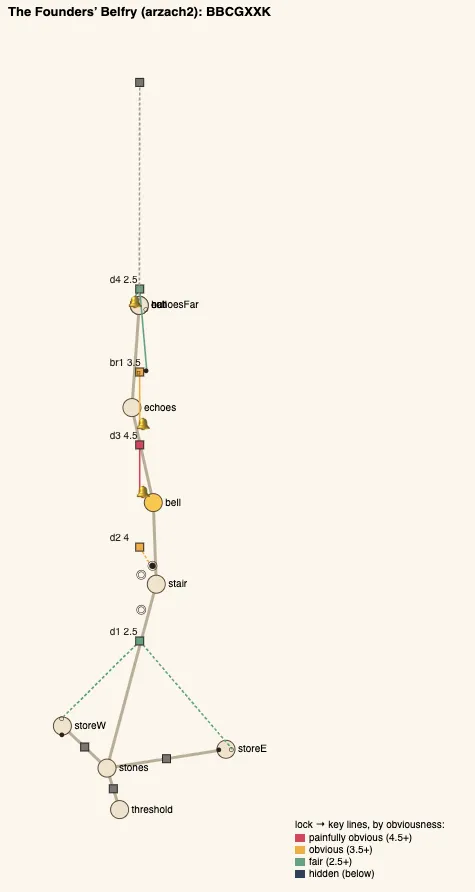

*The plan: the Hall of Stones (`stones`) is a hub now, with the two stores off it; the dashed lines from `d1` are
its keys out of sight in them.*

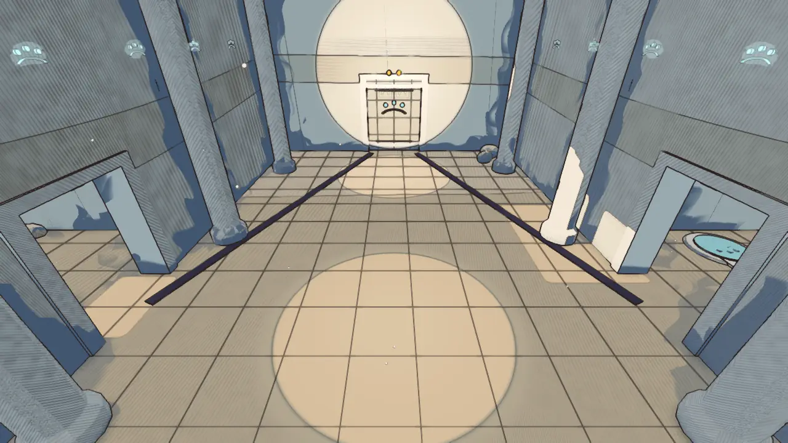

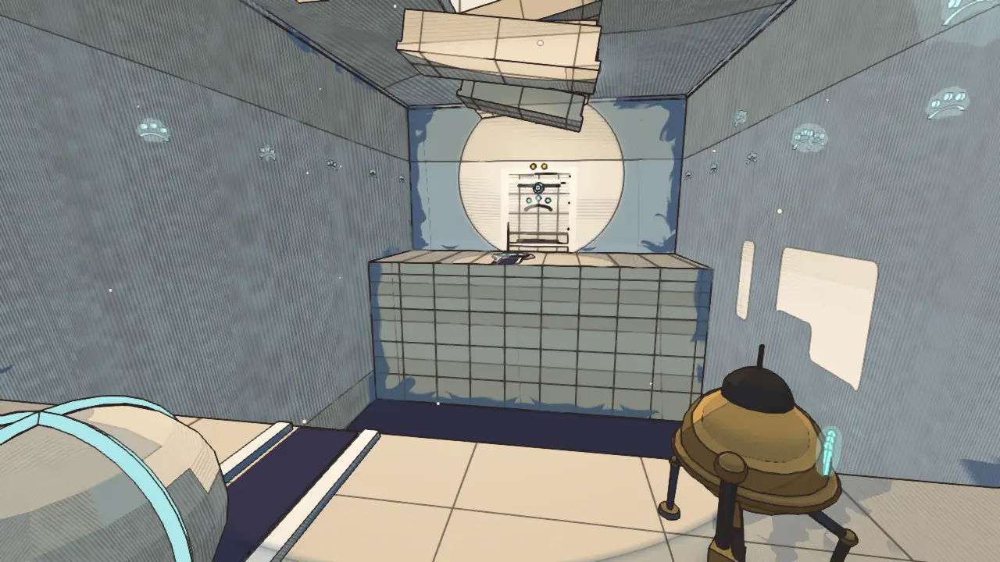

- **Steps:**
  - `d1` push (2.5): the door's two balls are in the two stone stores off the hall, out of sight of the door and
    25-33 m from it. The order is yours;
  - `d2` shot (4): a new high door on the Stone Stair; its eye is on the landing's face, seen from the ledge or
    the second disc but not from the landing above it;
  - `d3` bell, held (4.5): the door out of the Bell Chamber stands open only while the bell rings, about 8 s.
    This teaches the gadget's truth where failing costs nothing (it shuts, you ring again);
  - `br1` bell + push, held (3.5): the stones come down only while the bell rings, 10 s. Running across is
    enough, but the far door also wants the ball, which waits at the near edge in a groove that runs over the
    bridge;
  - `d4` push + bell (3): the ball must be on the far plate. Pushed while the stones hang, it stops at the lip;
    pushed late, it drops when they rise under it. Ring, push at once, and it rolls across. On its plate its
    weight holds the bridge down for good.
- **The gadget's arc:** taught at `d3`, tested at `br1`, twisted at `br1` and `d4` with the push, used in the
  fight.
- **Guardian:** unchanged. The Cloud-Mother asks for the bell when she cries.

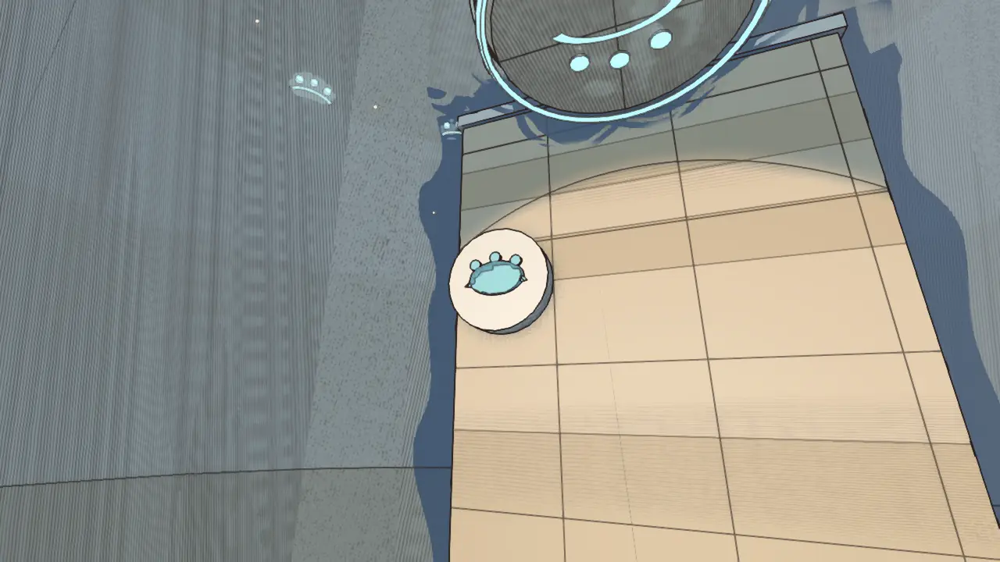

### The Hush-House (perdide), 1.67 → 3.44

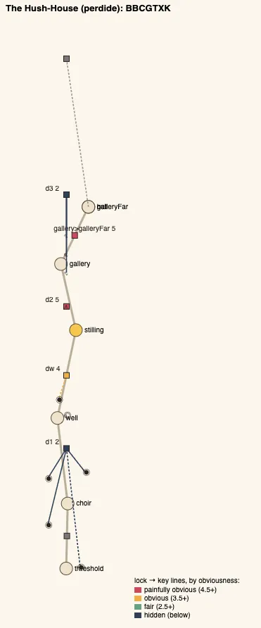

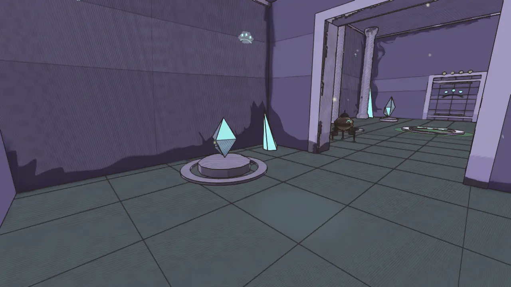

- **Steps:**
  - `d1` sequence (2): the lowest of the four crystals is in the Threshold, a room back and 38 m from the door.
    The Choir's three ring flat until it has sung, and say the first note was sung at the door;
  - `dw` shot (4): a new door at the top of the Bog Well's root-wall; its eye is on the wall's face, at eye height
    on the climbing disc, out of sight from the top;
  - `d2` stilling (5): the gate of jaws beside the chest, kept as the cheap first use of the gadget;
  - the pendulums, stilling (5): still them to cross;
  - `d3` stilling + order (2): the far gate of jaws is now a door with three lamps that wants the pendulums'
    notes, and a stilled pendulum's note only takes in turn, smallest crystal first, as the Choir taught. They
    hang middle, biggest, smallest, so stilling them to cross gets two of them wrong: from the far side, still
    them again in turn.
- **The gadget's arc:** taught at `d2`, tested on the bridge, twisted at `d3` with the temple's first verb.
- **Curve 3:** the first step is now the hardest (an order and a key a room away). That is a fair price for a
  pre-gadget room that asks you to look back.

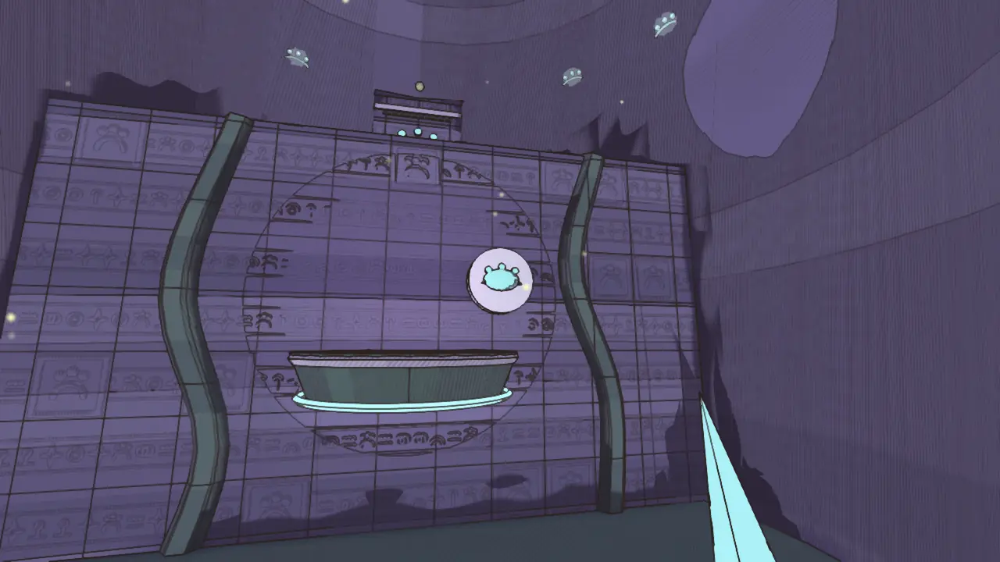

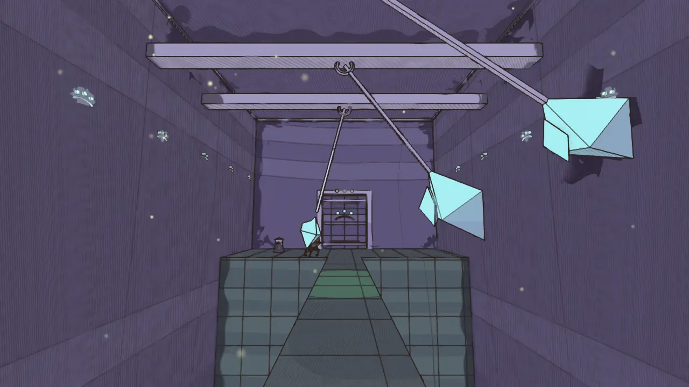

### The Lamp-House (perdide2), 1.67 → 3.11

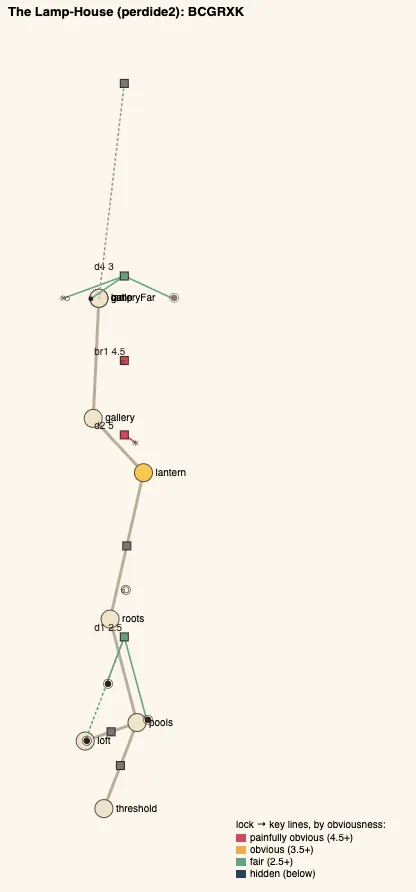

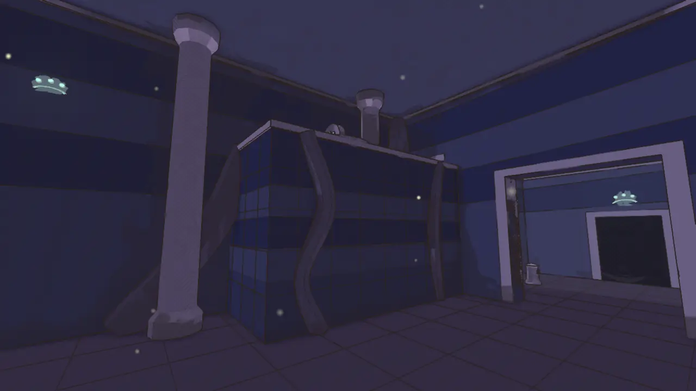

- **Steps:**
  - `d1` shot (2.5): two pool-lamps on the floor; the third is on a loft of roots against the west wall, its edge
    hiding the pool from everywhere on the floor. Climb its face to find it;
  - `d2` lantern (5): the lamp beside the chest, the cheap first use;
  - `br1` lantern, reveal (4.5): the moss-stones only its light shows;
  - `d4` lantern + push, reveal (3.5): the far door's third lamp is in a niche low in the west wall and wakes only
    to a pool-orb's light. Stand by the orb at rest with the lantern until it glows, then roll it into the niche
    before the glow fades (25 s). Rolled in dark it wakes nothing, and the niche tips it back out.
- **The gadget's arc:** taught at `d2`, tested at `br1`, twisted at `d4` (light carried where you cannot stand).
- **Dungeon item 4:** the chest still comes at a quarter of the steps.

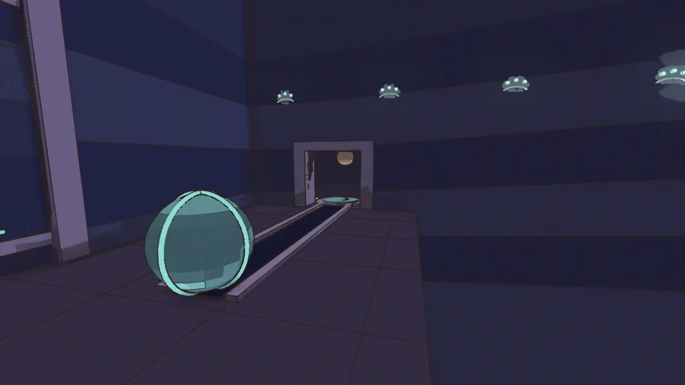

## Ranked edits, what is left

For the three reworked temples, worst first. The other eight temples' edits are unchanged from the
[v1.5 report](temple-design-v1.5.md#ranked-edits) and `TODO.md`, "Temple design (audit)".

**The Lamp-House, 3.11**
1. **The chest mid-way:** a lock before the chest in the Root Stair (the Hush-House's root-wall eye is the
   model, but a different verb: a pool lit to show the root-wall's holds). Expected: dungeon item +1.
2. **A second key out of its room:** `s4`, the eye only the lantern shows, onto the near side, seen across the
   chasm from the far door. Expected: decoupling +1.
3. **The Lampless:** lure it to the pools you lit as well as the lantern (a guardian change, deferred). Expected:
   guardian +1.

**The Hush-House, 3.44**
1. **A shortcut or a state that changes back:** a door from the far gallery back to the Stilling Chamber, or
   pendulums that a stilled glob holds at the top of their arc as steps. Expected: structure +1.
2. **`d2` beside the chest** is still painfully obvious (5): still the jaws from the Bog Well's disc as it rides
   past a window in the gate. Expected: non-obvious +0.5.
3. **The Mother:** her last phase asks for the order (still the pendulums over her bed in turn). Deferred with
   the guardians.

**The Founders' Belfry, 4.00**
1. **Identity:** its opening is still balls and a disc. One store could hold a different first verb.
2. **The Cloud-Mother:** a phase where the held note brings a stone down where she will dive (bell + timing).
   Deferred with the guardians.

## What was not done

- **The guardians.** The audit's guardian edits (the Cloud-Mother's falling stone, the Lampless lured to the
  pools, the Mother stilled through the order) change the fights. Another batch is reworking the foes, so these
  are left for it and listed above; the guardian scores here are the v1.6 fights'.
- **The Undertower** (1.78) is next by score: its `br1` should stand only while the high note is held, so the
  one-note rule bites twice (v1.5 report).

## Against the last report

- Average 1.84 → 2.38. The three worst temples are now the three best.
- Combination: 0 → 3 temples with a step that combines the gadget and an older verb.
- Steps whose key is a room away or out of sight: 2 → 9 (of 45 → 47).
- Structure: 11 straight chains → 9; the Belfry and the Lamp-House have a hub, and the Belfry two states that
  change back.
- The skeleton matches: arzach2 and bazaar no longer 100 % alike; the reworked three are 71-86 % alike to each
  other, which the next batch should break (see "What still repeats").
