# Temple visual audit, v1.32: each house its own palette, stone and light (2026-10-10)

<!-- audit-scores
overall: none
headline: 11 of 11 temples given their picks' palette, stone and light inside; six blue-grey houses no longer alike; draw calls +2 to +7, frame time within the spread
date: 2026-10-10
-->

The author: "make sure the visuals and color palette match the references more. right now the temples look a bit
more all the same." Each temple's key hall and entrance in the game, from the same viewpoints before and after, beside
its picks (references/temples/&lt;id&gt;/, manifest.json: the key hall is the main prompt, the entrance its v2; the
prompts in docs/design/temple-prompts.md), and its world's environment sheets for how it sits in its world. How it
is built: docs/systems/temples.md, "Each house its own look". Puzzles, collision and logic untouched (their tests
pass unchanged).

## Setup

- Headless Chrome (muted, on the GPU), 1280 × 720, High, 10:00, clear, the HUD hidden, the camera pinned, the
  traveller at a temple mark; the same view before (the eleven temple files as on main, b954c1da) and after.
- Each picture below: the pick, before, after; the key hall over the entrance. Full-size pairs with the picks beside
  them: the changelog's v1.32 lines (changelog-media/1.32/tv-&lt;world&gt;-hall|door-*.webp).

## What made them alike

- **One kit, one stone.** Every house was drawn in the kit's strata (random wavy bands of three near colours), cream
  frames and caps, cyan glyph friezes, the same plain plates; only the colours differed, and some barely.
- **Everything in the shade, and the shade the world's.** A temple's rooms are roofed: nearly every surface is in
  shadow, and the shadow was the world's tint printed flat (Vael II's grey-blue, the City-Shaft's blue, the Garden's
  sage: `uShadowFlat`). The Warden's Well, the Founders' Belfry, the Footprint, the Greenhouse, the Undertower and the
  Aerie all read as one pale blue-grey house; the Lamp-House and the Hush-House as one indigo one.
- **No signature things.** The picks each have their own (bells in niches, lamps, crystals, brass clocks, valves, feathers,
  slit windows, portholes); the game had the same glyph frieze everywhere.

## The changes, house by house

### The Givers' House (the Desert)

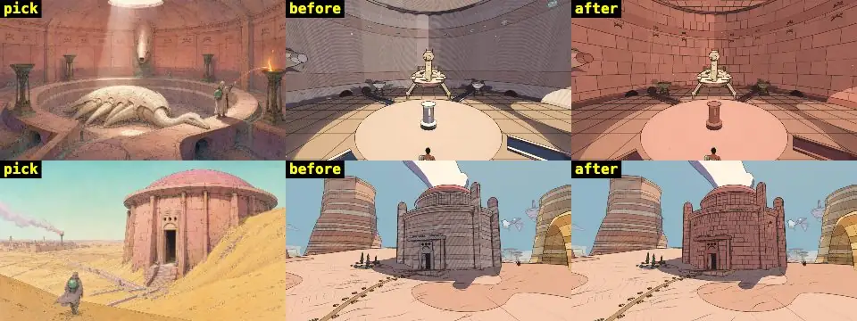

- **Picks:** a cistern of warm terracotta-rose ashlar under an oculus, a darker frieze course of three dots over an arc,
  rose-tan flags, verdigris bronze braziers, a warm light shaft, rose-violet shade; outside, a rose drum and dome half
  sunk in ochre dunes.
- **Before:** mauve-grey strata, cream frames, a washed lavender shade; outside brown and mauve bands.
- **After:** rose ashlar (staggered blocks), a darker course under the frieze and at the foot, the makers' mark cut along
  the walls, rose flags, frames in the darker rose, old green-bronze fittings; shade a deep rose (`#c79aa3`), warm light.
- **Left:** the light shaft itself (the sun's patch through the oculus stands for it); the cistern's sunk ring.

### The Warden's Well (the City-Shaft)

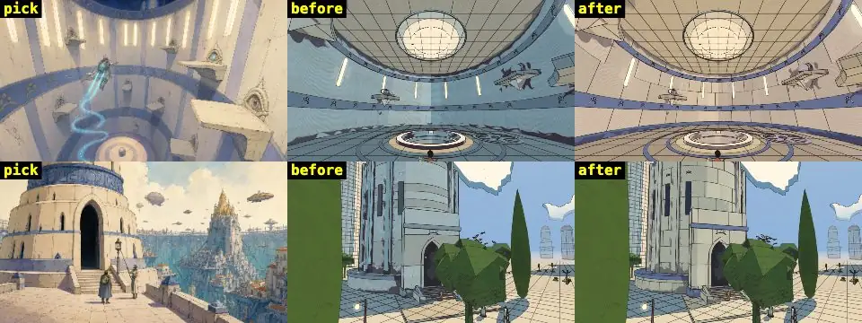

- **Picks:** cream stone, steel-blue bands and pilasters with gold glyph motifs, lit slit windows, cream ledges and
  concentric cream-and-blue floors; outside a stepped cream tower banded in blue.
- **Before:** the cream printed pale blue all over by the shaft's flat blue shade; slate-blue floors.
- **After:** cream stone in big smooth blocks that keeps its cream in the shade (lavender-blue `#bdb6d6`), a steel-blue band
  under every frieze with gold glyphs and one at the foot, cream floors, a lit slit window over every frieze glyph.
- **Left:** the vertical blue pilasters (they would be geometry on the walls the climbs use).

### The Founders' Belfry (Vael II)

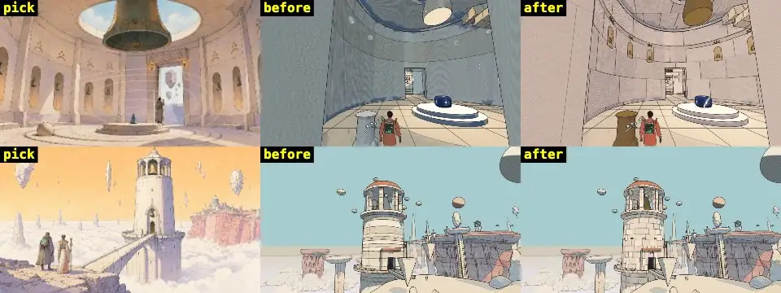

- **Picks:** bone-white stone, warm rose and lavender shade, a great bronze bell in the oculus, little bronze bells in
  lit arched niches, bronze dots-and-arc glyphs, pale sky light; outside a white tower over the cloud sea, a bronze bell.
- **Before:** blue-grey walls (Vael II's flat grey-blue shade), the bells cream stone.
- **After:** bone-white blocks, rose-lavender shade (`#d4bccb`), fewer spot blacks; the founders' bells in old bronze
  (`BRONZE`), a little bronze bell in a lit niche under every frieze glyph, bronze glyphs and fittings.
- **Since:** the author picked a regenerated key hall (sheet-3.jpg, the same bone-white chamber and bronze bells in
  niches); the changelog shows it beside the pair, the strip above the first pick.

### The Engine-House (the Buried Machine)

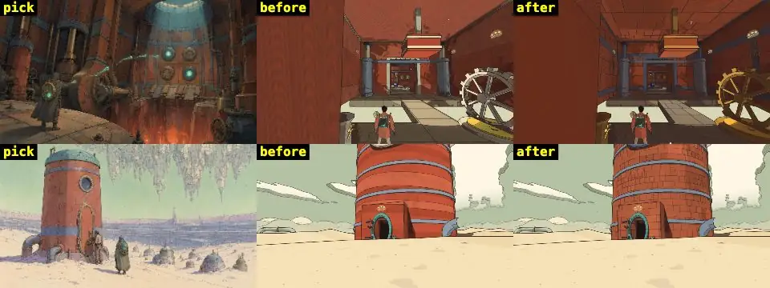

- **Picks:** rust iron in riveted plates, steel-blue straps, brass pipes and fittings, grey riveted floor plates, cyan
  eyes, a furnace's warm light; outside a riveted rust tank, a teal cap, a blue band, a porthole.
- **Before:** flat bright orange strata walls, cream frames, beige floors.
- **After:** riveted rust plates (`detail: 'built'`: seams and bolts), steel-blue frames and straps (a strap under every
  frieze and at the foot, a strap down the wall with a brass valve wheel on every other), grey iron floor plates, brass
  fittings; a deep rust shade that keeps the iron's red, warm light.

### The Footprint (the Garden of Spheres)

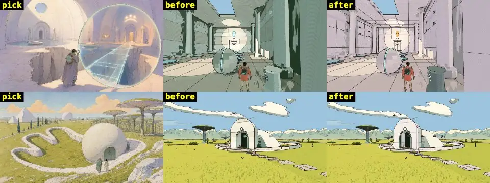

- **Picks:** white plaster domes, pale lavender shade, warm cream light, pale water, amber lit glyphs; outside a white
  sphere with a sage door in a sage meadow.
- **Before:** sage-green walls and shade (the Garden's sage spot tone and shade), dark green spot blacks.
- **After:** white plaster in big panels, lavender shade (`#c3b6da`), spot blacks a quarter, amber glyphs, round portholes,
  the door's sage on the fittings. The entrance hardly changed (it was already white and sage).

### The Lamp-House (Lorn II)

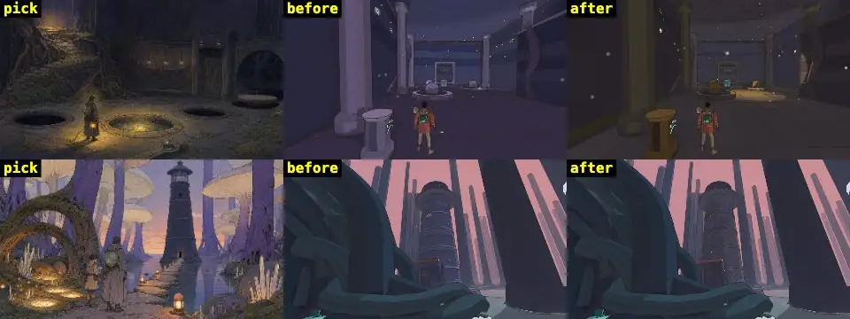

- **Picks:** dark slate stone, roots and olive moss, hanging lamps, the lantern's warm amber pools on grey flags; outside
  a dark slate lighthouse among violet trunks.
- **Before:** flat indigo-violet everywhere, no warm light.
- **After:** slate blocks, grey flags, olive moss at the walls' foot, mossy grey frames, a lamp under every frieze glyph;
  the six room lights lower and wider and every lamp's pool on the stone amber (`lampTint`); deep blue-violet shade. The
  entrance was already dark slate and stays so.
- **Left:** roots over the walls (geometry where the walls are climbed).

### The Hush-House (Lorn)

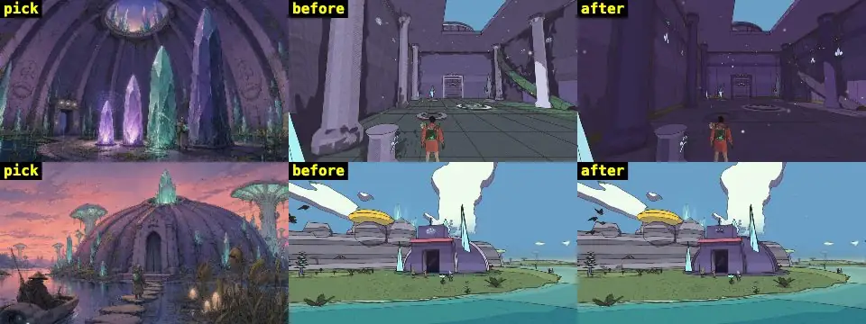

- **Picks:** violet stone under ribbed vaults, cracks and olive moss, crystals teal and violet, dark water, a dusk rose
  light; outside a violet ribbed dome with crystals.
- **Before:** violet walls but teal-green floors, pale lilac columns and frames.
- **After:** violet stone in cracked beds, violet-grey flags, darker violet frames, moss at the foot, small teal and
  violet crystals under every frieze, a dusky rose light. The entrance barely changed (its dome was violet already).

### The Aerie (Vael)

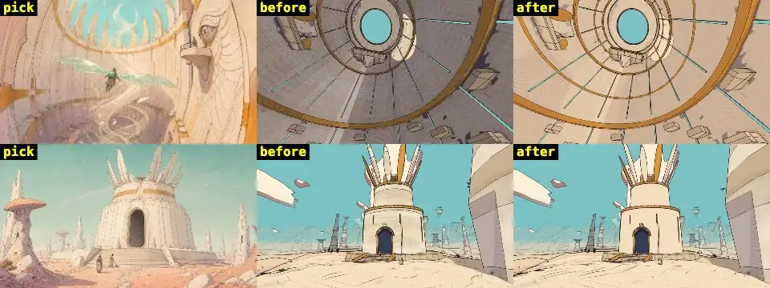

- **Picks:** warm ivory curved walls, ochre bands, peach-rose shade, a turquoise sky through the crown, feathered
  reliefs; outside an ivory stepped drum with an ochre band and feather spires.
- **Before:** grey-mauve walls in shade, ochre only on the frames.
- **After:** warm ivory (no grid), ochre bands under every frieze and low on the walls, a long feather carved under
  every frieze glyph, peach-rose shade (`#dcb4aa`).

### The First Garage (the Sealed Hangar)

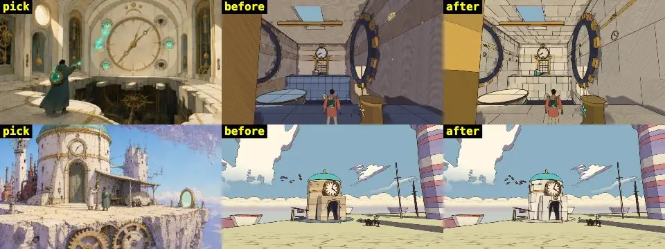

- **Picks:** cream marble with brass inlay in walls and floors, brass gears, pendulums and clocks, teal eyes, warm sun;
  outside a cream drum, a teal dome, brass bands and a clock.
- **Before:** tan strata walls and blue slate floors.
- **After:** cream marble slabs and floors, brass frames and fittings (metal), thin brass inlay under every frieze and at
  the foot, a little brass clock under every frieze glyph, the eyes lit the makers' teal; cool grey-teal shade.

### The Builders' Greenhouse (Viridel)

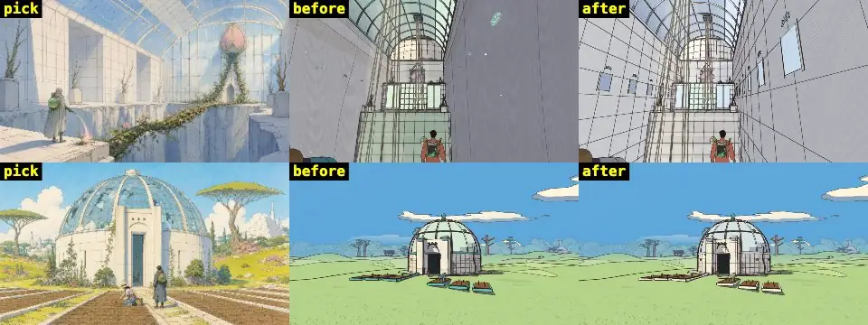

- **Picks:** white stone in big panels, white ribs, pale sky-blue glass, crisp blue shade, green vines and a pink bud;
  outside a white drum under a ribbed glass dome.
- **Before:** teal frames and ribs, green floors, mint glass.
- **After:** white panels and frames, pale stone floors, sky-blue glass (vault, dome, panes), a pane between two white
  ribs under every frieze glyph, crisp blue shade (`#b0c0e0`), white light.

### The Undertower (the Signal Market)

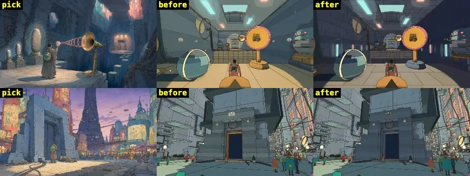

- **Picks:** heavy blue-grey masonry, cables, a brass horn, warm lamps, coral and teal light from the market overhead;
  outside a monolithic blue-grey portal in the market's dusk.
- **Before:** smooth teal-grey walls, brass door frames, sand-yellow floors.
- **After:** blue-grey masonry blocks, frames in the same stone (brass kept for the horns and fittings), grey flags, a
  darker course under every frieze and at the foot, coral and teal slots of light by turns, deep blue shade, warm light.

## Cost

The house's bands and ornaments share its paint mesh (one mesh, as before; the Garage's brass and the Engine-House's
valves are a metal material each). Frame time: six frames back to back to a one-pixel read, the median of five; draw
calls and triangles averaged over 24 frames (the shadow maps take turns). Dev server, same views, before and after
alternated:

| temple, view | preset | ms before → after | draw calls | k triangles |
|---|---|---|---|---|
| Givers' House, the Cistern | High | 3.18 → 3.03 | 194 → 199 | 308 → 366 |
| Givers' House, the Hall of Fires | High | 4.08 → 4.05 | 292 → 299 | 367 → 464 |
| Engine-House, the arena | High | 3.58 → 3.92 | 139 → 142 | 258 → 280 |
| Engine-House, the Crank Hall | High | 3.47 → 3.37 | 323 → 326 | 332 → 355 |
| Givers' House, the Cistern | Steam Deck | 3.88 → 2.45 | 169 → 173 | 255 → 303 |
| Givers' House, the Hall of Fires | Steam Deck | 3.30 → 3.62 | 236 → 241 | 301 → 379 |
| Engine-House, the arena | Steam Deck | 2.20 → 2.23 | 122 → 124 | 214 → 232 |
| Engine-House, the Crank Hall | Steam Deck | 3.62 → 3.58 | 260 → 262 | 270 → 289 |

Frame times are within the machine's run-to-run spread (about ±30 %). The triangles come from the bands' cut blocks and
the reliefs (the Givers' House has the most: its mark under 124 glyphs), drawn in every pass.

## Checks

- The temples' tests (`tests/temples.test.js`, 27, every temple solved on foot) and the design audit's
  (`tests/temple-design.test.js`) pass unchanged; `tests/temple-visuals.test.js` is new.
- The contact audit (`tests/contact-audit.test.js`): the ornaments are reliefs within its 6 cm tolerance and the bands'
  cut blocks have no faces where they meet; the first try (bells, lamps and valve wheels 0.2-0.5 m proud, the cut faces
  left in) grew the Givers' House's "walks through" 30 → 55 and the Engine-House's "climbs inside" to 48: both back under
  their limits.
