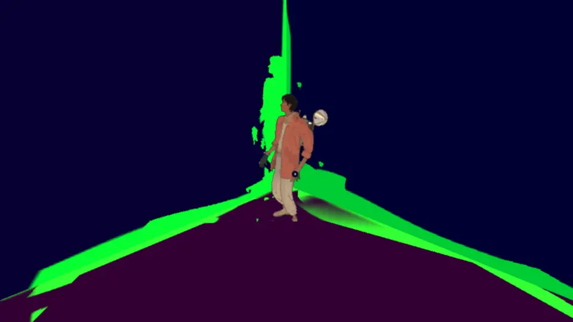
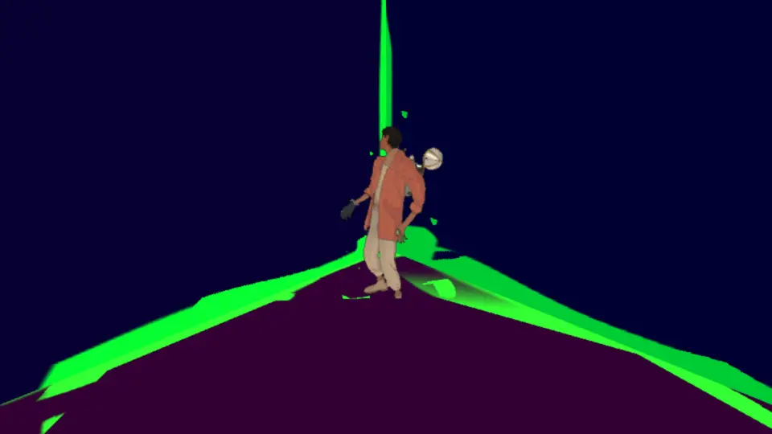
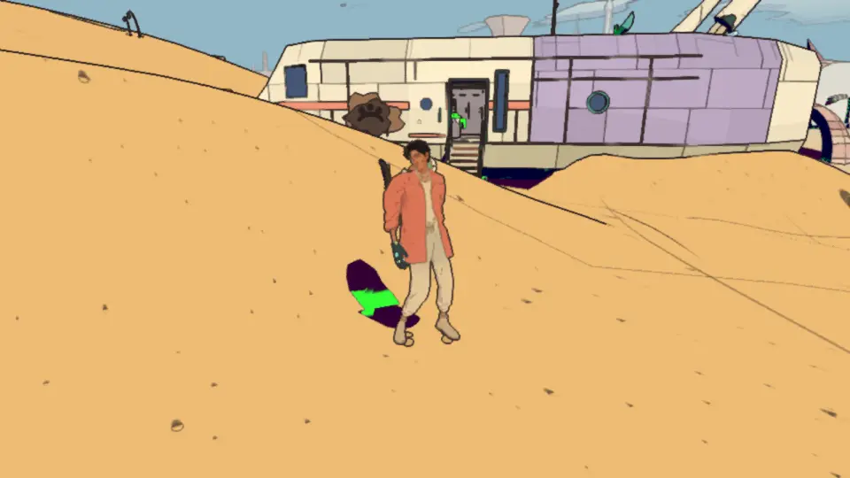
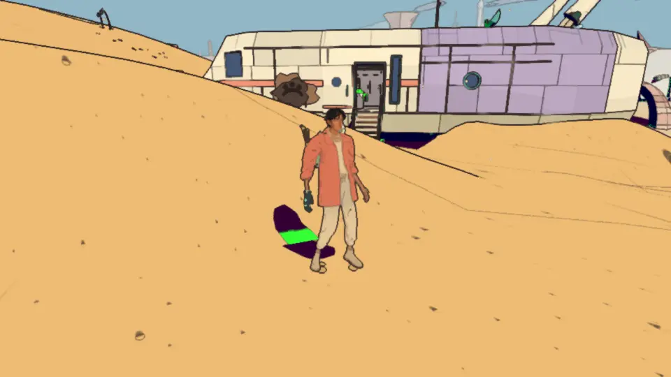
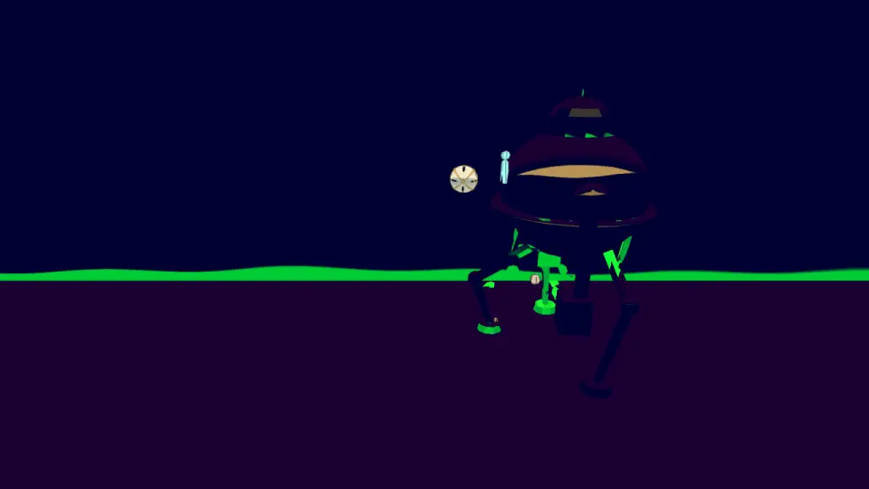

# Visual audit, v1.21: the probes' findings fixed (2026-10-10)

<!-- audit-scores
overall: none
headline: 0 breaks the picture, 2 noticeable, 3 only when looking, 2 look; v1.4's five findings fixed or checked, the probes' own misses fixed
date: 2026-10-10
-->

The after-run of [v1.4](visual-v1.4.md)'s probes, once its findings were worked through (TODO.md "Visual probes";
docs/systems/rendering.md, "The visual probes' findings fixed"). The probes themselves were changed too (a narrower
orbit in small rooms, noise over three takes, the silhouette from the normals as well, foot rays at 0.3 m, `--people`
to put Marrow where the traveller stood, known spots for his shadow by the ship): the table below is not quite the same
measure as v1.4's, and where a flag went away because the probe was fixed rather than the game, it says so.

## Setup

- This branch on main ac7600f6 (v1.19) plus the six fixes (rebased since onto v1.20); headless Chrome (muted, ANGLE Metal, M4 Pro), 1280 × 720,
  9:30, clear weather, the HUD hidden; the 11 route worlds at **Handheld and High** with `--people marrow` (only the
  desert has him), a 10 s rest between runs; the 12 side worlds at Handheld (below). Another agent's combat review
  shared the machine: the runs waited for its Chrome each time (one headless Chrome at a time).
- Before / after on the same spots: an archive of ac7600f6 served with `--root` (the desert's known spots, the corner,
  his shadow by the ramp, both presets), and v1.4's own numbers.

## v1.4's findings

| # | v1.4 finding | severity then | cause found | fix | before → after (probe) |
|---|---|---|---|---|---|
| 1 | a dark copy of the traveller on the wall beside him in room corners (Handheld) | noticeable | post.js `enclosure`: a tap on a person looked twice as far out, onto the corner's other wall, in front of the point; leaving the tap out was no better (1 of 4 taps closing, under the 0.3 threshold, became 1 of 3) | a tap on a person stands for what he hides: the planes of what is seen two and four times as far out and of the other taps, met along its own ray, the nearest between him and the point's own surface (`spotLoop`, `planeAlong`, `spotBehind`; the Unity composite too) | the corner's dark region beside him 6731 → 828 px at Handheld (0.40 → 0.04 of him); the known spots unchanged |
| 2 | a hairline of sky at the Givers' Hearth's floor edge (44-73 px, both presets) | only when looking | not the door cut: `rough` pushes the dome's foot out as well as down (17.4-19.8 m) and the floor ended at 18 m, a gap all round | the floor runs 3.5 m under the whole foot (`HEARTH.floorOut`); the giant's heart had the same gap in four places, its floor runs to ROOM + 4 | longest sky-white line 44-73 px → 0 (High still reports 73 px once: a glowing floor mark, the stone's breath) |
| 3 | hovering makers' drones draw a jagged spot-black halo on the wall behind them | noticeable | foes aren't people: the taps landing on a machine counted it as standing in front of the wall | foes are **movers** (gHatch.a + 64, materials.js `MOVER`: the 'foe-' and 'arch.' material keys), seen past as people are, a machine's own pockets kept (post.js `notStanding`) | the incal hall's machine: no halo (the ghost flag there 1359 px in v1.4, none now) |
| 4 | small square steps in the spot mass at the temple halls' pillar feet (Edena, High) | only when looking | the hall was rebuilt since (the Greenhouse, v1.16); the notches left are copies of what stands in front, tied to the surface | none needed | orbit p95 step 0 at the hall's four spots, every frame looked at |
| 5 | a spot-black blob in his own shadow on the sand by the ship | look | `notPerson` round his feet was right; his gear was not flagged: the shield, the sword and its frog, the tank's jets were built after he was tagged hero, so the taps took the shield by his hand for something over the sand | materials.js `keepHero`: what is added under him later is tagged (his fluid left inked as print) | the ragged blob → a clean stripe, the dune foot's crease in his shade (ramp view, Handheld: dark region 1688 → 1275 px, the rest the crease) |

| before (ac7600f6) | after |
|---|---|
|  |  |

*The desert room corner at Handheld (debug 10, the spot mask green): the dark copy of him on the left wall is gone.*

| before | after |
|---|---|
|  |  |

*His shadow by the ship's ramp, Handheld (debug 10): the ragged blob beside the shield → the dune foot's crease alone.*

*The machine in the City-Shaft hall (incal, High, debug 10, without the traveller): no halo on the wall behind it; its
own legs and plates keep their black. v1.4's picture: [drone-halo](visual-v1.4/drone-halo.webp).*

**v1.4's probe-only flags, now** (the probes fixed, TODO's last two items): the temple halls' ghost flags (drones and
passers-by moving between takes) are gone with the three noise takes and the movers; the small rooms' orbit flags are
gone with the narrowed swing (the garage's walls swing ×0.5 or less); the garage's two "slits" were a bench (the 0.3 m
ray runs under it too) and are no longer reported. world.js `jitter`'s vertical noise keeps a foot ring down
(tests/shell-seams.test.js runs it).

## Findings

| # | severity | where | picture | likely cause | suggested fix |
|---|---|---|---|---|---|
| 1 | noticeable | the Lorn temple hall (perdide, inner-wall-3, both presets): a jagged spot-black halo round the floating crystal on the wall behind it, and the orbit flagged (p95 0.70 / 0.80) | [picture](visual-v1.21/lorn-crystal-halo.webp) | the crystal turns and floats but isn't a mover (finding 3's class: a moving prop near a wall) | make its material with `{ mover: true }` (src/temples, the crystal's makeMaterial) |
| 2 | noticeable | the Givers' Hearth's passage: dark triangles of the dome hang across the passage's mouth (seen in the light pictures, both presets) | [v1.4's seam picture, right](visual-v1.4/hearth-hairline-seam.webp) | `cut()` drops a dome triangle only when its centre is in the door box; triangles straddling the passage walls stay | cut by any vertex inside the passage's inner width, or clip them to the passage walls (desert-hearth.js `door`) |
| 3 | only when looking | the desert room corner at Handheld (and the ship's ramp rail in four side worlds, 380-840 px): a notch in the corner's foot band beside his legs (598 px pale, 0.03 of him; flagged on the 300 px floor) | [after](visual-v1.21/corner-after.webp) | where three planes meet (two walls and the floor) the planes seen round a hidden tap don't always include the one that hides it | a third look-past (along the other axis), or accept |
| 4 | only when looking | Marrow at the same corner (Handheld): the floor at his robe's hem a little darker with him (2198 px, 0.09 of him) | [with](visual-v1.21/marrow-corner-with.webp), [without](visual-v1.21/marrow-corner-without.webp) | his wide hem hides several taps at once; their planes come from the corner's walls | as 3 |
| 5 | only when looking | the buried world's stairs-0 orbit at Handheld (p95 0.74), as in v1.4 | (v1.4) | not looked into by eye yet | look at the orbit frames (`--save-all`) |
| 6 | look | a shop in the Signal Market (bazaar inside-3, both presets): the floor and the shelves inside lit white in the light term; the shelf edge flagged as a 138-199 px lit line | [picture](visual-v1.21/bazaar-shop-lit.webp) | sunlight through the open front, or the shop's shell not casting; new since v1.4 (the shops came later) | check the shop's shadow casting at noon |
| 7 | look | his shadow on the sand by the ramp: a clean dark stripe where the dune's foot creases | [after](visual-v1.21/ramp-shadow-after.webp) | the crease's enclosure 0.25-0.4 on 4 taps; it only shows in shade, his shadow being the shade there | accept, or a lower spot share for terrain (an art call) |

## The probes, world by world

`swing`: spots whose orbit narrowed (the eye pulled in front of a wall). Ghost: the biggest pale and dark regions
beside the person / their size. Seams: enclosed of checked / slits / longest lit line px.

| world | preset | spots | orbit flagged (p95 step) | ghost flagged (biggest pale px / share of him) | close | seams: enclosed / slits / longest lit line px |
|---|---|---|---|---|---|---|
| desert | handheld | 9 | - | corner-1 (598 / 0.03), corner-1@marrow (598, dark 2198), inner-wall-3@marrow (331 px of a person 168 px in view) | 2 | 4/6 / 0 / 0 |
| desert | high | 9 | - | - | 1 | 4/6 / 0 / 0 |
| arzach | handheld | 4 | - | - | 0 | 2/4 / 0 / 0 |
| arzach | high | 4 | - | corner-1 (315 / 0.017, dark 1029) | 0 | 2/4 / 0 / 0 |
| arzach2 | handheld | 4 | - | - | 2 | 2/4 / 0 / 0 |
| arzach2 | high | 4 | - | - | 0 | 2/4 / 0 / 0 |
| perdide | handheld | 4 | inner-wall-3 (0.698: finding 1) | - | 1 | 2/4 / 0 / 0 |
| perdide | high | 4 | inner-wall-3 (0.8: finding 1) | - | 1 | 2/4 / 0 / 0 |
| perdide2 | handheld | 5 | - | - | 0 | 2/4 / 0 / 0 |
| perdide2 | high | 5 | - | - | 0 | 2/4 / 0 / 0 |
| edena | handheld | 4 | - | - | 1 | 2/4 / 0 / 36 |
| edena | high | 4 | - | - | 1 | 2/4 / 0 / 36 |
| incal | handheld | 4 | - | - | 2 | 2/4 / 0 / 0 |
| incal | high | 4 | - | - | 2 | 2/4 / 0 / 0 |
| garage | handheld | 4 (1 swing ×0.5) | - | - | 0 | 2/4 / 0 / 0 |
| garage | high | 4 (1 swing ×0.5) | - | - | 0 | 2/4 / 0 / 0 |
| buried | handheld | 4 | stairs-0 (0.741: finding 5) | corner-1 (465 / 0.024) | 0 | 4/4 / 0 / 43 |
| buried | high | 4 | - | - | 0 | 4/4 / 0 / 43 |
| spheres | handheld | 4 | - | - | 0 | 4/4 / 0 / 0 |
| spheres | high | 4 | - | - | 0 | 4/4 / 0 / 0 |
| bazaar | handheld | 4 | - | - | 0 | 2/4 / 0 / 138 (finding 6) |
| bazaar | high | 4 | - | - | 1 | 2/4 / 0 / 199 (finding 6) |

Against v1.4: 19 orbit flags → 3 (one known, two the Lorn crystal); 21 ghost flags → 5 (small pale notches at
corners, 300-600 px, and Marrow's); the Hearth's lit line → none; the garage's slits → none. The known spots: the
Qanat stairs, the two caves and the ramp are clean at both presets; Marrow in front of the Qanat stairs and the ramp:
clean.

## The side worlds (first run; Handheld)

The side worlds have no ways in (no seams checked) and few benchmark views: the probes found one or two spots each,
mostly the ship's ramp (`stairs-0`, the ship lands by the spawn in each).

| world | preset | spots | orbit flagged (p95 step) | ghost flagged (biggest pale px / share of him) | close | seams: enclosed / slits / longest lit line px |
|---|---|---|---|---|---|---|
| mangrove | handheld | 2 (1 orbit skipped: the eye pulled in) | stairs-0 (0.353) | stairs-0 (633 / 0.03) | 0 | - |
| glassdunes | handheld | 1 | - | stairs-0 (839 / 0.04) | 0 | - |
| waterfall | handheld | 1 | - | - | 0 | - |
| saltharbour | handheld | 1 | - | - | 0 | - |
| antennas | handheld | 1 | - | - | 0 | - |
| underwater | handheld | 2 | - | stairs-0 (380 / 0.01) | 0 | - |
| eclipse | handheld | 1 | - | stairs-0 (dark 1863 of a person 3076 px in view: far, mostly hidden) | 0 | - |
| fallenring | handheld | 1 | stairs-0 (0.361) | - | 0 | - |
| moonfoundry | handheld | 1 | stairs-0 (0.471) | - | 0 | - |
| underside | handheld | 1 | - | - | 0 | - |
| spacecity | handheld | 2 | - | wall-1 (426 / 0.02) | 0 | - |
| overnighttrain | handheld | 1 | - | - | 0 | - |

The ramp's ghost flags are the same small case as finding 3: a pale strip of the hull's shade along the ramp's rail
beside him (glassdunes: 839 px), where the rail, the ramp and the hull meet behind him. The three ramp orbits flagged
just over the 0.3 line (0.35-0.47) are worth a look with `--save-all` before calling them; the side worlds at High
were not run.

## What was not checked

- The side worlds at High; hours other than 9:30; the Retroid and the Steam Deck; the stills (section 1) and the motion
  check (section 2): v1.0's stand.
- The new rule's cost on the Retroid: one more texture read for a tap on a person and a few multiply-adds per hidden
  tap (only pixels next to people); not measured.
- People other than Marrow (the probe takes any story id: `--people`).
