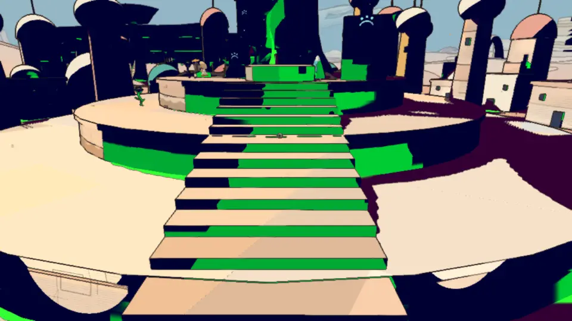
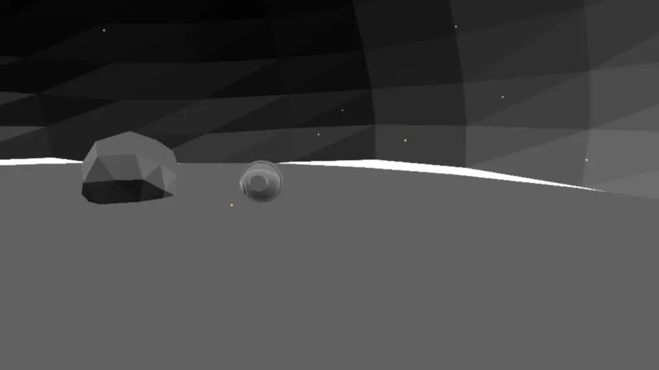

# Visual audit, v1.4: the probes (2026-10-09)

The first run of the visual audit's new probes (`.claude/skills/visual-audit/SKILL.md`, sections 3-5:
`.claude/skills/visual-audit/probes.mjs`, `scripts/visual-probes/lib.mjs`), made after three bugs got past the still
frames of [v1.0](visual-v1.0.md): the pale ghost of a person in the spot blacks (620c4384), the blocks that slid with the
camera (c58cbcaa), the lit seam round the caves' floors (c58cbcaa). The stills (section 1) and the motion check (section
2) were not run again for this report; see v1.0.

## Setup

- Commit c724b2a4 (main 592f0e7a plus the probes), headless Chrome (muted, ANGLE Metal, M4 Pro), 1280 × 720, 9:30, clear
  weather, the HUD hidden; the 11 route worlds at **Handheld and High**, one browser, a 20 s rest between runs (about
  40 minutes in all). Two runs (edena High, incal Handheld) were spoiled by another agent's script attaching to the
  probes' Chrome and were run again alone (the probes now default to debugging port 5391).
- Per world: the known spots of past bugs (the desert: the Qanat tree's stairs, the cave under the giant, the Givers'
  Hearth) and four found ones (stairs, a room corner, walls, inside the ways in first); the seams inside every way in.

## The probes against the bugs they were made for

Each probe was run on the build before the fixes (an archive of 5ca4f5c7, the parent of 620c4384: all three bugs in) and
on this commit, the desert's known spots, Handheld and High. The thresholds in `lib.mjs` were set from this.

| probe | spot | before the fixes | now | verdict before / now |
|---|---|---|---|---|
| ghost (debug 10, biggest pale region beside him) | Qanat stairs, Handheld | 418 px, 0.107 of him | 6-44 px, ≤ 0.011 | flagged / clean |
| ghost | the Hearth, Handheld / High | 6150 / 364 px | 0 / 21 px | flagged / clean |
| orbit (95th percentile of the step, debug 10) | Qanat stairs, Handheld / High | 0.60 / 0.60 | 0.20-0.23 | flagged / clean |
| orbit | the Hearth, Handheld / High | 0.54 / 0.25 | 0.18-0.24 / 0.03 | flagged, missed at High / clean |
| seams, foot rays | the Hearth | 6 of 24 directions open under the wall | 0 | flagged / clean |
| seams, foot rays | the cave under the giant | 5 of 24 | 0 | flagged / clean |
| seams, light term (longest sky-white line) | the Hearth, 6 looks | 62-149 px | 44-73 px | flagged / **flagged** (below) |

| before 620c4384, with him | without him |
|---|---|
|  |  |

*The Qanat stairs at Handheld before the ghost fix (debug 10, the spot mask green): beside him the risers' mass loses a
pale wedge of his shape. Now the masks beside him are the same with him and without.*

*The Givers' Hearth before c58cbcaa, debug 5 (the light term): the sky, white, all along the dome's foot.*

## Findings

| # | severity | where | picture | likely cause | suggested fix |
|---|---|---|---|---|---|
| 1 | noticeable | the desert, a room corner inside a way in, Handheld (the probe's `corner-1`; not at High) | [with](visual-v1.4/corner-halo-with.webp), [without](visual-v1.4/corner-halo-without.webp) | post.js `enclosure`: a tap that lands on the traveller looks past him twice as far; in a corner that lands on the other wall, nearer than the point, so it counts as closing in. A dark copy of him on the wall behind, offset to the side (Handheld's 4 taps) | look past along the surface only as far as the person's own depth allows, or leave a person tap out at once when the point is on a wall within a metre of him; a test twin with a corner |
| 2 | only when looking | the Givers' Hearth, along the floor's edge, both presets (44-73 px of sky-white line, two of six looks) | [picture](visual-v1.4/hearth-hairline-seam.webp) | a hairline left at the dome's foot: the foot ring goes down now, but the floor and the dome may not meet where the door is cut (`cut(inward(rough(...)), door)` in src/desert-hearth.js) or where the floor's edge is coarser than the dome's | find the gap with the foot rays from more points (the probe casts from the centre only); close it with a skirt ring under the floor |
| 3 | noticeable | temple halls with a hovering makers' drone (incal, edena, spheres; both presets) | [picture](visual-v1.4/drone-halo.webp) | the drones aren't people (no figure flag), so the screen-space enclosure draws a jagged spot-black halo round them on the wall behind, and it moves with them | give the hovering drones (and other moving props near walls) the figure flag, or leave moving objects out of the enclosure as people are |
| 4 | only when looking | the temple halls' pillar feet (edena High, seen in the orbit) | [picture](visual-v1.4/temple-pillar-steps.webp) | small square steps in the spot mass where a pillar meets the floor and the wall: the copies of a corner's edges, at the tap radius's 4 px floor | check with the motion check's swing on a temple hall; if they move, the same surface anchoring for the near-camera case |
| 5 | look | by the ship, the traveller's own cast shadow on open sand, both presets | [picture](visual-v1.4/own-shadow-spot.webp) | a spot-black mass inside his shadow beside his feet (the spot tier only runs in shade, and his shadow makes shade) | check `notPerson` on the shadow's edge taps; probably his feet's taps |

**Probe results that are the probe's, not the game's** (left flagged in the table below so the next run can compare):
- Most ghost flags in the temple halls (arzach2, edena, incal, spheres, bazaar) are the drones and the people walking
  there moving between the takes with and without the traveller: the noise take catches only what moves between the
  last two. Finding 3 is the real part of them.
- The orbit flags in the temple halls and small rooms (p95 0.4-1.0): the eye is pulled in front of the walls, so over
  ±32° the camera's distance changes several times over and the view changes entirely; a drone crossing the points
  passes the albedo check where it is the wall's colour. The orbit's thresholds were set on open stairs and caves.
- The garage's two "slits" (`inside-0`): the foot ray goes under a bench or a console the metre-high ray meets (low 9.7 m,
  high 6.1 m); its light term is clean.

## The probes, world by world

| world | preset | spots | orbit flagged (p95 step) | ghost flagged (biggest pale px / share of him) | close | seams: enclosed / slits / longest lit line px |
|---|---|---|---|---|---|---|
| desert | handheld | 7 | - | stairs-0 (671 / 0.034), corner-1 (halo: finding 1) | 0 | 4/6 / 0 / 0 |
| desert | high | 7 | - | stairs-0 (492 / 0.025) | 0 | 4/6 / 0 / 73 (finding 2) |
| arzach | handheld | 4 | - | corner-1 (360 / 0.021) | 0 | 1/3 / 0 / 0 |
| arzach | high | 4 | - | - | 0 | 1/3 / 0 / 0 |
| arzach2 | handheld | 4 | inner-wall-2 (0.302), inner-wall-3 (0.698) | corner-1 (500 / 0.011), inner-wall-2 (1277 / 0.09), inner-wall-3 (311 / 0.006) | 0 | 1/3 / 0 / 0 |
| arzach2 | high | 4 | inner-wall-3 (0.698) | inner-wall-3 (358 / 0.007) | 0 | 1/3 / 0 / 0 |
| perdide | handheld | 4 | - | - | 1 | 1/3 / 0 / 0 |
| perdide | high | 4 | - | - | 1 | 1/3 / 0 / 0 |
| perdide2 | handheld | 4 | - | stairs-0 (354 / 0.023) | 0 | 1/3 / 0 / 0 |
| perdide2 | high | 4 | - | - | 0 | 1/3 / 0 / 0 |
| edena | handheld | 4 | inner-wall-1 (0.8), inner-wall-2 (1) | inner-wall-1 (1863 / 0.033) | 1 | 2/4 / 0 / 0 |
| edena | high | 4 | inner-wall-1 (0.6), inner-wall-2 (1) | inner-wall-1 (727 / 0.046), inner-wall-2 (310 / 0.014), inner-wall-3 (501 / 0.018) | 0 | 2/4 / 0 / 0 |
| incal | handheld | 4 | inner-wall-1 (0.8), inner-wall-2 (1) | inner-wall-2 (439 / 0.007) | 1 | 3/3 / 0 / 48 |
| incal | high | 4 | inner-wall-3 (0.545) | inner-wall-2 (1359 / 0.087: the drone, finding 3) | 0 | 2/4 / 0 / 0 |
| garage | handheld | 4 | inner-wall-3 (0.8) | - | 0 | 1/3 / 2 (a bench) / 0 |
| garage | high | 4 | inner-wall-3 (0.404) | - | 0 | 1/3 / 2 (a bench) / 0 |
| buried | handheld | 4 | stairs-0 (0.741) | - | 0 | 3/3 / 0 / 43 |
| buried | high | 4 | - | - | 0 | 3/3 / 0 / 43 |
| spheres | handheld | 4 | inner-wall-2 (0.682), inner-wall-3 (0.6) | inner-wall-2 (748 / 0.012) | 1 | 3/3 / 0 / 0 |
| spheres | high | 4 | inner-wall-3 (1) | corner-1 (445 / 0.011), inner-wall-2 (440 / 0.028), inner-wall-3 (521 / 0.006) | 0 | 3/3 / 0 / 0 |
| bazaar | handheld | 4 | inner-wall-2 (0.549) | inner-wall-1 (2075 / 0.048) | 1 | 1/3 / 0 / 32 |
| bazaar | high | 4 | inner-wall-1 (0.31), inner-wall-2 (0.463) | corner-0 (1663 / 0.028) | 1 | 1/3 / 0 / 33 |

The known spots (the desert's) were clean at both presets but for the Hearth's hairline (finding 2). `close`: ghost
checks not judged because the traveller filled over a tenth of the frame.

## What was not checked

- The side worlds, home and the Lantern (the probes take `--worlds`; the route took 40 minutes at two presets).
- People other than the traveller (Marrow by the ship was the first report of the ghost; the probe places only him).
- Hours other than 9:30, the Retroid and the Steam Deck, the stills and the motion check (v1.0's still stand).
- The buried world's stairs-0 orbit flag (0.741, Handheld only) was not looked at by eye.
