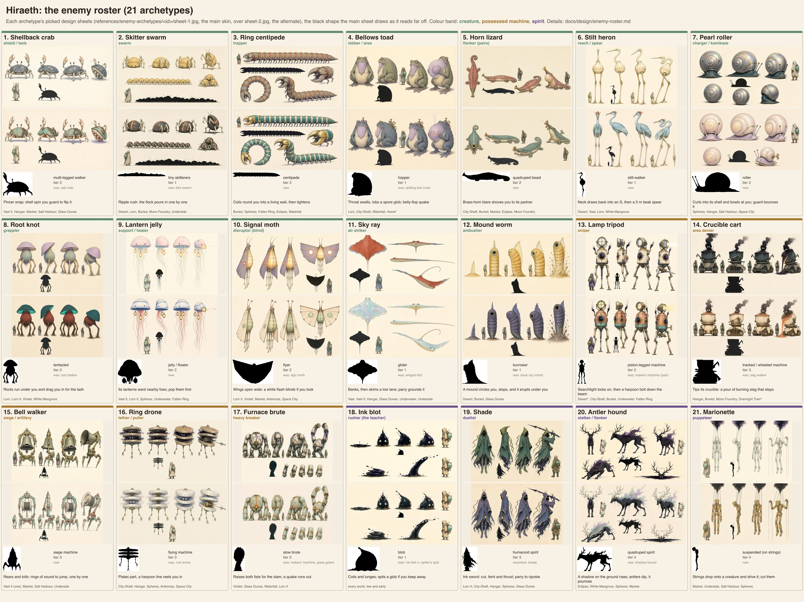

# Enemy roster: 21 archetypes (approved 2026-10-09; framework, batches 1 and 2 built)

2026-10-09. Approved (see "Decisions"); the framework and batch 1 are built (see "Status"). It replaces the 100 world enemies (src/enemies/roster.js) and
the 15 old kinds (src/foes.js, src/foe-kinds.js) with **21 archetypes**. Each one has its own silhouette, body plan,
way of moving and job in a fight, and each appears in several worlds with that world's skin.

*The contact sheet (`enemy-roster-sheet.jpg`; rebuild it with `node scripts/enemy-roster/sheet.cjs`, crops in
`scripts/enemy-roster/archetypes.json`). The small black shape under each card is the first reference cut out
against its paper, shrunk to roughly how it reads from 30 m away.*

## Why

The author: "the generated enemies are way too similar, most of the possessed machines look the same and so do the
shades … I'd rather have 20 enemies with a ton of diversity than 100 with bad diversity."

Looking at all 100 Midjourney sheets (`references/*/enemies/lineup-0*.{jpeg,webp}`) confirms it:

- **The machines:** 22 of the 25 possessed machines are one shape, an ivory boiler or cabinet on two to four
  stick legs with a black blob of smoke on one shoulder.
- **The shades:** 23 of the 25 are one shape too, a tall black biped with long arms and claw hands, and a violet
  smoke skirt.
- **The creatures** vary more, but they cluster: crabs or beetles in 12 worlds, lizards in 9, toads in 6.

In the game the 100 entries share a handful of rigs (src/enemies/models.js) and 15 attack patterns, so they fight
alike as well as look alike.

The rules this roster follows:

1. **Silhouette first.** Every archetype must read as a black shape from 30 m away, and no two are alike. The
   sheet's black shapes are the check.
2. **No shared body plan within a family.** No two possessed machines share a body plan, and no two spirits do.
   Creatures don't repeat a plan either. The only overlap across families is the four-legged body: the horn
   lizard (low, with a tail and a trumpet) and the antler hound (tall, antlered, a shadow). Their shapes are
   far apart.
3. **The possession shows differently on every machine and every spirit.** Each section names how.
4. **Every archetype has a job** in a fight (its role), two or three attacks with body telegraphs, and a move of
   the traveller's that answers it best. That answer is never only "the charged cut" (combat-v1.4,
   recommendation 1).
5. **The body is the telegraph** (TODO.md, "Combat telegraphs"). Nothing is drawn on the ground except where a
   lobbed or thrown thing will land.
6. **Wildlife is wildlife.** Most creatures leave you alone until provoked. The worlds stay quiet to walk through.

## The roster at a glance

| # | Archetype | Family | Body plan (procedural-animation.md §4) | Role | Signature attack | Tier | Worlds |
|---|---|---|---|---|---|---|---|
| 1 | Shellback crab | creature | 1 multi-legged walker | shield / tank | shell spin you guard to flip it | 2 | Vael II, Hangar, Market · Salt Harbour, Glass Dunes, Underwater, Antennas |
| 2 | Skitter swarm | creature | 2 tiny skitterers | swarm | the ripple rush | 1 | Desert, Lorn, Buried · Moon Foundry, Underside |
| 3 | Ring centipede | creature | 3 centipede | trapper | coils round you into a wall, then tightens | 3 | Buried, Spheres · Fallen Ring, Eclipse, Waterfall, Antennas |
| 4 | Bellows toad | creature | 5 hopper | lobber / area | spore lob; belly-flop quake | 1 | Lorn, City-Shaft · Waterfall |
| 5 | Horn lizard | creature | 6 quadruped beast | flanker (pairs) | the blare, a cone that shoves you to its partner | 2 | City-Shaft, Buried, Market · Eclipse, Moon Foundry |
| 6 | Stilt heron | creature | 7 stilt-walker | reach / spear | the 5 m beak spear | 1 | Desert, Vael, Lorn · White Mangrove |
| 7 | Pearl roller | creature | 16 roller | charger / kamikaze | the bowl, then the last roll | 2 | Hangar, Spheres · Salt Harbour, Space City, White Mangrove |
| 8 | Root knot | creature | 12 tentacled | grappler | roots that drag you into the lash | 2 | Lorn, Lorn II, Viridel · White Mangrove, Waterfall |
| 9 | Lantern jelly | creature | 11 jelly / floater | support / healer | wards its neighbours with its lanterns | 2 | Vael II, Lorn II, Spheres · Underwater, Fallen Ring |
| 10 | Signal moth | creature | 13 flyer | disruptor | the blinding flash | 2 | Lorn II, Viridel, Market · Antennas, Space City |
| 11 | Sky ray | creature | 14 glider | air striker | the low skim along a lane | 1 | Vael, Vael II, Hangar · Glass Dunes, Underwater, Underside |
| 12 | Mound worm | creature | 15 burrower | ambusher | the eruption under you | 1 | Desert, Buried · Glass Dunes |
| 13 | Lamp tripod | machine | 18 piston-legged machine | sniper | the searchlight, then a bolt down the beam | 2 | City-Shaft, Buried · Underwater, Fallen Ring |
| 14 | Crucible cart | machine | 17 tracked machine | area denier | the slag pour that stays | 3 | Hangar, Buried · Moon Foundry |
| 15 | Bell walker | machine | 19 siege machine | siege / artillery | the toll, rings of sound to jump | 3 | Vael II (one), Market · Salt Harbour, Underside |
| 16 | Ring drone | machine | 13 flyer (machine) | tether / puller | the harpoon that reels you in | 3 | City-Shaft, Hangar, Spheres · Antennas, Space City, Fallen Ring |
| 17 | Furnace brute | machine | 8 slow brute | heavy breaker | the two-fist slam and its quake | 3 | Lorn II, Viridel · Glass Dunes, Waterfall, Moon Foundry |
| 18 | Ink blot | spirit | 20 blob | rusher (the teacher) | coil and lunge | 1 | every world, few and early |
| 19 | Shade | spirit | 9 humanoid spirit | duelist | cut, feint, thrust | 3 | Lorn II, City-Shaft, Hangar, Spheres · Glass Dunes, Eclipse |
| 20 | Antler hound | spirit | 6 quadruped (spirit) | stalker / flanker | rises out of a shadow and pounces | 4 | Spheres, Market · Eclipse, White Mangrove |
| 21 | Marionette | spirit | new: suspended on strings | puppeteer | drops strings on a foe and drives it | 4 | Spheres, Market · Underside, Salt Harbour |

The worlds before the dot are on the route; those after it are side worlds. Home, the Atelier and the Overnight
Train stay peaceful, as now (their skins are for the Arena only). Plans 4 (serpent) and 10 (shelled turtle) have
no regular foe: the serpent is left to the Mother Snapper, so her fight stays unique, and the shelled guard pose
lives in the crab and the pearl roller.

**Roles covered:** rusher, tank, swarm, trapper, lobber, flanker, reach, charger/kamikaze, grappler, support,
disruptor, air striker, ambusher, sniper, area denier, siege, tether, heavy, duelist, stalker, puppeteer. Ranged or
area roles: 8 of the 21 (toad, jelly, moth, tripod, cart, bell, drone, marionette); the blot spits too.

## The traveller's answers (for the counterplay lines)

| Answer | What it is (docs/systems/foes.md) |
|---|---|
| combo | the three light swings (the third, heavy, staggers: combat-v1.4 rec. 1) |
| charged cut | hold the blade, `breaks`: reels anything, armour too |
| air cut | a swing in the air, plunges down onto it |
| dash cut | a swing out of an evade: carries you past its side |
| parry, riposte | a fresh guard within 0.18 s; then a 3-damage chop (×2 on the stunned) |
| evade | i-frames 0.03–0.24 s |
| shot, ember, stilling, bloom, push | the gun modes (fluid, fire, stun, bloom glob, push) |
| jets, wings | flight (the City-Shaft on), the glide and the boost (Vael on) |
| gadgets | bombs, the hook, the boomerang, the magnet glove, the bubble, the bell whistle, the lantern, the lens |

---

## Creatures (wildlife: most fight only when provoked)

### 1. Shellback crab: shield / tank

- **Silhouette:** low and wide; a domed shell wider than it is tall, two raised pincers, legs splayed out like a
  table. A black lump with two hooks on top.
- **Body plan and movement:** multi-legged walker (6 legs, an alternating tripod; knees out and up), duty 0.65.
  It moves sideways: it freezes, then scuttles in bursts.
- **Role:** the shield. The shell turns blows from the front (`glance`), so it makes you flank it, parry it or
  crack it.
- **Attacks:**
  - *Snap* (melee cone). Telegraph: the near pincer opens wide and draws back past the eye stalks; it plants its
    back legs. Counter: guard, or step to its side; a parry chips it.
  - *Shell spin* (a charge along a lane). Telegraph: it pulls its legs under and the shell tilts up at the front
    for 1.1 s, rocking. Counter: guard it, and it **flips onto its back** for 2.6 s with its shell off; or evade it,
    and it skids on.
  - *Burrow and pinch* (tier 2 skins only: the Salt Harbour, Underwater). It sinks into sand up to its eyes, then
    springs out at your feet. Telegraph: the eye stalks swivel to you and the sand at its rim trembles. Counter:
    jump, or the air cut while it is half buried.
- **Best answers:** the parry-flip, a dash cut to its side, bombs (they crack the shell), ember. The charged cut
  glances off the front like any blow.
- **Idle:** it picks along the tide line, pinching at weed, and backs into a crevice when you come near. It fights
  only if you corner it or touch its den.
- **References:** `The Salt Harbour/enemies/lineup-01.jpeg` (the blue crab); `The Glass Dunes/enemies/lineup-01.webp`
  (the faceted crab); `The Signal Market/enemies/lineup-01.jpeg` (the hermit crab under a canopy shell).
- **Worlds and skins:**
  - Vael II: a cliff crab, a slate-blue shell flecked with lichen;
  - the Hangar: an oil beetle, a black-teal shell and long antennae;
  - the Signal Market: a stall crab under a hermit's awning of patched cloth;
  - the Salt Harbour: an anchor crab, barnacled, with a rope tangle;
  - the Glass Dunes: glass facets that catch the light;
  - Underwater: coral sprouting from the shell;
  - the Antennas: a copper beetle with a green patina.
- **Tier 2.** It was the old **salt crab** (4.3). Its mind and its parry-flip stay.

### 2. Skitter swarm: swarm

- **Silhouette:** eight to twelve fist-sized domes on hooked legs, running as one ripple. From far off, a moving
  speckle along the ground.
- **Body plan and movement:** tiny skitterers: one planner phase per flock, offset per member, run at the mid
  LOD tier. They flow round obstacles, pile up to climb a ledge, and spill over it.
- **Role:** swarm. Each one is weak; the threat is that they come from all sides and pin you in place.
- **Attacks:**
  - *Ripple rush.* The flock rings you at 4 m and darts in one at a time, a nip each. Telegraph: the one about to
    come rears up on its back legs and clicks. Counter: a light swing ends each; the push ends one.
  - *Pile.* Three or four climb onto each other into a wobbling heap, then topple onto you. Telegraph: a heap
    growing, 1.2 s. Counter: evade, or the push scatters the heap.
- **Best answers:** the push, ember (they flee from it and regroup), the combo's sweeping third swing, the whirl.
- **Idle:** they graze in a loose flock like little sheep, scatter in a ripple when you run at them, and come back.
  They fight only if you stay in the middle of the flock.
- **References:** `The Desert/enemies/lineup-02.jpeg` and `lineup-01.jpeg` (the dune skitter);
  `The Moon Foundry/enemies/lineup-02.webp` (the furnace beetle).
- **Worlds and skins:**
  - the Desert: sand-gold dune skitters;
  - Lorn: spore mites, pale lilac, puffing dust when cut;
  - the Buried Machine: ash-grey grubs with a glowing seam;
  - the Moon Foundry: furnace beetles with ember backs;
  - the Underside: bridge crawlers clinging under the girders.
- **Tier 1.** It replaces the **blot swarm** (3.2, "no shape of its own").

### 3. Ring centipede: trapper

- **Silhouette:** a long segmented body, 4–6 m, with a heavy crab-like head and pincers. Coiled, it is a crescent
  or a full ring, a shape nothing else in the game makes.
- **Body plan and movement:** centipede: a follow-the-leader spine of 12–16 segments, legs per segment in a
  metachronal wave. The head leads and the body follows its path exactly, so nothing slides.
- **Role:** trapper. It turns open ground into an arena.
- **Attacks:**
  - *Ring.* It runs a circle round you at 5 m, its body becoming a wall (you can't walk through it). Then it
    tightens. Telegraph: the head lifts and turns inward, its legs ripple faster, and the circle starts to close
    over 2 s. Counter: jump out with the wings or jets before it closes; cut the head when it turns in (a weak
    spot, ×2); the push breaks the ring at one segment for a moment.
  - *Pincer lunge.* Telegraph: the head rears and the front segments bunch up like a spring. Counter: parry and
    riposte; evade sideways.
  - *Segment shed* (tier 3). Cut at the tail, two or three tail segments break off as tiny skitterers.
- **Best answers:** the wings or jets out of the ring, the air cut onto the head, the parry. The charged cut on the
  body does little: the segments are armoured; only the head counts.
- **Idle:** it suns coiled on warm rocks and unrolls slowly when you pass. Wildlife, but quick to take offence.
- **References:** `The Fallen Ring/enemies/lineup-03.webp` (the orbital crab: a centipede with a crab's head);
  `The City During the Eclipse/enemies/lineup-01.webp` (the crescent crawler, coiled).
- **Worlds and skins:**
  - the Buried Machine: rust-banded, with a drill-bit head;
  - the Garden of Spheres: pearl segments;
  - the Fallen Ring: teal plates with a gold head;
  - the Eclipse: violet, a crescent at rest;
  - the Waterfall: a drain crawler, slick and dark;
  - the Antennas: copper wire wound round its segments.
- **Tier 3.** New.

### 4. Bellows toad: lobber / area

- **Silhouette:** a squat pear on short legs, with a huge throat sac. It sits upright like a fat old man and
  inflates to twice its size.
- **Body plan and movement:** hopper: ballistic hops (crouch, launch, a tuck in the air, a squashed landing with a
  dust puff). It keeps its distance and likes a ledge.
- **Role:** the lobber. It carries the old **spitting blot**'s job (keep 6.5 m away, take the high ground, lob).
- **Attacks:**
  - *Spore lob.* Its throat swells and goes see-through, showing the glob inside, for 1.2 s; it rears back, then
    lobs it. **A landing mark** shows where it will fall (the allowed exception). It leaves a spore patch for 3 s
    that slows you. Counter: walk out of the mark; a shot in the swollen throat bursts it early (it chokes, stunned).
  - *Volley* (tier 2 skins). Three small lobs in a row across your path, each with its own mark.
  - *Belly flop.* A deep crouch of 0.9 s, its legs shaking, then a leap onto you; landing, a shockwave runs out to
    6 m. Counter: jump the wave; while it is in the air, the air cut meets it (×2 and it lands on its back).
- **Best answers:** the shot into its swollen throat, the air cut, closing in (it is soft up close: the combo
  works).
- **Idle:** it sits by water with its throat pulsing, croaks in chorus with the others, and snaps at flies. It
  fights only if you come within 4 m or hurt one nearby.
- **References:** `The City-Shaft/enemies/lineup-01.webp` (the pressure toad, blue);
  `The City Behind the Waterfall/enemies/lineup-02.jpeg` (the pressure-jet toad); `Lorn/enemies/lineup-03.jpeg`
  (the spore toad).
- **Worlds and skins:**
  - Lorn: a spore toad, mottled moss-green, lobbing spores;
  - the City-Shaft: a pressure toad, slate-blue, with a valve on its back, lobbing hot water;
  - the Waterfall: a pressure-jet toad, coral pink, with a jet;
  - Home (Arena only): a bulb toad with a flower on its head.
- **Tier 1.**

### 5. Horn lizard: flanker (pairs)

- **Silhouette:** long and low; a curled tail, a long neck, and a **brass trumpet** where its snout should be (it
  grows one). From far off, a curl with a horn.
- **Body plan and movement:** quadruped beast: a walking trot, and a gallop at speed with the spine flexing; the
  head stays steady and the tail swings on a verlet chain. It runs a wide circle round you.
- **Role:** the flanker. Two work together: one blares from the front while the other circles behind.
- **Attacks:**
  - *Blare* (a cone that shoves). Telegraph: it rears onto its hind legs, its chest swelling and the horn's bell
    glowing, for 1.0 s. Counter: guard (a held block, no knockback), or get behind it. The blast pushes you a few
    metres toward its partner.
  - *Flank bite.* The partner's dash in from behind. Telegraph: it flattens to the ground and its tail goes rigid
    for 0.8 s, with a hiss you hear from behind (and the off-screen marker). Counter: evade, or parry into a
    riposte.
  - *Tail whip* (when you are behind it). Telegraph: its hips swing out the other way first. Counter: jump.
- **Best answers:** the parry and riposte on the bite, the dash cut past the blarer, splitting the pair (the hook
  pulls one away). It wants you to keep turning.
- **Idle:** it basks on warm stones and blares at the others in turn: a morning chorus of horns. It is territorial
  near its stones, and harmless away from them.
- **References:** `The Signal Market/enemies/lineup-02.jpeg` and `lineup-03.webp` (the coin lizard with the trumpet).
- **Worlds and skins:**
  - the City-Shaft: a pipe lizard, pink, with a pipe-elbow horn;
  - the Buried Machine: an ash lizard, grey, with a soot horn;
  - the Signal Market: a coin lizard, teal, with a brass horn hung with coins;
  - the Eclipse: a night lizard, violet, its eyes glowing;
  - the Moon Foundry: an ember lizard, orange, with a hot horn.
- **Tier 2.** New.

### 6. Stilt heron: reach / spear

- **Silhouette:** a tall, thin vertical: two stilt legs 2.5 m high, a slim body, an S-neck and a long bill. In the
  Desert skin the body is a jug. Nothing else in the game is this tall and thin.
- **Body plan and movement:** stilt-walker: a slow wave gait with knees high (`StiltMotor`, generalised). The high
  body sways on a spring.
- **Role:** reach. It hits from 5 m and holds a space with its bill.
- **Attacks:**
  - *Spear.* The neck draws back into a tight S, the bill points at you, the body leans back, for 0.9 s; then it
    straightens all at once, 5 m. Counter: evade to the side; a parry knocks the bill aside and leaves it open.
  - *Sweep* (when you are close, under it). It lifts one leg and stamps, the other leg turning it round. Telegraph:
    one foot raised high. Counter: get out from under it, or the charged cut at a leg **topples it** (down for 3 s:
    its head is in reach).
  - *Wing buffet* (Vael's skin). The wings flare and push you back off a ledge. Counter: guard; the wings.
- **Best answers:** the dash cut inside its reach, then cuts at the legs. The charged cut at a leg topples it.
- **Idle:** it wades and fishes, stabbing at the water. It walks off if you come near and flies off if you run.
  It fights only if it is cornered, or you go near its nest.
- **References:** `Vael/enemies/lineup-04.jpeg` (the ridge runner, blue); `The Desert/enemies/lineup-02.jpeg` (the
  cistern beast: a jug on stilts with a long neck); `Lorn/enemies/lineup-01.jpeg` (the marsh snapper: a mushroom
  cap on stilts).
- **Worlds and skins:**
  - the Desert: a cistern heron, its body a cream clay jug, wading in the cisterns;
  - Vael: a ridge runner, pale blue with a hooked bill;
  - Lorn: a marsh snapper, its head a lilac mushroom cap;
  - the White Mangrove: a root wader, bone-white, with root-like toes.
- **Tier 1.** New. It echoes the **Keeper of the cistern** (the Desert's six-legged stilt guardian).

### 7. Pearl roller: charger / kamikaze

- **Silhouette:** a snail with a shell bigger than itself. Rolling, it is a perfect ball, a shape no other foe has.
- **Body plan and movement:** roller: rolled up, its spin is locked to the ground it covers, so it never slips; it
  wobbles over bumps on a spring. Unrolled, it is a slow snail (a foot ripple, the eye stalks).
- **Role:** charger, and at the end a kamikaze.
- **Attacks:**
  - *Bowl.* It pulls in and rolls at you along a straight lane, bouncing off walls once. Telegraph: its eye stalks
    sink and the shell rocks back and forth three times, 1.0 s. Counter: guard, and it **bounces off stunned**
    (open 2 s); sidestep it into a wall, and it is stunned longer. Rolling, it takes no harm.
  - *Ricochet* (tier 2 skins). Two bounces, aimed off the walls toward you. Telegraph: the same rocking, faster;
    the shell's spiral glows.
  - *Last roll* (at a quarter of its health). It spins in place, glowing, for 1.6 s, then rolls at you and
    shatters in a ring of pearl. Counter: evade at the last moment, or let it hit a wall (it breaks there alone).
- **Best answers:** the guard and bounce, then the charged cut into its foot; walls; the bubble (it floats,
  helpless).
- **Idle:** it grazes moss in slow trails that glisten, and pulls in if you touch it. It fights only if you hit it
  or step on its trail.
- **References:** `The Garden of Spheres/enemies/lineup-02.jpeg` and `lineup-04.jpeg` (the pearl rolling hunter).
- **Worlds and skins:**
  - the Garden of Spheres: a pearl shell;
  - the Hangar: a ball-bearing snail, steel and oily;
  - the Salt Harbour: a brine mollusk, its shell crusted with salt;
  - Space City: a magnetic mollusk that rolls up walls;
  - the White Mangrove: a salt mollusk, chalk-white.
- **Tier 2.** New.

### 8. Root knot: grappler

- **Silhouette:** a mushroom or stump, a broad cap over a bulb body, standing on a skirt of roots and tendrils.
  From far off, a tree that shouldn't be there.
- **Body plan and movement:** tentacled: four to six root-arms reach out and plant (FABRIK per arm, the tip
  planted), and the body is pulled between them. It is slow, and it can't be knocked back.
- **Role:** the grappler. It holds you in place for the others.
- **Attacks:**
  - *Grip.* Roots run under the ground toward you along a lane, then burst up and drag you in. Telegraph: it sinks
    two arms into the soil, its cap tipping toward you, for 1.0 s. The trail is the soil heaving, a body part, not
    a painted zone. Counter: jump or evade sideways; caught, a cut frees you, or stilling.
  - *Lash* (a cone, the follow-up). Telegraph: two arms coil back high. Counter: guard; a parry cuts the arm.
  - *Spore puff* (Lorn II skins). The cap shudders and a cloud drifts out that blurs your sight for 2 s.
- **Best answers:** the bloom glob (it falls asleep for 3 s and takes cuts double), ember ×2, a parry on the lash.
- **Idle:** it stands rooted, indistinguishable from the other mushrooms or stumps until you pass close. Its cap
  turns to follow you: the lens shows it.
- **References:** `Lorn II The Deep Wood/enemies/lineup-01.jpeg` (the root crawler: a teal mushroom on roots);
  `Lorn II The Deep Wood/enemies/lineup-04.jpeg` (a cap with a jelly body and tendrils).
- **Worlds and skins:**
  - Lorn: a reed knot with a lilac cap;
  - Lorn II: a root crawler, teal, with glowing gills;
  - Viridel: a topiary knot, clipped green;
  - the White Mangrove: a mangrove knot, bone-white roots;
  - the Waterfall: a weed knot, slick and dark.
- **Tier 2.** It was the **root stalker** (4.0): the same mind (grab, lash, bloom) on a body that reads as a root.
  It echoes the **Gardener** (Viridel).

### 9. Lantern jelly: support / healer

- **Silhouette:** a floating bell-cap with long trailing threads, and two or three glowing lanterns hanging
  beneath it. From far off, a floating lamp.
- **Body plan and movement:** jelly / floater: the bell pulses, it bobs, its threads trail on waves, and it tilts
  into its drift. It hovers 3–4 m up, out of the blade's reach.
- **Role:** support. It keeps the others going: kill it first.
- **Attacks:**
  - *Ward.* A lantern brightens and a thread of light runs to a foe near it: that foe takes half damage and
    shrugs off staggers while the thread holds. Telegraph: the lantern swells and the bell pulses faster. Counter:
    a shot or the boomerang **pops a lantern** (each lantern is one ward); a cut on the thread breaks it.
  - *Mend* (tier 2). It sinks over a hurt foe and its lanterns pour light onto it (a heart a second). Telegraph: it
    drifts low, out of the air and within reach, for 1.5 s. Counter: the air cut, or the push knocks it away.
  - *Sting curtain* (when you are under it). It drops its threads to the ground for 2 s: a stinging curtain.
    Telegraph: the bell clenches. Counter: step out.
- **Best answers:** the shot (each lantern), the boomerang, the air cut when it sinks, the jets and the wings to
  reach it.
- **Idle:** it drifts with the wind in slow herds and gathers over water at dusk, a field of lamps. It fights only
  as part of a fight that is already going (it never starts one).
- **References:** `The Fallen Ring/enemies/lineup-02.webp` (the solar ray: a jellyfish disc);
  `Lorn II The Deep Wood/enemies/lineup-04.jpeg` (the red jelly with a lantern).
- **Worlds and skins:**
  - Vael II: a cloud jelly, pink and puffy, with a paper lantern;
  - Lorn II: a lamp jelly, red, with brass lanterns;
  - the Garden of Spheres: a halo jelly with prism lanterns;
  - Underwater: a porcelain jelly with glass floats;
  - the Fallen Ring: a sun jelly, teal, with an orange core.
- **Tier 2.** New. It echoes **the Echo** (the Garden of Spheres) and **the Lampless** (Lorn II).

### 10. Signal moth: disruptor (blind)

- **Silhouette:** a moth upright in the air, its two broad wings folded into a tent, two feathery antennae like a
  tuning fork. Opened, a broad bright triangle.
- **Body plan and movement:** flyer: a flap cycle by speed with the wing tips lagging behind the root, the body
  pitching with acceleration, a bob as it hovers. It comes in threes.
- **Role:** disruptor. It blinds you and breaks your lock while the others close in.
- **Attacks:**
  - *Flash* (blinds if you look at it). Telegraph: the wings snap open and the eye-spots glow brighter for 1.0 s,
    with a rising whine. Counter: turn the camera away or guard; the lantern charm halves the white-out.
  - *Dart.* A short dive. Telegraph: the wings fold back. Counter: one light blow, or the push, ends it.
  - *Dust* (tier 2 skins). It shakes its wings over you: for 3 s your lock-on slips. Telegraph: it hovers right
    over you, fluttering.
- **Best answers:** the push and the fan's gust (one each), a light swing, the shot. The weak, quick moves are best
  here, and the charged cut is too slow.
- **Idle:** it circles lamps and signs, sitting on them in rows with its wings shut. It fights only near a lit
  sign it lives on, or with another fight.
- **References:** `The Forest of Antennas/enemies/lineup-01.webp` (the signal moth);
  `The Overnight Train/enemies/lineup-03.webp` (the lantern moth); `Viridel/enemies/lineup-01.jpeg` (the glass wasp).
- **Worlds and skins:**
  - Lorn II: a lamp moth, dusty grey, its wings lit from behind;
  - Viridel: a glass wasp, petal-pink wings and a long body;
  - the Signal Market: a sign moth, with painted letters on its wings;
  - the Antennas: a signal moth, cream, with dish-shaped antennae;
  - Space City: a space moth, blue, with a sail-like membrane.
- **Tier 2.** It was the **sign moth** (4.5, the best score). It is kept, with a third move. It echoes
  **the Lampless** (Lorn II's moth guardian).

### 11. Sky ray: air striker

- **Silhouette:** a broad flat diamond with a whip tail, seen against the sky.
- **Body plan and movement:** glider: a slow wave across the span (the wing tips lag), banking into its turns,
  the tail on follow-the-leader. It rides thermals high, in twos and threes.
- **Role:** air striker. It comes in from above on a line you can read.
- **Attacks:**
  - *Skim.* It banks round onto a line at you and comes in low along it (a lane charge in the air). Telegraph: the
    bank, the wings swept back, a whistle, for 1.2 s; the line is its heading, not a mark on the ground. Counter:
    a parry **grounds it** (it ploughs into the ground, 2.5 s open); evade.
  - *Tail lash* as it passes. Telegraph: the tail lifts. Counter: guard.
  - *Downdraft* (Vael, Vael II). It hovers over you and beats its wings; the wind pushes you down and stops your
    glide. Telegraph: it stalls overhead, its wings rising high. Counter: get out from under it, or the air cut up
    into it.
- **Best answers:** the parry, then the charged cut while it lies grounded; the air cut while it passes low; the
  wings or jets to follow it.
- **Idle:** it circles in the thermals over cliffs, and lands on warm rock with its wings spread flat. It fights
  only if you fly near its rock (or a pack is hunting).
- **References:** `Vael/enemies/lineup-02.jpeg` (the storm ray); `The Underwater City/enemies/lineup-02.webp` (the
  porcelain ray with ribbon fins); `The Glass Dunes/enemies/lineup-02.webp` (the crystal manta).
- **Worlds and skins:**
  - Vael: a storm ray, rust-red;
  - Vael II: a cloud ray, pale, its fins trailing mist;
  - the Hangar: a scrap ray, patched canvas and wire;
  - the Glass Dunes: a glass manta, faceted and see-through;
  - Underwater: a porcelain ray with ribbon fins, swimming;
  - the Underside: an abyss ray, dark, with a long tail.
- **Tier 1.** It takes the place of the **winged blot** (3.5) as the air foe. It echoes **the Elder** (Vael) and
  **the Cloud-Mother** (Vael II).

### 12. Mound worm: ambusher

- **Silhouette:** under the ground, a moving mound with a dorsal fin. Up, a fat grub, a thick bulb tapering to a
  drill tail; it stands up out of its hole like a stack of rings.
- **Body plan and movement:** burrower: a path of sand mounds under the ground (follow-the-leader); it rises with a
  pose blend; once up, it slumps slowly back.
- **Role:** ambusher. You don't see it until it chooses.
- **Attacks:**
  - *Erupt.* The mound circles you, stops and trembles, then it bursts up under you and knocks you down. Telegraph:
    the mound stops and the fin sinks, 1.3 s. The mound is the body, not a painted ring. Counter: move off the spot.
    Once up, it **stays up 6 s, open**.
  - *Spit stones* (when it is up and you are far). It rears back and coughs a spray of grit in a cone. Telegraph:
    it swells, its rings bunching. Counter: guard.
  - *Dive.* It dives back under; anyone next to it is knocked off their feet. Telegraph: it leans over and its
    drill spins. Counter: step back.
- **Best answers:** flush it out with a stomp, the fan's gust, a bomb or a cut at the fin; then cut it while it is
  up. The air cut onto the mound does ×2.
- **Idle:** mounds wander the dunes slowly, surfacing to eat dry thorn bushes and sinking again. Wildlife: it
  ignores you unless you stand on its mound.
- **References:** `The Buried Machine/enemies/lineup-01.jpeg` (the drill grub); `The Buried Machine/enemies/lineup-04.jpeg`.
- **Worlds and skins:**
  - the Desert: a dune worm, sand-gold, with a fin like the old ray's;
  - the Buried Machine: a drill grub, slate-violet with a steel drill;
  - the Glass Dunes: a glass worm with a crystal crest.
- **Tier 1.** It carries the **dune ray**'s mind (4.3: the richest use of space). The ray's flat shape goes on as
  the sky ray. It echoes **the Tooth-Warden** (the grinding under the Buried Machine).

---

## Possessed machines (the makers' old machines, with a dark spirit inside; always hostile)

Each machine shows its spirit in its own way. None has "a black blob on the shoulder" any more.

### 13. Lamp tripod: sniper

- **Silhouette:** a tall boiler with a lamp on top, on three thin jointed legs, 3.5 m. A lighthouse on stilts.
- **The possession:** **a face at the porthole.** The dark presses against the boiler's round window from inside:
  two eyes, and fingers smearing the glass. Its steam comes out black.
- **Body plan and movement:** piston-legged machine: a rigid step (lift, move, drop), hard stops with a small
  overshoot, pistons between the thighs and the body, and joints that click round in steps. The possession breaks
  those rules: a leg twitches past its stop.
- **Role:** sniper. It keeps 15–20 m off and locks you down from far away.
- **Attacks:**
  - *Beam and bolt.* Its searchlight sweeps and finds you; held for 1.4 s, the light narrows and brightens (the
    lamp's shutter clicks), then a harpoon bolt flies down the beam. Counter: break the line (cover, or get behind
    something); guard the bolt; a perfect parry sends it back at the lamp.
  - *Stamp* (if you get under it). Telegraph: one leg lifts high and its piston hisses. Counter: evade.
  - *Steam vent* (tier 2). Its valves open in a ring, a burst of black steam round its feet. Telegraph: the valves
    rattle.
- **Best answers:** cover, and the dash under it. The **magnet glove pulls a leg and topples it** (it is metal);
  the riposte on the bolt; the hook.
- **Idle:** it patrols its old round, sweeping the lamp across the walls the way it was built to. It stops and
  peers at anything moving.
- **References:** `The City-Shaft/enemies/lineup-01.webp` (the inspection tripod);
  `The Buried Machine/enemies/lineup-04.jpeg` (the porthole with eyes).
- **Worlds and skins:**
  - the City-Shaft: an inspection tripod, brass and enamel;
  - the Buried Machine: a mining tripod with a drill lamp;
  - Underwater: a diving bell on legs, the eyes at its portholes;
  - the Fallen Ring: a gyroscope tripod, its lamp spinning;
  - the Desert (one, placed): the cistern pump, guarding the deep cistern.
- **Tier 2.** It takes part of the **makers' machine** (3.8). It echoes **the warden** (the City-Shaft's sentinel).

### 14. Crucible cart: area denier

- **Silhouette:** a squat open pot on tracks, wider than it is tall, a pouring lip on one side and black smoke
  boiling up out of it.
- **The possession:** **boiling over.** The spirit is the brew: ink froths over the crucible's rim like a pot left
  on the fire, a column of black smoke with two eyes rising out of it and sinking back.
- **Body plan and movement:** tracked machine: the tracks turn by the distance covered and never slip; the body
  pitches on springs over bumps; the crucible turns on a slow turret (its spring overshoots and settles).
- **Role:** area denier. It makes ground you can't stand on.
- **Attacks:**
  - *Pour.* The crucible tilts toward you (1.2 s; the lip glows, the smoke leans the same way), and a cone of
    burning slag spills out and stays as patches for 6 s. Counter: get behind it, or to the side of the lip;
    shooting the slag cools it.
  - *Ram.* It backs up, its tracks spinning in place and spitting gravel, then charges in a line. Counter: evade;
    it stalls against a wall.
  - *Trail.* While it moves it drips slag behind it. Counter: don't follow in its tracks.
- **Best answers:** **the fluid shot cools its crust** (cuts ×2 for 4 s), then the combo from behind; bombs on the
  tracks (it can't turn for 5 s).
- **Idle:** it trundles its old route between the furnaces, pouring into moulds that are no longer there.
- **References:** `The Moon Foundry/enemies/lineup-02.webp` and `lineup-04.webp` (the crucible automaton). The
  sheet's references stand on legs; the archetype puts the pot on tracks.
- **Worlds and skins:**
  - the Hangar: a welding cart with torch arms;
  - the Buried Machine: an ore cart with a rusted bucket;
  - the Moon Foundry: a crucible cart, cream enamel;
  - the Overnight Train (Arena only): a luggage trolley.
- **Tier 3.** It was the **slag walker** (3.8). The same slag and the same douse, on a different body. It echoes
  **the Clockwork Foreman** (the Hangar).

### 15. Bell walker: siege / artillery

- **Silhouette:** a great bell, 4 m, on five short spider legs; the clapper swings inside. A bell on legs reads
  from anywhere.
- **The possession:** **the clapper is the spirit.** The thing swinging inside the bell is a black body with two
  eyes, its arms hooked over the rim; ink drips from the bell's mouth.
- **Body plan and movement:** siege machine: a very slow walk; the bell swings on its yoke with its own lag, the
  clapper on a pendulum. Its wind-ups are mechanical and long.
- **Role:** siege. It turns a whole space into rhythm.
- **Attacks:**
  - *Toll.* It rears back on its rear legs, the clapper swinging higher three times, for 1.5 s; then BONG: a ring of
    sound runs out over the ground to 12 m, then another, and another. Counter: jump each ring (a guard doesn't
    stop it). The rhythm is the readable part.
  - *Drop.* It lifts on all legs and slams its rim down where you stand, then sits there trembling. Telegraph: the
    legs straighten and the bell rises 1 m over 1.2 s. Counter: evade out.
  - *Opening.* After the drop, it tips up to rise, its mouth toward you: the clapper is in reach for 2.5 s.
- **Best answers:** **the bell whistle** (Vael II's gift: answer its note while it winds up, and the toll chokes and
  the bell sits open); strike the clapper (it is the only part that takes harm; the riposte on it doubles); jump the
  rings.
- **Idle:** it stands in a square or on a tower and tolls the hours, softly, no ring. Its old job.
- **References:** `Vael II- The Sky Stones/enemies/lineup-02.jpeg` and `lineup-04.jpeg` (the monastery bell).
- **Worlds and skins:**
  - Vael II: one, placed, the old belfry's bell, met before or after the temple;
  - the Signal Market: a sign automaton, a hanging signboard in a frame on legs with the clapper behind the
    board, tolling the market's hours;
  - the Salt Harbour: a dock winch, its drum and chain swinging as the clapper;
  - the Underside: a cable crane, its hook-block swinging.
- **Tier 3.** New. It echoes Vael II's belfry and **the First Sign** (the Signal Market's crier).

### 16. Ring drone: tether / puller

- **Silhouette:** a stack of three flat discs hovering, with thin arms dangling under it. A floating cake stand.
- **The possession:** **a caught cloud.** Smoke is trapped between the plates, held like a breath; it leaks out
  wherever the plates part, and two eyes drift in it.
- **Body plan and movement:** flying machine: it hovers on springs, its plates spinning at their own speeds, and it
  tilts with a servo's overshoot; its aim moves in steps.
- **Role:** tether. It pulls you out of position, into the others or off a ledge.
- **Attacks:**
  - *Harpoon.* The plates part and slow, and a harpoon slides out between them for 1.0 s (a clicking reel); it
    fires along a line, and a hit reels you in. Counter: guard it to cut the line, and it is dazed; evade.
  - *Ram.* Its plates lock and spin up, then it dives. Telegraph: the whine climbs. Counter: guard; parry for a cut.
  - *Hide* (as the rust drone now: `COVER`). It slips behind something between strikes.
- **Best answers:** stilling (it drops and its plates stop), the magnet glove (it is metal), the hook (pulls it
  down), a guard on the harpoon.
- **Idle:** it circles its old post, slowly polishing a dome that isn't there. It drifts after anything that
  shines.
- **References:** `The Garden of Spheres/enemies/lineup-01.jpeg` and `lineup-04.jpeg` (the ring machine).
- **Worlds and skins:**
  - the City-Shaft: a rust drone, brass plates;
  - the Hangar: a scrap drone, mismatched plates;
  - the Garden of Spheres: a ring drone, pearl and gold;
  - the Antennas: a relay drone, its top plate a dish;
  - Space City: an airlock drone, white enamel;
  - the Fallen Ring: a gyroscope drone, its rings at odd angles.
- **Tier 3.** It was the **rust drone** (4.0): the same mind, a body of its own.

### 17. Furnace brute: heavy breaker

- **Silhouette:** a hulk 3.5 m tall: a huge ivory torso, no head, two massive arms reaching the ground, and short
  legs. A wardrobe with fists.
- **The possession:** **ink in the cracks.** The hull is cracked like a dropped jar, and the dark seeps from every
  seam and runs down its limbs like tar. As it is hurt the cracks widen and glow violet.
- **Body plan and movement:** slow brute: a long stance with a big dip at each footfall, the camera shaking and the
  pad rumbling; hips over the standing foot; overshoot when it stops. Possessed, its fingers twitch while it waits.
- **Role:** the heavy hitter. It punishes standing still and ends combos.
- **Attacks:**
  - *Slam.* It raises both fists high over its head for 1.3 s (the torso arches back; the cracks glow), then brings
    them down; a quake runs out to 8 m. Counter: evade to the side and jump the quake; **a perfect parry chips it**
    (one crack bursts).
  - *Hurl.* It tears up a slab and lobs it. **A landing mark.** Counter: walk out of it.
  - *Sweep* (tier 3). A backhand across the front. Telegraph: one arm swings back behind it, the shoulder turning.
    Counter: duck under it with an evade; guard.
- **Best answers:** the riposte (×2 on the stunned), bombs ×2 (they crack the hull), the charged cut on a glowing
  crack. **Heavy:** uncharged swings don't stagger it (combat-v1.4 rec. 1).
- **Idle:** it stands where it stopped working, rusted mid-task with a tool in its hand. It wakes when you are
  close: it lifts its arms with a groan.
- **References:** `The Glass Dunes/enemies/lineup-01.webp` (the furnace walker);
  `The City Behind the Waterfall/enemies/lineup-04.jpeg` (the turbine guardian with hanging arms).
- **Worlds and skins:**
  - Lorn II: a wood cutter, grown through with roots (one, placed);
  - Viridel: a pruning machine with shears for hands;
  - the Glass Dunes: a furnace walker plated in glass (the old golem's place);
  - the Waterfall: a turbine guardian, dripping wet;
  - the Moon Foundry: a crucible hand.
- **Tier 3.** It takes the **makers' machine** (slam, quake) and the **glass golem** (parry chip, bombs ×2, the
  hurl). It echoes **the Gardener** (Viridel).

---

## Spirits (the dark itself: the loose ink taking a shape)

Each spirit shows itself differently. None of them is the tall clawed biped with a smoke skirt.

### 18. Ink blot: rusher (the teacher)

- **Silhouette:** a puddle that stands up into a squat, wobbling drop with two white eyes. Small (0.8 m).
- **The manifestation:** **loose ink.** It is the ink itself, no body borrowed; it splashes and pools.
- **Body plan and movement:** blob: hops with squash and stretch, leaning into its motion; the phase follows the
  distance it covers, not a clock.
- **Role:** the rusher, and the game's first teacher. It is the Desert's first foe, as now.
- **Attacks:**
  - *Lunge.* It coils into a flat puddle for 0.65 s, then springs. Counter: anything; a cut breaks its coil.
  - *Lunge combo* (later packs). A second quick lunge.
  - *Spit* (if you keep away). It rears up tall and thin, then spits a glob. **A landing mark.** This is the old
    spitter's move, kept on the blot.
- **Best answers:** everything; it is there to teach the combo, the guard and the shot.
- **Idle:** it pools in shade and under arches, a stain until you come near; then the stain stands up.
- **References:** it keeps its in-game look. The nearest concepts are `The Atelier/enemies/lineup-02.webp` and
  `The Garden of Spheres/enemies/lineup-02.jpeg` (round black spirits).
- **Worlds and skins:** every world, few in number and early in it. It takes the ground's colour at its edge
  (sand in the Desert, moss in Lorn, rust in the Hangar).
- **Tier 1.** The **ink blot** is kept (3.5); the **spitting blot** (4.0) is folded into it.

### 19. Shade: duelist

- **Silhouette:** a tall hooded cloak with no one inside; two white eyes in the hood, an ink sword. The hood is
  pointed or feathered by world, so it never reads as the skeleton biped.
- **The manifestation:** **a cloak of smoke worn by nothing.** The cloak hangs empty; its hem breaks into smoke and
  drops; the sword is poured ink.
- **Body plan and movement:** humanoid spirit: the skinned `Humanoid` with `Locomotion` and `plantFeet` (as now).
  Its feet touch down late and lift early; its cloak strips trail on verlet.
- **Role:** the duelist. It is the one foe that fights like the traveller.
- **Attacks:**
  - *Cut.* The sword drawn back over the shoulder. Telegraph: 0.9 s, the hood turning. Counter: parry, then
    riposte.
  - *Feint and thrust.* It starts the cut's wind-up and stops halfway (the hood tilts), then thrusts low and
    straight. Telegraph: the sword dropping to the hip; you guard late. Counter: an evade sideways; a parry timed
    on the thrust.
  - *Step through the shade.* It sinks into its own shadow and comes up beside you, then cuts. Telegraph: the
    cloak collapses into a pool; the pool slides. Counter: the lantern charm's light or ember shows it **solid**
    (it can't step while lit).
- **Best answers:** the parry and riposte (its main lesson), ember, light. It answers the review's complaint (3.0:
  "one sword cut, no answer but the blade").
- **Idle:** it walks a path it walked in life and stops at doorways, as if waiting to be let in. It turns to you
  only when you cross its path.
- **References:** `Vael/enemies/lineup-04.jpeg` (the feather-cowled shade); `The Sealed Hangar/enemies/lineup-04.jpeg`
  (the hooded mechanic, pointed hood).
- **Worlds and skins:**
  - Lorn II: a hollow woodsman with a bark hood;
  - the City-Shaft: a vagrant with a ragged coat;
  - the Hangar: a mechanic with a pointed hood;
  - the Garden of Spheres: a halo shade with a ring over its hood;
  - the Glass Dunes: a mirrored nomad with a glinting veil;
  - the Eclipse: a pilgrim with a crescent on its hood.
- **Tier 3.** The **shade** is reworked (3.0, the weakest): two new attacks and a non-blade answer.

### 20. Antler hound: stalker / flanker

- **Silhouette:** a lean four-legged shadow-beast with a **crown of antlers** wider than its body. Lying down, it
  is only a shadow on the ground.
- **The manifestation:** **a shadow cast by nothing.** It travels as a flat shadow along the ground (under
  objects, along walls), then rises out of it into a body; when it runs off it sinks back.
- **Body plan and movement:** quadruped spirit: the same kit as the lizard's (trot, bound), longer legs with the
  hocks back, the head steady, antlers rigid; smoke on its back on a verlet chain.
- **Role:** stalker. It hunts in twos and picks the angle you aren't watching.
- **Attacks:**
  - *Pounce.* It crouches, the antlers dipping forward and the shoulders bunching, for **0.8 s** (the review asked
    for at least 0.75 s), then leaps. Counter: evade, or parry and riposte.
  - *Step behind.* It sinks into a shadow and rises behind you, then bites. Telegraph: the shadow slides round
    you; a growl behind you and the off-screen marker. Counter: turn and guard; ember makes it solid at once.
  - *Antler rake* (tier 4). A sweep of the antlers at two-thirds of its health. Telegraph: its head low and to one
    side.
- **Best answers:** **ember (it turns solid and burns, 2 damage)**, the lantern (a lit hound can't phase), the
  parry. While it runs as a shadow, the blade passes through it (`phased`).
- **Idle:** shadows lie under trees and arches where there shouldn't be any. Walk past and one stands up and
  watches you go. Not every one hunts.
- **References:** `The White Mangrove/enemies/lineup-01.webp` and `lineup-04.webp` (the antlered driftwood shade;
  the archetype puts its antlers and its dripping body on four legs).
- **Worlds and skins:**
  - the Eclipse: a night hound, its antlers a crescent;
  - the White Mangrove: a driftwood hound with bleached antlers;
  - the Garden of Spheres: a halo hound with a ring caught in its antlers;
  - the Signal Market: an alley hound with a tangle of wire for antlers.
- **Tier 4.** It was the **shadow hound** (3.3): its phase is kept, its pounce slowed, and its look made its own.

### 21. Marionette: puppeteer

- **Silhouette:** a thin figure hanging limp in the air from long strings that rise up into a knot of black smoke
  overhead; its feet don't touch the ground. Nothing else hangs from above.
- **The manifestation:** **the puppeteer.** The spirit is the hand you never see: the strings go up into smoke,
  and they drop down onto other things.
- **Body plan and movement:** new: suspended on strings. The body is a rigid puppet whose joints hang on
  verlet chains, moved by four strings from an anchor that glides 6 m up. It sways, and it jerks when it moves.
- **Role:** the puppeteer. It makes the others worse, and it can turn wildlife against you.
- **Attacks:**
  - *Strings.* It drops two strings onto a creature nearby (even a calm one): the creature's eyes go black, and it
    fights faster and harder (its wind-ups 20 % shorter, no stagger from light blows). Telegraph: the puppet lifts
    its arms and its fingers curl; the strings unspool down. Counter: **cut the strings** (the air cut, the
    boomerang, ember burns them), and the creature drops free and goes back to grazing.
  - *Yank.* It drops a string onto you and lifts you off your feet for a moment, toward the drop. Telegraph: one arm
    rises, the string swinging toward you, for 1.0 s. Counter: evade; caught, a cut.
  - *Dance* (alone). With nothing to hold, it drops and kicks in a whirl. Telegraph: its legs jerk up together.
    Counter: guard; it is open after it.
- **Best answers:** the air cut and the wings or jets to reach its strings or its body; the boomerang; ember. The
  creatures it frees are not the enemy.
- **Idle:** it hangs still from the underside of bridges, cranes and arches, swaying slightly, like a coat on a
  hook.
- **References:** `The Underside/enemies/lineup-01.webp` and `lineup-04.webp` (the suspended humanoid shade).
- **Worlds and skins:**
  - the Signal Market: a parcel puppet, with paper parcels for limbs;
  - the Underside: a crane puppet, hanging under the girders;
  - the Salt Harbour: a drowned sailor, hung from wet rope;
  - the Garden of Spheres: a glass puppet on silver threads.
- **Tier 4.** New. It is the late game's combination-maker.

---

## World table

Route worlds first, in route order. Lead = the pack lead, the most common archetype there. Ranged or area roles are
marked (R).

| # | World | Archetypes (skin) | Roles | Guardian echo |
|---|---|---|---|---|
| 1 | **The Desert** | ink blot (sand-edged, lead, the teacher); mound worm (dune worm); stilt heron (cistern heron, in the cisterns); skitter swarm (dune skitters); lamp tripod (the cistern pump, one, placed) | rusher, ambusher, reach, swarm, sniper (R, one) | the Keeper: stilt heron |
| 2 | **Vael** | sky ray (storm ray, lead); stilt heron (ridge runner); ink blot (feather tufts) | air striker, reach, rusher (spit R) | the Elder: sky ray |
| 3 | **Vael II** | sky ray (cloud ray); shellback crab (cliff crab, lead); lantern jelly (cloud jelly, R); ink blot; bell walker (the belfry bell, one) | air, tank, support (R), rusher, siege (R, one) | the Cloud-Mother: sky ray, jelly; the belfry: bell walker |
| 4 | **Lorn** | bellows toad (spore toad, lead, R); root knot (reed knot); stilt heron (marsh snapper); skitter swarm (spore mites) | lobber (R), grappler, reach, swarm | the Mother Snapper: none (her serpent plan is hers alone) |
| 5 | **Lorn II** | root knot (root crawler, lead); lantern jelly (lamp jelly, R); signal moth (lamp moth, R); shade (hollow woodsman, rare); furnace brute (the wood cutter, one) | grappler, support (R), disruptor (R), duelist, heavy | the Lampless: moth, jelly |
| 6 | **Viridel** | root knot (topiary knot); signal moth (glass wasp, lead, R); furnace brute (pruning machine); ink blot | grappler, disruptor (R), heavy, rusher | the Gardener: brute, root knot |
| 7 | **The City-Shaft** | lamp tripod (inspection tripod, lead, R); ring drone (rust drone, R); horn lizard (pipe lizards, pairs); bellows toad (pressure toad, R); shade (vagrant) | sniper (R), tether (R), flanker, lobber (R), duelist | the warden: tripod |
| 8 | **The Sealed Hangar** | ring drone (scrap drone, lead, R); crucible cart (welding cart, R); shellback crab (oil beetle); pearl roller (ball-bearing snail); sky ray (scrap ray); shade (mechanic) | tether (R), area (R), tank, charger, air, duelist | the Foreman: cart, drone |
| 9 | **The Buried Machine** | mound worm (drill grub, lead); lamp tripod (mining tripod, R); crucible cart (ore cart, R); horn lizard (ash lizard); ring centipede (drill-head); skitter swarm (ash grubs) | ambusher, sniper (R), area (R), flanker, trapper, swarm | the Tooth-Warden: worm |
| 10 | **The Garden of Spheres** | pearl roller (pearl, lead); ring drone (pearl and gold, R); lantern jelly (halo jelly, R); ring centipede (pearl); shade (halo); antler hound (halo hound, late); marionette (glass puppet, one, late) | charger, tether (R), support (R), trapper, duelist, stalker, puppeteer (R) | the Echo: jelly, roller |
| 11 | **The Signal Market** | signal moth (sign moth, R); horn lizard (coin lizards, lead, pairs); shellback crab (stall crab); bell walker (sign automaton, R); marionette (parcel puppet, R); antler hound (alley hound, pairs) | disruptor (R), flanker, tank, siege (R), puppeteer (R), stalker | the First Sign: bell walker, marionette |

Side worlds (all still WIP; they draw from the same set):

| World | Archetypes (skin) |
|---|---|
| The White Mangrove | stilt heron (root wader, lead); root knot (mangrove knot); antler hound (driftwood hound); pearl roller (salt mollusk) |
| The Glass Dunes | furnace brute (furnace walker in glass, lead); shellback crab (glass crab); sky ray (glass manta); mound worm (glass worm); shade (mirrored nomad) |
| The City Behind the Waterfall | bellows toad (pressure-jet toad, lead); ring centipede (drain crawler); furnace brute (turbine guardian); root knot (weed knot) |
| The Salt Harbour | shellback crab (anchor crab, lead); pearl roller (brine mollusk); bell walker (dock winch); marionette (drowned sailor) |
| The Forest of Antennas | signal moth (lead); ring drone (relay dish); shellback crab (copper beetle); ring centipede (wire-wound) |
| The Underwater City | shellback crab (coral crab, lead); sky ray (porcelain ray); lamp tripod (diving bell); lantern jelly (porcelain jelly) |
| The City During the Eclipse | antler hound (night hound, lead, pairs); horn lizard (night lizard); ring centipede (crescent crawler); shade (pilgrim) |
| The Fallen Ring | ring centipede (orbital, lead); lantern jelly (sun jelly); lamp tripod (gyroscope tripod); ring drone (gyroscope drone) |
| The Moon Foundry | crucible cart (lead); skitter swarm (furnace beetles); horn lizard (ember lizard); furnace brute (crucible hand) |
| The Underside | marionette (crane puppet, lead); bell walker (cable crane); sky ray (abyss ray); skitter swarm (bridge crawlers) |
| The City Floating in Space | ring drone (airlock drone, lead); signal moth (space moth); pearl roller (magnetic mollusk) |
| Home, the Atelier, the Overnight Train | peaceful, as now; Arena skins only (bulb toad; ink lizard → horn lizard; luggage trolley → crucible cart) |

**Variety check:**

- Every route world has 3–6 archetypes and at least one ranged or area role. Vael's ranged threat is only the
  blot's spit; the sky ray's dive keeps it from being all melee on the ground.
- No two consecutive route worlds share a lead: blot, ray, crab, toad, root knot, moth, tripod, drone, worm, roller,
  lizard.
- Each archetype appears in 3–7 worlds, and on the route in 1–4.

## Difficulty curve

The tiers say how much an archetype asks of you alone:

- **Tier 1:** one readable threat, slow tells.
- **Tier 2:** needs a specific answer.
- **Tier 3:** punishes a mistake hard, or changes the space.
- **Tier 4:** works through other foes.

Down the route:

1. **The Desert, Vael** (worlds 1–2): tier 1 alone. Single foes and small packs of one kind. The blot teaches the
   blade; the worm, cover and timing; the heron, reach; the ray, the parry.
2. **Vael II, Lorn, Lorn II** (3–5): tier 2 arrives, one specific answer each (the crab's flip, the toad's throat,
   the root knot's sleep, the jelly's lanterns). Mixed packs of two kinds, at most one ranged. The first lone shade
   in Lorn II is a rare encounter.
3. **Viridel, the City-Shaft, the Hangar** (6–8): tier 3 heavies and machines, and pairs that cooperate: the lizards'
   blare-and-flank; a tripod sniping while lizards close; a drone pulling you into a cart's slag.
4. **The Buried Machine, the Garden of Spheres, the Signal Market** (9–11): combinations, and tier 4.
   - Worm under a sniping tripod.
   - Centipede ring with a jelly warding it.
   - The marionette driving crabs and lizards.
   - Moths blinding while hounds flank.
   - The Market is the hardest world on the route, which fixes the review's "the difficulty falls at the end".

The packs grow with the visit, as now (`packOf(n, world)`, `FROM`); Gentle still cuts a pack to two and softens
the harms. Rough pack budget by stage: 1–2 foes / 2–3 / 3–4 / 4–5 (tier 4 counts double).

## The guardians

The eleven guardians stay separate: their own fights, scale, poses and temples. No archetype appears inside its
echo guardian's temple rooms, so the guardian's silhouette stays its own. The echoes are on purpose: the world's
small creatures rhyme with its keeper.

| Guardian | World | Plan | Archetypes that echo it |
|---|---|---|---|
| the Keeper of the cistern | Desert | stilt / six legs | stilt heron |
| the Elder | Vael | quadruped and glider | sky ray |
| the Cloud-Mother | Vael II | glider (air-whale) | sky ray, lantern jelly; the belfry bell walker |
| the Mother Snapper | Lorn | serpent neck, rooted | none: the serpent plan is kept for her |
| the Lampless | Lorn II | flyer (moth) | signal moth, lantern jelly |
| the Gardener | Viridel | slow brute | furnace brute (pruning machine), root knot |
| the warden | City-Shaft | piston tripod | lamp tripod |
| the Clockwork Foreman | Hangar | piston, four legs | crucible cart, ring drone |
| the Tooth-Warden | Buried Machine | machine | mound worm (the grinding), lamp tripod |
| the Echo | Garden of Spheres | floater | lantern jelly, pearl roller |
| the First Sign | Signal Market | siege / piston | bell walker (sign automaton), marionette |

## Retired, and why

| Retired | Score (combat-v1.4) | What happens to it |
|---|---|---|
| The 100 world enemies (src/enemies/roster.js) | not scored | All retired as kinds: near-identical machines and shades, shared rigs, two attacks each. Their best pictures become the archetypes' skins (the references above); `references/` stays as it is. Their 15 attack patterns (src/enemies/attacks.js) stay as a library the archetypes draw from. |
| spitting blot | 4.0 | Folded in: its spit goes to the ink blot, its lobber role to the bellows toad. Two blots that differed in one move were one archetype. |
| blot swarm | 3.2 | Replaced by the skitter swarm, which has a shape of its own. |
| winged blot | 3.5 | Replaced by the sky ray (the air dive, with a parry answer) and the signal moth. |
| glass splinter | 3.0 | Retired: a 0.47 s lunge, fodder. |
| glass golem | 4.0 | Folded into the furnace brute (its parry chip, bombs ×2, the hurl; the Glass Dunes skin). |
| makers' machine | 3.8 | Split: its slam and quake to the furnace brute, its role as the makers' sentinel to the lamp tripod. |
| dune ray | 4.3 | Its mind (burrow, erupt, surface open) goes to the mound worm; its flat shape to the sky ray. |
| salt crab, sign moth | 4.3, 4.5 | Kept: the shellback crab and the signal moth (new skins, a third move each). |
| rust drone, root stalker, slag walker, shadow hound | 4.0, 4.0, 3.8, 3.3 | Kept in mind, rebuilt in body: the ring drone, the root knot, the crucible cart, the antler hound. |
| ink blot, shade | 3.5, 3.0 | Kept: the blot as the teacher; the shade reworked (two new attacks, a non-blade answer). |

## Build plan

Everything is built on the procedural locomotion kit (docs/systems/procedural-animation.md §3–5; TODO.md,
"Procedural animation"). The body telegraphs come from its pose blend (TODO.md, "Combat telegraphs").

**The data shape** (one place, replacing src/enemies/roster.js and most of src/foe-kinds.js):

- `src/enemies/archetypes.js`: `ARCHETYPES[id]` with:
  - the plan (the kit's table entry);
  - the role, attacks (the existing `def.attacks` fields: `instant`, `track`, `sweep`, `then`, `wave`, `leave`,
    `tether`, `blind`, `surface`, `blink`, `onParry`…);
  - `takes`, `weak`, the flags (`heavy`, `metal`, `light`, `flinchy`);
  - the idle behaviour (`calm`: grazing, basking, patrolling, hanging; `provoked`: the radius and triggers);
  - the key poses per attack (each attack's coil reads differently);
  - the hurt/burst sound family (shell, chitin, soft, glass, metal, paper, ink: combat-v1.4 rec. 2).
- `src/enemies/skins.js`: `SKINS[id][world]`: palette, material keys, props (coral, lichen, lanterns, coins),
  scale and any skin-only move.
- One model builder per plan (`src/enemies/plans/<plan>.js`), exposing joints for the kit
  (`{ legs, spine, neck, tail, wings, strings }`). A skin only recolours and dresses it.
- `src/foe-worlds.js` `ROSTERS[world]` lists archetypes by weight, from the world table above.

**Order of implementation** (each step with its tests, the enemies viewer, the Arena and a combat-review pass):

1. **Approval of this roster** (names, the 21, the world table).
2. **The framework** (1 session): archetypes and skins tables, rosters pointing at them, the 100 entries
   unregistered. The old kinds keep running as the stand-in bodies until each archetype lands.
3. **With kit phase 3** (first three plans), 2 sessions: the **shellback crab** (walker), the **horn lizard** and
   the **antler hound** (one quadruped plan, two skins of the rig), the **lamp tripod** (piston). Plus the **ink
   blot** moved onto a distance phase.
4. **With kit phase 4** (chains), 2 sessions: the **mound worm**, **sky ray**, **signal moth**, **ring centipede**
   and **lantern jelly**. The route's early worlds (Desert, Vael, Vael II) then run fully on the new roster.
5. **Hoppers, stilts and grapplers**, 2 sessions: the **bellows toad**, **stilt heron** (`StiltMotor`
   generalised), **skitter swarm** (mid tier) and **root knot** (FABRIK arms). Lorn, Lorn II and Viridel follow.
6. **The machines**, 2 sessions: the **ring drone**, **crucible cart** (tracks), **furnace brute** and **bell walker**
   (siege). Each one's possession effect: porthole face, boiling over, the clapper, a caught cloud, ink in the cracks.
7. **The late spirits and the roller**, 2 sessions: the **shade** rework (the feint, the shadow step), the **pearl
   roller** (rolling locked to distance) and the **marionette** (string anchors, possessing a host foe: a host's
   `possessed` state, string targets for the blade, the boomerang and ember).
8. **Balance and sound**, 1 session: the rosters and pack budgets per world, the difficulty curve checked
   world by world with the combat-review skill, and the hurt/burst sound families.

About 12–13 sessions alongside the kit's 8–11. Phases 2–4 put the whole first half of the route on the new roster.

## Decisions (the author, 2026-10-09)

- **Approved: all 21 archetypes** (keep the pearl roller and the horn lizard).
- **The bell walker is saved for the Signal Market**; none is placed in Vael II.
- **Fresh Midjourney sheets per archetype**, drawn to match each body plan, replace the borrowed reference crops
  (prompts: docs/design/enemy-roster-prompts.md).
- Not yet answered, so the proposal's defaults stand: the marionette's tone as written; working names for now;
  the side worlds' tables are set as each world is vetted.

## Status (the build, 2026-10-09)

The framework (build plan step 2) is in the game: `src/enemies/archetypes.js` (`ARCHETYPES`, each with its status),
`src/enemies/skins.js` (`SKINS[archetype][world]`), the world table as `src/foe-worlds.js` `WORLDS` (wired into the
wild packs, the relics' guards, the Arena's waves and FOES list, and the gallery, enemies.html), one body builder per
plan in `src/enemies/plans/`. The 100 world enemies are retired (their attack patterns kept: `fromPattern`), and the
glass splinter with them. docs/systems/foes.md, "The enemy roster", says how it all works.

**Art:** the picked sheets are in `references/enemy-archetypes/<id>/sheet-1.jpg` (with `manifest.json`), for every
archetype but the horn lizard and the signal moth (being redrawn). Batch 2's worm, ray, centipede and jelly are drawn
to theirs (`art: 'sheet-1'` in src/enemies/archetypes.js): the worm's ivory fin and turquoise toothed mouth on a stack
of ochre-banded rings, the ray's red diamond with its pale rim, bulging eyes and segmented tail, the centipede's grey
tube of plates with orange bands and crab-claw jaws round a drill, the jelly's broad pink puffy bell with three paper
lanterns. Batch 1 and the moth follow the doc's description and the older references until their pass
(`art: 'pending'`).

| # | Archetype | Status | Body now | Notes |
|---|---|---|---|---|
| 1 | Shellback crab | **built** (batch 1) | `plans/walker.js`, plan 1, 7 skins | snap, shell spin, burrow (Salt Harbour, Underwater); scuttles sideways in bursts; calm, shy. Art match pending its sheet |
| 2 | Skitter swarm | stand-in | the blot swarm | batch 4 |
| 3 | Ring centipede | **built** (batch 2) | `plans/centipede.js`, plan 3, 6 skins | ring (spirals round you, its body a wall: out over its back, or push it apart), pincer lunge; plated, its head turned in takes double; sheds two skitterers off its tail; coiled at rest. Drawn to its sheet |
| 4 | Bellows toad | stand-in | the spitting blot | batch 4 |
| 5 | Horn lizard | **built** (batch 1) | `plans/quadruped.js`, plan 6, 5 skins + the Atelier's (Arena) | blare (shoves you to its partner), flank bite (from behind you), tail whip (at its back, the `tail` pattern); pairs. Art match pending its sheet |
| 6 | Stilt heron | planned | none | batch 4 |
| 7 | Pearl roller | planned | none | batch 6 |
| 8 | Root knot | stand-in | the root stalker | batch 4 |
| 9 | Lantern jelly | **built** (batch 2) | `plans/floater.js`, plan 11, 5 skins | ward (a lantern's thread: half the harm, no staggers), mend (tier-2 skins, comes down within reach), sting curtain; a shot or the boomerang pops a lantern; never starts a fight, joins one; alone in the Arena with a blot. Drawn to its sheet |
| 10 | Signal moth | **built** (batch 2) | `plans/flyer.js`, plan 13, 5 skins | flash, dart, dust (the lamp moth and the Antennas' moth: the lock slips); in threes. Art pending its redrawn sheet |
| 11 | Sky ray | **built** (batch 2) | `plans/glider.js`, plan 14, 6 skins | skim (a perfect parry grounds it), tail lash (at its back), downdraft (Vael, Vael II: breaks the glide); circles in its thermals. Drawn to its sheet |
| 12 | Mound worm | **built** (batch 2) | `plans/burrower.js`, plan 15, 3 skins | erupt (from under), spit stones and dive (up); the dune ray's mind; the air cut onto the mound double; ignores you off its mound. Drawn to its sheet |
| 13 | Lamp tripod | **built** (batch 1) | `plans/piston.js`, plan 18, 5 skins | beam and bolt (the searchlight follows then locks; a parry sends it back), stamp (the `stomp` pattern), steam vent; the porthole face, black steam, a leg's possessed twitch. The Desert's cistern pump is not placed yet. Art match pending its sheet |
| 14 | Crucible cart | stand-in | the slag walker | batch 5 |
| 15 | Bell walker | planned | none | batch 5 (the Signal Market, the Salt Harbour, the Underside; none in Vael II) |
| 16 | Ring drone | stand-in | the rust drone | batch 5 |
| 17 | Furnace brute | stand-in | the glass golem | batch 5 (Lorn II's wood cutter not placed yet) |
| 18 | Ink blot | **built** (batch 1) | `plans/blob.js`, plan 20, a skin per world (its edge the ground's colour) | lunge, lunge combo, spit (folded in; a lob, once you keep away); hops by distance; lies pooled. Art match pending its sheet |
| 19 | Shade | stand-in | the shade (as before) | batch 6 rework |
| 20 | Antler hound | **built** (batch 1) | `plans/quadruped.js` (the lizard's rig), 4 skins | pounce (0.8 s), step behind, antler rake (under two thirds); a shadow while it runs; not every one hunts. Art match pending its sheet |
| 21 | Marionette | planned | none | batch 6 (the Garden's glass puppet not placed yet) |

Measured: docs/audits/combat-v1.8.md (batch 1: scores 3.7–4.5, motion on the kit: no foot slide, the right gait
groups) and docs/audits/combat-v1.9.md (batch 2: 4.3–4.7 by eye; the centipede's 24 legs slide 0.00 m/m, the chains
keep to their heads' paths). Vael II now runs wholly on the new roster; the Desert and Vael wait on the stilt heron and
the skitter swarm (batch 3).

## Open questions for the author

1. **21 or 20?** If one must go, the pearl roller (the newest idea; its role partly overlaps the crab's guard-flip)
   or the horn lizard (the antler hound also flanks, though later).
2. **The bell walker in Vael II:** keep one placed bell there (a set piece that pays off the bell whistle at once)
   or hold the bell walker for the Signal Market?
3. **The marionette's possession of wildlife:** a puppeteer that turns calm creatures hostile (and frees them when
   its strings are cut) is the strongest new idea here. Does it fit the story's tone of the dark spirit?
4. **Names:** working names, all of them. Each world may want its own name for a skin (the dune worm vs the drill
   grub), as the boxes have.
5. **New references:** where a reference doesn't match the archetype (the antler hound on four legs, the
   crucible cart on tracks, the ink blot), a fresh Midjourney set per archetype (one sheet each: its body in three
   world skins) would give the modellers a truer target. Worth a batch?
6. **Side worlds:** they stay WIP. Is the side-world table worth fixing now, or only when each world is vetted?
