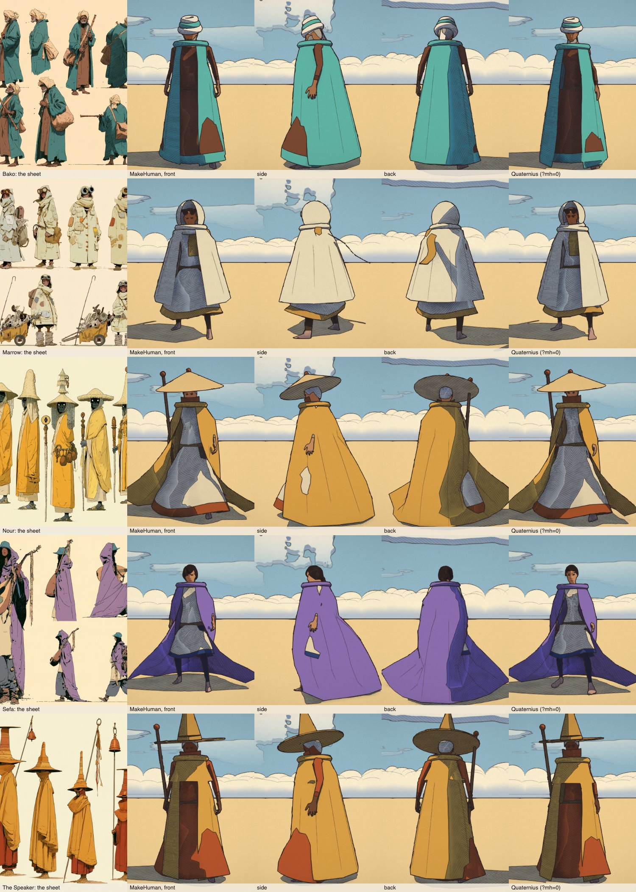
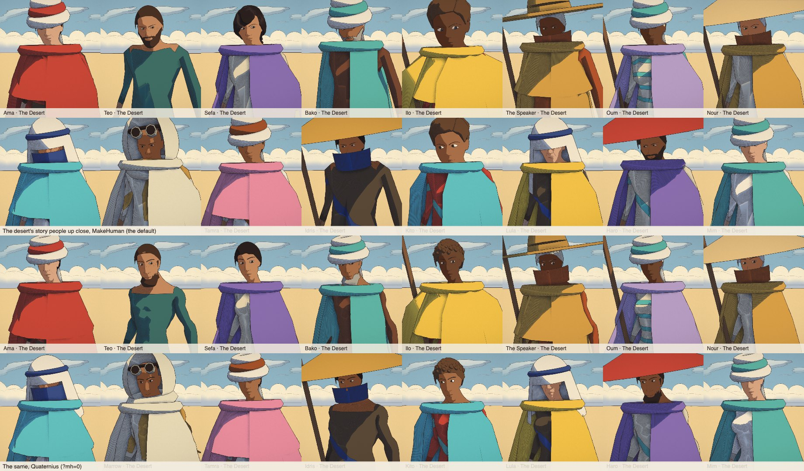
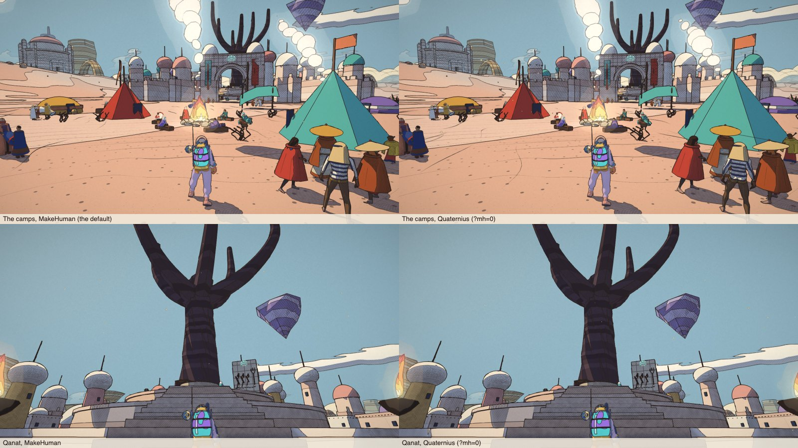
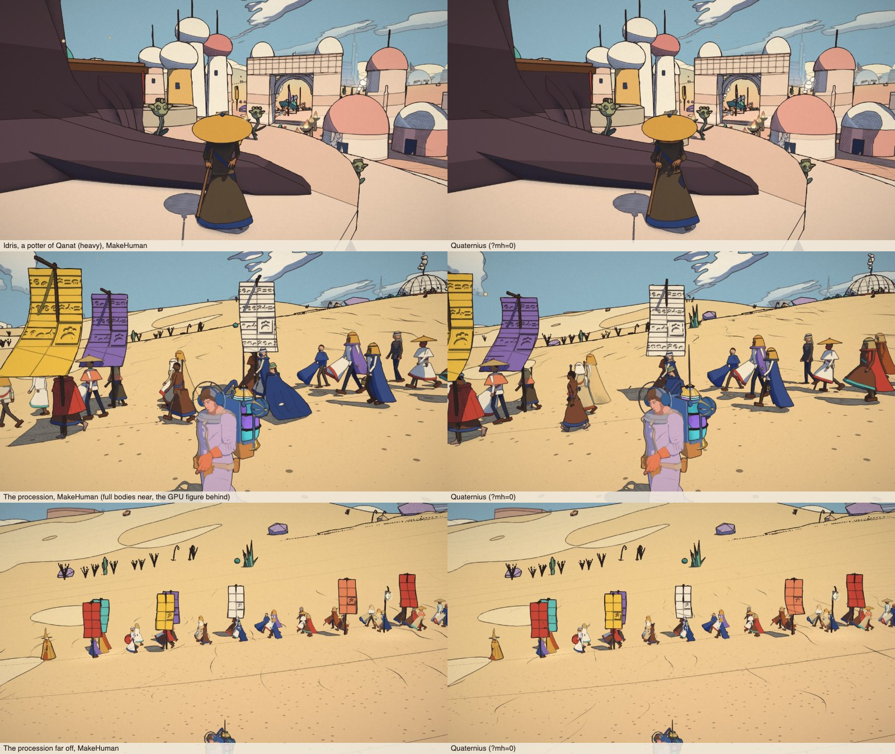

# MakeHuman / MPFB bodies: the prototype, and stage 1 of the switch

The question (TODO, "Faces and bodies"): would people built from MakeHuman read better than the
Quaternius Universal Base Characters the game uses, through the same ink pass? This is the
prototype that answers it: eight MakeHuman people on the game's skeleton, with face shape keys,
as a second body source in the character studio only. The game's own people are unchanged.

**Recommendation: switch, in stages, keeping everything above the mesh.** The bodies are the
clear win: a child, a teenager, heavy people and the old come out of MakeHuman as real bodies of
their age and build, where the Quaternius ones are one adult man and one adult woman stretched by
`morph.js` (Lou is a man's body with a 1.3× head). The faces read as more human and their
expressions move the skin itself (a smile lifts the cheeks, worry raises the inner brows), while
the game's face ink still draws them the Moebius way; they are less stylised than the reshaped
Quaternius heads (no long gaunt face, realistically small eyes that close to slits at a distance),
which MakeHuman's own face targets can bring back. Animation, feet, the motion capture and the
costumes carry over almost as they are, because MakeHuman's `game_engine` rig has the game
skeleton's bone names (the Unreal mannequin's). The skin weights are no worse (no better at the
elbows and knees, fewer pinched triangles at the shoulders and hips). What a full switch would take
is listed at the end. The real costs were file size (eight baked people were 6.4 MB against 1 MB) and
the hair and face fitting; both have clear fixes.

**Stage 1 is in (below)**: one parametric body for everyone (1.7 MB, 1.0 gzipped), MakeHuman's own
CC0 hair as shells with strand lines, the eyes opened, the Moebius face as targets, levels of detail for
shape-keyed bodies; behind the studio's Body source and the game's `?mh=1`. The prototype's eight baked
people (and their manifest) are gone: they are points of the parametric body now (the studio's presets).

**Stage 2 is in for the Desert (below)**: its people, story and crowd, are MakeHuman bodies by default
(`?mh=0` brings back the Quaternius ones), every look checked on every age and build, the story's
children made children, the crowd and the colliders matched, the crown holes and the dark hair fixed,
the body shipped in one file. The other worlds follow one by one.

## Licences (what the sources say)

All the data in `public/anim/mh/` comes from assets their authors publish under **CC0 1.0
Universal**; MPFB's code (GPLv3) and MakeHuman's (AGPL) are tools here and none of their code is
in the game. The exact texts, as published on 2026-10-05:

- **MPFB** (2.0.17, from extensions.blender.org; repository
  <https://github.com/makehumancommunity/mpfb2>), `LICENSE.md`:
  > C. The license for the bundled assets
  > The assets are defined as any data contributing to the output from MPFB. This includes:
  > * The base mesh and proxies * Targets and modifiers * Textures * Clothes (any MHCLO-based asset)
  > * Rigs, poses and expressions * JSON data with mesh information
  > These assets have been released under CC0 1.0 Universal. In summary this means that to the
  > fullest extent possible, it is the intention of the MakeHuman team that anyone can do whatever
  > they want with it.

  > D. Concerning the output from MPFB
  > It is the opinion of the MakeHuman team that no output from MPFB contains any trace of program
  > logic. That is, regardless of whether you use the UI as such or if you call functions of MPFB
  > via a script (such as an addon that extends MPFB), what you get is a combination of assets and
  > your own creative input. As the assets have been released under CC0, there is no limitation on
  > what you can do with this combined output.
  > To make it clear, the MakeHuman team makes no claim whatsoever over output such as:
  > * Exports to files (FBX, OBJ, DAE, MHX2...) * Graphical data generated via scripting or plugins
  > * Renderings * Screenshots * Saved model files

  The source code part: "The MPFB source (as defined per the above) is released under GPLv3."
  `LICENSE.ASSETS.md` is the full CC0 1.0 legal code.
- **MakeHuman** (<https://github.com/makehumancommunity/makehuman/blob/master/LICENSE.md>) says
  the same for its bundled assets ("The base mesh and proxies, Targets and modifiers, Textures,
  Clothes (any MHCLO-based asset), Poses and expressions ... have been released under CC0 1.0
  Universal") and for output "regardless of whether you use the UI as such or if you call functions
  of MakeHuman via a script". It adds: "If you use a third part asset, such as one downloaded from
  the asset repositories, it is your own responsibility to make sure you abide by its specific
  license."
- The site's licence page (<https://static.makehumancommunity.org/about/license.html>): "All core
  assets are shared under Creative Commons, CC0. The effective consequence of this is that you are
  free to do as you see fit with the asset or derivates of the assets. You do not need to pay
  anything, include any copyright notices nor give attribution." The MPFB FAQ "Is it really free?":
  "There are in practice no restrictions on neither output nor bundled graphical assets (all core
  asset such as the base mesh, targets and skins are shared under CC0)".
- **The asset packs used**: `makehuman_system_assets` (every asset listed CC0, author
  makehuman_system: <https://static.makehumancommunity.org/assets/assetpacks/makehuman_system_assets.html>;
  the files' headers: "This asset was explicitly released as CC0 in september 2020"), from which
  the low-poly eyes, the eyebrows and (stage 1) the ten hairstyles afro01, bob01, bob02, braid01,
  long01, ponytail01, short01–04 (each `.mhclo` header carries that same sentence); `faceunits01` (ARKit face units) and `visemes01` (Microsoft
  visemes), both by Mika Suominen, every target's metadata `"license": "CC0"`
  (<https://static.makehumancommunity.org/assets/assetpacks/faceunits01.html>, `visemes01.html`).
- **To avoid, or to credit**: the community asset packs mix licences. Some are CC-BY (attribution
  required: for example every one of the 21 hairstyles in `hair02`); others CC0. Each pack's page
  lists the licence per asset. Older pages describe a superseded scheme (AGPL assets with a CC0
  exception only for exports from the unmodified GUI: "no longer valid for MakeHuman 1.2.0 and
  later", <http://www.makehumancommunity.org/content/license_explanation.html>). Keep to the
  bundled assets and the CC0 packs above. `public/anim/mh/LICENSE-MakeHuman-CC0.txt` records the
  sources next to the files.

## Stage 1: one parametric body, MakeHuman's own hair (2026-10-05)

Behind the studio's *Body source: MakeHuman* and the game's `?mh=1`; without the flag the game's
people are the Quaternius ones, and the traveller always is (his suit and gear are fitted to his body).

### The pipeline (no GUI)

```
scripts/makehuman/fetch.sh            # Blender 4.5 LTS (unpacked, not installed), MPFB 2.0.17 into
                                      # Blender's own user folder, the CC0 packs: .local-tools/makehuman/
scripts/makehuman/build.sh [workers]  # build.py --reference, --samples i/n (in parallel), --pack
node scripts/makehuman/skin-audit.mjs # the skin weights in the game's clips
```

`build.py` runs in Blender's background mode (`-b -noaudio`), MPFB's Python services driven
directly; about 15 s for the reference and 0.4 s a sample (100 corners and 19 targets: a minute on 6
workers). Its steps:

1. **The reference** (every macro at 0.5): MPFB's base mesh (hm08), the `game_engine` rig and its
   weights, the low-poly eyes and two eyebrows (a fine one; a man's), MPFB's T-pose for that rig, the
   arms made straight and level, the neck and head turned back by a fixed 0.05 rad (the face standing as
   the Quaternius ones do), applied as the rest pose. The helper geometry dropped, the body decimated
   to 12 000 triangles (Blender's Decimate, symmetric; the head kept whole and the hands finer: 5 250 of
   the 6 001 vertices are the full mesh's own) and **every low vertex written as a point of the full
   mesh** (a triangle and its barycentric weights), so any other shape of the same full mesh maps onto
   the same low mesh. The ARKit face units and visemes as shape keys, carried onto the brows, merged
   left with right and cut to the 11 the game uses. The bones' rest rotations as Blender's glTF exporter
   writes them (a scratch export), so the game's skeleton has the prototype's frames.
2. **The samples**: MakeHuman blends its macro targets multilinearly between corners: gender
   (female, male) × age (its slider's 0, 0.1875, 0.5, 1: 1, 11, 25 and 90 years) × muscle × weight
   (min, average, max), and height and proportions lean each gender and age one way or the other. So
   the build makes exactly those corners (72, and 28 for height and proportions), each posed and
   framed like the reference (scaled so the hips stand where the Quaternius man's do, the skull where
   his is front to back) and mapped onto the low mesh: the body, the eyes, both brows and every bone's
   head. And the reference with a few targets of its own: a belly, wider hips and waist (the heavy:
   MakeHuman's weight slider at its top is only moderately heavy), and the face's targets (below).
3. **The pack** (`pack.py`): the corners' principal components (27 of them, enough that no point of
   the head is off by more than 4 mm at any corner and 99% of all points within 2 mm; the worst, 18 mm,
   is at the crotch of the most extreme corners, under the trousers), int16 for the strongest eight,
   int8 for the rest; each corner's coefficients; the targets and the face keys as sparse int16 deltas;
   the topology, the skin (4 bones a vertex, bytes), the bones; the hair (below). **`body.bin` 1 668 KB
   (1 043 KB gzipped) + `body.json` 29 KB for everyone** (stage 2: one file, 1 710 KB with its header and
   the scalps), against 6.4 MB for the prototype's eight
   people: components 776 KB, hair 346, targets 159, face keys 157, topology and skin 117, the mean 89.

### In the game's code (`src/makehuman/`)

- `shape.js`: who someone is as MakeHuman's sliders (`personParams`: kind, years, build, world;
  `MH_BUILDS` slim / average / broad / heavy as muscle and weight, the heavy with the belly and hip
  targets; `WORLD_BODIES` each world's proportions, height and a lean of their builds: the desert's lean
  and long-limbed, the market's sturdier; `AGES` child 8, teen 15, grown-up 32, elder 72), and the
  sliders as the corners' weights (`nodeWeights`, MakeHuman's own blend: a corner is exactly its sample).
- `body.js`: `makeBody` (about 10 ms a person; cached) makes the points (the mean plus the weighted
  components, the targets, the face's scaled with the head), opens the eyes, builds the skeleton (each
  bone at this person's joints, turned as the reference's), the skinned body, eyes and brows (tapered:
  the warmer faces' finer stroke) with the face keys as morph targets, measures what the game needs
  (`measure`: the face ink's landmarks, the outfit's regions, the ears, the skull for the hats) and
  hands Humanoid a profile it reads instead of its per-kind tables, as the prototype's did.
- `people.js`: the game's family of bodies. `main.js` (with `?mh=1`) passes `[man, woman]` where it
  passed the Quaternius pair; `NPC` asks it for the person's own (`templateFor`: a story child or elder
  by `def.age`, an elder by their look's face, their build, their world). A template is a skeleton and a
  body; the other builds are MakeHuman bodies on that skeleton (`profile.buildGeometry`), so a crowd's
  pooled body, a grown-up of average build, takes each person's build as the Quaternius ones do, and a
  world has at most a few dozen distinct bodies. A child stands as tall as the story says (`heightFix`:
  its bigger head taken off), keeps only the ink of a Quaternius face morph (`filterFace`: Lou's
  `eyeSize 1.45` was for a man's body) and none of the body morphs, and its face is drawn bare
  (`profile.young`, face-ink.js `faceYouth`); a grown-up keeps half of a face morph's shape.
- `hair.js`: the hair (next section) and `mhLookPieces`, the profile's costumes.js `lookPieces`.
- `humanoid.js` asks the profile for the builds, the look's pieces (and the skinned shells), a face and
  body morph filter and a child's youth: five small hooks; `npc.js` one line; `skinned-lod.js` one.

### Hair: MakeHuman's own, drawn as shapes

A MakeHuman hairstyle is a few hundred alpha-textured cards; through a flat-colour ink pass they
would be strips and holes, and the prototype's scaled Quaternius hair read as a helmet. The ten CC0
styles (afro01, bob01, bob02, braid01, long01, ponytail01, short01–04; never the CC-BY `hair02`) are
fitted by MPFB to the reference and made into closed shells (`scripts/makehuman/hair.py`): the cards
cut to their texture's strands (the alpha widened a little), thickened and voxel-remeshed (5.5 mm) into
one volume with the style's cut, small islands dropped, smoothed into clean silhouettes, decimated
(2 000–3 300 triangles). The cards are grouped into a few big locks (k-means on where they lie,
squeezed along the fall of the hair: 6–11 a style), the borders between locks straightened along
themselves and pressed into a shallow groove; in the game each lock gets its own normals there,
turned into the groove (`creaseNormals`, 0.55 rad), so the ink pass draws every border as a clean
crease: a few strand lines, as Moebius draws hair. The **beard** is made the same way from the skin
itself: the jaw, chin, lower cheeks, sideburns and the upper lip, the lips clear, thickened 5.5 mm.

Each shell vertex is bound to the low body: its nearest point on a triangle of the head, neck or
upper back (never an arm) and its offset; on load it is fitted to the person's own triangle, the offset
scaled with their head, and weighted from that triangle's skin (the head, the neck, the upper spine).
So every style sits on every head, a child's or a heavy man's. The game's hairstyles map to the
nearest (`MH_HAIR`: curls → afro01, braid → braid01, tail → ponytail01, long and flow → long01, bob →
bob02 or bob01, short → short02 / short01 for men and short03 for women, crop, the topknot, buns and
locks over short04, swept → short01); MakeHuman has no topknot, bun or crest, so the game's own pieces
go on top, and the shaved head, the crest and the tonsure stay the game's. Under a hat, the game's cap,
on the measured skull.

### Faces

- **Eyes that read at a distance.** MakeHuman's eyes are realistically small and the upper lid rests
  half over the iris: at 50 px a face they were slits. Its eye-scale target on everyone (more on
  children), the upper lids lifted 1.2 mm over the iris (none at the corners) and the eyeballs grown 5%
  (`openEyes`); the eyeball's painted lid now comes down with the skin's blink key.
- **The Moebius face, as MakeHuman targets** (`MOEBIUS_FACE`, on grown-ups, three quarters of it on
  women, none on children): a longer, narrower chin, a narrower jaw, lean cheeks under clear
  cheekbones, a long, straight, narrower nose, an oval head, the brow a little forward. Each target is
  its own delta in the file, so the mix is tuned in `shape.js` without a rebuild.
- **The warmer faces kept**: the resting smile and each person's mood ride the shape keys (the ink
  draws its share, `INK_SHARE`), the brows are tapered and softened, the face shade is the warm one,
  and a child's face is drawn bare.

### Levels of detail

`skinned-lod.js` built no levels for meshes with morph targets, so a MakeHuman body drew all its
12 000 triangles at any distance. Its levels are now built without the shape keys (far off a face
has no expression to show; the full mesh, keys and all, comes back up close; the eyes and brows are
hidden from the same distance). In the Desert with `?mh=1`, 16 of 27 bodies drew a level: 69 000
triangles against 272 000.

### The skin weights in the clips

`skin-audit.mjs` on the parametric presets: the shoulders keep 0.83–0.84 of their girth (the
Quaternius bodies 0.89–0.91), elbows 0.66–0.67 (0.64–0.72), hips 0.80–0.84 (0.78–0.83), knees
0.57–0.62 (0.73–0.76: the coarser legs of the new decimation, which keeps the hands finer, lose a little
more volume at the knee in Jump and Climb_Up); the pinch measure finds no triangles wholly blended at the
joints on the coarser mesh, so it reads 0% (no signal, not a result). In the clips nothing tears or
twists visibly.

## Side by side, through the same ink pass

All rendered with the game's own pipeline (shadows, G-buffer, ink pass, FXAA): the studio
(`studio.html`, Desert light) and the game (`?mh=1`).


*The prototype's eight people as points of the parametric body, each beside the Quaternius body made
to match (`lineup=makehuman`).*


*`lineup=mhbuilds&kind=m&mh=child` (and teen, adult, elder): slim, average, broad, heavy at 8, 15, 32
and 72. The heavy have a MakeHuman belly (9 cm deeper at the waist than the average man; it shows from
the side more than in these front views).*


*`lineup=mhhair`: the ten styles and the beard, from the front and from behind.*


*Faces at conversation distance, each pair Quaternius then MakeHuman (*Share → Faces sheet*).*


*The same face, each step twice as far; then figures at mid distance and far away (far: a level of
detail, no face keys).*


*The Desert's story people and crowds in the studio, and the game at a crowd with and without `?mh=1`.
In the game most people at a crowd's distance are the GPU crowd figure, which stage 1 leaves as it is;
only the story people and the four nearest crowd people are full bodies.*


What they show:

- **Hair** reads as hair of its cut now, a few shapes with strand lines, not a helmet; on the shaded side
  dark hair is one dark shape (its lines dark on dark), as Moebius often leaves it. Two small holes
  remain at the crown of short02 and short04 from behind, where the cards left a gap the remesh didn't
  close (stage 2 closes them and lightens the strand lines on dark hair: below).
- **Eyes** are open and the iris reads at mid distance; up close the faces are MakeHuman's (more human
  than the Quaternius ones, less stylised), with the Moebius targets giving the grown-ups longer, leaner
  faces than MakeHuman's default.
- **Bodies**: children, teenagers, the heavy and the old in their own proportions, from one file.
- **Crowds**: in the game the difference is small, because the crowd's mid tier is the GPU figure; the
  full NPCs (story people, the nearest crowd people) are MakeHuman.

## Stage 2: the Desert's people (2026-10-05)

The Desert's people, its story people and its crowd, are MakeHuman bodies by default
(`MH_WORLDS` in `src/makehuman/people.js`); `?mh=0` brings back the Quaternius ones to compare and
`?mh=1` puts any world's people on MakeHuman. The other worlds stay on the Quaternius bodies until
their own review (the Signal Market next). What was checked and changed:

### Costumes on every body

Every desert look (the headcloths, sun hats, head-wraps, hoods, veils, beards, mantles, robes, capes,
staffs and baskets of the pilgrims; the procession; the keepers Ama and Hessa; the musicians Bako and
Sefa; Nour, Marrow, the Speaker, the gate guard Haro, Qanat's villagers and its two children) was
rendered from the front, the side and behind on every story person and on children, teenagers,
grown-ups, the heavy and the old (the studio: *who=npc* with *source=makehuman*, and the blank presets
with each piece). The pieces fit the MakeHuman bodies as they fit the Quaternius ones: the hats and
masks on the measured skull (`profile.headScale`), the robes round the body's own extent, the capes
round its colliders (below). What was off was not the fit but the people:

- **The story's children were small grown-ups**: Ilo and Kito had only a small `def.scale`; MakeHuman
  gave them a grown-up's body shrunk. The story now says who is a child (`def.age`, `def.years`: Ilo 8,
  Kito 9; Lou at home 7.5) and a small story person without an age is one (`CHILD_SCALE`).
- **Heights** (`heightFix`, `trueScale`): every MakeHuman sample stands with its hips where the
  Quaternius man's are, so a MakeHuman woman, longer in the leg, stood 5 % taller than a man in bind
  space (1.85 m against 1.80). A grown-up's root scale is corrected so a woman is as much shorter than a
  man of her world as the Quaternius woman is (`Q_TOP`: 1.767 against 1.81); a man stays as MakeHuman
  makes him. The young stand as tall as MakeHuman makes their age beside the grown-ups of their kind:
  Lou (7.5) 1.13 m, Ilo (8) 1.16 m, Kito (9) 1.30 m, against a man of 1.80 m and a woman of 1.68 m (Lou
  was 1.48 m; with `?mh=1` at home she is now a child's height).
- **The named people against their character sheets** (`references/The Desert/characters/`): Bako was
  a broad grown-up in a sun hat and veil, Nour a slim grown-up in blue, Marrow an elder in a sun hat
  (his face drew the elder type). Now Bako is an old man (70) with a head-wrap, a grey beard and a long
  teal coat over a brown robe; Nour is old (80) and slim, under a wide straw cone with a veil, ochre
  robes over cream, her staff; Marrow is a grown-up, short, in a patched cream hood and coat, goggles
  pushed up, a scarf, amused; Sefa wears a long purple cloak over a cream tunic and trousers, her
  braid down her back (MakeHuman's braid01); the Speaker a tall wide-brimmed hat, a high collar over
  his mouth, a mustard poncho over a rust robe and his staff. The changes are the looks' own (both
  bodies wear them).


*Each sheet, the person on their MakeHuman body from the front, the side and behind, and on the
Quaternius body (`?mh=0`).*



Seen on both bodies alike, so the kit's and left as they are: the head-wrap sits low on the brow (on a
child's bigger head it shades the eyes), the wrap's tail stands off the neck, the headcloth's back is a
box behind the head, a cape's lining shows where the cloth folds over, and a long cape (1.25 m and
more) pools on the ground round a child (no story child wears one).

What the sheets have that the costume kit doesn't (left for later): Bako's satchel and ney (the rig's
satchel would sit under his coat), Marrow's cart and hook, Sefa's oud and cap over her braid, the
keepers' bead fringes and hanging keys, the Speaker's bell staff.

### The traveller: kept on his own body

Re-fitting him would mean a new `suitGeometry` (the baggy copy of the body the suit is painted on),
re-placing every piece of `traveller.glb` (helmet, tank, bracers, belt, pack frame: fitted by hand to
the Quaternius man, `travellerKit`) and the face he wears under the visor (`TRAVELLER.face`). Kept, he
costs nothing, and he reads right among MakeHuman people: he is the one stranger from the sky, his suit
hides the body, and up close his face is framed by the helmet's glass; his height (1.81 m) is a
MakeHuman man's (1.80 m). The animation, feet, hands and capes are the same code on both bodies.

### The crowd

- **Promoted, nothing pops**: a pooled crowd body (a grown-up of average build, on that skeleton) took
  each person's build; it now takes their age too (an elder: `Humanoid.setBuild(build, years)`, the
  template's `yearsOf`, MakeHuman's elder shape on the same skeleton: its joints are within 1.5 cm of
  the grown-up's), and stands as tall as its figure (`assign` applies `heightFix`). The 16 shapes a
  pooled body can take (4 builds, grown-up and elder, each kind) are made ahead, one at a time while
  the page is idle (`MakeHumanPeople.warm`), so nobody coming close waits for theirs.
- **The figure** (`crowd-shader.js`): measured against the MakeHuman bodies at their game heights the
  figure was right in height (1.81 / 1.67 m against 1.80 / 1.67) and at the neck and shoulders' height;
  a woman's shoulders were 1.8 cm too wide (0.186 m against 0.168) and everyone's hips 1.5 cm too narrow
  (0.093 against 0.111). `CROWD_BODY` moves them (a woman's shoulders 12 % in, the hips 17 % out), which
  is closer to the Quaternius bodies too. `tests/makehuman-desert.test.js` holds them within 1.2 cm.




### Cloth and ragdolls round the new girths

The cape colliders were fixed radii per segment (the Quaternius man's, widened by a build's girth), and
not scaled with the person: a child's trunk collider was a man's. On a MakeHuman body each collider is
now its own girth (`segmentGirths`: the 90th percentile of its vertices' distance to the segment, each
vertex counted for its strongest bone) plus the margin the Quaternius colliders leave over their own
skin (`CAPSULE_MARGIN`: 7 cm at the hips, where the cloth falls clear, 2-3 cm on the limbs), at the
body's size. The heavy man's trunk collider is 0.31 m (the fixed one, 0.26 m, left the cloth 2 cm over his 0.24 m
belly where the Quaternius bodies leave it 7 cm), a child's in proportion. The ragdoll's particles take the same girths (`ragdollRadii`), so a
heavy body lies on its belly or its back, not half in the ground. The Quaternius bodies keep their
tables.

### Hair

- **The crown holes** of short02 and short04 were the skin showing where the smoothed shell had sunk
  under the scalp (the cards fan out at the whorl). Every style now carries a scalp (`hair.py`
  `scalp_of`: the head's triangles a ray down the skin's normal meets the shell over, above the brows
  and behind the ears, never the face), drawn in the hair's colour 1.5 mm off the skin (`hair.js`
  `scalpOf`): 510-740 triangles a style, 13 KB in the file.
- **Dark hair in shade** was one flat dark shape (the strand lines are dark creases). The vertices on
  the locks' borders now carry a weight, and the costume's colour there goes lighter (`HAIR_EDGE`: the
  darker the hair, the more; none from grey up), so the strands read as lighter lines in shade and a
  soft highlight in the sun.

### The file and its load

`body.bin` is one file: its JSON header in front (`'MHB1'`, its length, the header, padding to 8, the
arrays; `pack.py`, `unpackBody`). One fetch, asked for as the page starts (in parallel with the
Quaternius bodies, the traveller and the clips, not after them); the browser keeps it in its cache
between worlds and undoes its transfer gzip off the main thread; the parse (the header's JSON, the
head's vertices) takes 0.3-1 ms in Chrome, the arrays are views on the file. It ships with the build now
(`vite.config.js`; `MAKEHUMAN=0` leaves it out): +1.75 MB in the web bundle and the APK, +1.06 MiB
compressed in the over-the-air zip (deflate, as `web-update.mjs` packs it).

### Memory and frame time

Measured in headless Chrome on the Mac (the bench's viewpoints `camps` and `qanat-tree`,
`scripts/bench/viewpoints.json`, 1280 x 720, the hour 10), High and Handheld (its 0.75 render scale,
the CPU throttled 4x as a handheld stands-in), each the median of three runs alternating `?mh=0` (the
Quaternius bodies, before) and the default (MakeHuman, after), 9 s after arriving, 8-10 s recorded.
The Mac was shared with other work, so single runs swing by a third; the medians:

| | frame (ms) | CPU (ms) | JS heap (MB) | textures | geometries |
|---|---|---|---|---|---|
| camps, High, Quaternius | 10.7 | 10.5 | 270 | 78 | 755 |
| camps, High, MakeHuman | 9.9 | 9.7 | 333 | 112 | 768 |
| Qanat, High, Quaternius | 8.2 | 8.0 | 285 | 68 | 660 |
| Qanat, High, MakeHuman | 8.2 | 8.0 | 310 | 97 | 672 |
| camps, Handheld, Quaternius | 41.6 | 40.3 | 305 | 56 | 735 |
| camps, Handheld, MakeHuman | 41.7 | 40.2 | 337 | 81 | 741 |
| Qanat, Handheld, Quaternius | 41.0 | 38.6 | 260 | 56 | 655 |
| Qanat, Handheld, MakeHuman | 39.0 | 37.4 | 317 | 81 | 664 |

- **Frame time**: the same on both presets (the MakeHuman bodies draw fewer triangles far off: their
  levels; the faces' keys cost the GPU nothing measurable). A first run had the camps on Handheld 50 %
  slower in the first seconds after arriving: a crowd body come close re-dressed itself with a colour
  parsed per vertex (a MakeHuman costume, its hair, scalp and robe, is several thousand) and its hair's
  skin weights built a vertex at a time. Both are now done once a role and at once (`dress`,
  `skinnedPiece`), and the pooled shapes are made ahead (`warm`); a CPU profile of those first seconds
  now has the two bodies within 3 %, and settled (25 s in) the MakeHuman camps are a little quicker.
- **Memory**: +30 to +60 MB of JS heap and +25 to +34 textures: the face keys' morph textures and
  their CPU copies (three keeps both, about 1 MB each body that has come close: 7 by the tree, 11 at
  the camps), the templates' key arrays (0.8 MB each template; shared between its builds and faces now),
  the body file itself (1.75 MB, its arrays views on it). In node, the 16 story people dressed take
  35 MB on MakeHuman bodies against 16 MB on the Quaternius ones.
- **Loading**: reading the file 19 ms, its parse 0.3-1 ms (the header's JSON, the head's vertices), a
  person's template 7-9 ms (about 15 distinct ones at the desert's start); the page took as long to
  start either way.

### The Unity export

It still exports the Quaternius bodies (`scripts/unity-export/build-world.mjs` loads `human_m.glb` /
`human_f.glb`), so it keeps working; the named people's new looks go with it. To follow the web
build it needs: the body's file read with `parseBody` and a `MakeHumanPeople` family passed as
`humans` for the desert; the face keys written as blend shapes (11 a body; or the faces stay at rest);
the hair shells and the scalp are ordinary skinned costume meshes and need nothing.

### Left before the next world (the Signal Market)

1. Its looks on every age and build (the market's hats, turbans, aprons, the skybridge couriers), its
   children by `def.age` / `def.years` (Kip, 0.78), its crowd; then add it to `MH_WORLDS`.
2. The face keys' morph textures: three makes one per geometry (about 1 MB each body that comes close:
   7 by Qanat's tree, 11 at the camps). Sharing them between the bodies of one template needs a renderer hook (or a head-only
   morph mesh); the arrays behind them are shared already.
3. The Unity export (above) and the Lab's faces gallery, which still show the Quaternius bodies.
4. The props the sheets show that the kit lacks (above).

## What a full switch would take

1. ~~One parametric body~~: done (stage 1). ~~Levels of detail~~: done. ~~Hair fitted to the skull~~ and
   ~~the beard~~: done. ~~Eyes bigger, the Moebius stylisation as targets~~: done.
2. ~~Costumes, re-checked per body~~: done for the Desert (stage 2); each next world's own looks.
3. ~~The traveller's suit and gear~~: he stays on his own body (stage 2: why).
4. ~~The GPU crowd figure~~ matched, ~~a promoted crowd person their age and build~~: done (stage 2).
5. ~~Ragdoll capsules and cape colliders~~: each MakeHuman body's own girths (stage 2).
6. **The Unity export** (`scripts/unity-export`) and the Lab's faces gallery still read the Quaternius
   bodies (stage 2 says what the export needs); the tests that load `human_m.glb` / `human_f.glb` for the
   per-kind tables stay as they are until those tables go.
7. **Memory**: the arrays are shared between a template's bodies (stage 2); the morph textures are still
   one per geometry (about 1 MB each body that comes close): share them with a renderer hook, or keep
   only the head's vertices in a separate morph mesh.
8. **The flip, world by world**: the Desert is flipped and the file ships (stage 2); the Signal Market
   next, then the others (`MH_WORLDS`).
