# MakeHuman / MPFB bodies: the prototype, and stage 1 of the switch

The question (TODO, "Faces and bodies"): would people built from MakeHuman read better than the
Quaternius Universal Base Characters the game uses, through the same ink pass? This is the
prototype that answers it: eight MakeHuman people on the game's skeleton, with face shape keys,
as a second body source in the character studio only. The game's own people are unchanged.

**Recommendation: switch, in stages, keeping everything above the mesh.** The bodies are the
clear win: a child, a teenager, heavy people and the old come out of MakeHuman as real bodies of
their age and build, where the Quaternius ones are one adult man and one adult woman stretched by
`morph.js` (Lou is a man's body with a 1.3× head). The faces read as more human and their
expressions move the skin itself (a smile lifts the cheeks, worry raises the inner brows), while
the game's face ink still draws them the Moebius way; they are less stylised than the reshaped
Quaternius heads (no long gaunt face, realistically small eyes that close to slits at a distance),
which MakeHuman's own face targets can bring back. Animation, feet, the motion capture and the
costumes carry over almost as they are, because MakeHuman's `game_engine` rig has the game
skeleton's bone names (the Unreal mannequin's). The skin weights are no worse (no better at the
elbows and knees, fewer pinched triangles at the shoulders and hips). What a full switch would take
is listed at the end. The real costs were file size (eight baked people were 6.4 MB against 1 MB) and
the hair and face fitting; both have clear fixes.

**Stage 1 is in (below)**: one parametric body for everyone (1.7 MB, 1.0 gzipped), MakeHuman's own
CC0 hair as shells with strand lines, the eyes opened, the Moebius face as targets, levels of detail for
shape-keyed bodies; behind the studio's Body source and the game's `?mh=1`. The prototype's eight baked
people (and their manifest) are gone: they are points of the parametric body now (the studio's presets).

## Licences (what the sources say)

All the data in `public/anim/mh/` comes from assets their authors publish under **CC0 1.0
Universal**; MPFB's code (GPLv3) and MakeHuman's (AGPL) are tools here and none of their code is
in the game. The exact texts, as published on 2026-10-05:

- **MPFB** (2.0.17, from extensions.blender.org; repository
  <https://github.com/makehumancommunity/mpfb2>), `LICENSE.md`:
  > C. The license for the bundled assets
  > The assets are defined as any data contributing to the output from MPFB. This includes:
  > * The base mesh and proxies * Targets and modifiers * Textures * Clothes (any MHCLO-based asset)
  > * Rigs, poses and expressions * JSON data with mesh information
  > These assets have been released under CC0 1.0 Universal. In summary this means that to the
  > fullest extent possible, it is the intention of the MakeHuman team that anyone can do whatever
  > they want with it.

  > D. Concerning the output from MPFB
  > It is the opinion of the MakeHuman team that no output from MPFB contains any trace of program
  > logic. That is, regardless of whether you use the UI as such or if you call functions of MPFB
  > via a script (such as an addon that extends MPFB), what you get is a combination of assets and
  > your own creative input. As the assets have been released under CC0, there is no limitation on
  > what you can do with this combined output.
  > To make it clear, the MakeHuman team makes no claim whatsoever over output such as:
  > * Exports to files (FBX, OBJ, DAE, MHX2...) * Graphical data generated via scripting or plugins
  > * Renderings * Screenshots * Saved model files

  The source code part: "The MPFB source (as defined per the above) is released under GPLv3."
  `LICENSE.ASSETS.md` is the full CC0 1.0 legal code.
- **MakeHuman** (<https://github.com/makehumancommunity/makehuman/blob/master/LICENSE.md>) says
  the same for its bundled assets ("The base mesh and proxies, Targets and modifiers, Textures,
  Clothes (any MHCLO-based asset), Poses and expressions ... have been released under CC0 1.0
  Universal") and for output "regardless of whether you use the UI as such or if you call functions
  of MakeHuman via a script". It adds: "If you use a third part asset, such as one downloaded from
  the asset repositories, it is your own responsibility to make sure you abide by its specific
  license."
- The site's licence page (<https://static.makehumancommunity.org/about/license.html>): "All core
  assets are shared under Creative Commons, CC0. The effective consequence of this is that you are
  free to do as you see fit with the asset or derivates of the assets. You do not need to pay
  anything, include any copyright notices nor give attribution." The MPFB FAQ "Is it really free?":
  "There are in practice no restrictions on neither output nor bundled graphical assets (all core
  asset such as the base mesh, targets and skins are shared under CC0)".
- **The asset packs used**: `makehuman_system_assets` (every asset listed CC0, author
  makehuman_system: <https://static.makehumancommunity.org/assets/assetpacks/makehuman_system_assets.html>;
  the files' headers: "This asset was explicitly released as CC0 in september 2020"), from which
  the low-poly eyes, the eyebrows and (stage 1) the ten hairstyles afro01, bob01, bob02, braid01,
  long01, ponytail01, short01–04 (each `.mhclo` header carries that same sentence); `faceunits01` (ARKit face units) and `visemes01` (Microsoft
  visemes), both by Mika Suominen, every target's metadata `"license": "CC0"`
  (<https://static.makehumancommunity.org/assets/assetpacks/faceunits01.html>, `visemes01.html`).
- **To avoid, or to credit**: the community asset packs mix licences. Some are CC-BY (attribution
  required: for example every one of the 21 hairstyles in `hair02`); others CC0. Each pack's page
  lists the licence per asset. Older pages describe a superseded scheme (AGPL assets with a CC0
  exception only for exports from the unmodified GUI: "no longer valid for MakeHuman 1.2.0 and
  later", <http://www.makehumancommunity.org/content/license_explanation.html>). Keep to the
  bundled assets and the CC0 packs above. `public/anim/mh/LICENSE-MakeHuman-CC0.txt` records the
  sources next to the files.

## Stage 1: one parametric body, MakeHuman's own hair (2026-10-05)

Behind the studio's *Body source: MakeHuman* and the game's `?mh=1`; without the flag the game's
people are the Quaternius ones, and the traveller always is (his suit and gear are fitted to his body).

### The pipeline (no GUI)

```
scripts/makehuman/fetch.sh            # Blender 4.5 LTS (unpacked, not installed), MPFB 2.0.17 into
                                      # Blender's own user folder, the CC0 packs: .local-tools/makehuman/
scripts/makehuman/build.sh [workers]  # build.py --reference, --samples i/n (in parallel), --pack
node scripts/makehuman/skin-audit.mjs # the skin weights in the game's clips
```

`build.py` runs in Blender's background mode (`-b -noaudio`), MPFB's Python services driven
directly; about 15 s for the reference and 0.4 s a sample (100 corners and 19 targets: a minute on 6
workers). Its steps:

1. **The reference** (every macro at 0.5): MPFB's base mesh (hm08), the `game_engine` rig and its
   weights, the low-poly eyes and two eyebrows (a fine one; a man's), MPFB's T-pose for that rig, the
   arms made straight and level, the neck and head turned back by a fixed 0.05 rad (the face standing as
   the Quaternius ones do), applied as the rest pose. The helper geometry dropped, the body decimated
   to 12 000 triangles (Blender's Decimate, symmetric; the head kept whole and the hands finer: 5 250 of
   the 6 001 vertices are the full mesh's own) and **every low vertex written as a point of the full
   mesh** (a triangle and its barycentric weights), so any other shape of the same full mesh maps onto
   the same low mesh. The ARKit face units and visemes as shape keys, carried onto the brows, merged
   left with right and cut to the 11 the game uses. The bones' rest rotations as Blender's glTF exporter
   writes them (a scratch export), so the game's skeleton has the prototype's frames.
2. **The samples**: MakeHuman blends its macro targets multilinearly between corners: gender
   (female, male) × age (its slider's 0, 0.1875, 0.5, 1: 1, 11, 25 and 90 years) × muscle × weight
   (min, average, max), and height and proportions lean each gender and age one way or the other. So
   the build makes exactly those corners (72, and 28 for height and proportions), each posed and
   framed like the reference (scaled so the hips stand where the Quaternius man's do, the skull where
   his is front to back) and mapped onto the low mesh: the body, the eyes, both brows and every bone's
   head. And the reference with a few targets of its own: a belly, wider hips and waist (the heavy:
   MakeHuman's weight slider at its top is only moderately heavy), and the face's targets (below).
3. **The pack** (`pack.py`): the corners' principal components (27 of them, enough that no point of
   the head is off by more than 4 mm at any corner and 99% of all points within 2 mm; the worst, 18 mm,
   is at the crotch of the most extreme corners, under the trousers), int16 for the strongest eight,
   int8 for the rest; each corner's coefficients; the targets and the face keys as sparse int16 deltas;
   the topology, the skin (4 bones a vertex, bytes), the bones; the hair (below). **`body.bin` 1 668 KB
   (1 043 KB gzipped) + `body.json` 29 KB for everyone**, against 6.4 MB for the prototype's eight
   people: components 776 KB, hair 346, targets 159, face keys 157, topology and skin 117, the mean 89.

### In the game's code (`src/makehuman/`)

- `shape.js`: who someone is as MakeHuman's sliders (`personParams`: kind, years, build, world;
  `MH_BUILDS` slim / average / broad / heavy as muscle and weight, the heavy with the belly and hip
  targets; `WORLD_BODIES` each world's proportions, height and a lean of their builds: the desert's lean
  and long-limbed, the market's sturdier; `AGES` child 8, teen 15, grown-up 32, elder 72), and the
  sliders as the corners' weights (`nodeWeights`, MakeHuman's own blend: a corner is exactly its sample).
- `body.js`: `makeBody` (about 10 ms a person; cached) makes the points (the mean plus the weighted
  components, the targets, the face's scaled with the head), opens the eyes, builds the skeleton (each
  bone at this person's joints, turned as the reference's), the skinned body, eyes and brows (tapered:
  the warmer faces' finer stroke) with the face keys as morph targets, measures what the game needs
  (`measure`: the face ink's landmarks, the outfit's regions, the ears, the skull for the hats) and
  hands Humanoid a profile it reads instead of its per-kind tables, as the prototype's did.
- `people.js`: the game's family of bodies. `main.js` (with `?mh=1`) passes `[man, woman]` where it
  passed the Quaternius pair; `NPC` asks it for the person's own (`templateFor`: a story child or elder
  by `def.age`, an elder by their look's face, their build, their world). A template is a skeleton and a
  body; the other builds are MakeHuman bodies on that skeleton (`profile.buildGeometry`), so a crowd's
  pooled body, a grown-up of average build, takes each person's build as the Quaternius ones do, and a
  world has at most a few dozen distinct bodies. A child stands as tall as the story says (`heightFix`:
  its bigger head taken off), keeps only the ink of a Quaternius face morph (`filterFace`: Lou's
  `eyeSize 1.45` was for a man's body) and none of the body morphs, and its face is drawn bare
  (`profile.young`, face-ink.js `faceYouth`); a grown-up keeps half of a face morph's shape.
- `hair.js`: the hair (next section) and `mhLookPieces`, the profile's costumes.js `lookPieces`.
- `humanoid.js` asks the profile for the builds, the look's pieces (and the skinned shells), a face and
  body morph filter and a child's youth: five small hooks; `npc.js` one line; `skinned-lod.js` one.

### Hair: MakeHuman's own, drawn as shapes

A MakeHuman hairstyle is a few hundred alpha-textured cards; through a flat-colour ink pass they
would be strips and holes, and the prototype's scaled Quaternius hair read as a helmet. The ten CC0
styles (afro01, bob01, bob02, braid01, long01, ponytail01, short01–04; never the CC-BY `hair02`) are
fitted by MPFB to the reference and made into closed shells (`scripts/makehuman/hair.py`): the cards
cut to their texture's strands (the alpha widened a little), thickened and voxel-remeshed (5.5 mm) into
one volume with the style's cut, small islands dropped, smoothed into clean silhouettes, decimated
(2 000–3 300 triangles). The cards are grouped into a few big locks (k-means on where they lie,
squeezed along the fall of the hair: 6–11 a style), the borders between locks straightened along
themselves and pressed into a shallow groove; in the game each lock gets its own normals there,
turned into the groove (`creaseNormals`, 0.55 rad), so the ink pass draws every border as a clean
crease: a few strand lines, as Moebius draws hair. The **beard** is made the same way from the skin
itself: the jaw, chin, lower cheeks, sideburns and the upper lip, the lips clear, thickened 5.5 mm.

Each shell vertex is bound to the low body: its nearest point on a triangle of the head, neck or
upper back (never an arm) and its offset; on load it is fitted to the person's own triangle, the offset
scaled with their head, and weighted from that triangle's skin (the head, the neck, the upper spine).
So every style sits on every head, a child's or a heavy man's. The game's hairstyles map to the
nearest (`MH_HAIR`: curls → afro01, braid → braid01, tail → ponytail01, long and flow → long01, bob →
bob02 or bob01, short → short02 / short01 for men and short03 for women, crop, the topknot, buns and
locks over short04, swept → short01); MakeHuman has no topknot, bun or crest, so the game's own pieces
go on top, and the shaved head, the crest and the tonsure stay the game's. Under a hat, the game's cap,
on the measured skull.

### Faces

- **Eyes that read at a distance.** MakeHuman's eyes are realistically small and the upper lid rests
  half over the iris: at 50 px a face they were slits. Its eye-scale target on everyone (more on
  children), the upper lids lifted 1.2 mm over the iris (none at the corners) and the eyeballs grown 5%
  (`openEyes`); the eyeball's painted lid now comes down with the skin's blink key.
- **The Moebius face, as MakeHuman targets** (`MOEBIUS_FACE`, on grown-ups, three quarters of it on
  women, none on children): a longer, narrower chin, a narrower jaw, lean cheeks under clear
  cheekbones, a long, straight, narrower nose, an oval head, the brow a little forward. Each target is
  its own delta in the file, so the mix is tuned in `shape.js` without a rebuild.
- **The warmer faces kept**: the resting smile and each person's mood ride the shape keys (the ink
  draws its share, `INK_SHARE`), the brows are tapered and softened, the face shade is the warm one,
  and a child's face is drawn bare.

### Levels of detail

`skinned-lod.js` built no levels for meshes with morph targets, so a MakeHuman body drew all its
12 000 triangles at any distance. Its levels are now built without the shape keys (far off a face
has no expression to show; the full mesh, keys and all, comes back up close; the eyes and brows are
hidden from the same distance). In the Desert with `?mh=1`, 16 of 27 bodies drew a level: 69 000
triangles against 272 000.

### The skin weights in the clips

`skin-audit.mjs` on the parametric presets: the shoulders keep 0.83–0.84 of their girth (the
Quaternius bodies 0.89–0.91), elbows 0.66–0.67 (0.64–0.72), hips 0.80–0.84 (0.78–0.83), knees
0.57–0.62 (0.73–0.76: the coarser legs of the new decimation, which keeps the hands finer, lose a little
more volume at the knee in Jump and Climb_Up); the pinch measure finds no triangles wholly blended at the
joints on the coarser mesh, so it reads 0% (no signal, not a result). In the clips nothing tears or
twists visibly.

## Side by side, through the same ink pass

All rendered with the game's own pipeline (shadows, G-buffer, ink pass, FXAA): the studio
(`studio.html`, Desert light) and the game (`?mh=1`).

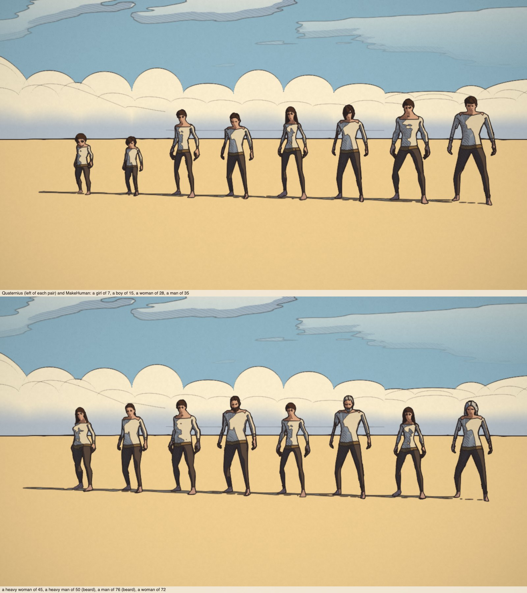
*The prototype's eight people as points of the parametric body, each beside the Quaternius body made
to match (`lineup=makehuman`).*

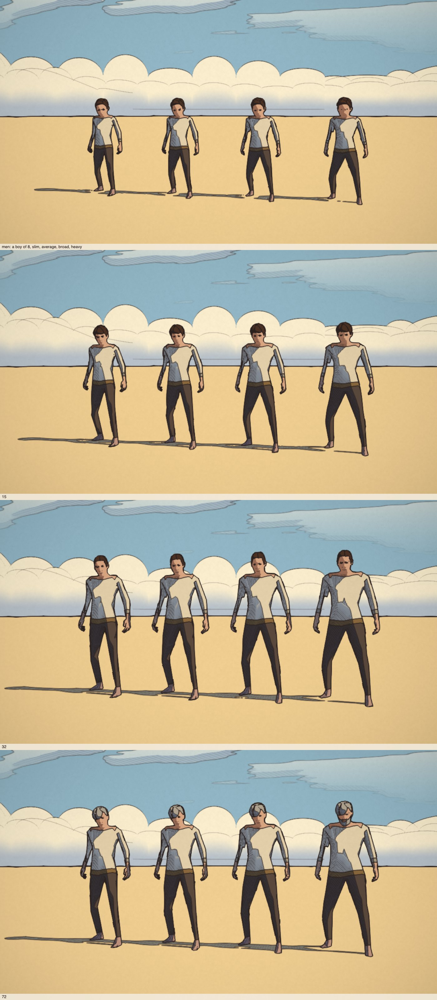
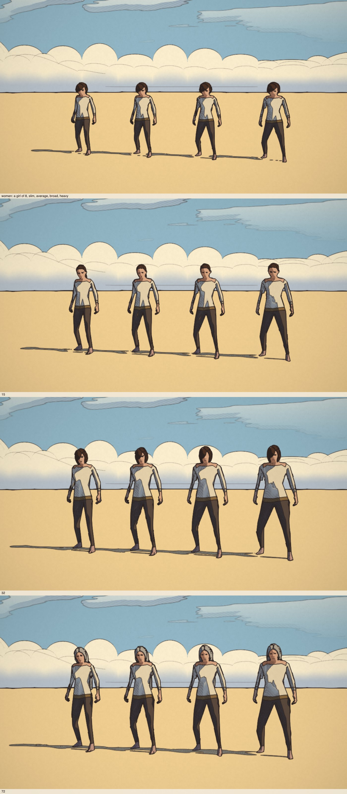
*`lineup=mhbuilds&kind=m&mh=child` (and teen, adult, elder): slim, average, broad, heavy at 8, 15, 32
and 72. The heavy have a MakeHuman belly (9 cm deeper at the waist than the average man; it shows from
the side more than in these front views).*

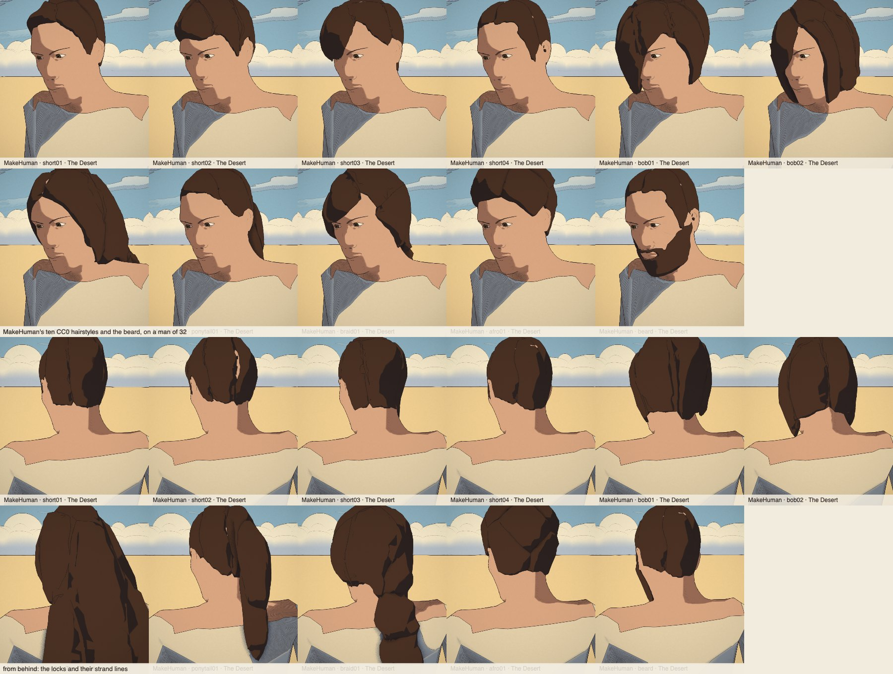
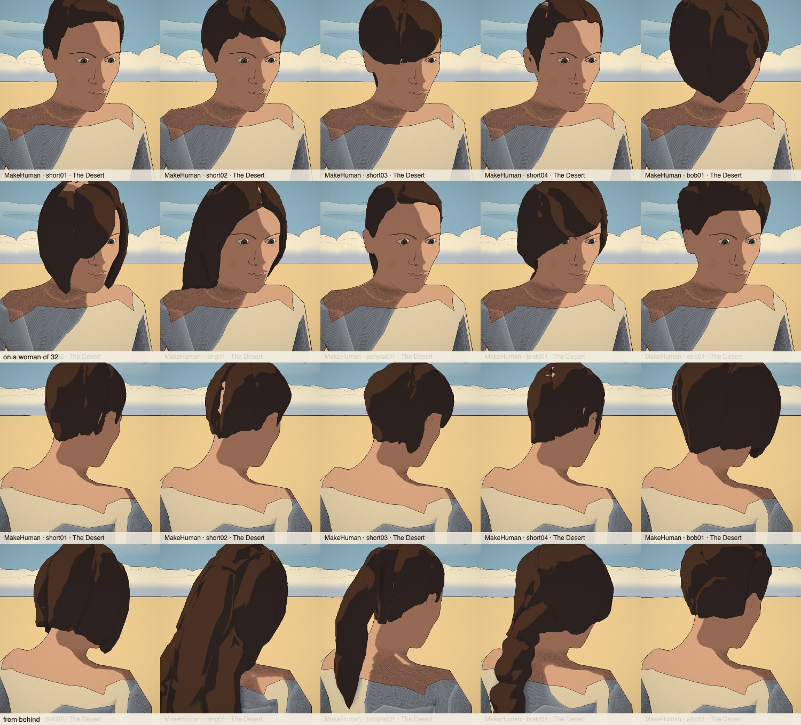
*`lineup=mhhair`: the ten styles and the beard, from the front and from behind.*


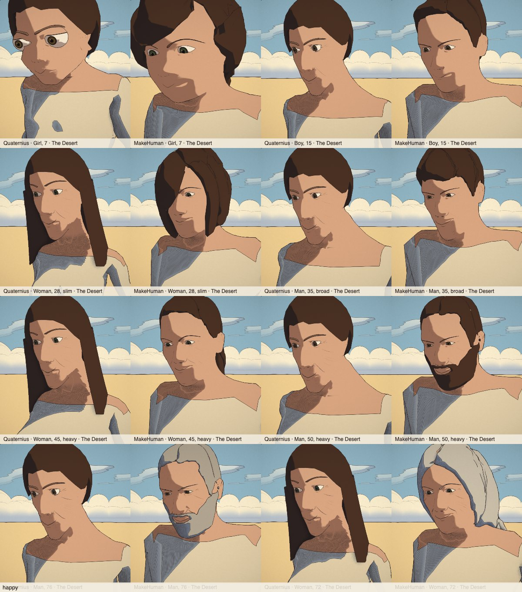
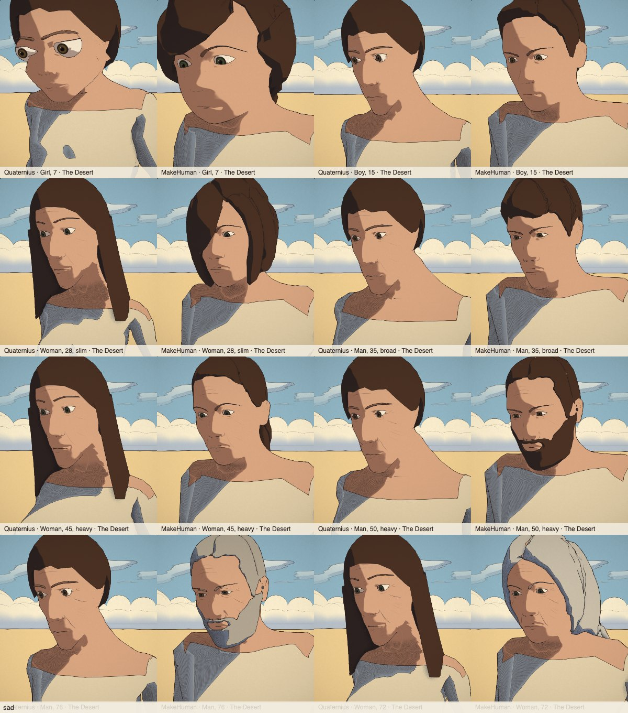
*Faces at conversation distance, each pair Quaternius then MakeHuman (*Share → Faces sheet*).*

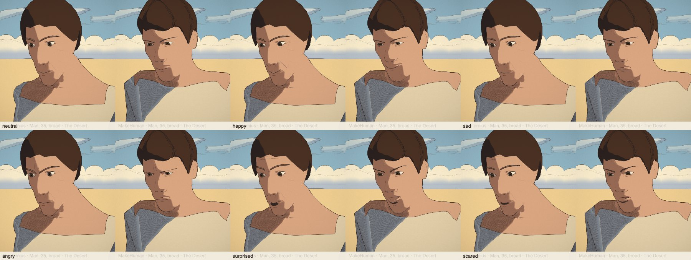

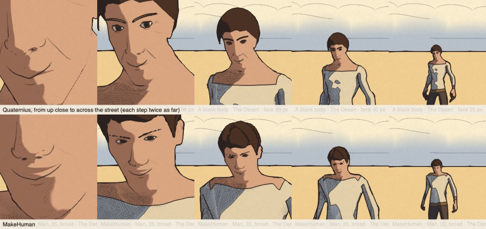
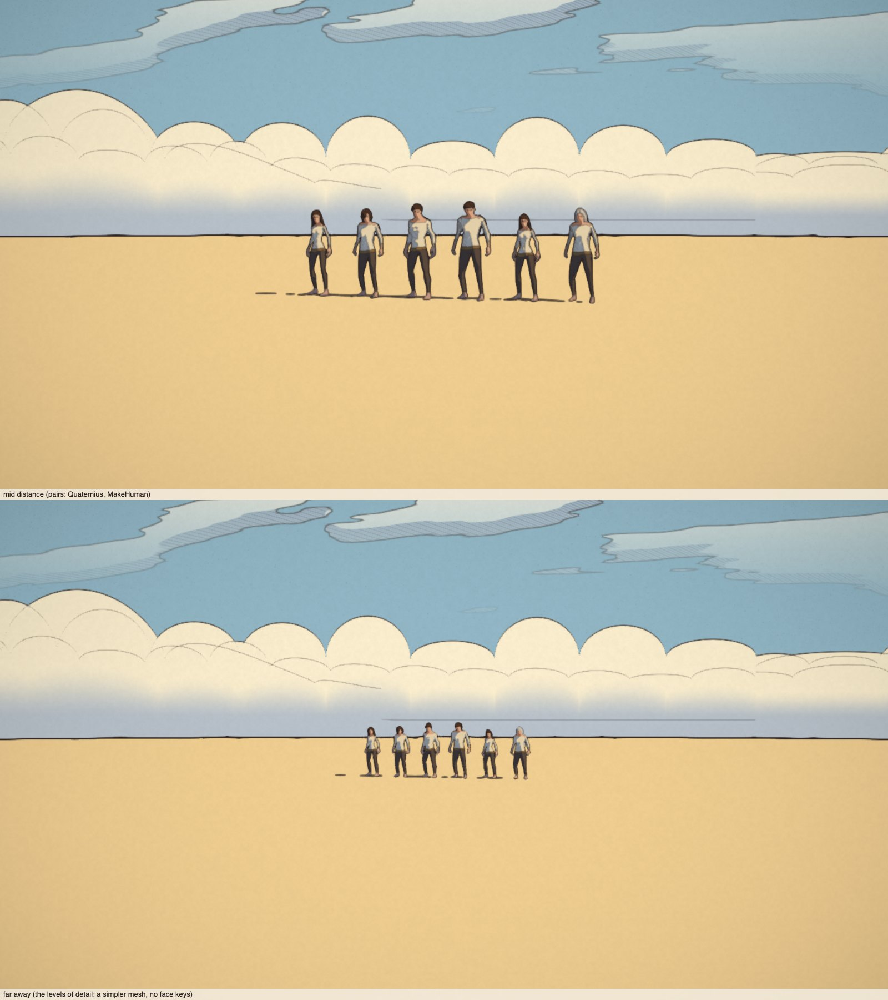
*The same face, each step twice as far; then figures at mid distance and far away (far: a level of
detail, no face keys).*

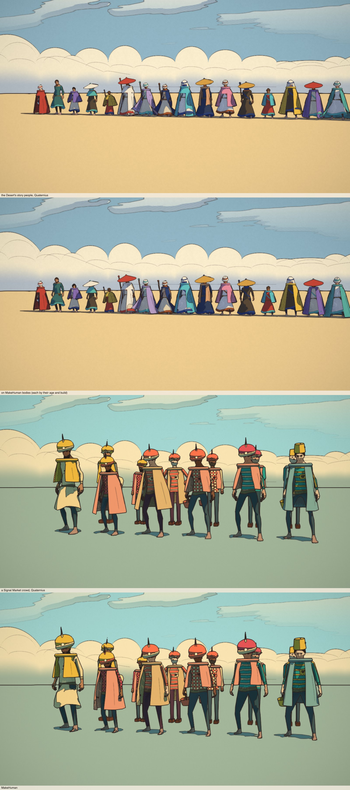
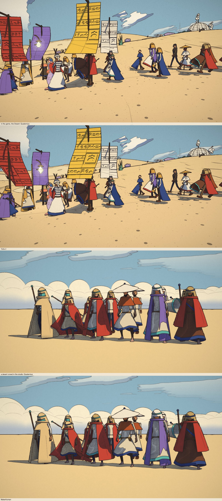
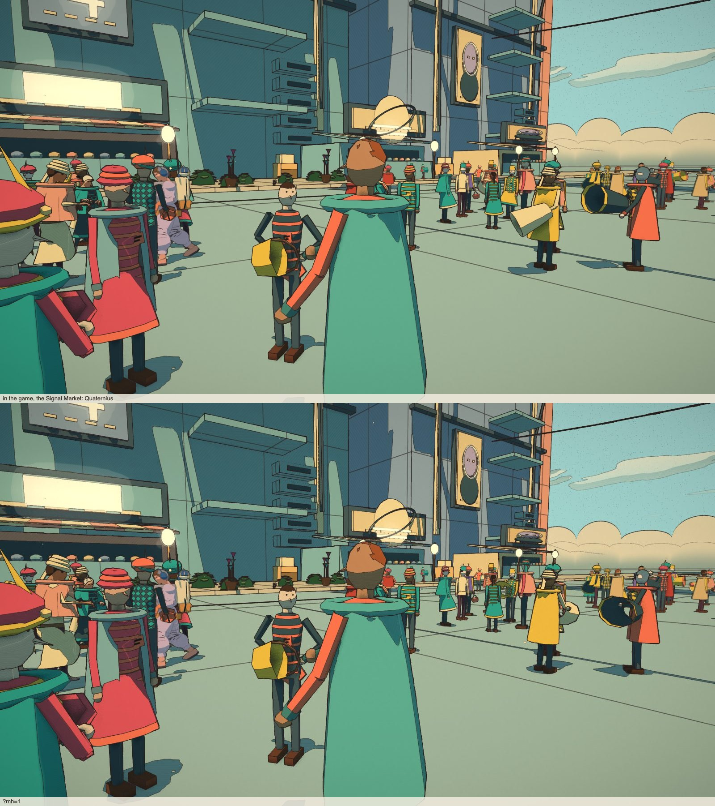
*The Desert's story people and crowds in the studio, and the game at a crowd with and without `?mh=1`.
In the game most people at a crowd's distance are the GPU crowd figure, which stage 1 leaves as it is;
only the story people and the four nearest crowd people are full bodies.*

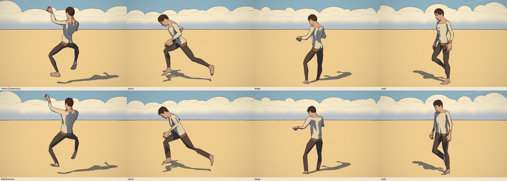

What they show:

- **Hair** reads as hair of its cut now, a few shapes with strand lines, not a helmet; on the shaded side
  dark hair is one dark shape (its lines dark on dark), as Moebius often leaves it. Two small holes
  remain at the crown of short02 and short04 from behind, where the cards left a gap the remesh didn't
  close.
- **Eyes** are open and the iris reads at mid distance; up close the faces are MakeHuman's (more human
  than the Quaternius ones, less stylised), with the Moebius targets giving the grown-ups longer, leaner
  faces than MakeHuman's default.
- **Bodies**: children, teenagers, the heavy and the old in their own proportions, from one file.
- **Crowds**: in the game the difference is small, because the crowd's mid tier is the GPU figure; the
  full NPCs (story people, the nearest crowd people) are MakeHuman.

## What a full switch would take

1. ~~One parametric body~~: done (stage 1). ~~Levels of detail~~: done. ~~Hair fitted to the skull~~ and
   ~~the beard~~: done. ~~Eyes bigger, the Moebius stylisation as targets~~: done.
2. **Costumes, re-checked per body**: every hat and mask is fitted to the measured skull
   (`profile.headScale`) and the robes measure the body, but nobody has looked at each one on a child, a
   teenager and the heavy; hats over the MakeHuman hair use the game's cap under them.
3. **The traveller's suit and gear** (`suitGeometry`, `traveller.glb`, fitted to the Quaternius man):
   re-fitted to a MakeHuman man, or he stays on his own body (he does now).
4. **The GPU crowd figure** (`crowd.js`, `crowd-shader.js`): procedural, so no export, but its
   proportions (`packBody`: shoulders, hips, girth) should be matched to the MakeHuman silhouettes, and
   a crowd person promoted to a full NPC should get their nearest MakeHuman body (age, build) rather
   than the pooled grown-up of average build, so nothing changes as they come close.
5. **Ragdoll capsules and cape colliders** against the new girths (the heavy, the children); the
   animation itself is unchanged (the same bone names, the legs scaled to the rig's hips).
6. **The Unity export** (`scripts/unity-export`) and the Lab's faces gallery, which read the Quaternius
   bodies; the tests that load `human_m.glb` / `human_f.glb` for the per-kind tables stay as they are
   until those tables go.
7. **Memory**: each distinct body geometry carries its face keys as morph targets (6 000 vertices × 11
   keys, about 1 MB of morph texture each); a world uses a few dozen. Cheaper: share the keys' textures
   between bodies of one template, or keep only the head's vertices in a separate morph mesh.
8. **The flip, world by world**: `?mh=1` becomes each world's default once its costumes and crowds
   are checked; the files then ship (`vite.config.js` drops `anim/mh/` from the build unless
   `MAKEHUMAN=1`: 1.0 MB gzipped more in the web bundle and the APK).
