# The engine bridge: the game's JavaScript inside Godot and Unity

The C# port (`unity/Memento`, docs/systems/unity.md) re-implements the game. The bridge goes the
other way: the game's own modules run in the engine's JavaScript VM (GodotJS's V8 in Godot, Puerts'
V8 in Unity), build and move their three.js scene as they do on the web, and the engine only draws
it. One game, drawn by three renderers, never out of step.

## What runs where

| | the web | Godot / Unity through the bridge |
|---|---|---|
| levels, physics, player, camera rig, story, people, quests, saves | `src/` in the page | the same `src/`, bundled (`scripts/engine-bundle.mjs`) into the engine's VM |
| the scene graph and the maths | three.js | three.js (its `Object3D`s, matrices, geometries, materials as data: no `WebGLRenderer`) |
| drawing | `WebGLRenderer`, `materials.js` G-buffer, `post.js` ink | the engine's nodes, fed by the mirror (`engine/mirror.js`); the ink look in the engine's shaders |
| the page (HUD, menus), input, sound, files, storage | the browser | `engine/platform.js` stand-ins, fed by the engine's host (`engine/<engine>/host.js`) |

Per frame: the engine calls the bundle's `frame(dt)`; the game updates; `SceneMirror.sync(scene,
camera)` walks the scene and hands the backend only what changed; the engine draws.

## The seam: the scene mirror

`engine/mirror.js` (engine-agnostic, tested in Node) gives every drawable a small integer id the
first time it is seen, every geometry and material theirs, and calls the backend:

| op | when | payload |
|---|---|---|
| `geometry(gid, g)` | a geometry first seen, or an attribute's `version` moved | three's typed arrays as they are (`position`, `normal`, `uv`, `color`, `skinIndex`, `skinWeight`, `index`) and its groups |
| `material(mid, spec)` | a material first seen | `engine/ink-spec.js`: makeMaterial's options read back from its uniforms, plain numbers and arrays; the frame's shared uniforms left out |
| `create(id, node)` | a drawable first seen | `{ kind: mesh / instanced / skinned / points / line / sprite, gid, mids, name, renderOrder, shadow }` (shadow: the web's caster rules) |
| `transforms(ids, mats, n)` | each frame, once | the world matrices that changed, packed: `n` ids and 16 floats each |
| `visible(id, on)` | an object (or an ancestor) shown or hidden, or out of the scene | |
| `instances(id, count, mats, colors)` | an `InstancedMesh`'s matrices or count changed | three's `instanceMatrix` (16 a instance) and `instanceColor` |
| `geometryOf(id, gid)` | a drawable's geometry swapped or rewritten (cloth, trails) | the geometry's id (sent again first) |
| `instances(id, count, null, null, attrs)` | a mesh on an instanced geometry (kind `instgeo`: the grass) whose attributes moved | each per-instance attribute that moved, with the range rewritten (`updateRanges`) |
| `drawState(id, o)` | each frame an `instgeo` drawable is drawn | the object: the backend reads what moves on it (the grass patch's centre and fades) |
| `materialLive(mid, color, glow)` / `materialFluid(mid, f)` | a material's colour, glow or fluid moved after it was sent | the new values (a flower waking, a lamp lit, the tank's fluid) |
| `bones(id, mats, n, bind, bindInverse)` | each frame a skinned mesh is seen | three's `skeleton.boneMatrices` (bone world × inverse bind) and the mesh's bind matrices (`engine/skin.js` folds them into one matrix a bone) |
| `remove(id)` | out of the scene for `forgetAfter` frames | |
| `camera(c)` | each frame | world matrix, vertical fov, near, far, aspect |
| `frame(f)` | each frame, last | the frame number and counters |

World matrices only: the engine side is flat (one node per drawable under one root), so three's
own hierarchy, `matrixAutoUpdate`, attachments and skeleton maths stay in three. Godot and three
agree on frames (right-handed, y up, cameras down −z): only the winding flips (three's front faces
are counter-clockwise, Godot's clockwise). Unity is left-handed: x is mirrored, as the C# port's
exporter does.

**Materials** cross as data, not shaders: `inkSpec(material)` gives `{ type: 'ink' | 'basic' |
'shader', side, transparent, defines, u: { uColor, uMode, uGlow, uShade, … } }`, and
`engine/ink-params.js` maps it to the engines' ink shader parameters (`color`, `color2`, `mode`,
`strata_size`, `glow`, `shade_lift`, `hatch_k`, …). The engine keeps one ink surface shader and
sets parameters per material, as `export-world.mjs materialOf` does for the C# port. The frame's
look (sun, shadow tint, ink, sky, fog: `sharedUniforms` and post.js's uniforms) is sent once a
frame.

### Godot (GodotJS)

`engine/godot/backend.js` runs in the same VM as the game and calls Godot directly: an
`ArrayMesh` per geometry (one surface per group), a `MeshInstance3D` or `MultiMeshInstance3D` per
drawable, a `ShaderMaterial` on the ink surface (`godot/shaders/ink.gdshaderinc`, in five variants by
side and skinning) per ink material. Bulk data
never goes vertex by vertex through the binding: an `ArrayBuffer` reaches Godot as a
`PackedByteArray` (a copy at memory speed), laid out as `var_to_bytes` writes a packed array
(`[type][count][data]`, `engine/godot/pack.js`), so `bytes_to_var` makes the `PackedVector3Array`,
`PackedInt32Array` or the MultiMesh's `PackedFloat32Array` natively. Transforms are one
`Transform3D` per moved node.

`godot/` is the project: `main.tscn` with one script, `main.js`, which `require`s the bundle
(`godot/js/memento*.js`, built, git-ignored) and forwards `_ready`, `_process` and `_input`.
`godot/shaders/ink_post.gdshader` is the ink composite on a full-screen quad.

### Unity (Puerts)

The same bundle under Puerts' V8, inside the C# port's project (`unity/Memento`) but apart from it:
`Assets/MementoJS/` (its scene `BridgeDesert.unity`, plain C# in the project's assembly, no
compile-time reference to Puerts: `JsRuntime.cs` finds it by reflection, so the port builds and
runs as before without it). Puerts calls C# by reflection, slower a call than GodotJS, so the JS
backend (`engine/unity/backend.js`) batches: a geometry once (one ArrayBuffer, `pack.js
unityGeometry`), a material once (JSON in the exporter's `materialOf` format, `port-format.js`),
and everything a frame changes in **one command buffer** (`pack.js CommandWriter`: transforms,
visibility, instances, bones, the camera, removals) decoded by `BridgeRenderer.cs`. Unity is
left-handed: the bridge mirrors x on the way, as the port's exporter does (points, matrices as
X · M · X, the winding), so the port's shaders see what they always see.

What it reuses from the port: its **materials** (`WorldLoader.MakeMaterial`, now static so the
bridge calls it), its **Surface shader, G-buffer and ink composite** (the URP renderer feature),
its **look** (`MementoLook.Load`, fed each frame the game's own preset and palette in world.json's
format: `port-format.js portLook`), its **shadows** (`MementoShadows`, the mirrored meshes as its
casters). Skinned bodies are Unity `SkinnedMeshRenderer`s whose bone transforms the frame's
buffer sets (each bone's matrix folded with three's bind matrices: `skin.js`); instanced meshes are
drawn on the GPU by the port's `InstMats` (below). Input: the Input System's keys as
`KeyboardEvent.code`s, the first pad in the standard mapping, the mouse (right button).

## The browser APIs the game uses

`engine/platform.js` `installPlatform(host)` puts stand-ins on `globalThis` where the VM has none
(GodotJS's V8 has `setTimeout` and `console` and nothing of the page: no `performance`,
`TextDecoder`, `queueMicrotask`, `URL`, `fetch`). `engine/boot.js` installs them first in every
bundle, before the game's modules load (some touch the page as they load), and routes
`GLTFLoader.load` through the host's files, as `scripts/unity-export/build-world.mjs` does in Node.

| API | used by (modules) | in the engines |
|---|---|---|
| `document`, elements, `innerHTML`, `classList` | the HUD and menus: main.js (57 uses), ui.js, hud.js, quest.js, changelog.js, dev-menu.js, story/ (dialogue, calls, moment, index, the worlds' data), ship/ (cinema, starmap, homecoming), boxes/ (card, effects), temples/runtime.js, npc.js, crowd.js, aliens/alien.js | **shim now** (elements that take every call and draw nothing; `getElementById` keeps one element per id); **bridge later**: a HUD layer (below) |
| `window` events (`keydown`, `keyup`, `mousemove`, `blur`, `beforeunload`) | main.js, player.js (`CameraRig`), ui.js, fluid-tool.js, native-pad.js | **bridge**: the engine dispatches `keydown` / `keyup` with the web's `KeyboardEvent.code` names to the same listeners (`page.dispatch`) |
| `navigator.getGamepads` | controller.js (injectable `pads`), native-pad.js, ship/starmap.js | **bridge**: Gamepad-shaped objects from the engine's joypads (`host.pads()`), standard mapping |
| `localStorage` | save-slots.js, quest.js, changelog.js, audio.js, native-app.js, motion-match.js | **bridge**: the host's storage (Godot: `user://memento-storage.json`; Unity: PlayerPrefs) |
| `fetch`, `GLTFLoader` | the characters (`anim/*.glb`), MakeHuman bodies, motion data | **bridge**: `host.readFile(path)` reads `public/` (the repository's, or packed with the game) |
| WebAudio (`AudioContext`, oscillators, filters) | audio.js (89 uses), score*.js, ship/sfx.js, story/arzach2.js | **shim**: `engine/webaudio.js` renders the game's own graph to PCM the engine plays (below, "Sound") |
| `performance.now`, `requestAnimationFrame` | 21 modules / main.js's loop, title.js | **shim**: the host's clock; the engine's frame runs the callbacks (`page.tick`) |
| 2D canvas (`getContext('2d')`, `CanvasTexture`) | ship/art.js, ship/portrait.js, ship/cinema.js, levels/home-drawings.js, levels/reference-picker.js | **shim**: a context that draws nothing (painted panels stay blank); later an engine-side canvas or pre-rendered textures |
| `Worker` | lod.js (simplification off the main thread) | absent: lod.js already falls back to the main thread |
| `matchMedia`, `devicePixelRatio`, `location`, `history`, `URL` | perf.js, ui.js, main.js (`?level=`), reference levels (`new URL(…, import.meta.url)`) | **shim**: no media matches, `location.search` from the host |
| WebAssembly | none (three-mesh-bvh is plain JS) | |

### The platform layer (`src/platform.js`)

One module for what the game's modules reach for on the page, so the same code runs on the web and
in an engine:
- `page`: `byId`, `on` (a window listener; returns its remover), `bodyClass`, `exitPointerLock`,
  `activeElement`; nothing (null, a no-op) without a page;
- `store`: localStorage behind a try (the settings in ui.js, the mute in audio.js, the changelog's
  seen version, motion matching's switch);
- `input.pads()`, `audio.context()`;
- `screen`: **what the HUD shows, as data**, each part null or a plain object, with a `version` that
  moves when a part changes: `cue` (hud.js `Cue`), `toast` (ship/cinema.js as one goes up),
  `prompt` (story/index.js `placePrompt`: the text, the key, where it floats in the world),
  `health` and `stamina` (hud.js `healthHud` / `staminaHud`, the rules main.js draws by, now shared),
  `dialogue` (story/dialogue.js `publish`: name, title, colour, the line, how much is revealed,
  the answers), `choice` (the answer a pad has picked, in an engine).

The web draws as before (the modules set their part as they draw; `tests/platform.test.js`,
`tests/hud.test.js`); in the engine the page is engine/platform.js's stand-in and the engine draws
from `screen`. Left on the page for now: the menus (ui.js SettingsMenu, the sketchbook, the star
map, cards), the floating speech balloons, the scout's line.

**In Unity** (`BridgeHud.cs`): the bundle sends `screen.state` when its version moves, and the HUD
draws it in uGUI with the C# port's own pieces and layout (Hud.cs, Ui.cs: the paper, the ink, the
fonts, the notebook panel with its name tag and chip, the answers); the conversation itself (who
speaks, the reveal, the answers, what an answer does) is the web's `Dialogue` and `DialogueRunner`,
fed the engine's keys as the page's events (E, Space, 1–9, Escape) and its pad through
`Controller`'s talk context. engine/game.js runs E as main.js does (`storyRt.update` with
`ePressed`, the traveller held while busy, the two-shot through `frameCamera`, the cue by
`cueText`, the toasts queued for their reading time). A batch run: `-talk ama` walks up to someone
and photographs the conversation.

| web (three.js) | Unity + Puerts (the same conversation, the port's uGUI) |
|---|---|
| 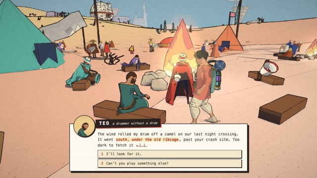 | 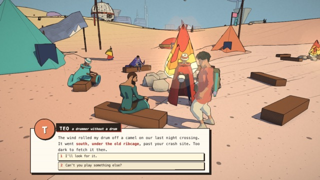 |
| 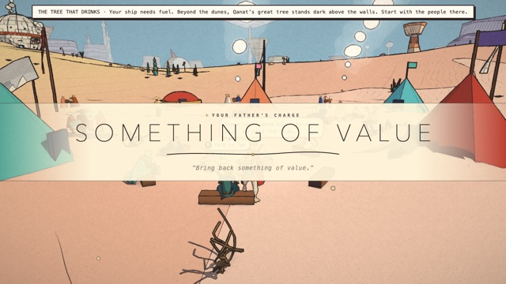 | 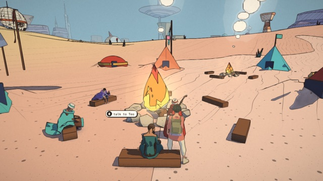 |

(No portrait in the chip yet: the web shoots one with its renderer; the initial on their colour
stands in.) Two traps met on the way: the canvas has to stay beyond the near plane the game's
camera sets each frame (on it, the HUD was clipped away), and the dynamic font's letters are put
in its texture at once (`Warm`: added one by one, they dropped out of a frame).

## Costs

Measured on the M4 Pro (macOS 26, Godot 4.6.1 + GodotJS 1.1.0 beta 1, V8, Metal Forward+), the
desert, the spike's camera:

- **Bundle**: the spike's modules and three.js, 2.98 MB of CommonJS (the whole game entry, with the
  people, crowd and story: 6.1 MB, 1.5 MB gzipped), built in 0.1–0.6 s.
- **Load**: the desert built by `createDesert` in GodotJS's V8 in 4.3 s (12 s in a Node `vm`
  context, whose globals are slow; the game in Chrome builds it in steps between frames).
- **Upload**: 796 drawables, 794 geometries (1.07 M vertices, 1.01 M triangles, 1 915 surfaces),
  274 materials, 36.9 MB of attributes mirrored in 0.53 s, 0.46 s of it in Godot making meshes.
- **Per frame**: the mirror's walk of the scene and a compare of 16 floats per drawable (the web
  renderer walks it too), then one Godot call per moved drawable. Stage 2 measures it in play.

## Risks

- **GodotJS is in beta** (1.1.0 beta 1 for Godot 4.6.1, April 2026); the editor binary is GodotJS's
  own build of Godot, so the Godot version follows theirs. Its V8 is current; QuickJS (`qjs-ng`)
  builds exist for platforms without a JIT (iOS).
- **Modules**: GodotJS and Puerts load CommonJS; the game is ESM with top-level `await` in main.js.
  The bundle is flat CommonJS (`codeSplitting: false`), so dynamic imports are inlined and no
  module loading happens at run time. A top-level `await` cannot be bundled into CommonJS: the
  entries are functions the engine calls.
- **No workers, no WASM** used by the game; lod.js's worker already falls back.
- **`import * as godot`** of GodotJS's lazy module proxy is empty once bundled (the bundler copies
  its keys): engine code imports the default (`import godot from 'godot'`).
- **Quitting deadlocks on macOS** with a window open (NSApplication's terminate waits on a thread
  V8 holds); batch runs kill the process after the log (`batchExit`).
- **Pictures need a window** on macOS: `--headless` uses the dummy renderer (scripts and tests run
  headless; screenshots open a window for a few seconds, muted, `--audio-driver Dummy`).
- **The ink look is a port to keep in step**: materials.js and post.js are 3 300 lines of GLSL; the
  engines' shaders follow them by hand (as the C# port's HLSL does). Godot's Forward+ gives depth,
  normals and the lit colour to a post pass, not the web's custom G-buffer, so the shade and the
  strokes are drawn in the surface shader's `light()` and the lines in the post pass.
- **Per-call cost** in Puerts (reflection) is higher than GodotJS's: hence the command buffer.
- **No ICU in GodotJS's V8**: a regular expression with `\p{L}` is a syntax error there, and the
  whole bundle fails to load; the bundler lowers them (`lowerUnicodeClasses`, tested). No `Intl`
  either (the game uses none outside a log line).
- **Engine quirks met**: Godot smooths `delta` to the display's refresh (frame times are taken from
  the wall clock), its measured GPU time reads 0 on Metal here; Unity's V8 isolate aborts if
  disposed while the editor exits (the batch run leaves it to the process).

## Running it

```sh
node scripts/engine-bundle.mjs                 # the bundles (godot/js/memento.js, memento-spike.js)
godot/run.sh                                   # play the desert in Godot (WASD, Shift, Space; the right mouse button turns the camera; pads)
godot/run.sh --views=$PWD/scripts/bench/viewpoints.json --out=$PWD/output/engine-bridge/godot   # a PNG a viewpoint
godot/run.sh --bench=6 --views=… --out=…       # frame times a viewpoint, uncapped: <out>/godot-bench.json
godot/run.sh --walk=4 --out=…                  # the traveller walks forward for 4 s, a PNG at the end
godot/run.sh --entry=spike --shot=$PWD/output/engine-bridge/spike.png      # the spike: one frame
node scripts/godot-globals.mjs                 # godot/project.godot's [shader_globals] from engine/ink-params.js
```

`godot/run.sh` rebuilds the bundles and runs the GodotJS editor binary from
`.local-tools/godot/` (`GODOT=` another), muted (`--audio-driver Dummy`), its log in
`output/engine-bridge/godot.log`; `--shadows=0`, `--post=0` and `--only=camps,dunes` narrow a
benchmark. GodotJS's debugger listens on port 6299 (`godot/project.godot`). The web side of the
same viewpoints is the benchmark's own (`scripts/bench/web-bench.mjs --paths 0 --shots dir`).
`tests/engine-bridge.test.js` checks the stand-ins, the mirror's ops (no false moves, no false
uploads), materials read back, the Godot layouts, keys and pads, the skinning, the look's globals
against `project.godot`, the bundle's regular expressions, and the game itself in a bare V8
context (no Node, no page): a world built with its people, the traveller walking on the keys,
the camera following; `tests/engine-unity.test.js` the mirror in x, the geometry and command
layouts the C# side reads, the port's formats, and the Unity bundle against a stand-in of the C#
host.

The Unity side, once:

```sh
scripts/unity-js-setup.sh                      # Puerts 3.0.3 (core + V8) into unity/Memento/Packages/ (not committed)
node scripts/engine-bundle.mjs unity           # the bundle into unity/Memento/Assets/StreamingAssets/memento-js/
scripts/unity-export/unity-batch.sh BridgeBatch.Run -views scripts/bench/viewpoints.json -out $PWD/output/engine-bridge/unity [-bench 6] [-walk 4]
```

(Unity writes Puerts' embedded packages into `Packages/packages-lock.json` on a machine that has
them: leave that change out of commits. The batch run plays `BridgeDesert.unity` in the editor,
muted, and exits; the menu Memento ▸ JS bridge rebuilds the scene.)

`scripts/unity-js-run.sh <name> [BridgeBatch.Run arguments…]` does the two last in one, its log in
`output/engine-bridge/unity-<name>.log`, the lines that say what happened printed. Its arguments:
`-level`, `-views file [-only a,b]`, `-out dir`, `-bench secs`, `-split` (the frame's split: the
mirror's profile, the audio, the C# apply), `-walk secs`, `-talk id`, `-play tool,drone`, and
`-probe text [-solo]` (at each shot, the nodes whose name holds the text as Unity has them: mesh,
bounds, materials' culling, shadows, GPU instances; `-solo` draws only those).

## The Godot renderer (stage 2)

`engine/game.js` builds the world as `main.js` does at load (the level, physics and water, the
ship at its site, the traveller with his body, clips, gear and cape, the people near the start,
the crowd and its pooled full bodies, the story's people and places, the flora) and plays it a
frame at a time: the keys and pads into `Controller` and `Player.update`, the camera rig, the
crowd and the people, the story's update, the level's own update, the hour's palette. Left out:
the HUD and menus (the page's), conversations, sound, the fluid tool, the drone, weather,
wildlife, the grass blades, the ship's scenes.

**On the Godot side** (`engine/godot/`): the mirror's ops become nodes (`backend.js`); the
skinned bodies are skinned in the ink shader from one **bone atlas** a frame (a float texture,
every skinned mesh a row: `skin.js` folds three's bind matrices into one matrix a bone), so a
crowd costs one texture upload, not one a person; geometry that changes (cloth, trails) is sent
again and swapped in; the shadow casters follow the web's rules (`level.noShadow`, the gear's,
`selfLitSkips`). **Input**: Godot's key events as `KeyboardEvent.code`s (`keys.js`), its joypads
as standard-mapping Gamepads for `controller.js`, the mouse (right button) into `CameraRig.look`.

**The ink look in Godot** (`godot/shaders/`): Godot's Forward+ gives a post pass the depth, the
normals and the lit colour, not the web's G-buffer, so the work is split differently:
- `ink.gdshaderinc` (the surface, five variants by side and skinning): the albedo by mode (plain,
  the terrain's patches and slopes with the desert's regions and sand blobs, the strata bands, the
  people's outfit zones by the rest pose, metal's three tones, vertex and instance colours, grid
  lines as drawn detail); in `light()` the web's light term and two tones (each surface's lift,
  half-tone, bounce and hue) and the pen strokes, ported from `materials.js` (object-space
  triplanar, power-of-two spacing, crossed where darkest, fewer on a lifted shade, faded far
  off). The maths is in the web's display values, then taken to Godot's linear light.
- the albedo's value goes to the post pass in the normal buffer's roughness channel (Godot keeps
  7 bits of it), so colour boundaries are found on the albedo, not on the hatching;
- `ink_post.gdshader`: the lines (`post.js inkLines`: the Laplacian of 1/z, creases, colour and
  shadow boundaries, silhouettes heavier, thinner with distance, wobble, pen pressure, broken
  interior lines), the sky (bands, the flat print sky, the sun's side), fog in flat bands toward
  the haze, aerial perspective;
- the frame's look (post.js's preset and the hour's palette: tints, ink, sky, fog, line
  settings) as Godot **global shader parameters** (`engine/ink-params.js` GLOBALS, declared in
  `project.godot`), set once a frame when they change.

Not ported yet: the sky's dots, clouds and paper, weathering and pen detail on walls, facades,
tiles, leaves and cracks, glyphs, plating, the crevice and spot blacks, crease shading (AO),
water's own look, the faces' ink, glows and bloom, the crowd's GPU animation (its figures stand in
their rest pose past the pooled bodies), the canvas-painted panels.

The same viewpoints (`scripts/bench/viewpoints.json`), the web game in Chrome (left) and the game
in Godot through the bridge (right), 1280 × 720, hour 10:

| web (three.js) | Godot 4.6 + GodotJS (the same JS) |
|---|---|
|  |  |
|  |  |
|  |  |
|  |  |
|  |  |

(The spawn view stands inside the parked ship: the web hides its hull from the sun when you are
in it, the bridge doesn't run the ship's scenes yet, so the hull's shadow falls on the floor.)
Walking, the camera on the rig (`--walk=4`): 

**Frame times, first numbers** (M4 Pro, 1280 × 720, uncapped: no vsync either side; medians in ms;
the web: `web-bench.mjs --preset high`, render scale 1; Godot: `--bench=6`, the wall clock between
frames, Godot's own delta being smoothed to the display). The machine was busy with other work
(load average 30–40 during the Godot runs), so these are an upper bound, to be measured again on a
quiet machine; the run-to-run spread on the Godot side was ±40 %.

| view | web frame | web CPU | Godot frame | Godot: the VM (game + mirror) | Godot: render CPU |
|---|---|---|---|---|---|
| spawn | 7.4 | 7.2 | 15.2 | 9.0 (2.9 + 5.7) | 0.9 |
| qanat-tree | 12.0 | 11.8 | 19.8 | 16.4 (8.9 + 6.7) | 0.7 |
| camps | 10.4 | 10.3 | 24.2 | 19.2 (9.4 + 8.9) | 1.0 |
| dunes | 3.7 | 3.5 | 10.4 | 5.3 (1.2 + 3.8) | 0.6 |
| cave | 3.8 | 3.6 | 18.5 | 8.9 (2.0 + 6.4) | 1.2 |

Where it goes: the VM's share is the game's own update (people, capes, the crowd: the same work
the web does) and the mirror (the scene walk, the moved matrices, the bones, cloth re-sent), and
the rest of a Godot frame is its GPU work (without the sun's shadows or without the ink composite
the dunes drop from 10.4 to 8.4 ms each). Three fixes found by measuring: matrices compared as
the floats they are sent as (a double no float can hold counted as a move: 700 false moves a
frame), interleaved glTF attributes' versions (read off their buffer: every body was sent again
every frame), and the bone atlas (one texture a frame, not one a body). **Load**: the desert is
built in the VM in 1.6–4.5 s (the level 1.3–3.2 s of it) and drawn on the next frame; the web's
first frame comes 3.0 s after navigation.

## The Unity renderer (stage 3)

The same game, the same frames: `engine/unity/game.js` is `engine/game.js` with the Unity backend.
Since the port's look is a complete port of the web's (G-buffer, composite, ripples, dots, paper,
clouds), the bridge's pictures in Unity are closer to the web than Godot's first port.

| web (three.js) | Unity 6.6 + Puerts (the same JS, the port's look) |
|---|---|
|  | 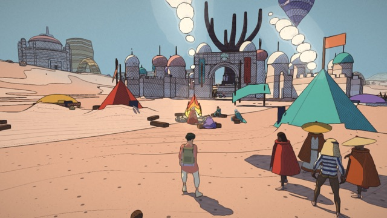 |
|  | 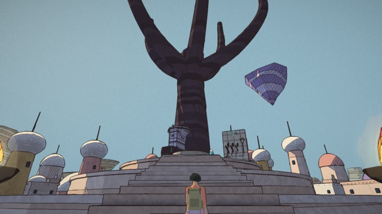 |
|  | 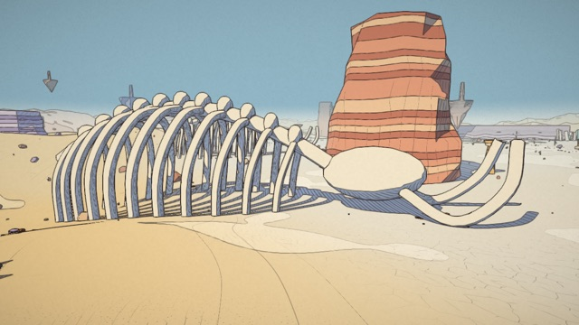 |
|  | 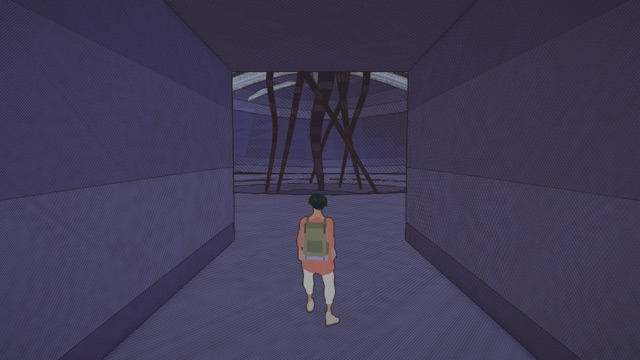 |

Walking (`-walk 4`), the same steps as in Godot: 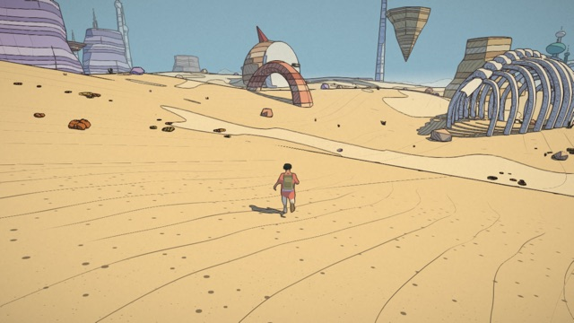

Not drawn yet on this side: points, lines and sprites (motes, the fluid's drops), the canvas
panels, glows and the far crowd's animation (as in Godot); the cave's rounded walls in the web's
shot come from a part of main.js the engine entry doesn't run yet (both engines lack them).

## The three side by side (stage 4)

The same desert, the same viewpoints, at 1280 × 720 on the M4 Pro. **Frame times**: one round of
each side back to back (5 minutes apart), the machine equally busy for all three (load average
12–14: other work was running); medians in ms, uncapped. Unity is the editor in play mode (Mono,
the editor's own overhead), not a player build.

| view | web: frame (CPU) | Godot + GodotJS: frame (the VM) | Unity + Puerts, editor: frame (the VM) |
|---|---|---|---|
| spawn | 10.4 (10.1) | 10.3 (7.3) | 8.4 (6.9) |
| qanat-tree | 17.2 (17.4) | 11.7 (9.9) | 13.4 (11.4) |
| camps | 16.5 (16.7) | 14.6 (12.2) | 21.2 (18.4) |
| dunes | 6.5 (6.3) | 8.5 (4.1) | 6.2 (4.7) |
| cave | 4.9 (4.7) | 8.5 (4.3) | 6.0 (4.6) |

(On a quieter machine earlier the web ran 7.4 / 12.0 / 10.4 / 3.7 / 3.8 ms.) The three are within
the machine's noise of each other. On both engines the frame is the VM's: the game's own update
(people, capes, the crowd: the work the web does too, 1–9 ms) and the mirror (the scene walk, the
moved matrices, the bones, cloth re-sent: 3–10 ms). The engines' own CPU side is small (Godot's
render CPU 0.4–1.2 ms). So the mirror is the first thing to make cheaper (below), and the engines'
GPU headroom is not the limit.

| | web (three.js) | Godot 4.6 + GodotJS (V8) | Unity 6.6 + Puerts (V8) |
|---|---|---|---|
| **fidelity** | the reference | a first port of the look: the light, each surface's shade, the strokes, the lines, sky and fog; no paper, sky dots, weathering, facades, glows | the C# port's complete look (its HLSL port of materials.js and post.js): closest to the web |
| **game logic** | the game | the same JS, unchanged (engine/game.js composes it) | the same JS, unchanged |
| **load** (the desert) | first frame 3.0 s after navigation (9.5 s busy) | built in the VM in 1.6–4.5 s, drawn the next frame | the bundle evaluated in 0.3 s, built in 2.7–4.7 s |
| **what ships** | 12.1 MB fetched (6.4 gzipped), dist 32.5 MB | the engine (release template, V8: macOS 58 MB, Linux 81 MB, Android 94 MB zipped, all ABIs), the bundle 6.1 MB (1.5 gzipped), `public/` (10 MB) | the Unity player, Puerts' V8 (Android arm64 18 MB, Linux 34 MB), the bundle, `public/`; no world export (the C# port's APK is 143 MB with its exports) |
| **updates** | the site, the app's web.json | the bundle is data: it could ride the same over-the-air feed | the same |

What it would take to ship each:
- **Android (the Retroid)**: *Godot*: GodotJS's Android templates (V8 and QuickJS) exist; the ink
  post reads the normal-roughness buffer, which only Forward+ has (Vulkan devices); the Mobile
  renderer would need the lines from depth alone. *Unity*: the port already builds an IL2CPP APK
  (`BenchBuild.Android`); under IL2CPP the methods the JS calls by reflection (`BridgeHost`) need
  to be kept from stripping (link.xml / `[Preserve]`), and Puerts' IL2CPP mode checked; Puerts ships
  arm64 V8.
- **The Deck**: *Godot*: the Linux template (V8). *Unity*: a Linux player with Puerts'
  `libPapiV8.so`. (The web build already runs there in Electron.)
- **Both**: the HUD, menus and conversations (today the page's: a platform layer and an engine UI,
  "The platform layer" above), sound (recorded samples first), the parts of
  main.js the entry doesn't run yet (the fluid tool, the drone, weather, wildlife, the ship's
  scenes).

### Where to go next (a recommendation)

1. **Make the mirror cheap**: skip static subtrees (flag them once, re-check rarely), send cloth as
   positions only (Godot: `RenderingServer.mesh_surface_update_vertex_region`; Unity: `SetVertices`
   on a kept mesh), and on Godot apply the frame's transforms from one packed buffer. It is the
   largest share of the VM's frame on both engines.
2. **Unity + Puerts as the main line**: it already draws the web's look (the port's shaders), and
   the bridge lets the port's C# game logic be retired step by step in favour of the web's own,
   so the port can no longer drift from the web game. Next there: an IL2CPP player, then the APK.
3. **The platform layer in the web game** (page, input, audio modules; main.js split into the loop
   and the web shell), so both engines run the whole loop, conversations and HUD included.
4. **Godot as the light, open alternative**: keep it building and compared; port the rest of the
   look when it matters (paper, dots, weathering, glows), and decide Forward+ (Vulkan) against the
   Mobile renderer for Android.

The choice between 2 and 4 as the long-term engine is the author's: Unity has the finished look
and the existing Android pipeline; Godot is smaller, open, starts fast and its JS binding is
cheaper a call, but its look is a first port and GodotJS is in beta.

## A cheaper sync (Unity + Puerts, next stage 1)

Where the mirror's time went (`-split`: the mirror's own profile, `SceneMirror.profile()`, and the
C# side's, `BridgeHost.ApplyMs`), at the camps on a quiet machine, ms a frame: three's matrices
0.49, the walk 1.9, the bones' encoding 0.75, the call into C# 2.1, all but 0.02 of it the C# apply
(Puerts' marshalling of a 437 KB ArrayBuffer is nothing), the look 0.16. Under them:
- **bones a mesh**: a person is five skinned meshes (body, eyes, brows, hair…) on one skeleton, and
  each sent its bones: 63 skeletons, 102 meshes, ~4 100 bones, each set as a Transform on the main
  thread;
- **cloth sent whole**: every cape's geometry re-encoded and a new Unity mesh made every frame,
  inside the walk;
- **the look parsed every frame**: its JSON changed every frame only by `uTime`;
- the walk itself: a recursive closure, two map lookups and a `for…in` over the attributes for every
  drawable.

What changed:
- **One skeleton, once a frame** (mirror `skeleton(sid, mats, n)`; a skinned mesh's create says its
  skeleton and bind matrix): in Unity the meshes share one set of bone Transforms, the bind matrix as
  their bind pose, and the bones are set by one **Burst job** over a `TransformAccessArray` from the
  frame's floats, copied straight in (`BridgeBones.cs`). (Backends without `skeleton()`, Godot's, get
  `bones()` a mesh as before.)
- **Cloth as points** (mirror `vertices(gid, positions, normals, n)`): when only a geometry's
  positions and normals moved (the same count, the same triangles), they go alone in the frame's
  buffer (op 8) and the C# side updates its meshes in place.
- **The look without the clock** (MementoLook keeps Unity's own), read every 4th frame.
- **The walk**: an explicit stack, the mirror's node kept on the object, the attribute lists cached
  on the geometry (looked at again every 32 frames; a new index is a new shape at once).

Before and after, the same C# side, back to back on a quiet machine (load ~3), Unity editor play
mode, medians in ms (frame; the mirror's share in brackets), and the web game in Chrome then:

| view | before | after | web |
|---|---|---|---|
| spawn | 5.19 (3.26) | 3.01 (1.45) | 5.4 |
| qanat-tree | 8.16 (3.49) | 5.33 (1.26) | 7.2 |
| camps | 10.62 (5.19) | 6.76 (2.08) | 8.1 |
| dunes | 2.48 (1.40) | 1.19 (0.43) | 2.9 |
| cave | 2.45 (1.40) | 1.18 (0.42) | 2.2 |

The mirror is 2.5–3.3 times cheaper and the frames 35–52 % shorter; the commands a frame at the
camps went from 437 to 317 KB (most of it the bones, 263 KB). What is left at the camps: three's
own matrices 0.50, the walk 0.86, the bones 0.18, the C# apply 0.85; the game's own update 3.4.

## The rest of the picture and the play (Unity + Puerts, next stage 3)

`engine/game.js` now builds and runs what main.js does around the world, in main.js's order: the
flocks, the motes, the footprints, the wildlife, the weather under its shelter (into the look's rain,
storm and haze), the fluid tool (aim R / LT, fire G / RT) and its splats, the drone (Q / View), the
answering plants (reactive-world.js), what burns (flammable.js), the plants in view (`flora.update`
each frame: before, the engines drew only the cells the build left filled), and the sound. Each is
`optional`: a system that cannot start in the VM is said once and left out.

**Sound.** `engine/webaudio.js` is the part of Web Audio the game's synthesis uses (src/audio.js,
score.js, score-voices.js, ship/sfx.js, story/voice.js), in JavaScript: oscillators (and periodic
waves), buffer sources, gains, biquads, stereo panners, a delay, the convolver as a Schroeder room
(four combs, two allpasses, the impulse's length as its decay: a 3 s impulse convolved in JS would cost
more than the game), a peak-follower compressor, an analyser; AudioParams follow the spec's timeline
(set, linear and exponential ramps, setTarget, cancel), a non-finite value is a TypeError as in a
browser. It renders in 128-frame blocks pulled from the destination, each node once a block; a chain
whose sources ended leaves the graph and comes back when something new is connected (the buses). The
game's own `Sound` runs on it unchanged (`createGame({ audio: { sampleRate } })`), started at once.
In Unity `BridgeAudio.cs` holds a ring of float stereo, played by Unity's audio thread from
`OnAudioFilterRead` on a clip-less AudioSource; each frame the script renders what keeps the ring
0.12 s ahead (`host.AudioQueued`, `host.Audio(pcm)`). In batch runs, and with `-mute` on a player's
command line, nothing reaches Unity's audio: the ring is drained on the main thread at the output rate
and its level logged (`Memento bridge: sound {…, "rms": …}`; the desert's start: 0.01–0.04, 1–2
underruns at the load). Its cost in the VM: 0.2–0.6 ms a frame in the macOS player (the music, the
wind, the camps' voices), once the automation a parameter has had folds into one event as it passes (the
game sets its targets every frame: unfolded, thousands piled up and the cost grew to 3 ms). The timers the sound's scheduler wants (`setInterval`) are
`engine/platform.js`'s where the VM has none, run from the frame.

**On the Unity side**, what the port already had, fed from the same objects:

| the web's | Unity through the bridge |
|---|---|
| instanced meshes (the flora's sets, the wildlife's parts, the flocks, the props) | the port's `InstMats` (Surface.shader `MEMENTO_INSTMAT`, its shadows in the cascades): the instances' matrices a GPU buffer, each node its own copy of the material (the buffer is bound on it); a mesh without vertex colours gets white ones (the shader multiplies the instance's tint by them); several groups: baked into one mesh as before. The C# apply went from ~3 ms to 0.2–0.5 at the desert's views once the birds, the motes and the wildlife moved every frame |
| the crowd's GPU figures (crowd-shader.js) | the port's crowd figures (FarCrowd's `MEMENTO_CROWD`), posed in the shader from the same instance data (op 9) |
| the motes (life.js `Points`, drawn by the page from a scene of their own) | added to the mirrored scene; quads turned to the camera each frame, sized as the web's `gl_PointSize`, on the port's `Memento/Mote` |
| the footprints (a decal multiplied into the albedo) | the port's `Puffs` with its `Memento/Print` (op 10: place, turn, size, fade) |
| the fire (story/flames.js) | `Memento/Flame`, its five colours, seed and heat |
| the weather (post.js uRain, uRainNear, uStorm) | the port's globals, as Ambient.cs sets them |
| local lights (main.js updateLights: lamps, fires, eggs, pools, doors; the jet's flame) | the 8 nearest the traveller each frame they change (op 11), into MementoLook's list |
| shadows (main.js draws every caster double-sided: `shadowOverride`) | casters `TwoSided` |

The cave's rounded walls were none of the geometry (the same mesh, the same checksum), the haze, the
AO or the cast shadows: they are the pools of the cave's **local lights** on its flat walls, which
the look did not carry. Points, lines and sprites: the motes are the game's only points (the ship's
hologram has lines, inside the ship only); there are no sprites.

Side by side (the web left, Unity right; the bench's save and conditions, the same views): the
desert (spawn, camps, cave, dunes), the City-Shaft (incal) and the Signal Market (bazaar), and the
fluid tool's shot and the drone at the start:

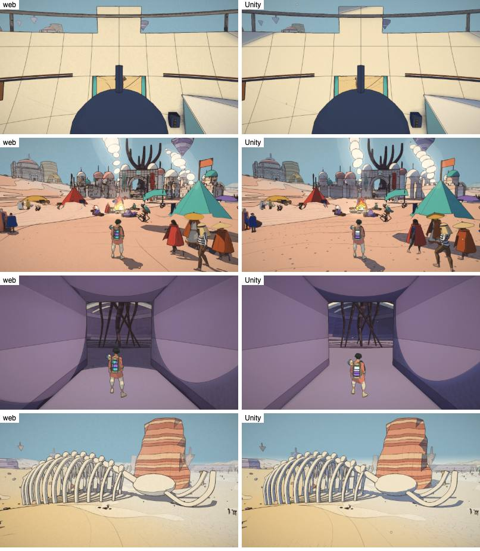
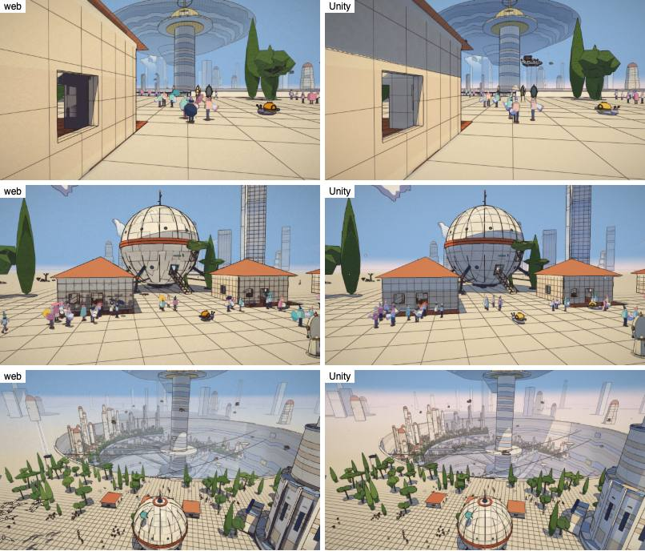
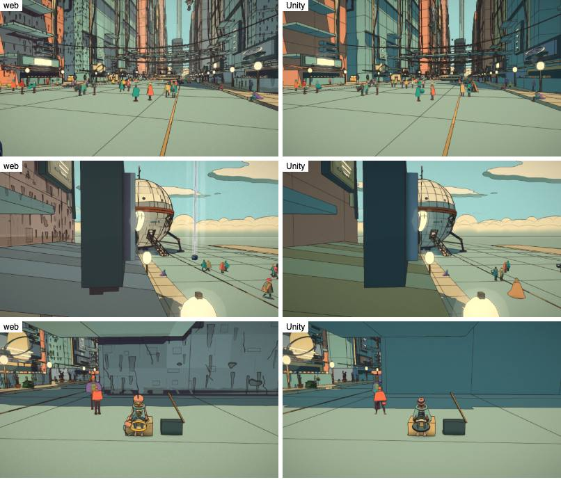
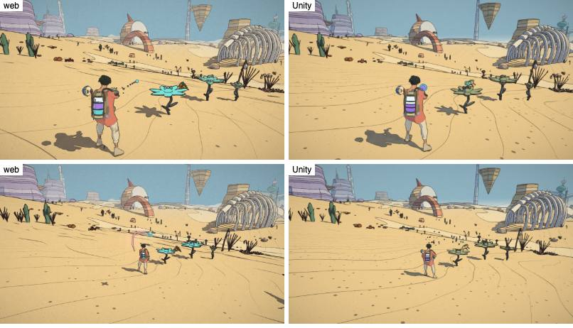

(`scripts/unity-js-run.sh <name> -play tool,drone -out …` plays the second; the views with `-views`.)

(What still differed then, and what closed it: the next section.)

## The web's newer look and the rest of the world (Unity + Puerts, 2026-10-06)

What the side-by-sides above still showed, closed:

- **The port's look brought up to the web's** (`Surface.shader`, `Marks.hlsl`, `Composite.shader`). The port's
  shaders dated from 2026-10-05 morning; materials.js and post.js had moved on. Now ported: weathering
  (`weatherInk`: grime streaks, the small ones soft and faint, chips with their lip's shadow, cracks with a
  shadow side, the dust at a wall's foot in the composite), pen detail at every scale (`detailLod`: built
  seams, joints, vents, plates and bolts; organic grain), colour across a wall (`wallPatch`), plating, the
  house fronts' lit windows at night and cracked corners, the print look's pebbles and stones on the sand
  (ground-ink.js `PEBBLES`), the shadow map's lit fraction steepened (`SHADOW_CUT`), flat facets edge-on to
  the sun shaded whole, big curved forms' terminators; and the G-buffer's newer packing, read by a composite
  that is now post.js's main (each surface's shade: its lift, hue or flat print; spot blacks; cast shadows
  lifted or printed as ink masses, `uInkShadow`; lines by material, `uLineStep`; the face's warm shade;
  banked sand's soft line; haze in layers and fog by height; the lines' noise on the view's direction, from
  the same 128² texels: `MementoLook.LineNoise`; no paper grain or vignette). The materials carry the new
  options through `port-format.js` (`weather`, `detail`, `patch`, `plates`, `windows`, `drift`, `shade`,
  `spotStep`, `lineStep`) and the look its vectors (`LOOK_VECTORS`: `uSpot`, `uInkShadow`, the haze's). Not
  ported: hatching that follows the form (`S_FORM`: its per-vertex axis isn't uploaded), the makers' boxes'
  own star and ray (`MAKERS_BOX`: the shell is drawn plain), MakeHuman faces' shape keys (`FACE_KEYS`).
- **The light pillar** was the jetpack box's beacon by the ship: engine/game.js now builds the makers' boxes
  (`createBoxes`), their beacons with them.
- **Grass**: `engine/mirror.js` kind `instgeo`, a plain mesh on an `InstancedBufferGeometry` with a count of its
  own (flora-grass.js `Grass`): `create` says its capacity and attributes, `instances(id, count, null, null,
  attrs)` sends them when their versions move, only the range rewritten (`updateRanges`), `drawState(id, o)`
  each frame. In Unity (ops 12, 13) the port's `MEMENTO_GRASS` places the tufts, now with grass-shader.js's
  own fades (thinning by rank, the blend into the ground's tones, the far layer growing in, a few pen-lined
  tufts). `buildGrass` and `grass.update(camera)` are back in engine/game.js, on the bench's preset (High).
- **Wind**: the web's own (`WindStreaks`: the traveller's push, the plants' and blades' `uWind`, sent with the
  look), and its wisps, which on the page are an overlay of their own, as a mesh in the mirrored scene on the
  port's `Memento/Wisp`; their points and alpha go each frame as cloth's do (op 8, `aAlpha`).
- **The answering flowers**: the bridge paused the answering plants (and the animals) at a fixed view, which
  main.js doesn't; and a material's colour and glow changed after it was sent never reached Unity, so a
  waking flower opened but stayed its quiet green. The mirror now sends them live (`materialLive`, op 15,
  to each copy the port drew a material with: lamps, beacons, the temples' lights too), and the traveller's
  fluid on the tank, hose and globs (`materialFluid`, op 16). A view settles 1.5 s of the game's time.
- **People**: the world's MakeHuman bodies, as main.js loads them (`usesMakeHuman`, `loadPeople`).
- **The coral-shirt traveller** (characters/traveller-v1.js): built as main.js builds him; his overshirt's
  cloth steps on the VM's own thread (tripo-cloth.js falls back where there is no `Worker`). His skin's
  texture is a JPEG no engine VM decodes, so its sampled colours (colors.json) go on as vertex colours,
  found by place (the cloth rebuilt the skin and cut the overshirt from it); his parts' linear colours are
  turned to display values in the port's shader (`albedoLinear` → `_ToDisplay`, as tripo-material.js does).
  Not carried: the overshirt's lining colour on its back faces, the trousers' repair band. The glove, the
  fingers (hands.js), the self-driving cabs on their lanes and a seated ride (`-play cab`), seated robes and
  capes all draw.

The same views, the web left, Unity right (after):

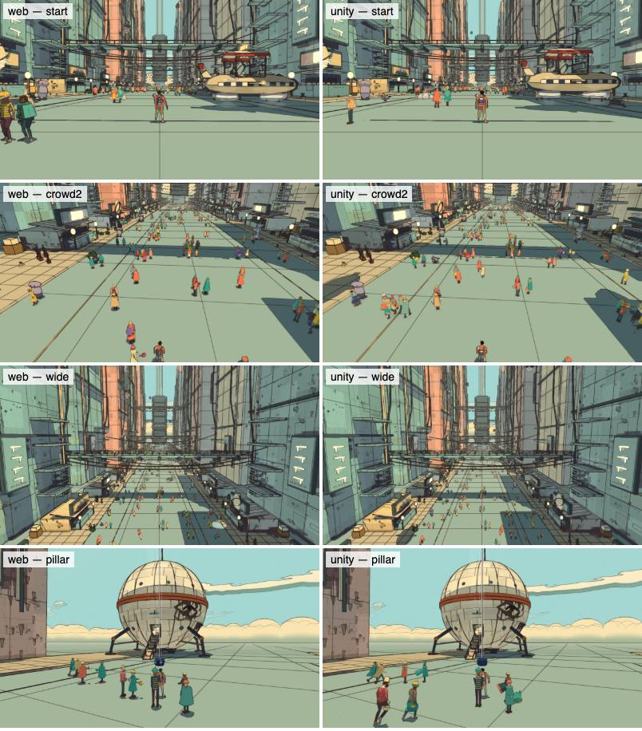
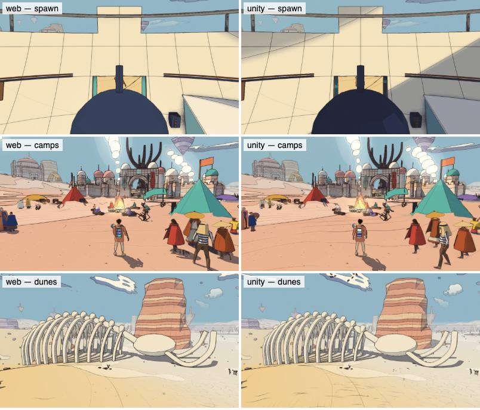
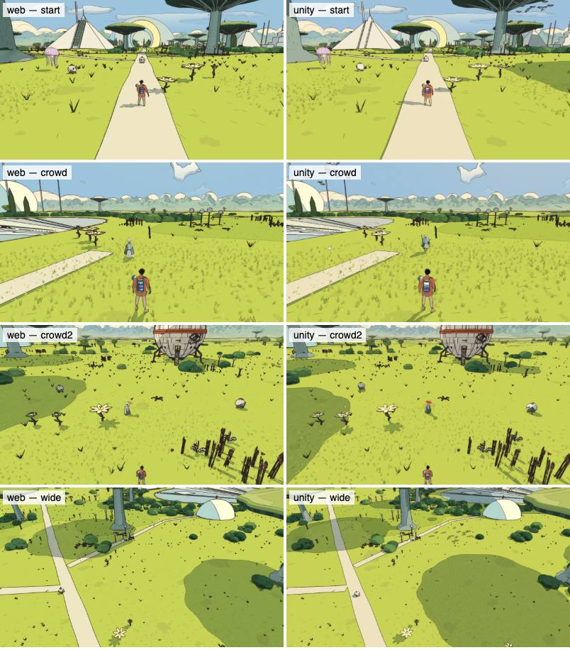
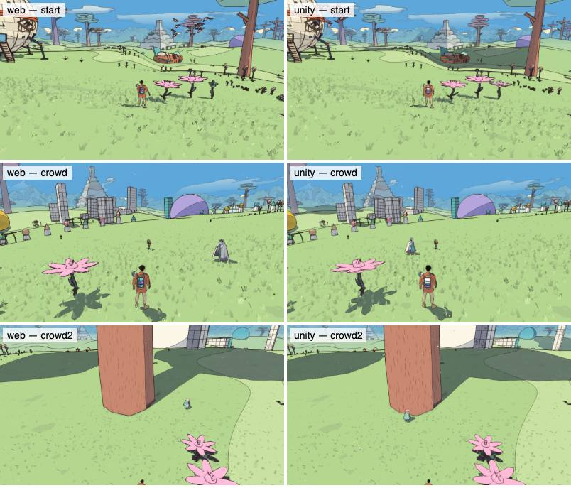
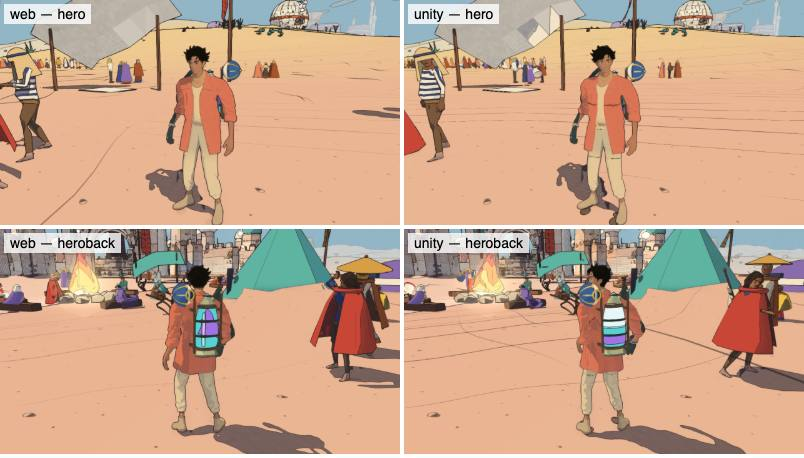

What still differs: which people stand where (another moment of the same code);
cloud shadows (the clock); the portraits in the conversation chip.

(Some people near the camera held their things out sideways: the crowd's GPU figures, whose port, Crowd.hlsl,
still read the costume in the old packing and so showed the wrong pieces, several props at once. Ported again
from crowd-shader.js, 2026-10-07.)

**The overshirt in a Burst job** (2026-10-07). The coral-shirt traveller's cloth was most of the script's
frame (the web steps its cage in a Worker and, since, moves the garment in its vertex shader; the engines' VMs
have no Worker). `src/characters/tripo-cloth.js` takes an engine's offload (`CLOTH_HOST.offload`, set by
engine/game.js from the backend's `clothOffload()`): once, the cage's constants and the garment's flat arrays
(`engine/cloth.js packClothDesc`, `BridgeHost.Cloth`); each frame, the packet the module still works out on the
VM's thread from the bones (the cage's targets, the leg capsules, the bones' matrices with the bind inverse
folded in, the attachment: op 17, ~3 KB). `BridgeCloth.cs` steps the cage (90 Hz Verlet, 18 passes over the
edges and the capsules), places every garment vertex (rigid on the attachment, eased into its skinned place,
plus its cell's displacement, pushed out of the legs) and works out the normals in one Burst job, scheduled
as the packet arrives and completed before the frame is drawn; the garment's meshes take the result (mirrored
in x). `engine/cloth.js clothFrame` is the same steps in JS, which `tests/cloth-offload.test.js` checks against
the module's own path. At the camps (load ~35) the script's update went from 13.6 to 4.8 ms, the frame from
22.9 to 11.1 ms; the dunes from 6.7 to 1.5 and 13.2 to 5.4.

**The rest of the gaps, closed** (2026-10-07). Hatching that follows the form: the part's axis per vertex
(src/form.js `aFormC`, `aFormA`) rides the geometry (flag 64, TEXCOORD5 and 6) where a material says `S_FORM`,
and Surface.shader builds materials.js's `vForm` from it: caps' strokes radiate, cylinders' wrap, a dark cap's
veins are drawn lighter as branches, a denser hatch (HATCH_DENSE) is closer and heavier. The makers' boxes draw
their star, compasses and travelling ray (`boxMarks`, `boxRay`), inked by their outline only; the ray's clock
goes live (`materialVec`, op 18). A MakeHuman face's shape keys (body.js `keyTexture`) become the mesh's blend
shapes, scaled by its head (`faceKeyDeltas`, `BridgeHost.FaceKeys`: only the vertices a key moves), and each
face's weights go a frame they move (`keyWeights`, op 19). The overshirt's lining colours its back faces
(`_Lining`); the trousers' repaired band is in their vertex colours.

Side by side after all of it (the web left, Unity right, the same views; the editor):

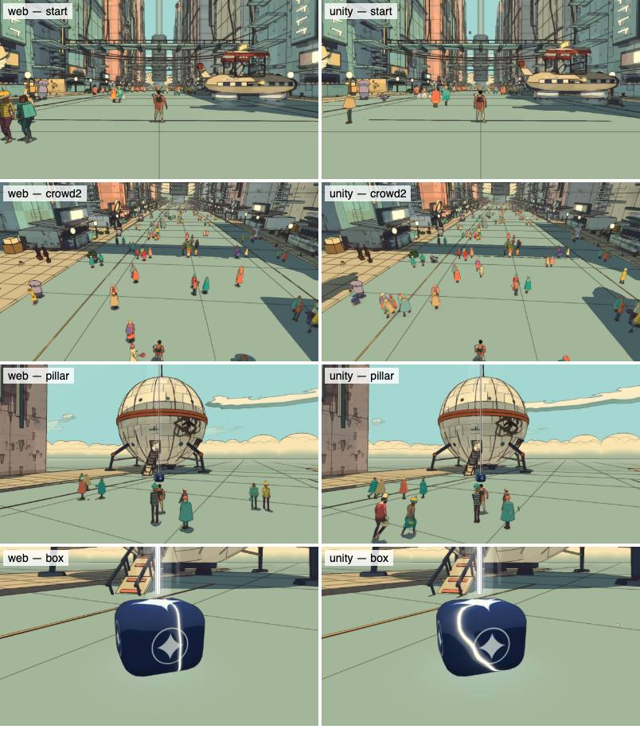
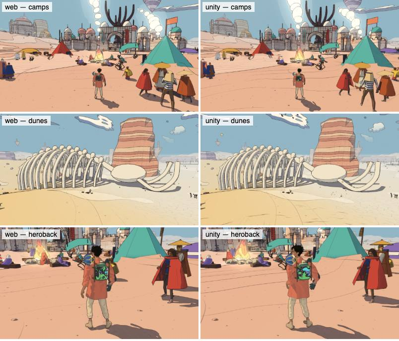
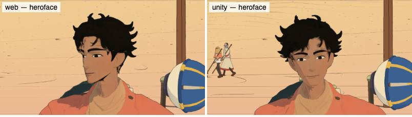
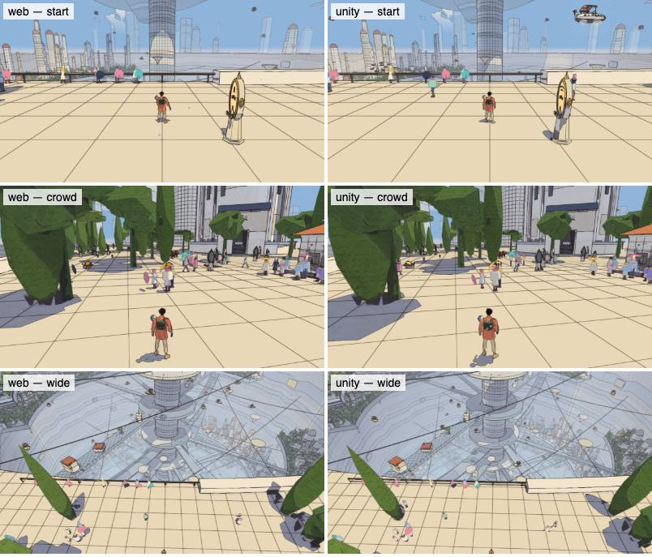
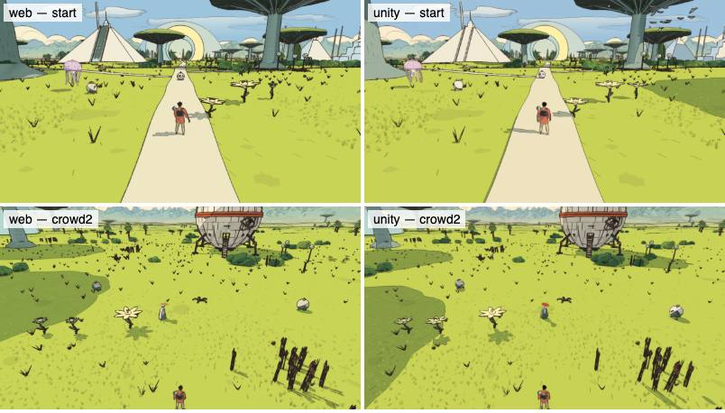

(Once, with the machine's load at 150, the editor's shots after the first came out black; the same run again,
the load at 20, drew every view. `-look` logs the frame's look at each shot.)

**The newer pieces from the web** (2026-10-07). The coral-shirt traveller's drawn face (characters/tripo-face.js:
brows, eyes and mouth drawn in his body's shader, moved by his expression): its GLSL is turned into HLSL by
`scripts/unity-export/tripo-face-hlsl.mjs` (`TripoFace.hlsl`, generated; a test checks it is current) and its four
vectors go live with the boxes' (`LIVE_VECTORS`, op 18). The glass flask (fluid-tool.js buildFlask): its living
fluid (`flaskFluid`, the green base the tones stream through, op 16 carries it), the glass's tint, its pale rim,
its foot and its etched thirds; the fluid's meshes now upload their rest place, which the shader reads its box by.
And a fix found on the way: the bridge sent every figure's rest pose unmirrored where the port's shader expects
it mirrored like the points (the port's own figures keep it so), so faces, sashes and the flask were drawn the
other way round. The Garden's and Lorn II's kits (garden-kit.js, wood-kit.js) need nothing of their own: vertex
colours and a palette, which the port draws.

**What it costs** (before the overshirt's job, above): the VM's update grew with what it now runs. The coral-shirt traveller's overshirt cloth is
the largest share: on the web it steps in a Web Worker, here on the VM's own thread (in Node's `vm` context,
35 of a 49 ms frame at the garage; in Puerts' V8 a few ms). On a busy machine (load 21–27) the editor's frame
at the camps was 22.9 ms (update 13.6, mirror 5.0), the dunes 13.2 (6.7, 2.8), the Garden of Spheres' start
5.8 (3.0, 1.3): to be measured again quietly, and the cloth moved off the script's thread (a C# job over the
same flat arrays tripo-cloth-sim.js steps) before the Retroid's run.

## Players (Unity + Puerts, next stage 4)

`BridgeBuild.cs` builds the bridge's scene alone with the bundle and the characters it loads
(public/anim/*.glb into StreamingAssets/memento-js/public), the bridge's own package name
(`com.rnaud.memento.bridge`):

```sh
node scripts/engine-bundle.mjs unity                              # the bundle first: a build takes StreamingAssets as they are
scripts/unity-export/unity-batch.sh BridgeBuild.Il2cpp            # once: Puerts' IL2CPP glue into Assets/Gen (not committed)
scripts/unity-export/unity-batch.sh BridgeBuild.Mac               # IL2CPP ARM64: Builds/bridge-macOS/Memento JS.app
scripts/unity-export/unity-batch.sh BridgeBuild.Linux -mono       # the Steam Deck's: Linux x86_64, Vulkan: Builds/bridge-linux/
scripts/unity-export/unity-batch.sh BridgeBuild.Android           # IL2CPP ARM64, Vulkan then GLES3, debug key: Builds/bridge-android/memento-js.apk
scripts/unity-js-player.sh bench -views scripts/bench/viewpoints.json -bench 6 -split -out output/engine-bridge/player-mac
```

A player takes its plan from its command line (`BridgeArgs.cs`: the batch run's arguments, a relative
path from the shell's directory) and `-limit secs`; `-mute` keeps it silent (the script passes it).
Under IL2CPP:
- Puerts 3.0.3 wants its IL2CPP glue generated ("Minimal Bridge, Reflection Mode"), and the glue calls
  il2cpp's `Object::Unbox`, which Unity 6.6's il2cpp no longer has: `BridgeBuild.Il2cpp` generates it
  and patches those calls to the object's raw data;
- an IL2CPP player hands a JS value typed `object` over as a ScriptObject, not as an ArrayBuffer: the
  script boxes its buffers (`{ b }`, `BridgeHost.BoxBuffers`) and `JsRuntime.Bytes` reads the buffer out
  as Puerts' ArrayBuffer (`ScriptObject.Get<ArrayBuffer>`);
- `link.xml` keeps Puerts' assemblies and the bridge whole; StreamingAssets inside an APK are read
  through UnityWebRequest (`StreamingFile`).

What came out (Unity 6000.6.4f1, an M-series Mac):

| player | size | its start |
|---|---|---|
| macOS, IL2CPP ARM64 | 163 MB (V8 56, GameAssembly 42, UnityPlayer 29, data 30) | the bundle running 2.4 s after launch, the world ready 1.7 s later |
| Linux x86_64, Mono (the Deck's) | 133 MB, 46 MB as a .tar.gz | built, not run (no Linux machine; Linux IL2CPP from a Mac wants Unity's Linux sysroot package) |
| Android, IL2CPP ARM64 | 58 MB APK (149 MB unpacked: libil2cpp 55, libunity 30, V8 18, the bundle 6.7) | in an emulator of its own (Android 15, arm64, software GPU): installed in 14 s; the bundle running 5.5 s after launch, the world ready 9.8 s later, the desert drawn |

The macOS player against the web game in Chrome at the same views, back to back (1280 × 720, the
web's High preset at render scale 1; the player's frame is uncapped), medians in ms, the player's
script share in brackets (the game's update, the mirror, the sound); the machine was busy (load
24–40), so these are a comparison, not a benchmark:

| view | the player | web |
|---|---|---|
| spawn | 6.8 (4.2: 1.7, 1.9, 0.4) | 6.4 |
| qanat-tree | 9.4 (7.4: 4.9, 2.0, 0.4) | 7.8 |
| camps | 11.0 (8.4: 5.4, 2.3, 0.6) | 8.5 |
| dunes | 4.1 (2.3: 1.0, 1.0, 0.2) | 3.2 |
| cave | 4.1 (2.3: 1.1, 1.0, 0.3) | 2.7 |

The player is within 6–30 % of the web at the busy views and 1–1.5 ms behind at the quiet ones; the
difference is the game's own update (5.4 ms at the camps in Puerts' V8, the same modules) and the
mirror, which the web does not pay. The C# apply is 0.1–0.3 ms. The Android numbers on a
device wait for the Retroid.

### The players again, and the web against the macOS player (2026-10-07)

With everything above in (the overshirt in its Burst job, the surface marks, grass, wind, people, the boxes),
built again from the same tree (`scripts/unity-export/unity-batch.sh BridgeBuild.Il2cpp`, then `.Mac`,
`.Android`, `BridgeBuild.Linux -mono`): the macOS app 173 MB, the Android APK 73 MB, the Linux player 141 MB.
Not installed anywhere. On a device they are one command each:

```sh
scripts/bench/android-bridge.sh desert -views scripts/bench/viewpoints.json -bench 8 -split   # the Retroid: installs com.rnaud.memento.bridge only, muted
# the Deck: copy unity/Memento/Builds/bridge-linux/ over, then
./memento-js.x86_64 -mute -screen-width 1280 -screen-height 800 -level desert -views viewpoints.json -bench 8 -split -out out
```

(`android-bridge.sh` pushes the views to the app's own folder, starts it with the plan as Unity's `-e unity`
arguments, waits for it to exit and pulls its pictures and `unity-bench.json`; written without a device to run
it on.) The four views of the comparison, each side back to back as the machine went quiet (load 8–10; a
second round at load 8–19 in brackets): the web game in Chrome (High, render scale 1, 1280 × 720, uncapped)
and the macOS player (IL2CPP, uncapped), medians in ms; the player's script in its frame split into the game's
update and the mirror:

| view | web: frame (CPU, GPU) | macOS player: frame | its script (update + mirror) | its GPU |
|---|---|---|---|---|
| the camps | 8.8 (8.6, 3.5) [7.4] | 11.9 [13.5] | 8.7 (5.3 + 2.9) | 5.9 |
| the dunes | 4.0 (3.8, 2.6) [2.9] | 4.7 [7.8] | 2.7 (1.3 + 1.2) | 6.3 |
| the Signal Market's crowd | 4.4 (4.3, 2.8) [6.5] | 6.6 [7.7] | 4.3 (2.9 + 1.1) | 5.4 |
| the City-Shaft, wide | 8.7 (8.4, 5.7) [10.5] | 11.5 [14.1] | 5.6 (2.7 + 2.5) | 12.8 |

The player is 1–3 ms behind the web at every view. Its script costs about what the web's whole frame costs
(the same game update, plus the mirror the web doesn't pay); the overshirt's job adds 0.5–0.8 ms of waiting
on the main thread. Its GPU is now the heavier side: the port's composite took on the web's newer passes
(spot blacks' enclosure, haze, the lines by material), and at the City-Shaft's wide view the frame is the
GPU's (12.8 ms). Next for speed: the mirror's walk (static subtrees skipped), and the composite's passes
compiled in only where a look asks for them, as post.js does (`inkFeatures`).

## Speed: the script on its own thread, still subtrees (Unity + Puerts, 2026-10-07)

Profiled in a development player (`BridgeBuild.Mac -development`, the bench's `-split`: the mirror's parts,
and Unity's own main-thread samplers by name, `BridgeGpuSplit.cs`; this Mac's Metal has no GPU recorders, so
those are CPU times), the player was CPU-bound everywhere but the City-Shaft: at the camps 12.7 ms a frame,
of which the script 8.7 (the game's update 5.4, the mirror 2.8), Unity's culling and render-graph recording
2–3, the overshirt's job waited for 0.65; the GPU 6.9. The script and Unity's drawing ran one after the other
on the main thread. Three changes:

- **The script on a thread of its own, a frame ahead** (BridgeRunner.cs, BridgeHost.cs). While Unity draws
  frame N, the script plays frame N + 1. At the next Update the main thread waits for it, applying what it
  hands over as it comes (every op that touches Unity is queued in order, `BridgeHost.On`; what returns a value
  is asked of the main thread and waited for: a file inside the APK, the save, `Ask`), takes the keys, the pad,
  the mouse and the frame times for the next frame (`Snapshot`), and lets it go. The frame costs the longer of
  the two, not their sum; the picture is one frame behind the script (as the web's is behind its GPU).
  V8 takes its stack limit from the thread that makes the isolate, so the JsEnv is made on the script's thread
  (64 MB of stack); Puerts reads its own scripts from Resources as it starts, which only the main thread may,
  so a loader hands those reads over (`Assets/MementoJS/Puerts/MainThreadLoader.cs`, an assembly that compiles
  only where Puerts is installed, found by name). On macOS a plain thread ran on the efficiency cores, the
  script ten times slower: it asks for the main thread's class (`pthread_set_qos_class_self_np`,
  USER_INTERACTIVE). `-js-main` (or `"jsMain": true`) runs the script in Update as before. The bench's split
  says how long the main thread waited (`mainWait`) and that the thread ran (`threaded`).
- **Still subtrees frozen** (engine/mirror-freeze.js). Every 30 frames the mirror looks for the largest
  subtrees whose drawables have not moved for 45 frames (plain groups and meshes: no bones, instances, lines,
  render hooks, face keys or own matrices) and freezes them: the walk takes such a subtree whole (its drawables
  seen, its materials' live colours still looked at) without going in, and three's matrix update stops at its
  root while the root's parent stays where it was. Every object in it is watched, so a change thaws it at once,
  before the next frame's matrices: position and scale (their x, y, z made accessors), rotation and quaternion
  (their change callbacks), `visible`, a child added or removed, the root moved elsewhere, its parent's world
  matrix. A geometry rewritten or swapped, or a render hook set later, has no hook: each frozen subtree is looked
  at for those once every 8 frames. One that thaws soon after freezing waits twice as long each time. At the
  dunes this halved the mirror (2.1 to 0.8 ms in Node's VM, the walk 1.8 to 0.6), at the camps a third.
  tests/mirror-freeze.test.js plays 400 frames of random moves, turns, hides, adds, removes and reparentings
  on two copies of a world and checks the frozen mirror says exactly what a full walk says, every frame.
- **The bones walked only down to what hangs on them** (a prop in a hand), and a geometry's version summed once
  a frame however many drawables share it.
- **The composite's passes compiled in only where a look asks for them**, as post.js's `inkFeatures`: the
  spot blacks, the haze (layers and height fog), the cast and the ink shadows are Composite.shader keywords
  (`MEMENTO_INK_SPOT`, `_HAZE`, `_CAST`, `_SHADOW`) that MementoLook sets from the look's own values.

## Status

- **Stage 1, the spike**: the desert, built by `createDesert` inside GodotJS, mirrored to Godot
  nodes and drawn through a first ink port, saved as a PNG:
  
- **Stage 2, the Godot renderer**: the desert played in Godot through the bridge (above).
- **Stage 3, the Unity renderer**: the desert played in Unity through Puerts, drawn by the port's
  own ink look (above).
- **Stage 4, the comparison**: above.
- **Unity, stage 1 (a cheaper sync)**: above.
- **Unity, stage 2 (the platform layer, the HUD and conversations in uGUI)**: above.
- **Unity, stage 3 (the rest of the picture and the play: sound, life, weather, the tool and the
  drone, lights, motes, prints)**: above.
- **Unity, stage 4 (players: macOS, Linux, Android)**: above.
- **Unity, the web's newer look and the rest of the world** (the surface marks, the boxes, grass, wind, the
  answering flowers, MakeHuman people, the coral-shirt traveller, the cabs): above.
