# The engine bridge: the game's JavaScript inside Godot and Unity

The C# port (`unity/Memento`, docs/systems/unity.md) re-implements the game. The bridge goes the
other way: the game's own modules run in the engine's JavaScript VM (GodotJS's V8 in Godot, Puerts'
V8 in Unity), build and move their three.js scene as they do on the web, and the engine only draws
it. One game, drawn by three renderers, never out of step.

## What runs where

| | the web | Godot / Unity through the bridge |
|---|---|---|
| levels, physics, player, camera rig, story, people, quests, saves | `src/` in the page | the same `src/`, bundled (`scripts/engine-bundle.mjs`) into the engine's VM |
| the scene graph and the maths | three.js | three.js (its `Object3D`s, matrices, geometries, materials as data: no `WebGLRenderer`) |
| drawing | `WebGLRenderer`, `materials.js` G-buffer, `post.js` ink | the engine's nodes, fed by the mirror (`engine/mirror.js`); the ink look in the engine's shaders |
| the page (HUD, menus), input, sound, files, storage | the browser | `engine/platform.js` stand-ins, fed by the engine's host (`engine/<engine>/host.js`) |

Per frame: the engine calls the bundle's `frame(dt)`; the game updates; `SceneMirror.sync(scene,
camera)` walks the scene and hands the backend only what changed; the engine draws.

## The seam: the scene mirror

`engine/mirror.js` (engine-agnostic, tested in Node) gives every drawable a small integer id the
first time it is seen, every geometry and material theirs, and calls the backend:

| op | when | payload |
|---|---|---|
| `geometry(gid, g)` | a geometry first seen, or an attribute's `version` moved | three's typed arrays as they are (`position`, `normal`, `uv`, `color`, `skinIndex`, `skinWeight`, `index`) and its groups |
| `material(mid, spec)` | a material first seen | `engine/ink-spec.js`: makeMaterial's options read back from its uniforms, plain numbers and arrays; the frame's shared uniforms left out |
| `create(id, node)` | a drawable first seen | `{ kind: mesh / instanced / skinned / points / line / sprite, gid, mids, name, renderOrder }` |
| `transforms(ids, mats, n)` | each frame, once | the world matrices that changed, packed: `n` ids and 16 floats each |
| `visible(id, on)` | an object (or an ancestor) shown or hidden, or out of the scene | |
| `instances(id, count, mats, colors)` | an `InstancedMesh`'s matrices or count changed | three's `instanceMatrix` (16 a instance) and `instanceColor` |
| `bones(id, mats, n)` | each frame a skinned mesh is seen | three's `skeleton.boneMatrices` (bone world × inverse bind) |
| `remove(id)` | out of the scene for `forgetAfter` frames | |
| `camera(c)` | each frame | world matrix, vertical fov, near, far, aspect |
| `frame(f)` | each frame, last | the frame number and counters |

World matrices only: the engine side is flat (one node per drawable under one root), so three's
own hierarchy, `matrixAutoUpdate`, attachments and skeleton maths stay in three. Godot and three
agree on frames (right-handed, y up, cameras down −z): only the winding flips (three's front faces
are counter-clockwise, Godot's clockwise). Unity is left-handed: x is mirrored, as the C# port's
exporter does.

**Materials** cross as data, not shaders: `inkSpec(material)` gives `{ type: 'ink' | 'basic' |
'shader', side, transparent, defines, u: { uColor, uMode, uGlow, uShade, … } }`, and
`engine/ink-params.js` maps it to the engines' ink shader parameters (`color`, `color2`, `mode`,
`strata_size`, `glow`, `shade_lift`, `hatch_k`, …). The engine keeps one ink surface shader and
sets parameters per material, as `export-world.mjs materialOf` does for the C# port. The frame's
look (sun, shadow tint, ink, sky, fog: `sharedUniforms` and post.js's uniforms) is sent once a
frame.

### Godot (GodotJS)

`engine/godot/backend.js` runs in the same VM as the game and calls Godot directly: an
`ArrayMesh` per geometry (one surface per group), a `MeshInstance3D` or `MultiMeshInstance3D` per
drawable, a `ShaderMaterial` on `godot/shaders/ink_surface.gdshader` per ink material. Bulk data
never goes vertex by vertex through the binding: an `ArrayBuffer` reaches Godot as a
`PackedByteArray` (a copy at memory speed), laid out as `var_to_bytes` writes a packed array
(`[type][count][data]`, `engine/godot/pack.js`), so `bytes_to_var` makes the `PackedVector3Array`,
`PackedInt32Array` or the MultiMesh's `PackedFloat32Array` natively. Transforms are one
`Transform3D` per moved node.

`godot/` is the project: `main.tscn` with one script, `main.js`, which `require`s the bundle
(`godot/js/memento*.js`, built, git-ignored) and forwards `_ready`, `_process` and `_input`.
`godot/shaders/ink_post.gdshader` is the ink composite on a full-screen quad.

### Unity (Puerts), planned

The same bundle under Puerts' V8. Puerts calls C# by reflection or generated wrappers, slower per
call than GodotJS, so the Unity side applies the ops in C#: the JS backend appends them to one
command buffer (`ArrayBuffer`: op, id, payload), handed over once a frame, and a C#
`BridgeRenderer` decodes it into `Mesh`es (`SetVertexBufferData` from the bytes), `MeshRenderer`s
or `Graphics.RenderMeshInstanced`, and materials on the C# port's ink shaders
(`unity/Memento/Assets/Memento/Shaders`). In its own project or assembly, so the C# port keeps
working.

## The browser APIs the game uses

`engine/platform.js` `installPlatform(host)` puts stand-ins on `globalThis` where the VM has none
(GodotJS's V8 has `setTimeout` and `console` and nothing of the page: no `performance`,
`TextDecoder`, `queueMicrotask`, `URL`, `fetch`). `engine/boot.js` installs them first in every
bundle, before the game's modules load (some touch the page as they load), and routes
`GLTFLoader.load` through the host's files, as `scripts/unity-export/build-world.mjs` does in Node.

| API | used by (modules) | in the engines |
|---|---|---|
| `document`, elements, `innerHTML`, `classList` | the HUD and menus: main.js (57 uses), ui.js, hud.js, quest.js, changelog.js, dev-menu.js, story/ (dialogue, calls, moment, index, the worlds' data), ship/ (cinema, starmap, homecoming), boxes/ (card, effects), temples/runtime.js, npc.js, crowd.js, aliens/alien.js | **shim now** (elements that take every call and draw nothing; `getElementById` keeps one element per id); **bridge later**: a HUD layer (below) |
| `window` events (`keydown`, `keyup`, `mousemove`, `blur`, `beforeunload`) | main.js, player.js (`CameraRig`), ui.js, fluid-tool.js, native-pad.js | **bridge**: the engine dispatches `keydown` / `keyup` with the web's `KeyboardEvent.code` names to the same listeners (`page.dispatch`) |
| `navigator.getGamepads` | controller.js (injectable `pads`), native-pad.js, ship/starmap.js | **bridge**: Gamepad-shaped objects from the engine's joypads (`host.pads()`), standard mapping |
| `localStorage` | save-slots.js, quest.js, changelog.js, audio.js, native-app.js, motion-match.js | **bridge**: the host's storage (Godot: `user://memento-storage.json`) |
| `fetch`, `GLTFLoader` | the characters (`anim/*.glb`), MakeHuman bodies, motion data | **bridge**: `host.readFile(path)` reads `public/` (the repository's, or packed with the game) |
| WebAudio (`AudioContext`, oscillators, filters) | audio.js (89 uses), score*.js, ship/sfx.js, story/arzach2.js | **bridge later**; a silent stand-in for now (`sound` proxies) |
| `performance.now`, `requestAnimationFrame` | 21 modules / main.js's loop, title.js | **shim**: the host's clock; the engine's frame runs the callbacks (`page.tick`) |
| 2D canvas (`getContext('2d')`, `CanvasTexture`) | ship/art.js, ship/portrait.js, ship/cinema.js, levels/home-drawings.js, levels/reference-picker.js | **shim**: a context that draws nothing (painted panels stay blank); later an engine-side canvas or pre-rendered textures |
| `Worker` | lod.js (simplification off the main thread) | absent: lod.js already falls back to the main thread |
| `matchMedia`, `devicePixelRatio`, `location`, `history`, `URL` | perf.js, ui.js, main.js (`?level=`), reference levels (`new URL(…, import.meta.url)`) | **shim**: no media matches, `location.search` from the host |
| WebAssembly | none (three-mesh-bvh is plain JS) | |

### A platform layer for the web game (proposed)

Today `engine/` composes the game's modules itself (the level, physics, the player and the camera
rig: what `main.js` does at load), so the web game needs no change for the spike or the desert. To
run *everything* `main.js` runs, it would be split, in small steps each with its tests:

1. `src/platform/page.js`: one module that owns `document` / `window` access (the HUD's elements by
   id, adding and removing listeners, pointer lock, fullscreen), imported where the 29 modules
   reach for `document` now; the web's version is today's code, the engines' records the HUD's
   state (text, shown / hidden) for an engine-side HUD.
2. `src/platform/input.js`: the keys and pads as one source (today main.js's `input` proxy and
   `Controller`'s `pads`); the engines feed it.
3. `src/platform/audio.js`: `Sound` behind an interface the engines implement with recorded
   samples first (scripts/unity-export/record-sounds.mjs already records every effect and score).
4. `main.js` split into the game loop (platform-free: what `frame(dt)` runs) and the web shell
   (renderer, passes, panel); the engine entries then run the same loop.

## Costs

Measured on the M4 Pro (macOS 26, Godot 4.6.1 + GodotJS 1.1.0 beta 1, V8, Metal Forward+), the
desert, the spike's camera:

- **Bundle**: the game's modules and three.js, 2.98 MB of CommonJS, built in 0.1–0.6 s.
- **Load**: the desert built by `createDesert` in GodotJS's V8 in 4.3 s (12 s in a Node `vm`
  context, whose globals are slow; the game in Chrome builds it in steps between frames).
- **Upload**: 796 drawables, 794 geometries (1.07 M vertices, 1.01 M triangles, 1 915 surfaces),
  274 materials, 36.9 MB of attributes mirrored in 0.53 s, 0.46 s of it in Godot making meshes.
- **Per frame**: the mirror's walk of the scene and a compare of 16 floats per drawable (the web
  renderer walks it too), then one Godot call per moved drawable. Stage 2 measures it in play.

## Risks

- **GodotJS is in beta** (1.1.0 beta 1 for Godot 4.6.1, April 2026); the editor binary is GodotJS's
  own build of Godot, so the Godot version follows theirs. Its V8 is current; QuickJS (`qjs-ng`)
  builds exist for platforms without a JIT (iOS).
- **Modules**: GodotJS and Puerts load CommonJS; the game is ESM with top-level `await` in main.js.
  The bundle is flat CommonJS (`codeSplitting: false`), so dynamic imports are inlined and no
  module loading happens at run time. A top-level `await` cannot be bundled into CommonJS: the
  entries are functions the engine calls.
- **No workers, no WASM** used by the game; lod.js's worker already falls back.
- **`import * as godot`** of GodotJS's lazy module proxy is empty once bundled (the bundler copies
  its keys): engine code imports the default (`import godot from 'godot'`).
- **Quitting deadlocks on macOS** with a window open (NSApplication's terminate waits on a thread
  V8 holds); batch runs kill the process after the log (`batchExit`).
- **Pictures need a window** on macOS: `--headless` uses the dummy renderer (scripts and tests run
  headless; screenshots open a window for a few seconds, muted, `--audio-driver Dummy`).
- **The ink look is a port to keep in step**: materials.js and post.js are 3 300 lines of GLSL; the
  engines' shaders follow them by hand (as the C# port's HLSL does). Godot's Forward+ gives depth,
  normals and the lit colour to a post pass, not the web's custom G-buffer, so the shade and the
  strokes are drawn in the surface shader's `light()` and the lines in the post pass.
- **Per-call cost** in Puerts (reflection) is higher than GodotJS's: hence the command buffer.

## Running it

```sh
node scripts/engine-bundle.mjs                 # the bundles (godot/js/memento.js, memento-spike.js)
godot/run.sh                                   # play the desert in Godot (WASD, Shift, Space; the right mouse button turns the camera; pads)
godot/run.sh --views=$PWD/scripts/bench/viewpoints.json --out=$PWD/output/engine-bridge/godot   # a PNG a viewpoint
godot/run.sh --bench=6 --views=… --out=…       # frame times a viewpoint, uncapped: <out>/godot-bench.json
godot/run.sh --walk=4 --out=…                  # the traveller walks forward for 4 s, a PNG at the end
godot/run.sh --entry=spike --shot=$PWD/output/engine-bridge/spike.png      # the spike: one frame
node scripts/godot-globals.mjs                 # godot/project.godot's [shader_globals] from engine/ink-params.js
```

`godot/run.sh` rebuilds the bundles and runs the GodotJS editor binary from
`.local-tools/godot/` (`GODOT=` another), muted (`--audio-driver Dummy`), its log in
`output/engine-bridge/godot.log`; `--shadows=0`, `--post=0` and `--only=camps,dunes` narrow a
benchmark. GodotJS's debugger listens on port 6299 (`godot/project.godot`). The web side of the
same viewpoints is the benchmark's own (`scripts/bench/web-bench.mjs --paths 0 --shots dir`).
`tests/engine-bridge.test.js` checks the stand-ins, the mirror's ops (no false moves, no false
uploads), materials read back, the Godot layouts, keys and pads, the skinning, the look's globals
against `project.godot`, the bundle's regular expressions, and the game itself in a bare V8
context (no Node, no page): a world built with its people, the traveller walking on the keys,
the camera following.

## The Godot renderer (stage 2)

`engine/game.js` builds the world as `main.js` does at load (the level, physics and water, the
ship at its site, the traveller with his body, clips, gear and cape, the people near the start,
the crowd and its pooled full bodies, the story's people and places, the flora) and plays it a
frame at a time: the keys and pads into `Controller` and `Player.update`, the camera rig, the
crowd and the people, the story's update, the level's own update, the hour's palette. Left out:
the HUD and menus (the page's), conversations, sound, the fluid tool, the drone, weather,
wildlife, the grass blades, the ship's scenes.

**On the Godot side** (`engine/godot/`): the mirror's ops become nodes (`backend.js`); the
skinned bodies are skinned in the ink shader from one **bone atlas** a frame (a float texture,
every skinned mesh a row: `skin.js` folds three's bind matrices into one matrix a bone), so a
crowd costs one texture upload, not one a person; geometry that changes (cloth, trails) is sent
again and swapped in; the shadow casters follow the web's rules (`level.noShadow`, the gear's,
`selfLitSkips`). **Input**: Godot's key events as `KeyboardEvent.code`s (`keys.js`), its joypads
as standard-mapping Gamepads for `controller.js`, the mouse (right button) into `CameraRig.look`.

**The ink look in Godot** (`godot/shaders/`): Godot's Forward+ gives a post pass the depth, the
normals and the lit colour, not the web's G-buffer, so the work is split differently:
- `ink.gdshaderinc` (the surface, five variants by side and skinning): the albedo by mode (plain,
  the terrain's patches and slopes with the desert's regions and sand blobs, the strata bands, the
  people's outfit zones by the rest pose, metal's three tones, vertex and instance colours, grid
  lines as drawn detail); in `light()` the web's light term and two tones (each surface's lift,
  half-tone, bounce and hue) and the pen strokes, ported from `materials.js` (object-space
  triplanar, power-of-two spacing, crossed where darkest, fewer on a lifted shade, faded far
  off). The maths is in the web's display values, then taken to Godot's linear light.
- the albedo's value goes to the post pass in the normal buffer's roughness channel (Godot keeps
  7 bits of it), so colour boundaries are found on the albedo, not on the hatching;
- `ink_post.gdshader`: the lines (`post.js inkLines`: the Laplacian of 1/z, creases, colour and
  shadow boundaries, silhouettes heavier, thinner with distance, wobble, pen pressure, broken
  interior lines), the sky (bands, the flat print sky, the sun's side), fog in flat bands toward
  the haze, aerial perspective;
- the frame's look (post.js's preset and the hour's palette: tints, ink, sky, fog, line
  settings) as Godot **global shader parameters** (`engine/ink-params.js` GLOBALS, declared in
  `project.godot`), set once a frame when they change.

Not ported yet: the sky's dots, clouds and paper, weathering and pen detail on walls, facades,
tiles, leaves and cracks, glyphs, plating, the crevice and spot blacks, crease shading (AO),
water's own look, the faces' ink, glows and bloom, the crowd's GPU animation (its figures stand in
their rest pose past the pooled bodies), the canvas-painted panels.

The same viewpoints (`scripts/bench/viewpoints.json`), the web game in Chrome (left) and the game
in Godot through the bridge (right), 1280 × 720, hour 10:

| web (three.js) | Godot 4.6 + GodotJS (the same JS) |
|---|---|
| 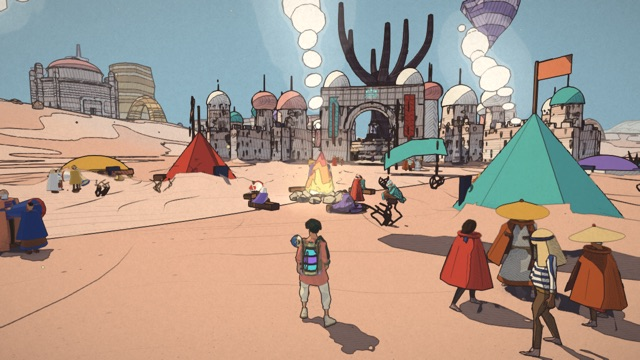 | 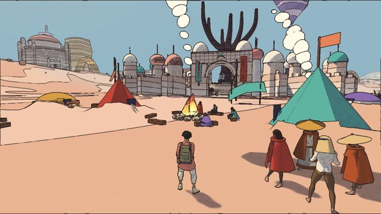 |
| 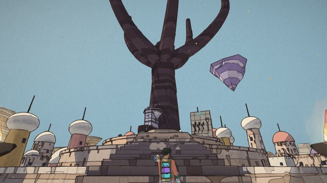 | 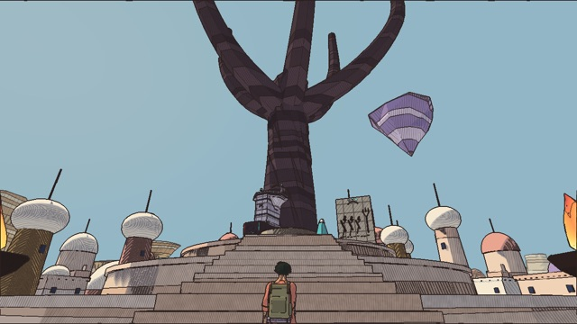 |
| 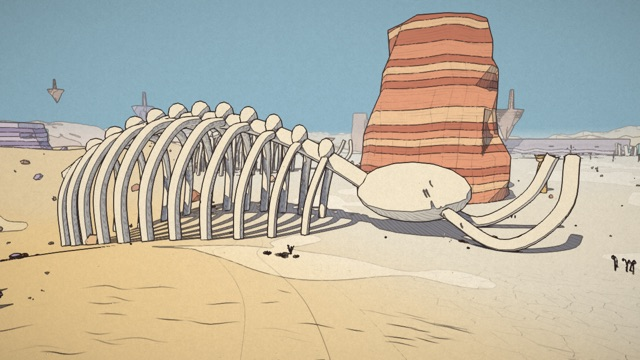 | 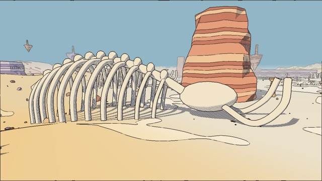 |
| 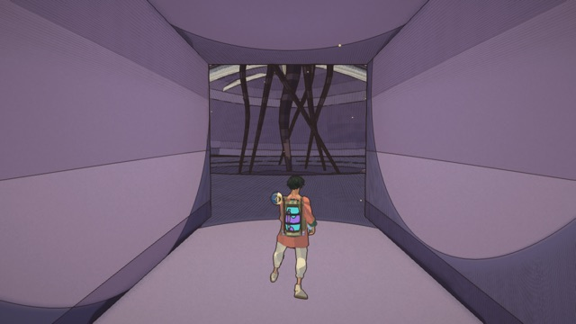 | 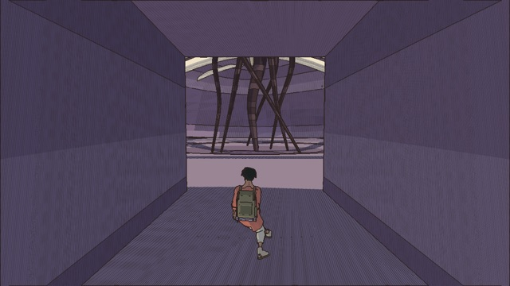 |
| 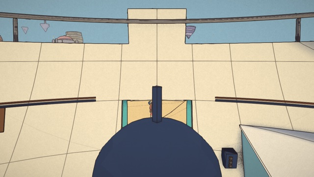 | 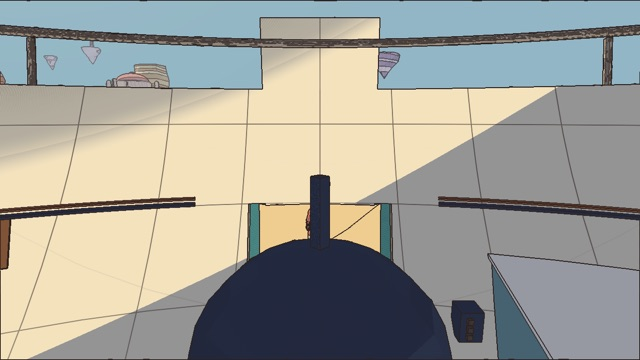 |

(The spawn view stands inside the parked ship: the web hides its hull from the sun when you are
in it, the bridge doesn't run the ship's scenes yet, so the hull's shadow falls on the floor.)
Walking, the camera on the rig (`--walk=4`): 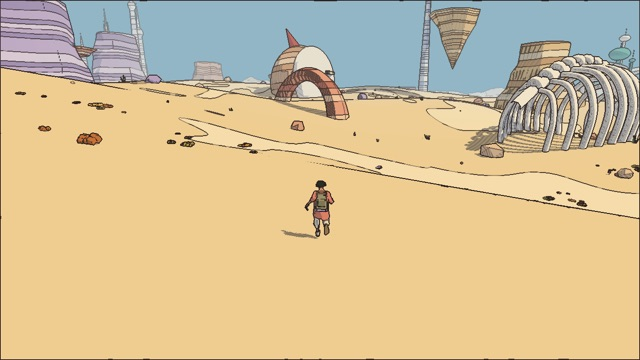

**Frame times, first numbers** (M4 Pro, 1280 × 720, uncapped: no vsync either side; medians in ms;
the web: `web-bench.mjs --preset high`, render scale 1; Godot: `--bench=6`, the wall clock between
frames, Godot's own delta being smoothed to the display). The machine was busy with other work
(load average 30–40 during the Godot runs), so these are an upper bound, to be measured again on a
quiet machine; the run-to-run spread on the Godot side was ±40 %.

| view | web frame | web CPU | Godot frame | Godot: the VM (game + mirror) | Godot: render CPU |
|---|---|---|---|---|---|
| spawn | 7.4 | 7.2 | 15.2 | 9.0 (2.9 + 5.7) | 0.9 |
| qanat-tree | 12.0 | 11.8 | 19.8 | 16.4 (8.9 + 6.7) | 0.7 |
| camps | 10.4 | 10.3 | 24.2 | 19.2 (9.4 + 8.9) | 1.0 |
| dunes | 3.7 | 3.5 | 10.4 | 5.3 (1.2 + 3.8) | 0.6 |
| cave | 3.8 | 3.6 | 18.5 | 8.9 (2.0 + 6.4) | 1.2 |

Where it goes: the VM's share is the game's own update (people, capes, the crowd: the same work
the web does) and the mirror (the scene walk, the moved matrices, the bones, cloth re-sent), and
the rest of a Godot frame is its GPU work (without the sun's shadows or without the ink composite
the dunes drop from 10.4 to 8.4 ms each). Three fixes found by measuring: matrices compared as
the floats they are sent as (a double no float can hold counted as a move: 700 false moves a
frame), interleaved glTF attributes' versions (read off their buffer: every body was sent again
every frame), and the bone atlas (one texture a frame, not one a body). **Load**: the desert is
built in the VM in 1.6–4.5 s (the level 1.3–3.2 s of it) and drawn on the next frame; the web's
first frame comes 3.0 s after navigation.

## Status

- **Stage 1, the spike**: the desert, built by `createDesert` inside GodotJS, mirrored to Godot
  nodes and drawn through a first ink port, saved as a PNG:
  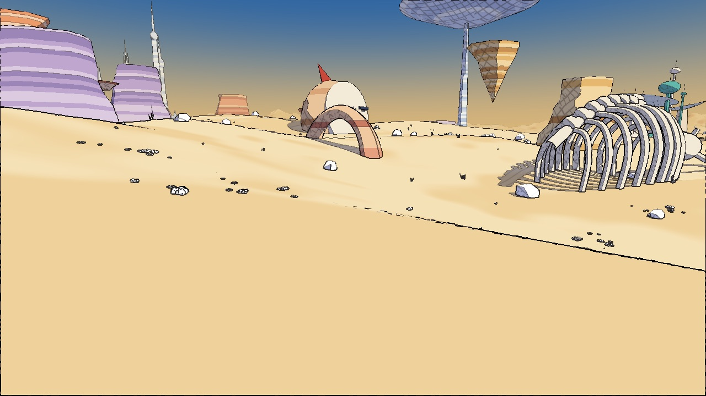
- **Stage 2, the Godot renderer**: the desert played in Godot through the bridge (above).
