# Memento in Unity: every world, by ship

`unity/Memento` is a Unity 6 (6000.6, URP 17) port of the web game, built from the web game
itself: a Node script builds each world headlessly exactly as the game does at load and exports
it; Unity reads the export and draws it through the same G-buffer and ink composite as
`src/materials.js` and `src/post.js`, ported to HLSL. It plays from the ship's prologue through
the desert's opening quest, "The Tree That Drinks", to the ship that hums; then the galactic map
flies to the other worlds (the City-Shaft, Vael, Vael II, the Sealed Hangar, the Buried Machine,
Viridel, the Garden of Spheres, Lorn, Lorn II, the Signal Market and, once it opens, home), each
built from its own export with its look, its people and its story: the takeoff, the approach
from space, the landing at that world's ship site (see [The other worlds](#the-other-worlds)).
The people are dressed and animated as on the web, with the fluid backpack, the makers' boxes,
sound and voices, wildlife, weather and saves.

The same viewpoints, web game (left) and Unity (right), rendered headlessly
(`views.mjs`, `Batch.Shots`):

| web (three.js) | Unity (URP) |
|---|---|
|  |  |
|  |  |
|  |  |
|  |  |
|  |  |
|  |  |
|  |  |
|  |  |
|  |  |

(The Unity world shots show the world alone, outside play, so there are no
people. The three portraits on the Unity side come from the play-through.) In
play, from the scripted play-through (`Batch.Play`):

| | |
|---|---|
|  the prologue: the father's recording, the parents' hologram |  the impact |
|  the camps, the seated people round the fire |  the city from afar, the far crowd instanced |
|  climbing the burning tree's buttress |  the makers' chest comes apart |
|  the tank on his back |  a glob of fluid splashed |
|  the fluid wings |  a dune crab |
|  the star box's keepsake |  the prologue: the crash's furrow |
|  the procession on its loop |  the hoverbike |
|  the arms out under the wings |  the jets' flames and drops |
|  an ember glob: the camp fire flares, a bramble burns |  a fog bank |
| 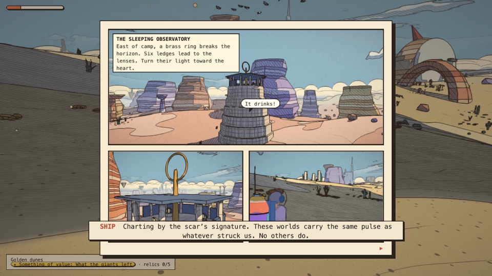 the traveller's sketch: the expedition begins | 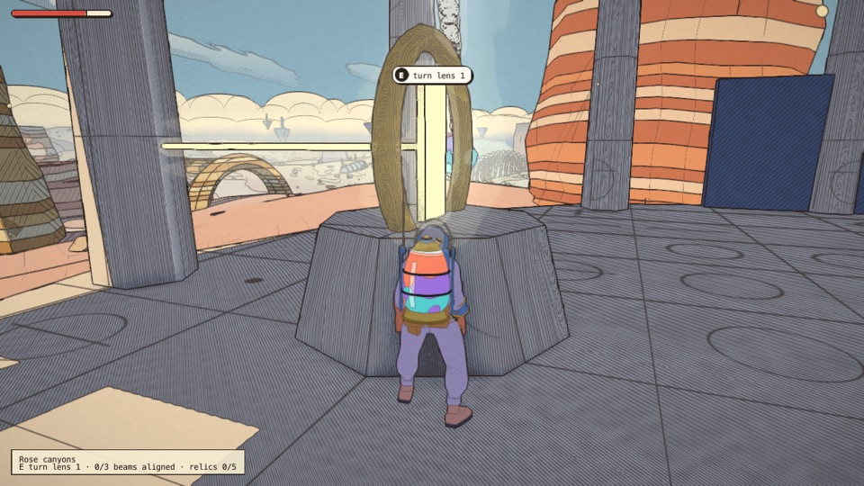 a lens of the observatory |
| 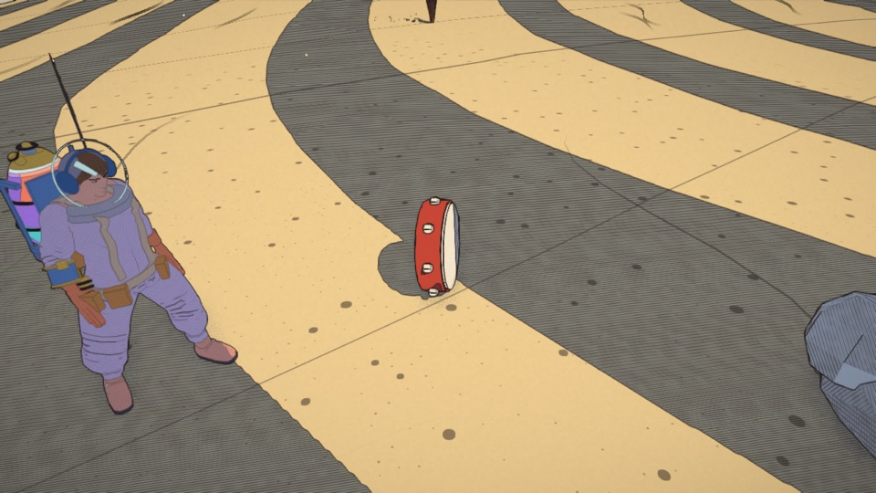 Teo's drum, shoved free of the knuckle | 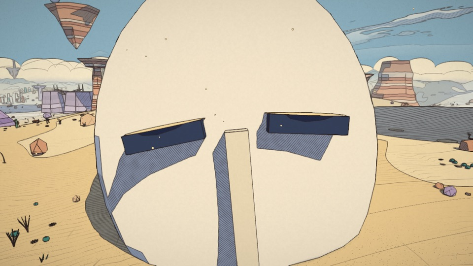 the mask's eyes washed open |
| 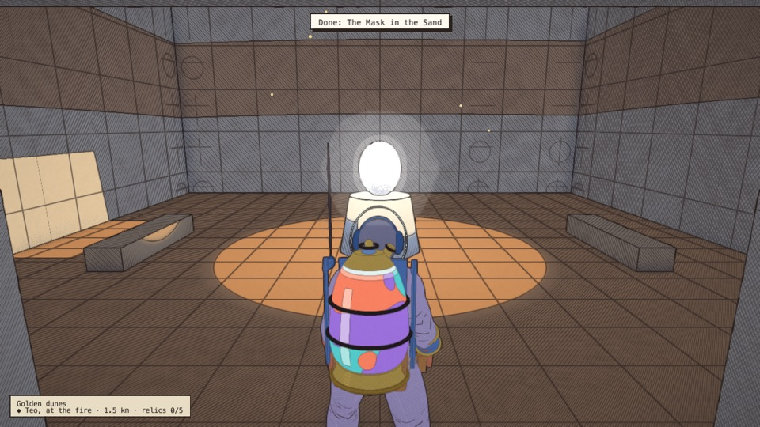 the masked head's chamber (the close arm of a tight room) | 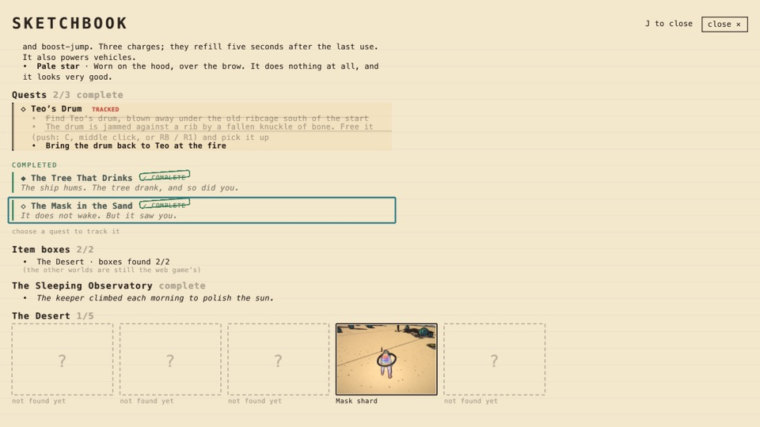 the sketchbook: quests, the observatory, the relics |

The holo table, the rain, the sun rays, the observatory awake (web left, Unity right):

| web (three.js) | Unity (URP) |
|---|---|
| 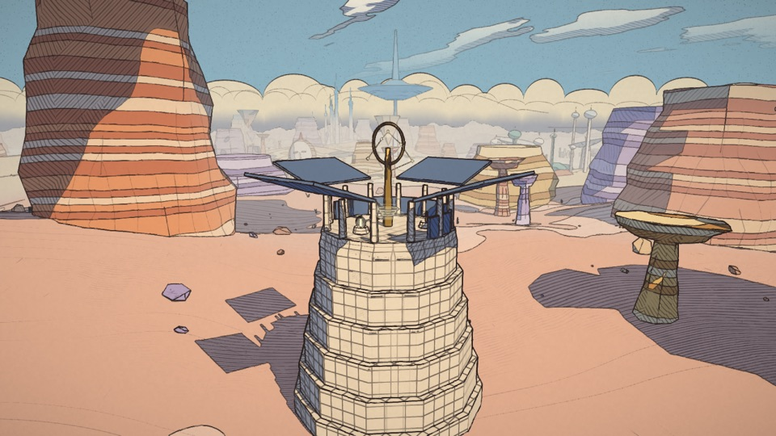 | 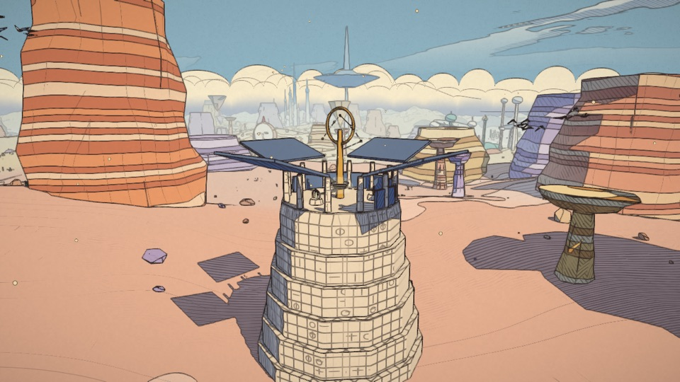 |
|  |  |
|  |  |
|  |  |

## Run it

1. Export the worlds (from the repository root; needs the web game's `node_modules`):

   ```sh
   node scripts/unity-export/export-all.mjs            # every world (one process each), about 35 s
   node scripts/unity-export/export-world.mjs incal    # or one world
   ```

   This writes `unity/Memento/Assets/StreamingAssets/<world>/` (world.json, world.bin, story.json)
   for each world, the shared store `StreamingAssets/shared/` (what every world shares: the
   traveller, the people's bodies and clips, the ship, the boxes) and copies the characters
   (`public/anim/*.glb`) to `StreamingAssets/anim/`: about 1.8 GB in all, none of it committed.
   Run it again whenever a world changes on the web side (`--clean` starts the shared store afresh).
   The sounds are recorded from the web game in a second step (headless Chrome against a dev
   server on its own port; writes `StreamingAssets/sound/`, every effect and each world's score,
   also not committed):

   ```sh
   npx vite --port 5238 --strictPort &
   PLAYWRIGHT=/path/to/playwright-core/index.mjs node scripts/unity-export/record-sounds.mjs
   ```
2. Open `unity/Memento` in Unity 6000.6 (Hub: Add project from disk). The first
   import resolves the packages (URP, Input System, glTFast, MCP for Unity).
3. Once, or after pulling: menu **Memento → Set up project** (URP settings, the
   ink renderer feature, the scenes). Already done in the committed project.
4. Open `Assets/Memento/Scenes/Title.unity` (or `Desert.unity`) and press Play.
   Loading the export takes a few seconds; another world, about one.

### Controls (as in the web game)

| | keyboard + mouse | controller (Xbox / PlayStation) |
|---|---|---|
| move | WASD | left stick |
| look | mouse (hold the right button in the editor) | right stick |
| run | Shift | L3 |
| jump, climb off | Space | A / × |
| talk, use, get on / off the bike, whistle for it | E | B / ○ |
| shoot (the backpack's fluid) | G, left click (cursor locked) | RT / R2 |
| push | C, middle click | RB / R1 |
| gun mode | X | D-pad ← → |
| boost; wings (with the glider) | Space again in the air; hold while falling | A / × again; hold |
| skip a cinematic | hold Esc | hold Y / △ |
| choose an answer | 1–3, ↑ ↓ + Enter | D-pad + A / × |
| sketchbook (journal); track a quest in it | Tab, J; ↑ ↓ + Enter | View; D-pad + A / × |
| close a panel | Esc | Y / △ |
| pause menu (settings) | Esc, P | Menu |
| controls in the status box | H | |
| hoverbike | W / S go and brake, A / D steer, Shift boost | left stick, RT / R2 go |
| the bird (Vael) | Space take off and flap, A / D bank, W dive, S pull up | A / ×, left stick, RT / R2 thrust |
| the galactic map (at the console, the ship powered) | ← → choose, Enter travel | D-pad, A / × |

### From the command line

`scripts/unity-export/unity-batch.sh <Method> [args]` runs one of the entry
points in `Assets/Memento/Editor/Batch.cs` in batch mode (with graphics, so
cameras render on Metal) and prints the log's errors and `Memento:` lines:

```sh
scripts/unity-export/unity-batch.sh Setup                 # project settings, renderer feature, scenes
node scripts/unity-export/views.mjs > /tmp/views.json      # fixed viewpoints, web coordinates
scripts/unity-export/unity-batch.sh Shots -shots /tmp/views.json -out /tmp/shots   # PNGs of the world
scripts/unity-export/unity-batch.sh Play -out /tmp/play    # the scripted play-through (below): the desert, then by ship to the City-Shaft and Vael
scripts/unity-export/unity-batch.sh Play -noTitle -start incal -worlds arzach2,garage,home -out /tmp/trip   # start in a world, fly on
node scripts/unity-export/views-worlds.mjs > /tmp/views.json                                    # viewpoints over every world
scripts/unity-export/unity-batch.sh Play -noTitle -tour /tmp/views.json -out /tmp/tour            # those views in play, world by world
scripts/unity-export/unity-batch.sh Probe                  # collision checks at the story's places
scripts/unity-export/unity-batch.sh UiKit -out /tmp/kit    # the UI kit alone (shapes, text, spacing) on a canvas
```

Unity's EditMode tests (`Assets/Memento/Editor/Tests`, the story run by the C#
ports of the quest and dialogue systems):

```sh
Unity -batchmode -projectPath unity/Memento -runTests -testPlatform EditMode -testResults /tmp/results.xml
```

`Play` enters play mode and lets `BatchDriver` drive the pad: the title
screen (and its settings; `-noTitle` skips it), New game, the prologue
(waking, the recording, the impact, the crash, stepping out), a run and a jump, the camps and Ama (the prompt over her, her answers chosen with the D-pad),
the sketchbook and the pause menu, the city gate, the climb up the burning
tree's buttress to the makers' chest, Nour, the well, Ama's jar, the Speaker at
the head of the procession, the skull's mouth into the cave, the push that
clears the rib, the pool that fills the jar, the hoverbike under the tarp, the
camp fire that burns, a fall that knocks you over, the ship that hums, the
galactic map at its console and its "Travel to …?", the holo table, then the
traveller's observatory (the page, a ledge, the three lenses, the roof
unfolding, the second page), Teo's drum shoved free, the mask's eyes, the
masked head's chamber, a relic and the sketchbook with them, and the rain, the
fog and the sun rays. Along
the way it runs the box scenes, the tank, a shot and a splat, the stun mode, a
boost, the wings, the wildlife, the star box and Nour back on her bench, counts
the sounds played, and writes a save and reads it back. Then it flies on (`-worlds incal,arzach` by default, `-worlds none` to stop
there; [The other worlds](#the-other-worlds)). It saves a frame at
each step and exits 0 only if the quest is done and every world's opening step was played. The EditMode tests also check
the voices' syllable plans against `voice.js`, the people's dress against the
export, the boxes and the recorded sounds; `UiTests` the portraits' backdrops,
the star chart's layout, the planets and the region names against the web's.

## How it is built

### The export (`scripts/unity-export/`)

- `build-world.mjs` builds the desert the way `main.js` does (and the tests:
  `tests/desert-story.test.js`): `createDesert`, the physics, the ship at its
  arrival point, the crowd, the story's people (`createStory`), the makers'
  boxes, the hoverbike and the flora, with a small DOM stub (`shim.mjs`).
  Colour management is off, as in the game: colours are display values.
- `export-desert.mjs` walks the scene and writes:
  - **static surfaces** in the web game's own draw units, each merged into
    world space (positions, normals, vertex × instance colours, uvs, cloth
    folds), with their **levels of detail** baked and what the culling needs
    (`statics.mjs`, see [Drawing it cheaply](#drawing-it-cheaply-levels-of-detail-culling-the-suns-shadows));
    the **flora** per species, every plant an instance filed by 32 m cell;
  - **materials**: the `makeMaterial` options read back from each shader's
    uniforms (colours, mode: plain / terrain / strata / water, faceted,
    strata size, grid, glyphs, biomes, ripples, sand ink, ticks, glow, folds,
    scrub, pattern: facade / tiles / leaves / cracks, palette, sides, sway);
  - **the terrain** as its heightfield (561 × 561), rebuilt in Unity with the
    same triangle layout, so `HeightAt` matches `world.js` exactly;
  - **collision**: what `physics.js` bakes (every mesh not under `noCollide`,
    the city's invisible proxies, the flora's trunks), in tiles, both sides;
  - **moving things** in their own frame: the hoverbike, the tarp, the makers'
    chests, the fallen rib, the pool, the stream, the well's water, Teo's drum;
  - **the look**: the post pass's uniforms with the "Moebius print" preset and
    the time-of-day palette at every quarter hour (`timeofday.js`), planets;
  - **the story's places** (the gate, the ledge, the well, the camps, the
    giant's door, the cave, the pool, the ship's ramp…), **portals** (the
    skull's mouth and the passage), **the people** (palettes, scale, routes,
    seats), the crowd and the procession's route, the tree's flame, the local
    lights;
  - `story.json`: `src/story/desert-data.js` as data (people and their
    conversations, quests, things, crowd lines, items), and the ship's
    prologue (`cinematics.js`: the call's pages, the timeline, the crash
    path, the map's worlds and order);
  - **the people** (`people.mjs`): every figure exactly as the web game dresses
    it (the traveller with the fluid kit, the story's people, the 132 of the
    crowd through `pooledNPC`). That means node trees, skinned meshes with
    their bind poses (deduplicated), and each material's figure uniforms
    (outfit zones, trims, skin, face kit, eyes, creases, glass, the hero flag,
    the tank's fluid, dissolve). Capes come with their drape. The postures the
    clips lack (seated on an edge, on a kerb, leaning on a rail or a wall) are
    baked on each rig. The animation clips are exported as the web game plays
    them, sampled at 30 fps from its own retargeting (`Animator` +
    `Humanoid.update` + `poseHands`) for each body kind;
  - the crowd's far figures (`crowd.js` figureGeometry) and their packed looks,
    the items (the backpack, the star), the box scene's timings, the parents'
    hologram busts, the birds, the wildlife species, the smoke column, embers
    and camp smokes, the weather kinds and the ship in its frames (space,
    parked, the crash path, hatch and ramp).
- `record-sounds.mjs` renders every effect the desert plays (and 150 s of the
  desert's score) through the game's own `Sound` class into an
  `OfflineAudioContext`, so the WAVs are what the browser plays.
- Coordinates: three.js is right-handed, Unity left-handed. Everything is
  mirrored across x (as glTFast does for the characters), windings flipped,
  headings become Unity yaw `-h`. The shaders mirror positions back before every
  procedural pattern, so the dunes, strata, ripples, cracks and sky land exactly
  where they do on the web.
- `views.mjs` writes fixed viewpoints (web coordinates) for side-by-side shots;
  `web-shots.mjs` shoots the web game from them with headless Chrome
  (`?level=desert`, the camera pinned to the same eye and target; needs
  playwright-core and a dev server), `unity-batch.sh Shots` the Unity side.
  The pairs are in `docs/` here.

### The look (`Assets/Memento/Shaders`, `Assets/Memento/Rendering`)

- `MementoFeature` is a URP renderer feature (RenderGraph). After URP's main
  light shadows it draws every `LightMode = MementoGBuffer` pass into three
  targets, as `src/pipeline.js`: albedo + light term (half-lambert × cast
  shadow, clamped under the toon threshold), world normal + linear view depth,
  hatching / stipple + drawn detail + flags (glow, hero, figure). Then one
  full-screen pass inks the page into the camera target.
- `Surface.shader` + `MementoCommon.hlsl` port `materials.js`: sand patches and
  regions (`biome.js`), strata bands with their far-distance average, façades
  with windows and shutters, roof tiles, leaves, rock cracks, fissures, glyphs
  and grids, sand blobs, ground ink by distance (`ground-ink.js`: ripples, wind
  lines, grains, salt-flat cracks), sand scuffs, cloud shadows, local lights,
  the surface-anchored power-of-two hatching (single, cross, form-following
  rings and height contours) and stipple, plant sway in the wind and away from
  the traveller, the printed outfit zones of the people. The sun's shadows are
  the web's own three cascades (`MementoShadows`, below), sampled as
  `materials.js` getShadow does.
- `Composite.shader` ports `post.js`: ink lines from the Laplacian of 1/z,
  normal creases, albedo and shadow edges, with the wobble, pen pressure,
  broken interior lines anchored in the world, lines thinning with distance and
  fog, people's lines by their size on screen, the hero's outline; two-tone cel
  shading with the lavender shadow tint; hatching in shade fading with
  distance; crease shading; banded fog and aerial perspective; the printed sky
  (flat colour, dome dots, the cumulus bank, the sun and moon discs, a planet,
  flat inked clouds with hatched undersides); paper fibre and the vignette.
  Colours stay the game's display values and are converted to linear at the end.
- **Figures** (`Figure.hlsl`, in `Surface.shader`): the printed outfit zones and
  trims drawn from the bind pose (uv3 / uv4), the drawn face (ink lines, lips,
  brows following the mood), eyeballs with their gaze, cloth creases, the
  bubble helmet's glass (discarded where it would hide the face), the tank's
  lava lamp (bands of fluid, a charge each) and the box scene's dissolve.
  `Crowd.hlsl` (keyword `MEMENTO_CROWD`) ports `crowd-shader.js`: the far
  figures posed and dressed in the vertex shader from their packed look.
  `Hologram.shader` is the parents' bust in the ship (scanlines, flicker,
  colour).
- **The glow** (`Bloom.shader`): the glowing surfaces are gathered at a
  quarter of the resolution, blurred, and blurred again at an eighth. The
  composite lays them on as flat-ringed halos (`post.js` createBloom). Each
  pass has its own property block. Then comes **FXAA** (`FXAA.shader`).
  Shadows use URP's low soft-shadow filter, the closest to the web's.
- **Instanced draws** (`Graphics.RenderMeshPrimitives`, drawn in the G-buffer
  pass): smoke puffs (`MEMENTO_PUFFS`: the column, the camp fires' smoke,
  dust), the far crowd, the wildlife's parts (`MEMENTO_INSTMAT`); `Wisp`,
  `Mote` and `Print` draw the blown sand, dust motes and footprints.
- The composite also has the cinema globals (fade, eyelids, letterbox, the
  alarm red), the sandstorm's tint and a glow debug view (`debug 9`).
- `Flame.shader` is the burning tree's fire (`flames.js` FlameBody): three
  lathe shells of flat bands, licked and torn by a scrolling noise, self-lit;
  it turns to the cool palette when the tree drinks.

### Drawing it cheaply: levels of detail, culling, the sun's shadows

The port draws what the web game draws, as cheaply (`src/perf.js`, `src/lod.js`,
`src/skinned-lod.js`, `src/shadows.js`, `main.js` renderFrame), the same rules
ported rather than Unity's own (LODGroup's screen-height thresholds don't give
lod.js's error-by-distance with its hysteresis):

- **Draw units** (`scripts/unity-export/statics.mjs`): the static world comes cut
  as `tileScene` leaves the web's scene: each mesh its own unit, a big one (150 k
  triangles) in 260 m tiles and a wide one (20 k, wider than 66 m) in 110 m tiles
  by triangle, a big InstancedMesh in 110 m tiles of instances (the "small" tiles).
  Each unit is merged into world space as the export always was, so the patterns
  land where they did. The terrain is cut into 260 m tiles at load
  (`Terrain3.Tiles`); its whole mesh stays for the collision.
- **Levels of detail**: each unit `LodManager` would take (one material, 400
  triangles, 48 each) gets its levels baked by `lod-core.js` cluster: cells of
  2^j × the mesh's scale (× its largest instance), j from the finest worth it (4 cm,
  r / 4000) to 0.35 r, the seams between tiles of one mesh locked, a level kept if
  it drops a fifth of the triangles of the one before (and of the full mesh).
  `WorldDetail` (per camera, before it culls: `RenderPipelineManager.beginCameraRendering`)
  swaps each unit's mesh for the coarsest level whose cell is under the preset's
  `lodPx` pixels at its distance (`PickLevel` = `pickLevel`, staying put within
  ~10 % of a switch). No extra objects or draws.
- **Culling** (in every pass, shadows included): the small prop tiles past the
  preset's `propFar` (`cullFar`), the small single meshes (under 3 m, not self-lit)
  whose size on screen is under `propPx` (`SmallCuller`).
- **The flora** (`flora.js`): one set per species, every plant an instance
  (`MEMENTO_FLORA` in `Surface.shader`: placed, swayed and lit as the merged chunks
  were), filed by 32 m cell. Each frame each species draws its cells in view within
  its distance × `floraFar`, and those just behind for their shadows; past the
  distance where the far copy (`farLevel`) is within `lodPx`, in that copy. One draw
  per species, one for its far copies, from the ink feature's G-buffer pass.
- **People**: each body's skinned meshes come with clustered copies (j = -6 … -3,
  the bone weights merged per cell, `mergeSkin`); `Figure.UpdateDetail` picks them
  by the same rule and hides the eyes and brows from 1/16 m cells. The crowd's
  instanced figures (`FarCrowd`) in the web's tiers: the mid figure out to
  `crowdMid` (65 m, leaving at 72), then the far figure (rewritten every 4th
  frame), past the distance where its 10 cm detail is under `lodPx` the far figure
  simplified to that, nobody past `crowdFar`; no shadows (the web's crowd figures
  cast them within 35 m, where the port draws full bodies, which cast).
- **The sun's shadows** (`MementoShadows`, in place of URP's: the sun light's own
  shadows are off): `shadows.js`'s three cascades round the traveller, fine (±12 m,
  2048²), near (±220 m, 4096²) and far (±1150 m, 2048²), each of a fixed size moved
  in whole texels and depth steps, the light quantised to 0.25°. They are redrawn
  on the preset's schedule: fine and near every `nearEvery`-th frame, far every
  `farEvery`-th and never on the near one's frame, all three when the light turns.
  Each pass skips the casters whose shadow can't reach the view (the sphere swept
  away from the sun down to the lowest ground, `ShadowCuller`) and those under ¾
  of its texel; the far pass leaves out the small tiles and plants and draws every
  unit no finer than its texel. The static units are drawn as meshes, what moves
  (people, capes, the ship) by their renderers, the flora and the wildlife
  instanced. `Surface.shader` samples them as `getShadow`: bias and normal offset
  in texels, the taps spread to the pixel's footprint, 9 taps (4 on the handheld).
- **The capes** (`CapeSystem`): once a frame after the people are posed, each cape
  within 30 m (35 m to leave), in view, on its turn (every frame within 12 m,
  every other frame beyond, as `npc.js`) has its anchor and capsules read once into
  plain arrays; one Burst job steps them all in parallel (3 substeps, 5 when the
  wearer hurries; 5 constraint passes, the capsules and the ground), writes the
  vertices back in the collar's space with their normals. Capes off screen sleep in
  their drape and start again from it.
- **The presets** (`Quality.cs`, `perf.js` QUALITY_PRESETS): High / Medium (lodPx 1,
  propFar 520 m, propPx 1, flora × 1, cascades 2048 / 4096 / 2048, near every frame,
  far every 3rd, 9 taps), Low (1.5, 420 m, 1.5, × 0.8, 1024 / 2048 / 2048, near
  every 2nd) and Handheld (2, 320 m, 2, × 0.65, no fine cascade, near 2048 at
  ±160 m every 2nd, far every 4th, 4 taps, no cloud shadows; crowd to 220 m).
- **What it costs** (`Perf.cs`): the capes, the levels and culling, the shadows'
  planning and the crowd are timed with a stopwatch (release players too); the
  benchmark writes them per view (`systems`, ms a frame) with their counts
  (`counts`: capes simulated, units drawn coarser, culled, shadow casters,
  cascades drawn). `Batch.Shots -detail full` (and the player's `-benchDetail
  full`) draws everything at full detail with nothing culled: the reference the
  levels are checked against.

### The play (`Assets/Memento/Runtime`)

- `Game` / `Play`: the desert scene's bootstrap (world, look, sun, camera, the
  traveller at the ship's ramp, the HUD, the crowd, the story, the bike),
  the use prompt, B / ○ to use, the push, the portals.
- `WorldLoader`: reads the export, builds meshes, materials and colliders.
- `MementoLook`: the time of day and the preset as shader globals; turns the sun.
- `Player` (`player.js`): walk 3.8, run 7.2, jump 13 under gravity 32, step
  0.6 m; climbing (push into a steep wall; up / down / sideways, stamina) and
  mantling over the top; health, the fall rules (tumble from 26 m/s, fatal from
  48), fire, a limp knock-down (a simplified ragdoll) and Restart.
- `CameraRig` (`player.js` CameraRig): the 9.5 m arm over a look point 1.8 m
  up, swinging behind the heading, pulled in front of walls and kept off the
  ground; a two-shot while talking.
- `Figures` / `Figure`: `FigureLibrary` builds the people from the export
  (shared meshes, bind poses, materials). Each figure's motion is blended as
  `animator.js` does it (idle, walk, jog, run by speed with the gait's phase,
  jump, fall, climb, glide, ride, talk), with the baked postures laid over
  it. The face's expressions follow each line's tone (`TalkFace`: mood, brows,
  the mouth opening on the voice), and the eyes look at you. `Cape` holds a
  cape's cut and `CapeSystem` simulates them (Verlet within 30 m, the baked drape
  beyond; one Burst job a frame, below). Far off a body draws its simpler skinned
  copies (`skinned-lod.js`). `FarCrowd` draws the crowd past 55 m as instanced
  figures, in the web's tiers. (`Characters` is the old glTFast path, kept as a
  fallback.)
- `FluidTool` (`fluid-tool.js`): three charges, the glob shot on an arc and its
  splat, the push, the boost, the wings with the glider, the gun modes
  (stilling, ember) and the tank's colours (the living water adds one).
  People shout, freeze or are shoved; the wildlife flees. Gliding, the arms
  open out under the wings (`Figure.SpreadArms`: player.js spreadArms, a
  two-bone reach over the clip). The jets (`fluid-kit.js` FluidJets, with the
  jetpack item another world's box gives on the web): hold A / × in the air to
  thrust on the tank's fluid, the two nozzles spitting flames banded in its
  tones, a pale core in each, drops falling off them.
- `Flammables` (`flammable.js`): what an ember glob sets alight. The camp fires
  flare up tall for a moment; the dry brambles at the edge of each camp (three a
  camp, drawn as the web's) burn away and grow back a minute later. The flames
  are `story/flames.js` Flames: tongues of flat colour bands, moved every frame.
- `BoxScene` (`box-scene.js`): the makers' chest wakes, rises, comes apart
  (dissolve) and leaves its item hovering, then the card comes up. The star
  box (its keepsake) opens the same way.
- `ShipScene` (`ship/`, `cinematics.js`): the prologue (waking in the bunk,
  the father's recording with the parents' coloured hologram, the impact, the
  fall, the streak and the furrow, the dust clearing, the hatch, stepping
  out), then boarding the crashed ship, the console and the galactic map.
  `StarMap` (`starmap.js`) draws the chart on the HUD's canvas: the worlds on
  their dotted route round home's sun (`chartLayout`: a ring, or a snake of
  rows on a small screen), the orbits, each world a drawn planet (`PlanetArt`,
  `planets.js`: body, shadow, its mark, the highlight, rings and moons) with its
  name, its tag, the strike's signature badge and the done star; the chosen
  world's panel, the signature legend, and "Travel to …?", which flies there
  (`ShipTravel.cs`, below). `HoloTable` (`holotable.js`): over the deck's table the
  world the ship is at turns, drawn by `Shaders/Planet.shader` (approach.js planetMaterial:
  the dune stripes, the hatched crescent, the highlight, self-lit), with its teal
  rim and two scan rings; it flickers on emergency power, stutters in the
  alarm, dies in the fall.
- `Sounds` / `Voice`: the recorded clips (3D where placed) and the score.
  The continuous layers are synthesised in `OnAudioFilterRead` (the wind and
  its howl in the storm, the cloak, the bike's engine, the fires' crackle).
  Voices work as in `voice.js`: each line is planned into syllables (per
  language: the desert's, home's, the ship's mechanical one) and sung by a
  small synth, its pitch and pace set by the line's tone, the mouth moving
  with it.
- `Puffs` / `FireFx`: the burning tree's landmark smoke column, its embers, the
  camp fires' smoke. `Ambient`: the weather (calm, wind, and the sandstorm that
  tints the page and hides the distance; the rain's slanted ink strokes and the
  fog banks, which the desert does not have itself but another world or the
  panel can bring: `forced`), wind-blown sand, birds in flocks,
  dust motes, footprints in the sand. `Wildlife` (`wildlife.js`): puff
  lizards, dune crabs and jerboas, with their gaits, wariness and surprises.
- `Save`: the flags, keepsakes, position and the tank's colours, as JSON in
  `persistentDataPath` (autosaved). The title offers Continue / New game.
- `Story.cs`: `GameState` (flags, events, keepsakes), `Quests` (`quests.js`:
  stages advancing on flags and arrivals, the objective and its marker),
  `DialogueRunner` (`dialogue.js`: entries, conditions, effects, pages, at
  most three answers, `once`, `next`), tones (`tone.js`).
- `DesertStory` (`story/desert.js`): the people at their places (Ama by the
  fire, the musicians, Ilo, Marrow, Hessa at the well, Nour on her bench, the
  people of Qanat, Oum on her stone, the Speaker ahead of the procession), the
  things to look at (the well, the stele, the skull's brow, the mural), the
  makers' chest on the ledge (the backpack), Qanat gathering, Teo's drum, Oum
  and Ilo following you, the rib (heaved, or pushed with the backpack), the
  stream and the rising pool, the jar, the ship; fire hurts.
- The people near the start (`levels/content.js`, exported with the story's):
  Ysa, Pell (who sends you to the mask), Rook (who sends you to Marrow), Ennor,
  Tamsin and the traveller who sketches the observatory (`sketcher`: the
  player's figure is `traveller`).
- `Observatory` (`observatory.js`): the sleeping observatory east of camp.
  Greeting the traveller starts it with a sketchbook page (three views of the
  world drawn by a page camera, `Hud.ShowPage`); fragments of the keeper's
  story on the even ledges; three lenses turned a quarter each (B / ○ beside
  one, or a glob from up there) until they face the heart: the beams reach the
  centre, the receivers and the lights come on, the roof's four leaves unfold,
  the constellation is drawn, a second page; back at the traveller, done. Its
  line stands in for the quest's in the status box while it is under way.
- `DesertErrands` (`story/desert-errands.js`): Teo's drum pinned under the
  ribcage by a knuckle of bone (shoved toward the rib it jams; from the side,
  by the push or by hand, the drum tips out, rolls away like a wheel and falls
  flat), and the mask's sand-lidded eyes (a glob or a push washes one clear for
  seven seconds; both at once and they open, a glint in each, and it looks at
  you).
- `Targets` (`targets.js`): what the fluid can hit besides people and creatures
  (the lenses, the knuckle, the drum, the eyes), for the globs and the push.
- `Relics` (`quest.js` Relics): the five relics on the highest surface over
  their spots, bobbing and lighting what is near; found, a sketch of the moment
  goes into the sketchbook ("relics n/5" in the status box).
- `QuestMarker` (`story/quests.js`): the cyan diamond, ring and beam over the
  objective, sized by the distance, gone when you are on it.
- `CameraRig` also probes how tight a spot is (`player.js` tightness: a ring of
  rays, the ceiling, rays slanting up): in a room or a corridor the arm comes in
  to 2.6 m. The masked head's chamber, the ship's rooms, the cave's narrows.
- `Npc`, `Crowd`: people walking their routes or standing, lines over their
  heads; the procession walking its loop round the city in rows.
- `Bike` (`bike.js`, `story/desert-bike.js`): the tarp, waking it with the
  backpack, a hover spring over the ground, banking, braking, whistling it over.
- `Hud`, `TitleScreen` and `Runtime/UI`: the screen (below).

### The screen (`Hud.cs`, `TitleScreen.cs`, `Runtime/UI`)

uGUI built in code on a **camera-space canvas** of the game camera (1280 × 720
reference, scaled by height), so it is drawn by the camera after the ink
composite and is in every frame the camera renders, the batch shots too. The
styles are the web game's (`index.html`, `src/menus.css`):

- `Ui` is the kit: the palette, the fonts (the system's Menlo, Avenir Next and
  Futura, Roboto on Android, Unity's own as the last fallback), boxes with
  their ink frame and hard offset shadow (`Panel`; frames and rounded pills are
  generated 9-sliced sprites), text measured for manual layout, `Spaced`
  (CSS letter-spacing as a mesh effect), `Sketch` (lines, dashes, dots, rings,
  ellipses, triangles with a feathered pixel), `StrokeFont` (thin capitals
  drawn as pen strokes, for what the web sets in Avenir Next Ultra Light: the
  system offers Unity only the regular and bold weights). The text uses
  `Shaders/UIText.shader`, uGUI's own with the glyph coverage corrected for
  the linear page (blended in linear, dark ink on paper reads thin).
- `Hud`: the status box (the region from `biome.js`, gauges, the objective
  line, or the father's charge in its gold tag), the prompt floating over what
  B / ○ would use with its round key badge, speech balloons, the toast, the
  health bar, the knock-out sheet, the conversation panel (the portrait chip,
  the name tag across the top edge, the words resolving with their caret, at
  most three answers, the red "more" pointer), the charge's lettered card, the
  makers' box card, the ship's subtitles, hint and hold-to-skip bar, the
  tool's mode flash with its charges, the frame time.
- `Portrait`: the chip's portrait, rendered by a second camera through the same
  ink pipeline with only the person on its layer, against the flat tone
  `portrait-bg.js` picks for them (the composite's `_Backdrop`).
- `Journal`: the sketchbook: the father's charge card, the gear, the quest log
  (choose one and track it), the makers' boxes.
- `PauseMenu` and `Settings`: the Start menu (Menu / Esc; the game holds still):
  the gold side with its stamped brand, Resume / Sketchbook / Quit to title,
  and the settings on ruled paper (FXAA, camera sensitivity and invert Y, music,
  effects, voices, mute, the frame time, a fresh start), kept in PlayerPrefs.
- `StarMap` and `PlanetArt`: the galactic map (below, with the ship).
- `TitleScreen`: an overlay on the desert scene (the `Title` scene is the
  "sketching the world…" page, `Loading`, which opens it): the desert at golden
  hour drifting behind a soft paper veil, MEMENTO in thin capitals with its pen
  rule and gold dot, the airy menu (Continue with a save, New game, Settings,
  Quit), then the play starts in the same scene.

Everything is driven by the pad's own navigation (`Pad.NavDown`, `NavXDown`,
`ConfirmDown`, `BackDown`, `MenuDown`), so a controller reaches every screen
and the batch play-through can too.

| web (three.js) | Unity (uGUI) |
|---|---|
|  |  |
|  |  |
|  |  |
|  |  |
|  |  |
|  |  |

| | |
|---|---|
|  the father's charge, lettered over the crash |  the makers' box card |

## The other worlds

Every world of the web game (`src/levels/index.js`, on the route of `src/levels/names.js` ORDER, and home)
is exported and can be flown to from the ship's galactic map, as on the web.

### Their exports (`scripts/unity-export/`)

- `build-world.mjs` builds any level as `main.js` does: the level and its physics, its water
  (`water.js` Waters), the ship at its site (`ship/sites.js`), the crowd, the people near the start,
  the story (`createStory`: the world's own script runs, its people spawn, its quests start), the
  makers' boxes, the mount, the flora and the grass fields. `export-world.mjs <id>` writes the same
  format for each (`export-desert.mjs` is a wrapper); `export-all.mjs` runs every world in its own
  process (a world's story listens on the shared game state).
- What each world needs and the desert did not: no heightfield where the ground is all geometry
  (the shaft, the hangar, the market; `WorldLoader.HeightAt` casts down instead); the **metals**
  (`METALS`: kind, brushed, reflectivity, highlight) and the **new water** (`water-shader.js`: its
  options, its bed's colour); every **body of water** (its surface and box); the **grass fields**;
  the **taxis' lanes** (taxi.js `lane`, sampled for two minutes); the **Hangar's gravity** shapes and
  portals; the **air by place** (`level.atmo` and `level.lightAt` sampled on a 40 × 16 × 40 grid: a
  tint, the fog, the region's name, the sun turned); the **story's locators** (where each quest
  marker stands); what **E can use** (each thing tried once on a scratch copy of the state: the
  conversation it opens, the flags it raises) and what **the fluid can hit** (each target tried with
  a shot and a push: what it raises, what it says); the **start flags** (what the world's script did
  as it started: its quests begun); the people's **words as the story gave them** (a world's locals,
  a temple's keeper); a stage's `when` read into **data** (a counter, every one of a few flags);
  the crowd's **conversations** (`world.crowdTalk`); the **story page**; the level's own **handles**
  (`level.shaft`, `level.garage`…: their points, for each world's script). Each world's **score** is
  recorded (`record-sounds.mjs`), and each world's **tongue** is in `Voice.cs`.
- **Shared assets** go once into `StreamingAssets/shared/shared.bin`, a content-addressed store kept
  across exports (`index.json`: a blob's hash → its offset): the traveller, the people's bodies,
  clothes and clips, the parents' hologram, the item models, the ship, the boxes, the mount.
  world.json refers to them with negative offsets (`-1 - offset`); `WorldLoader.Slice` / `Copy` read
  either store.

### Travel (`Game.Travel`, `ShipTravel.cs`, `Route.cs`, `UI/StarMap.cs`)

- **The map** (`starmap.js` mapEntries, `route.js` knownWorlds): the first world, the worlds done
  (`world.<id>.done`, or its story page reached) or seen (`seen.<id>`), and the next two not done
  along the route; home at the centre once `ending.js` homeOpen holds (six worlds done and the last
  recording heard, `calls.home` / `calls.6`, or the ending played). "Travel to …?" Yes flies there.
- **The takeoff** (`cinematics.js` TakeoffDirector): "Course set: …", the lift-off on its jets in a
  storm of the ground's dust (`exhaust.js`: a flame from each bell, the blast blown out along the
  ground, the feet's puffs), climbing faster and faster, then **the jump** (`cinema.js` Warp: the
  streaks rushing out on the paper, the world's name).
- **The loading page** ("sketching the city-shaft…"): `Game.SwitchWorldNow` lets the old world go
  (its objects, meshes and materials, its people, crowd, story, things to use and targets, the
  quests' definitions; the flags stay) and builds the next from its export, keeping the save, the
  traveller (his meshes and materials kept), his gear, the HUD and the sound. About a second.
- **The arrival** (ArrivalDirector, `approach.js`): out of the jump the planet grows ahead, drawn as
  the map draws it (`Planet.shader`: its body, its mark, the hatched crescent, its rim, ring or moon)
  under a dome of stars, the ship reading the strike's signature the first time
  (`signature.js` arrivalLine); the fire of entry streaming off its belly, a white flash; the fall
  through the world's sky trailing smoke; down on its jets over the site, the dust blowing out; the
  door; you walk out down the ramp. Hold Back to skip. A save continued in another world goes
  straight there, no cinematics.

### Each world, played (`WorldStory.cs`, `Mechanics.cs`)

- `WorldStory` runs any world from its export: its quests defined and started as its script starts
  them (a quest tracked in another world gives way to this one's), its people where the web puts
  them (routes, seats, their palettes and dress) and their conversations through the dialogue
  runner, the quest markers on the script's locators (a name that is someone follows them), the
  things to look at and to pick up, the targets the fluid can hit (counters count up; a flag every
  target of a kind raises waits for all of them), the boxes (the backpack and the jets beside the
  ship for whoever lacks them, as the web's fallbacks; a temple's gadget waits there too, the temples
  not being ported), the story page, the main quest's end (`world.<id>.done`, its outro card).
- `Crowd.BuildPool`: a city's crowd (the shaft's 1359, the market's 574): everyone where `crowd.js`
  put them, walking their routes, the nearest 36 given full bodies dressed as the web dresses them,
  the rest the instanced figures; B / ○ talks to whoever is nearest (their conversation by where they
  live). `Traffic`: the cabs on their lanes. `Waters`: swimming and wading (`swim.js`, on the surface),
  and the bed under each body baked from the collision for the water shader (300 m round you on
  Lorn's swamp). `Grass`: the blades round the camera, with their soft ink. `Atmo`: the haze, the
  tint, the region and the sun by place.
- `WorldMechanics` (each world's own script, beyond the data): the City-Shaft's splinter and the
  Lodestar (its main quest to its end), the Garden's three spheres, the Hangar's turned gravity
  (`Player.UpdateFramed`: a capsule swept along the traveller's own frame, the camera's arm turned
  with it), its portals and each quarter's print (post.js presets), Vael's bird (`BirdMount`, `bird.js`)
  and its first ride; Lorn's hover-skiff (`Bike` as a skiff, over the water).

The flight (`Play`, desert → the City-Shaft → Vael) and the worlds in play:

| | |
|---|---|
| 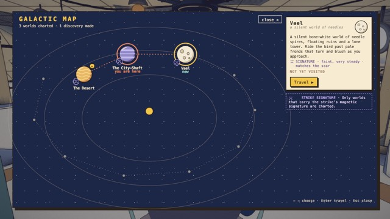 the map from the City-Shaft: the next two worlds | 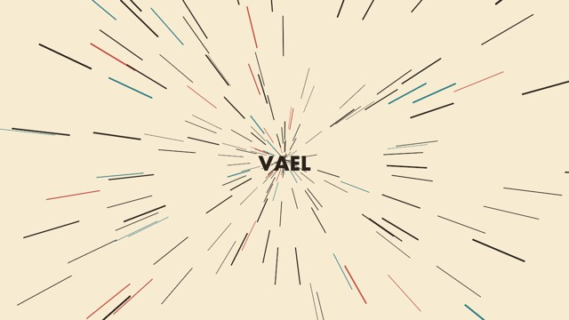 the jump |
| 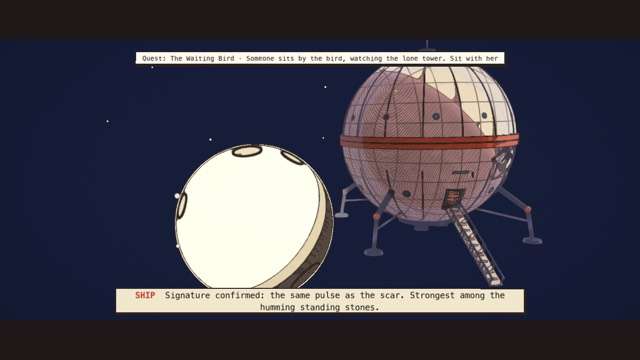 out of the jump: Vael ahead | 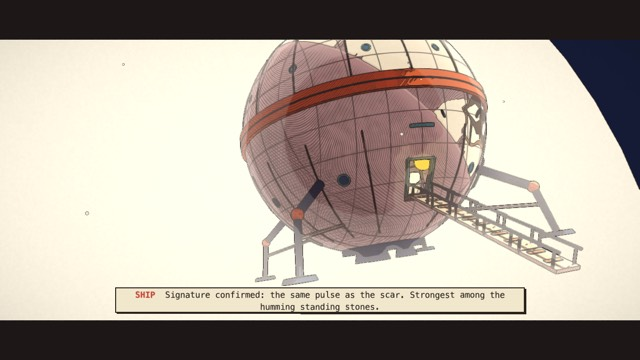 the fire of entry |
| 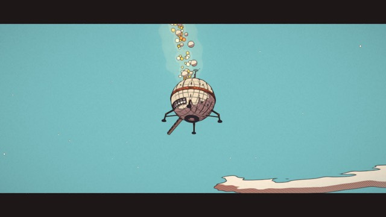 the fall through its sky | 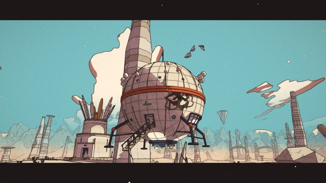 down on its jets |
| 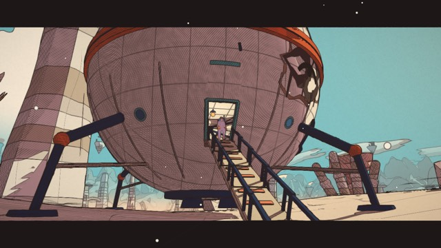 out down the ramp | 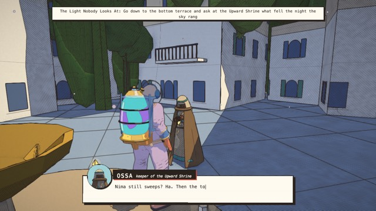 the bottom of the shaft: Ossa, the splinter |
| 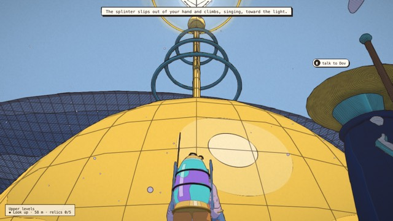 on the palace, looking up: the splinter climbs home | 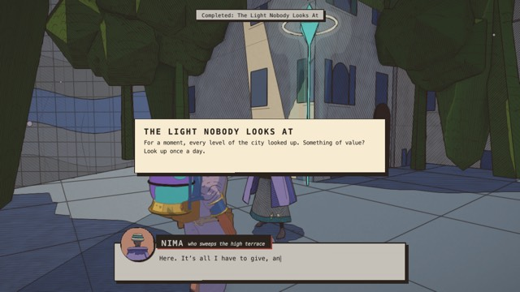 "The Light Nobody Looks At", done |
| 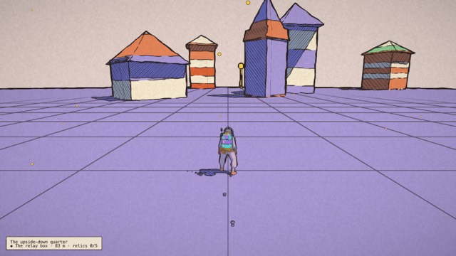 the Hangar's upside-down quarter, walked upside down | 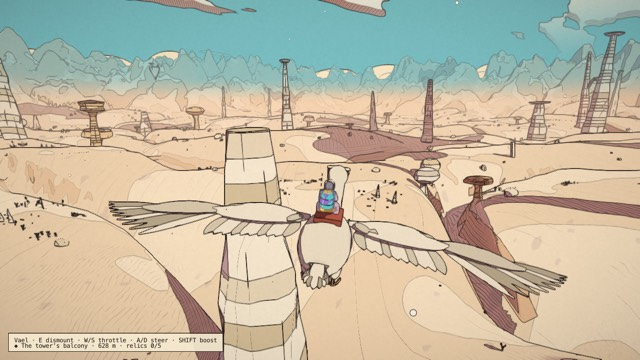 on the bird's back over Vael |

| web (three.js) | Unity (URP), the same viewpoint in play (`views-worlds.mjs`, `Play -tour`) |
|---|---|
| 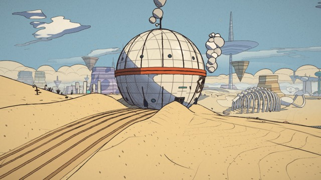 | 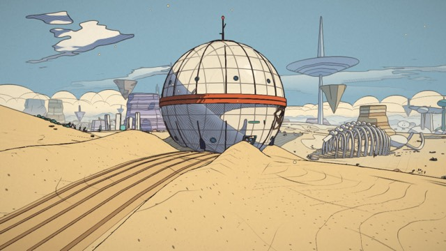 |
| 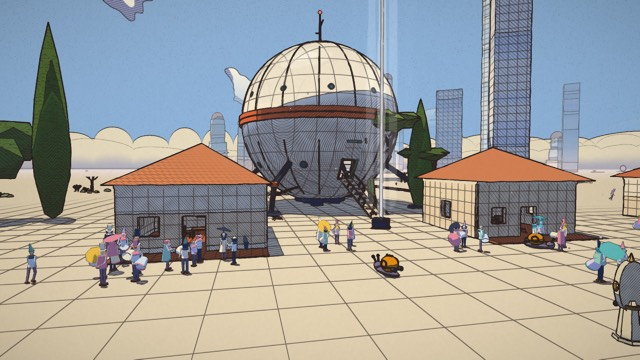 | 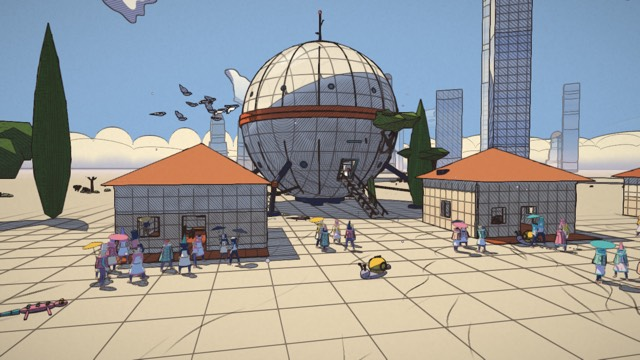 |
| 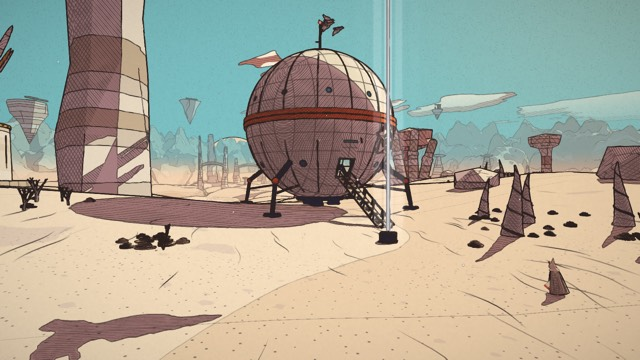 | 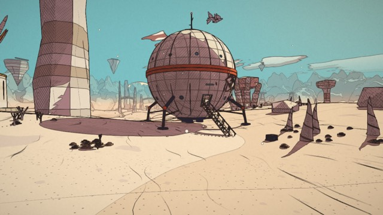 |
| 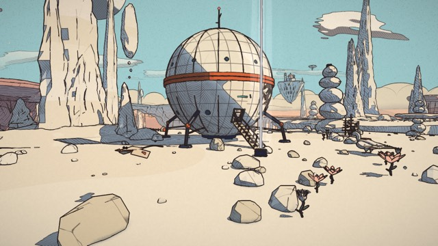 | 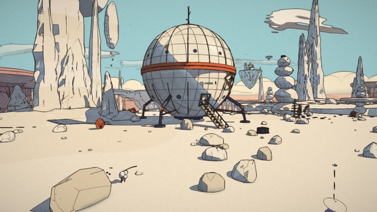 |
| 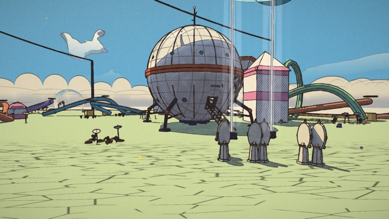 | 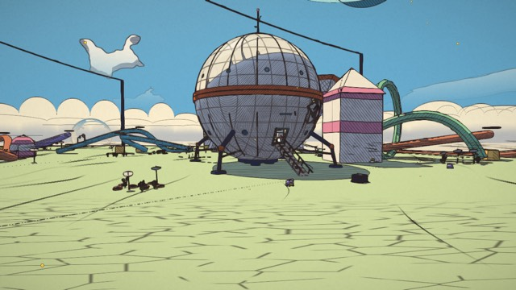 |
| 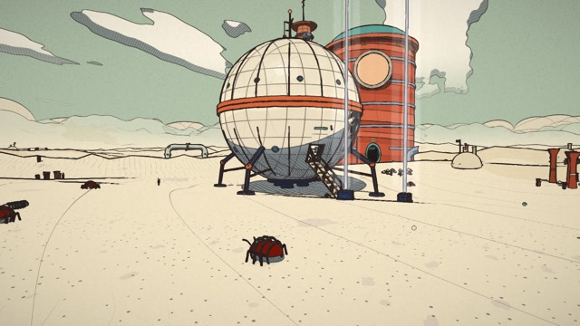 | 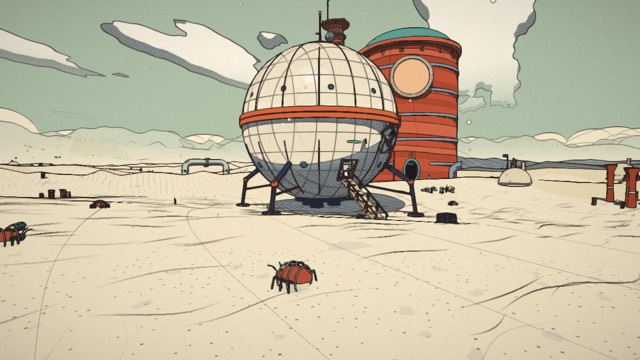 |
| 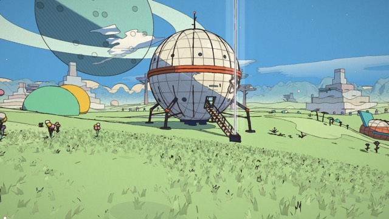 | 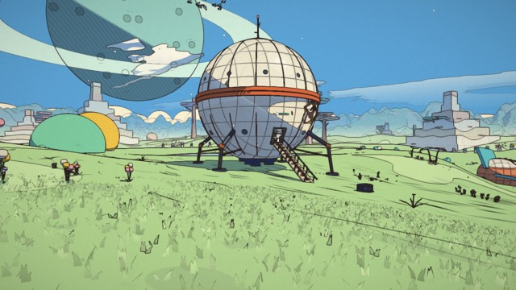 |
| 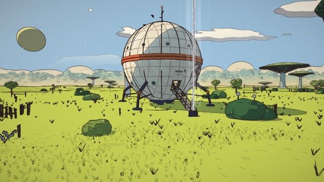 | 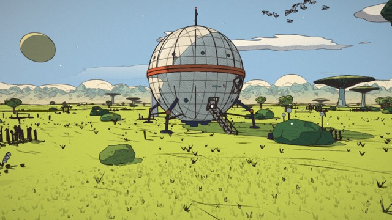 |
| 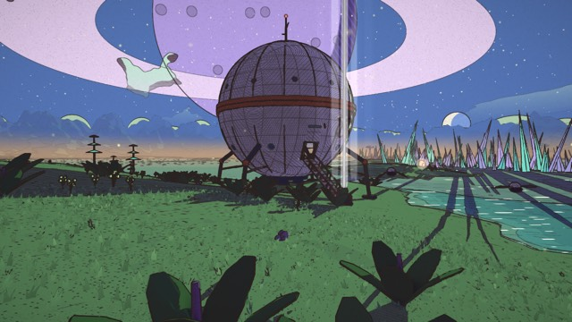 | 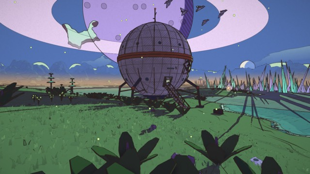 |
| 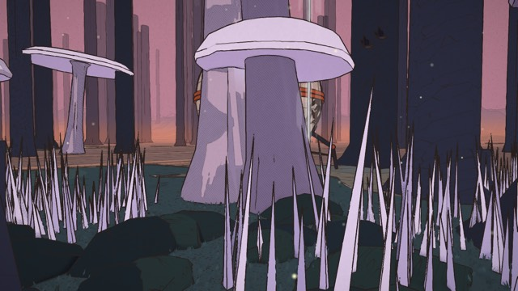 | 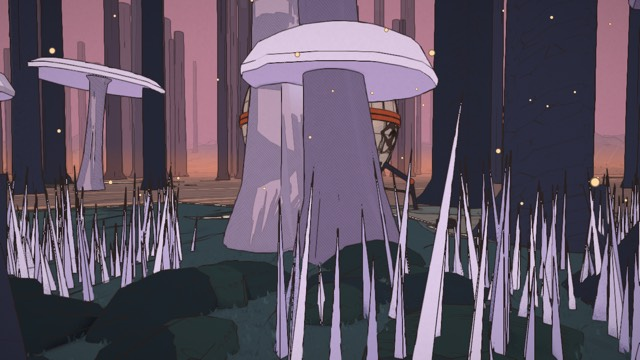 |
| 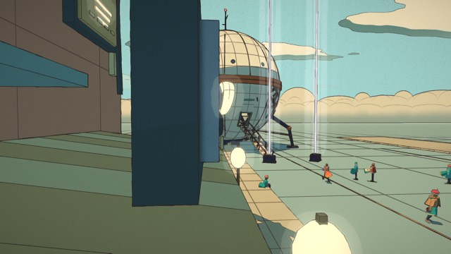 | 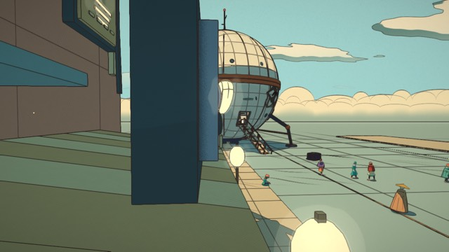 |
| 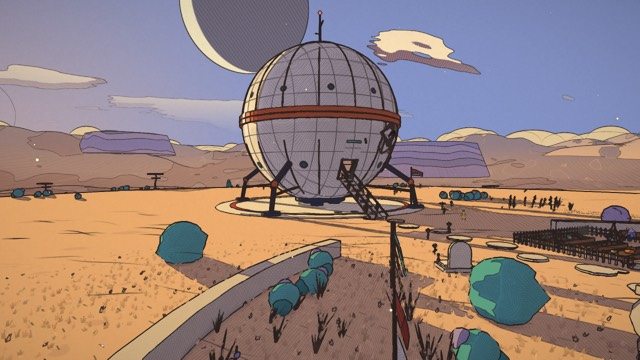 | 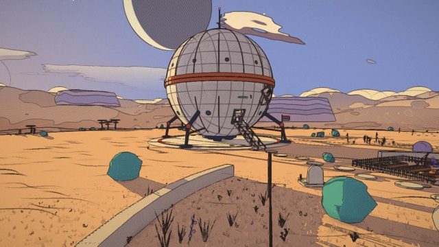 |

Per world (what plays in the port; what of the web's own scripts is still missing):

- **The Desert** (`desert`): the prologue, "The Tree That Drinks" to its end, the observatory, the errands, the relics (the first passes). Missing: the errands of the people near the start, the reactive flowers, the scout drone, the Givers’ House (its temple).
- **The City-Shaft** (`incal`): its main quest "The Light Nobody Looks At" to its end: Nima, Ossa’s splinter at the bottom, Dov at the palace, looking up at the Lodestar (the splinter climbs home), Nima again; the keepsake. 1359 in the crowd (pooled), their conversations; 81 cabs on their lanes; the haze thickening down the shaft, the steeper sun inside it; the call-lamp lit by a shot. Missing: riding the cabs (hailing, Wren’s cab), the goods hoist’s swing, the Lodestar’s own glow and the city’s lamps coming on, the crowd looking up, the Warden’s Well.
- **Vael** (`arzach`): Oïa (the opening), the bird to ride (take off, bank, dive, flap, land), the lone tower’s balcony; the feathers to pick up. Missing: the bird’s wing strokes, the rider’s whistle and her promise, the stone hand’s knuckles, the paper fronds.
- **Vael II** (`arzach2`): Sister Aube (the opening), the bird to the monastery, the cairn’s stones as data. Missing: the bell and its rope, the lamp, the tiles, the cairn’s placing, the Founders’ Belfry.
- **The Sealed Hangar** (`garage`): Ambroise (the opening), the turned gravity of the upside-down quarter and the ring, the portals between them, the signal posted in the relay box; the machines restarted by shots. Each quarter takes its own print. Missing: the signal board’s glyph, the machines’ turning, the First Garage.
- **The Buried Machine** (`buried`): Wen (the opening), the gauges cleared and the valve and jib by the fluid. Missing: the wheel turning, the crane, the key, the oculus, the canyon’s lifts.
- **Viridel** (`edena`): Mira (the opening), grass blades, the new water with its bed, the seed and the sprout. Missing: the terraces’ flood, the water clock, the fallen ship’s log, the flowers answering.
- **The Garden of Spheres** (`spheres`): Aube (the opening), the three spheres that remember (splashed), on to the plaza. Missing: the spheres’ sounds and the chord, the pebble and its glint, the mirror lake’s print.
- **Lorn** (`perdide`): Wendel (the opening), the hover-skiff over the swamp, the swamp’s water (its bed baked round you), wading and swimming. Missing: the crystals’ hum, the hush, the caves, the fungi.
- **Lorn II** (`perdide2`): Hollin (the opening), the skiff, the three dark pools relit by shots, the moss and fen lamps. Missing: the skiff’s cave home, Pim’s door, the dome doors, the saucer.
- **The Signal Market** (`bazaar`): Sel (the opening), 574 in the crowd with their conversations, the cabs, the sign and the crates by the fluid, the overhead sun of the street. Missing: the reactive screens, riding the cabs, the broadcast, the lanterns.
- **Home** (`home`): opens by the web’s rule (six worlds done and the last recording, or the ending played); the round house, Lou and Tove, the things in the yard. Missing: the homecoming (the cockpit’s choice, the landing, the door, the stone); the recordings (the reel’s calls) that open it.

## A standalone build

```sh
scripts/unity-export/unity-batch.sh BuildMac -out /tmp/Memento.app     # (default unity/Memento/Builds/macOS/Memento.app, git-ignored)
/tmp/Memento.app/Contents/MacOS/Memento -smoke /tmp/smoke -logFile /tmp/smoke/player.log
```

`Batch.BuildMac` puts the shaders the game finds by name into the always-included
list, sets the player (a 1280 × 720 resizable window) and builds the `Title`
scene (the loading page) and the desert; the export travels in
`StreamingAssets` (about 430 MB). With `-smoke folder` the player checks
itself (`SmokeTest.cs`): it shoots the title once the desert has loaded under
it, picks New game, shoots the prologue, skips it, shoots the desert and quits.
On an M4 Pro the build is 554 MB, the desert loads in about a second under the
title and runs at about 57 fps in a 1280 × 720 window (the frames below are
the player's own window, `ScreenCapture`). The setup takes the template's SSAO
feature out of the renderer (switched off, it still failed in a player, its
shaders stripped), and the last pass turns the page the right way up when it
writes the player's back buffer itself (`_TargetFlip`).

| | |
|---|---|
| 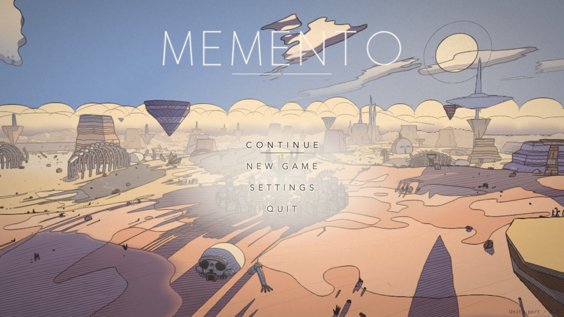 the build's title | 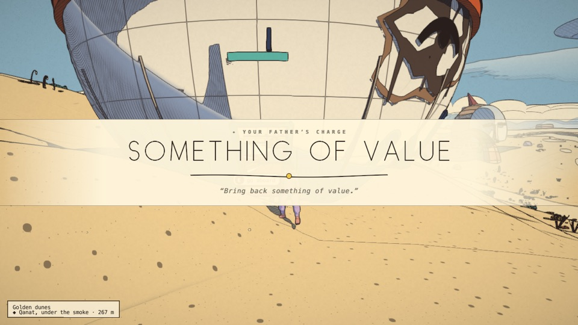 out of the ship |

### The Android build and the WebGL build (`Editor/BenchBuild.cs`)

```sh
scripts/unity-export/unity-batch.sh BenchBuild.Android   # Builds/Android/memento-unity.apk (about 150 MB; the desert alone, -allWorlds for every world)
scripts/unity-export/unity-batch.sh BenchBuild.WebGL     # Builds/WebGL (WebGPU), served by scripts/bench/serve.mjs
scripts/unity-export/unity-batch.sh BenchBuild.Mac       # Builds/macOS-bench/Memento.app: IL2CPP, ARM64, frame timing on (-mono: Mono; -development: the profiler markers)
```

- **Android**: package `com.rnaud.memento.unity` ("Memento (Unity)"), never the
  web app's `com.rnaud.moebius`, so both install side by side; debug-signed,
  IL2CPP ARM64, Vulkan first with GLES3 behind it (the instanced crowd, puffs and
  wildlife read structured buffers in the vertex shader, which many GLES drivers
  do not allow), landscape, engine code not stripped (the game adds components no
  scene holds: a stripped `SphereCollider` comes back null). Built here, not yet
  run on a device.
- **The export in a package** (`DataFiles.cs`): inside an APK (and on a WebGL
  server) `File.ReadAllBytes` can't reach StreamingAssets, so the first launch
  copies the export out to the app's files (`persistentDataPath/data`; WebGL: the
  in-memory `/tmp`), once per build (a manifest with the build's id), and the
  loaders read from there (`WorldLoader.DataPath`, `Sounds`, `Characters.AnimPath`
  all go through `DataFiles.Root`; on the desktop it is StreamingAssets itself).
  The full desert travels, not a reduced one, so the handheld runs what the Mac
  runs: in the APK `world.bin`, `world.json` and the shared store are gzipped
  (142 → 23 MB, 210 → 48 MB; named `.gzip`, since the Android Gradle plugin gunzips
  `.gz` assets as it packs them) and inflated on the way out; the characters and
  sounds go as they are, the other worlds and their scores stay out. The APK is
  about 150 MB and the copy about 450 MB on the device. (A Play Asset Delivery
  pack would be the store's way; for a sideloaded APK this is simpler.)
- **WebGL** uses WebGPU (WebGL 2 has no structured buffers in the vertex
  shader), no compression (the bench server is local), up to 4 GB of heap; the
  export is fetched and written to the in-memory file system at start.
- Still open on Android: the G-buffer's normal + depth target is RGBA32F (on
  mobile GPUs a half-float normal with depth in its own R32F target would halve
  the bandwidth); fonts (Menlo and Avenir Next are Apple's, `Ui` falls back to
  Roboto and Droid Sans Mono, or ship an open font); the pad's prompts in the
  handheld's names (the web's `native-pad.js` rewrite) and the back button as B / ○.
- The web game's Capacitor app (`android/`) is a separate thing and stays as it is.

### The benchmark mode (`Runtime/Bench.cs`)

With `-bench` on the command line (the Mac player), in the intent's `unity` extra
(Android: `am start -n com.rnaud.memento.unity/com.unity3d.player.UnityPlayerGameActivity
-e unity '-bench -benchPreset handheld'`) or `?bench` in the page's address
(WebGL), the player starts a new game past the prologue, hides its canvases, fixes
the hour and the weather, turns vSync off (`-benchVsync`: on) and visits the
viewpoints and paths of `scripts/bench/viewpoints.json` (the web side visits the
same), timing every frame with `FrameTimingManager` and the render and memory
counters (`ProfilerRecorder`), then writes one JSON file and quits. `-benchPreset
handheld` takes the web's Handheld preset (`Quality.cs`: render scale 0.75, its
levels of detail, culling and shadow schedule, no cloud shadows). Each view also
records what the game's own systems cost and do (`systems`, `counts`: `Perf.cs`);
`-benchDetail full` draws everything at full detail with nothing culled,
`-benchShadows off` without the sun's shadows. The player is silent (`-bench`, as
batch mode and `-mute`: `Sounds.Silent`). The comparison itself, its scripts and
its results: `docs/benchmark-web-vs-unity.md`.

## What is missing (next steps)

- **The worlds' own scripts** beyond their main quests' data: see the list per world above. Most
  worlds' opening steps and the fluid's stages play; the City-Shaft's main quest plays to its end.
  Riding the cabs, the temples (the gadgets wait
  by the ship instead), the reel's recordings at the console (`calls.js`: they open home), the
  homecoming, the reactive scenery (`reactive-world.js`), the scout drone.
- **The ship**: its door and ramp are drawn lowered through the flights (one rigid export); the
  interior reads brighter than the web's.
- **The look**: the water's sparkle and its rings; the world's lamps and the Lodestar's glow driven by
  their scripts; shadows are URP's, with a filter close to the web's hand-rolled cascades.
- **The traveller**: thrusting on the jets keeps the jump's pose; swimming keeps the walk (no
  strokes, no diving or breath).
- **The people**: a few seated people stand (their seat); the far figures have no brows.
- **The desert's smaller things**: the errands of the people near the start (`quest.js` Errands),
  the cactus spines, the sand puffs of the drum and the mask; the story's intro pages.
- **Not ported**: the dev menu; the Android build carries only the desert (built, not yet run on a
  device: above; with every world the exports are 3.6 GB: an install-time asset pack per world, or streamed). The standalone build still packs the
  desert scene (every world's export travels in its StreamingAssets). Mouse clicks on the menus.

## Connecting an MCP client to the editor

The project includes the Unity side of **MCP for Unity** (CoplayDev,
`com.coplaydev.unity-mcp`, from
`https://github.com/CoplayDev/unity-mcp.git?path=/MCPForUnity`, in
`Packages/manifest.json`). It runs a small bridge inside the editor that an
MCP client talks to through its Python server.

1. Open the project in the Unity editor (the bridge only runs in the editor,
   not in batch mode). **Window → MCP for Unity** shows the bridge's status.
2. Install the server side once: it needs Python 3.10+ and `uv`
   (`brew install uv`). The window's **Auto-Setup** can write the client
   configuration for Claude Code, Claude Desktop, Cursor or VS Code; or add it
   by hand, e.g. for Claude Code:

   ```sh
   claude mcp add unityMCP -- uvx --from "git+https://github.com/CoplayDev/unity-mcp@main#subdirectory=Server" mcp-for-unity
   ```

   (check the package's README for the current command; organisation policies
   may require the server to be approved first).
3. With the editor open and the bridge running, the client can read the scene,
   the console, run menu items (Memento → Set up project), enter play mode and
   take screenshots.
