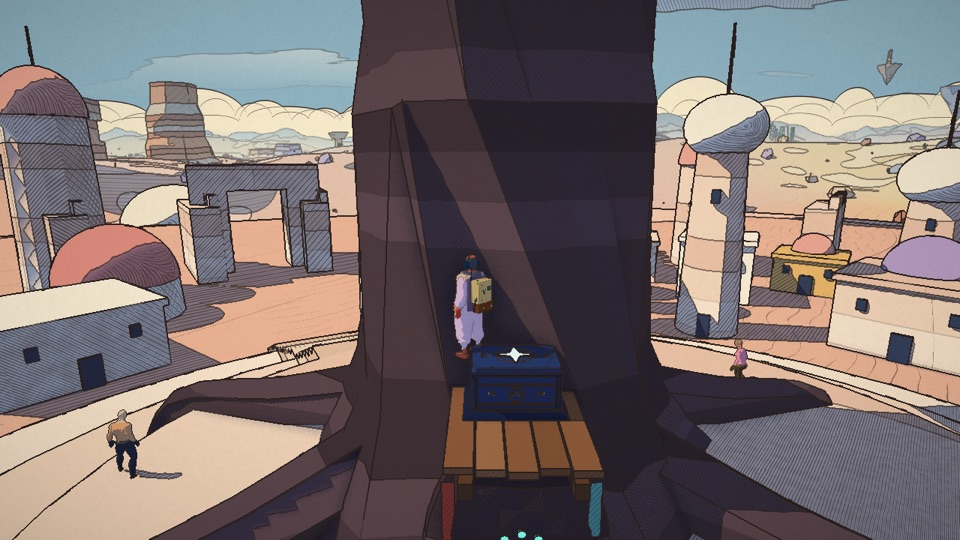

# Memento in Unity: the desert, a proof of concept

`unity/Memento` is a Unity 6 (6000.6, URP 17) port of the web game's first
world, the desert, built from the web game itself: a Node script builds the
desert headlessly exactly as the game does at load and exports it; Unity reads
the export and draws it through the same G-buffer and ink composite as
`src/materials.js` and `src/post.js`, ported to HLSL. The opening quest, "The
Tree That Drinks", plays end to end.

The same viewpoints, web game (left) and Unity (right), rendered headlessly
(`views.mjs`, `Batch.Shots`):

| web (three.js) | Unity (URP) |
|---|---|
|  |  |
|  |  |
|  |  |
|  |  |

(The Unity shots are of the world alone, outside play: no people, no smoke.)
In play, from the scripted play-through (`Batch.Play`):

| | |
|---|---|
|  the camps, people in their palettes |  the procession on its loop |
|  climbing the burning tree's buttress |  the makers' chest on the ledge |
|  the hoverbike | |

## Run it

1. Export the desert (from the repository root; needs the web game's
   `node_modules`):

   ```sh
   node scripts/unity-export/export-desert.mjs
   ```

   This writes `unity/Memento/Assets/StreamingAssets/desert/` (world.json,
   world.bin, story.json, about 400 MB, not committed) and copies the
   characters (`public/anim/*.glb`) to `StreamingAssets/anim/`. Run it again
   whenever the desert changes on the web side.
2. Open `unity/Memento` in Unity 6000.6 (Hub: Add project from disk). The first
   import resolves the packages (URP, Input System, glTFast, MCP for Unity).
3. Once, or after pulling: menu **Memento → Set up project** (URP settings, the
   ink renderer feature, the scenes). Already done in the committed project.
4. Open `Assets/Memento/Scenes/Title.unity` (or `Desert.unity`) and press Play.
   Loading the export takes a few seconds.

### Controls (as in the web game)

| | keyboard + mouse | controller (Xbox / PlayStation) |
|---|---|---|
| move | WASD | left stick |
| look | mouse (hold the right button in the editor) | right stick |
| run | Shift | L3 |
| jump, climb off | Space | A / × |
| talk, use, get on / off the bike, whistle for it | E | B / ○ |
| push (the backpack's fluid) | C, middle click | RB / R1 |
| choose an answer | 1–3, ↑ ↓ + Enter | D-pad + A / × |
| journal | Tab, J | View |
| close a panel | Esc | Y / △ |
| hoverbike | W / S go and brake, A / D steer, Shift boost | left stick, RT / R2 go |

### From the command line

`scripts/unity-export/unity-batch.sh <Method> [args]` runs one of the entry
points in `Assets/Memento/Editor/Batch.cs` in batch mode (with graphics, so
cameras render on Metal) and prints the log's errors and `Memento:` lines:

```sh
scripts/unity-export/unity-batch.sh Setup                 # project settings, renderer feature, scenes
node scripts/unity-export/views.mjs > /tmp/views.json      # fixed viewpoints, web coordinates
scripts/unity-export/unity-batch.sh Shots -shots /tmp/views.json -out /tmp/shots   # PNGs of the world
scripts/unity-export/unity-batch.sh Play -out /tmp/play    # the scripted play-through (below)
scripts/unity-export/unity-batch.sh Probe                  # collision checks at the story's places
```

Unity's EditMode tests (`Assets/Memento/Editor/Tests`, the story run by the C#
ports of the quest and dialogue systems):

```sh
Unity -batchmode -projectPath unity/Memento -runTests -testPlatform EditMode -testResults /tmp/results.xml
```

`Play` enters play mode and lets `BatchDriver` drive the pad: out of the ship,
a run and a jump, the camps and Ama, the city gate, the climb up the burning
tree's buttress to the makers' chest, Nour, the well, Ama's jar, the Speaker at
the head of the procession, the skull's mouth into the cave, the push that
clears the rib, the pool that fills the jar, the hoverbike under the tarp, the
camp fire that burns, a fall that knocks you over, the ship that hums. It saves
a frame at each step and exits 0 only if the quest is done.

## How it is built

### The export (`scripts/unity-export/`)

- `build-world.mjs` builds the desert the way `main.js` does (and the tests:
  `tests/desert-story.test.js`): `createDesert`, the physics, the ship at its
  arrival point, the crowd, the story's people (`createStory`), the makers'
  boxes, the hoverbike and the flora, with a small DOM stub (`shim.mjs`).
  Colour management is off, as in the game: colours are display values.
- `export-desert.mjs` walks the scene and writes:
  - **static surfaces** merged by material and by 256 m tile (positions,
    normals, vertex × instance colours, uvs, cloth folds; for plants the
    wind-sway anchor and bend), every flora instance included;
  - **materials**: the `makeMaterial` options read back from each shader's
    uniforms (colours, mode: plain / terrain / strata / water, faceted,
    strata size, grid, glyphs, biomes, ripples, sand ink, ticks, glow, folds,
    scrub, pattern: facade / tiles / leaves / cracks, palette, sides, sway);
  - **the terrain** as its heightfield (561 × 561), rebuilt in Unity with the
    same triangle layout, so `HeightAt` matches `world.js` exactly;
  - **collision**: what `physics.js` bakes (every mesh not under `noCollide`,
    the city's invisible proxies, the flora's trunks), in tiles, both sides;
  - **moving things** in their own frame: the hoverbike, the tarp, the makers'
    chests, the fallen rib, the pool, the stream, the well's water, Teo's drum;
  - **the look**: the post pass's uniforms with the "Moebius print" preset and
    the time-of-day palette at every quarter hour (`timeofday.js`), planets;
  - **the story's places** (the gate, the ledge, the well, the camps, the
    giant's door, the cave, the pool, the ship's ramp…), **portals** (the
    skull's mouth and the passage), **the people** (palettes, scale, routes,
    seats), the crowd and the procession's route, the tree's flame, the local
    lights;
  - `story.json`: `src/story/desert-data.js` as data (people and their
    conversations, quests, things, crowd lines, items).
- Coordinates: three.js is right-handed, Unity left-handed. Everything is
  mirrored across x (as glTFast does for the characters), windings flipped,
  headings become Unity yaw `-h`. The shaders mirror positions back before every
  procedural pattern, so the dunes, strata, ripples, cracks and sky land exactly
  where they do on the web.
- `views.mjs` writes fixed viewpoints (web coordinates) for side-by-side shots;
  `web-shots.mjs` shoots the web game from them with headless Chrome
  (`?level=desert`, the camera pinned to the same eye and target; needs
  playwright-core and a dev server), `unity-batch.sh Shots` the Unity side.
  The pairs are in `docs/` here.

### The look (`Assets/Memento/Shaders`, `Assets/Memento/Rendering`)

- `MementoFeature` is a URP renderer feature (RenderGraph). After URP's main
  light shadows it draws every `LightMode = MementoGBuffer` pass into three
  targets, as `src/pipeline.js`: albedo + light term (half-lambert × cast
  shadow, clamped under the toon threshold), world normal + linear view depth,
  hatching / stipple + drawn detail + flags (glow, hero, figure). Then one
  full-screen pass inks the page into the camera target.
- `Surface.shader` + `MementoCommon.hlsl` port `materials.js`: sand patches and
  regions (`biome.js`), strata bands with their far-distance average, façades
  with windows and shutters, roof tiles, leaves, rock cracks, fissures, glyphs
  and grids, sand blobs, ground ink by distance (`ground-ink.js`: ripples, wind
  lines, grains, salt-flat cracks), sand scuffs, cloud shadows, local lights,
  the surface-anchored power-of-two hatching (single, cross, form-following
  rings and height contours) and stipple, plant sway in the wind and away from
  the traveller, the printed outfit zones of the people. Shadows come from URP
  (4 cascades over 700 m, 4096²).
- `Composite.shader` ports `post.js`: ink lines from the Laplacian of 1/z,
  normal creases, albedo and shadow edges, with the wobble, pen pressure,
  broken interior lines anchored in the world, lines thinning with distance and
  fog, people's lines by their size on screen, the hero's outline; two-tone cel
  shading with the lavender shadow tint; hatching in shade fading with
  distance; crease shading; banded fog and aerial perspective; the printed sky
  (flat colour, dome dots, the cumulus bank, the sun and moon discs, a planet,
  flat inked clouds with hatched undersides); paper fibre and the vignette.
  Colours stay the game's display values and are converted to linear at the end.
- `Flame.shader` is the burning tree's fire (`flames.js` FlameBody): three
  lathe shells of flat bands, licked and torn by a scrolling noise, self-lit;
  it turns to the cool palette when the tree drinks.

### The play (`Assets/Memento/Runtime`)

- `Game` / `Play`: the desert scene's bootstrap (world, look, sun, camera, the
  traveller at the ship's ramp, the HUD, the crowd, the story, the bike),
  the use prompt, B / ○ to use, the push, the portals.
- `WorldLoader`: reads the export, builds meshes, materials and colliders.
- `MementoLook`: the time of day and the preset as shader globals; turns the sun.
- `Player` (`player.js`): walk 3.8, run 7.2, jump 13 under gravity 32, step
  0.6 m; climbing (push into a steep wall; up / down / sideways, stamina) and
  mantling over the top; health, the fall rules (tumble from 26 m/s, fatal from
  48), fire, a limp knock-down (a simplified ragdoll) and Restart.
- `CameraRig` (`player.js` CameraRig): the 9.5 m arm over a look point 1.8 m
  up, swinging behind the heading, pulled in front of walls and kept off the
  ground; a two-shot while talking.
- `Characters`: glTFast loads `traveller.glb` (his own Idle / Walk clips) and
  the Quaternius `human_m` / `human_f` bodies with the UAL clips (Idle, Walk,
  Jog, Talking) at runtime, as legacy animation; every material becomes
  `Memento/Surface` (the people in their printed outfit zones, drawn from the
  rest pose kept in uv3).
- `Story.cs`: `GameState` (flags, events, keepsakes), `Quests` (`quests.js`:
  stages advancing on flags and arrivals, the objective and its marker),
  `DialogueRunner` (`dialogue.js`: entries, conditions, effects, pages, at
  most three answers, `once`, `next`), tones (`tone.js`).
- `DesertStory` (`story/desert.js`): the people at their places (Ama by the
  fire, the musicians, Ilo, Marrow, Hessa at the well, Nour on her bench, the
  people of Qanat, Oum on her stone, the Speaker ahead of the procession), the
  things to look at (the well, the stele, the skull's brow, the mural), the
  makers' chest on the ledge (the backpack), Qanat gathering, Teo's drum, Oum
  and Ilo following you, the rib (heaved, or pushed with the backpack), the
  stream and the rising pool, the jar, the ship; fire hurts.
- `Npc`, `Crowd`: people walking their routes or standing, lines over their
  heads; the procession walking its loop round the city in rows.
- `Bike` (`bike.js`, `story/desert-bike.js`): the tarp, waking it with the
  backpack, a hover spring over the ground, banking, braking, whistling it over.
- `Hud`: the objective line, prompts in Xbox / PlayStation form, toasts, the
  health bar, speech over heads, the conversation panel, the journal, the
  father's charge card, the end card (IMGUI on paper colours).
- `TitleScreen`: the title page, then the desert.

## What is missing (next steps)

- **The traveller's moves** use his own Idle and Walk clips only (the web game
  retargets the UAL library onto his rig: run, jump, climb, ledge-climb poses).
  A humanoid avatar and `HumanPoseHandler` retargeting would bring them over.
  He is drawn without the bubble helmet, the cape cloth, the drawn face (the
  portrait shader), the creases and the fluid tank's lava lamp.
- **The people** wear their palette as flat zones on the Quaternius bodies;
  the web game's costumes, capes, hats, hair, faces and eyes, expressions and
  the voice / translator are not ported. The crowd is full bodies (90 of the
  132), not the instanced far figures; seated people stand.
- **The fluid tool**: only the push (for the rib); no shots, charges, boost,
  wings or jets. The other makers' box (the star) is hidden. The chest opens
  with a card, not the box scene.
- **Not ported**: the ship's prologue and interior, the recordings, the
  galactic map; wildlife, birds, footprints, wind-blown sand, the camp fires'
  animated tongues (they are exported as a still frame), smoke and embers, the
  reactive world, flammables, weather, the dev menu, saves, sound and music,
  the observatory and the masked head's chamber (exported, not playable),
  Android. The HUD is IMGUI (not in batch screenshots).
- **The look**: no FXAA, no sun rays, no rain or sandstorm, no hero-only line
  weights tuning, shadows are URP's (softer, a different filter than the web's
  hand-rolled cascades).

## Connecting an MCP client to the editor

The project includes the Unity side of **MCP for Unity** (CoplayDev,
`com.coplaydev.unity-mcp`, from
`https://github.com/CoplayDev/unity-mcp.git?path=/MCPForUnity`, in
`Packages/manifest.json`). It runs a small bridge inside the editor that an
MCP client talks to through its Python server.

1. Open the project in the Unity editor (the bridge only runs in the editor,
   not in batch mode). **Window → MCP for Unity** shows the bridge's status.
2. Install the server side once: it needs Python 3.10+ and `uv`
   (`brew install uv`). The window's **Auto-Setup** can write the client
   configuration for Claude Code, Claude Desktop, Cursor or VS Code; or add it
   by hand, e.g. for Claude Code:

   ```sh
   claude mcp add unityMCP -- uvx --from "git+https://github.com/CoplayDev/unity-mcp@main#subdirectory=Server" mcp-for-unity
   ```

   (check the package's README for the current command; organisation policies
   may require the server to be approved first).
3. With the editor open and the bridge running, the client can read the scene,
   the console, run menu items (Memento → Set up project), enter play mode and
   take screenshots.
